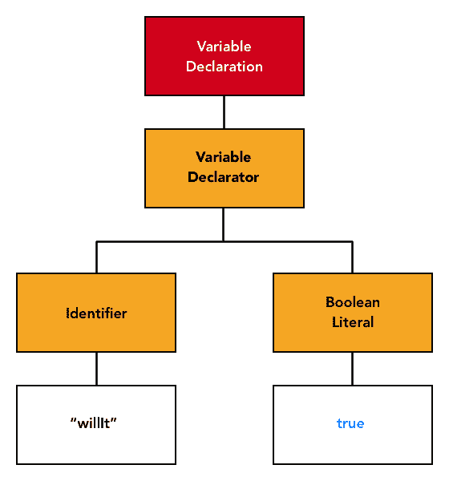
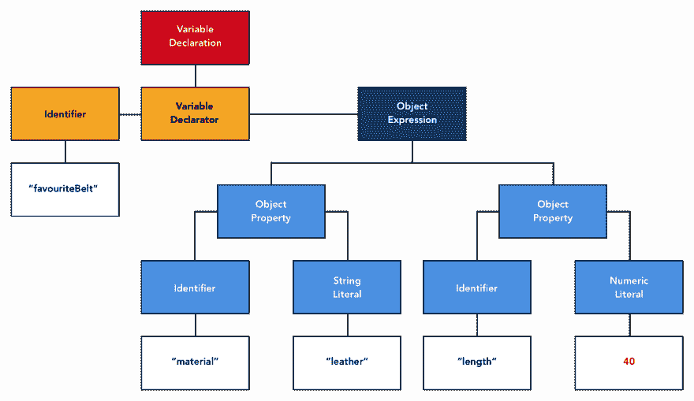
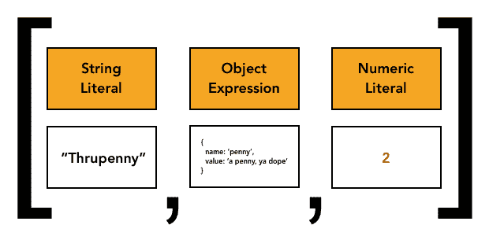
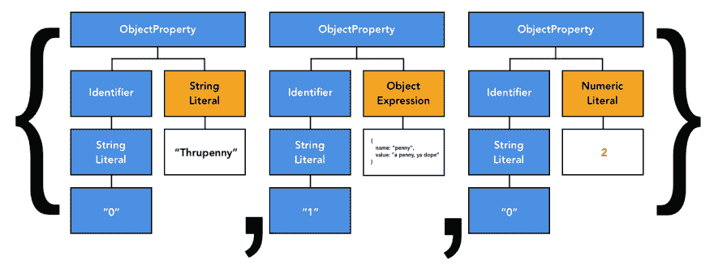

# 为了乐趣和利益的抽象语法树

> 原文：<https://dev.to/mlennox/abstract-syntax-trees-for-fun-and-profit-4mej>

# 第一部分-概述

这篇文章是从我的博客交叉发表的

这是关于抽象语法树及其在 javascript 中的使用的系列文章的第一部分。本文的范围是快速介绍 ASTs、babel 插件和一些简单的“玩具”示例。

我将尽可能使用描述、代码/json 和图表来呈现信息和说明，以使主题内容更容易被更多类型的学习者理解。

[](https://res.cloudinary.com/practicaldev/image/fetch/s--eHYOG4hX--/c_limit%2Cf_auto%2Cfl_progressive%2Cq_auto%2Cw_880/https://thepracticaldev.s3.amazonaws.com/i/512sko41rdjlnz0oxp59.png)

# 本条范围

这是对抽象语法树和非常简单的代码转换的简单介绍。未来的文章将处理真实世界的代码，研究静态分析，并着眼于创建可能对您自己的代码库有用的 babel 插件的方法，还有- *codemods* 。

# 代码

github 回购伴随本文[https://github.com/mlennox/abstractsyntaxforfunandprofit](https://github.com/mlennox/abstractsyntaxforfunandprofit)

# 什么是抽象语法树

这些有用的数据结构表示源代码的*抽象*结构，与语言无关。这是可能的，因为尽管语法不同，所有语言在它们表达的代码结构方面有很大的重叠:变量赋值、条件、逻辑分支等。

抽象语法树可用于促进代码的静态分析、重写代码、编译代码(从一种语言转换到另一种语言)，或者在 web 开发中非常常见的代码转换(从一种语言转换到具有相似抽象级别的另一种语言，即。typescript 到 javascript，或者 es6+到 es5)。

在本文中，我将展示一些以抽象语法树形式呈现的简单源代码的例子，并给出一个通过构建简单的[巴别塔](https://babeljs.io/)插件来转换基本代码的工作示例(参见 [repo](https://github.com/mlennox/abstractsyntaxforfunandprofit)

## 纯粹的抽象

我将展示的 AST 示例不是纯粹的抽象，因为它们包含与源代码相关的元数据，并且元素的命名反映了 javascript 语法。从各方面来看，它们都是抽象语法树，并且严格遵循 [EStree 规范](https://github.com/estree/estree)

本文中的 JSON 表示是由下面的`useful resources`部分中列出的 [AST 浏览器](https://astexplorer.net/)生成的。

## 有用的参考文献

Javascript AST 查看器-[https://astexplorer.net/](https://astexplorer.net/)

巴别塔插件开发的开发者文档- [巴别塔插件手册](https://github.com/jamiebuilds/babel-handbook/blob/master/translations/en/plugin-handbook.md)

巴别塔式参考-[https://babeljs.io/docs/en/next/babel-types.html](https://babeljs.io/docs/en/next/babel-types.html)

# AST 示例

我将在这里提供一些例子来帮助可视化代码被解析成抽象语法树时的结果结构。

第一个将把`var`的实例改为`const`，第二个将把一个数组转换成一个对象。

## 简单变量赋值

如果我们采用下面简单的 javascript 代码片段并用 AST 解析器处理它。

```
const willIt = true; 
```

生成的 AST 可以用多种方式表示，最有用的是 JSON。上面转换成 AST 的代码片段由下面的 JSON 表示。

```
{
  "type": "Program",
  "body": [
    {
      "type": "VariableDeclaration",
      "start": 0,
      "end": 20,
      "loc": {
        "start": {
          "line": 1,
          "column": 0
        },
        "end": {
          "line": 1,
          "column": 20
        }
      },
      "declarations": [
        {
          "type": "VariableDeclarator",
          "start": 6,
          "end": 19,
          "loc": {
            "start": {
              "line": 1,
              "column": 6
            },
            "end": {
              "line": 1,
              "column": 19
            }
          },
          "id": {
            "type": "Identifier",
            "start": 6,
            "end": 12,
            "loc": {
              "start": {
                "line": 1,
                "column": 6
              },
              "end": {
                "line": 1,
                "column": 12
              },
              "identifierName": "willIt"
            },
            "name": "willIt"
          },
          "init": {
            "type": "BooleanLiteral",
            "start": 15,
            "end": 19,
            "loc": {
              "start": {
                "line": 1,
                "column": 15
              },
              "end": {
                "line": 1,
                "column": 19
              }
            },
            "value": true
          }
        }
      ],
      "kind": "const"
    }
  ],
  "sourceType": "module"
} 
```

JSON 由一系列节点组成，每个节点都有一个`type`属性。下面的 JSON 去掉了上面 JSON 中除了`type`以外的所有属性。

```
{
  "type": "Program"
  "body": {
    "type": "VariableDeclaration"
    "declarations": [
      {
        "type": "VariableDeclarator",
        "id": {
          "type": "Identifier"
        },
        "init": {
          "type": "BooleanLiteral"
        }
      },
    ]
  }
} 
```

您还会注意到每个节点都包含引用源代码中相关表达式位置的位置数据。

```
{
  "type": "VariableDeclaration",
  "start": 0,
  "end": 20,
  "loc": {
    "start": {
      "line": 1,
      "column": 0
    },
    "end": {
      "line": 1,
      "column": 20
    }
  },
} 
```

还要注意，这是我们感兴趣的关键点，变量声明表示变量的种类——在本例中是一个`const`。

```
{
  "type": "VariableDeclaration",
  "kind": "const"
} 
```

树的分层性质的图形表示更容易掌握。

[](https://res.cloudinary.com/practicaldev/image/fetch/s--agQ--TA8--/c_limit%2Cf_auto%2Cfl_progressive%2Cq_auto%2Cw_880/https://thepracticaldev.s3.amazonaws.com/i/9ncn271dhg3xjfojcdcz.png)

## 分配一个对象

```
let favouriteBelt = {
  material: "leather",
  length: 40
}; 
```

这种情况下的 JSON 要复杂得多。为了清楚起见，我省略了一些属性。

```
{
  "type": "VariableDeclaration",
  "declarations": [
    {
      "type": "VariableDeclarator",
      "id": {
        "type": "Identifier",
        "name": "favouriteBelt"
      },
      "init": {
        "type": "ObjectExpression",
        "properties": [
          {
            "type": "ObjectProperty",
            "key": {
              "type": "Identifier",
              "name": "material"
            },
            "value": {
              "type": "StringLiteral",
              "value": "leather"
            }
          },
          {
            "type": "ObjectProperty",
            "key": {
              "type": "Identifier",
              "name": "length"
            },
            "value": {
              "type": "NumericLiteral",
              "value": 40
            }
          }
        ]
      }
    }
  ],
  "kind": "let"
} 
```

和图形表示。

[](https://res.cloudinary.com/practicaldev/image/fetch/s--IyQNlxTo--/c_limit%2Cf_auto%2Cfl_progressive%2Cq_auto%2Cw_880/https://thepracticaldev.s3.amazonaws.com/i/erdw2xk21cbtzg4jnv86.png)

您可以看到层次结构分解成熟悉的节点排列，尽管与简单的赋值相比复杂性相对增加。

# 转换代码

希望现在您对 AST 的样子以及它与源代码的关系有了一些了解。接下来，我将展示如何使用 AST 转换源代码。熟悉的`babel`库提供了解析、转换和重新生成源代码所需的所有工具，因此为了简单起见，提供的例子将是巴别塔插件。

一个警告，由于 babel 引用插件的方式，这些特定的插件不容易集成到你的代码库中——理想情况下，你需要一个发布 npm 包。另一种方法是编写脚本，将“插件”移动到巴别塔可以访问的位置。

## 巴别塔插件和穿越者 AST

巴别塔插件使用[访问者模式](https://www.dofactory.com/javascript/visitor-design-pattern)，这是一种抽象，便于向对象添加额外的功能，而不需要重构原始对象。这个想法是，对象可以“接受”一个访问者函数，这个函数可以改变对象的属性和结构，正如我们将要看到的。

当 AST 被遍历时，每个节点都被传递给 babel 插件，其简化版本如下所示——一个实现了一个`visitor`属性的对象文字，该属性由一个方法对象组成，这些方法被命名为匹配它应该处理的节点。这里的例子实现了一个访问者，它将作用于所有的`ArrayExpression`节点。

```
const ourCustomVisitor = {
  visitor: {
    ArrayExpression(path, state) {
      // do stuff
    },
  },
}; 
```

当 AST 被遍历时，关于所有相应节点的数据将被传递到相应的处理程序方法中——它们被传入的顺序、在层次结构中的哪一点以及先前的转换可能如何影响代码都是需要用真实世界的代码来解决的概念，但是本文中简单的“平面”示例被选择来关注基本概念。

说每个匹配节点*本身*被传递给处理程序是不成立的，每个节点处理程序被传递两个参数，`path`(它确实包含节点)和`state`，下面详细说明。

### 路径

路径是表示节点之间链接的对象。随着你的改变，AST 通天塔将更新所有节点之间的路径。

如果我们以下面的`ObjectProperty`和子`StringLiteral`值为例

```
{
  type: "ObjectProperty",
  value: {
    type: "StringLiteral",
    value: "gummi bears"
  }
} 
```

表示节点之间关系的路径应该是:

```
{
  "parent": {
    "type": "ObjectProperty",
      :
  },
  "node": {
    "type": "StringLiteral",
    "value": "gummi bears"
      :
  },
    :
} 
```

在这种情况下，`node`是插件的 visitor 中的`StringLiteral`处理程序正在处理的当前元素:

```
{
  visitor: {
    StringLiteral(path) {
      // path is:
      // {
      //   "parent": {
      //     "type": "ObjectProperty",
      //       :
      //   },
      //   "node": {
      //     "type": "StringLiteral",
      //     "value": "gummi bears"
      //        :
      //   }
      //    :
      // }
    }
  }
} 
```

#### 元数据和方法

该路径还包含元数据和允许删除、添加或更新树中节点的方法。

[在附带的 repo](https://github.com/mlennox/abstractsyntaxforfunandprofit/blob/master/arrayToObject/arrayToObject.js) 中的`arrayToObject`示例中，我们在`ArrayExpression`处理程序中使用`path.replaceWith`将定义数组的节点替换为定义对象的节点。

```
ArrayExpression(path) {
  // ArrayExpression has a property 'elements' that contains the array elements
  const objectProps = path.node.elements.map((element, index) => {
    return new t.objectProperty(new t.stringLiteral(`${index}`), element);
  });

  path.replaceWith(new t.objectExpression(objectProps));
} 
```

### 状态

这包含了插件的细节——包括访问者声明、pre 和 post 方法。它还包含被解析文件的详细信息、AST 的状态等。这些都可以在插件中访问。最常用的状态属性是`opts`。

#### 选项

如果你将插件作为你的巴别塔堆栈的一部分运行，而不是通过相关的 repo 中的[‘runner ’,你可以使用你的`.babelrc`文件为巴别塔插件提供选项](https://github.com/mlennox/abstractsyntaxforfunandprofit/blob/master/compile.js)

```
{
  plugins: [
    ["customPlugin", {
      "doIt": true,
      "decorate": "paint"
    }]
  ]
} 
```

这些选项将在`state.opts`的插件中提供。

```
state.opts === {
  doIt: true,
  decorate: "paint"
} 
```

# 插件示例

请记住，这些都是非常简单的例子，使用单个变量赋值，意味着我们不需要担心代码块的范围、深度等。其他文章中的未来示例将使用更复杂的代码。

下面是一个很好的巴别塔插件模板

```
module.exports = function({ types: t }) {
  return {
    visitor: {
      // add handlers here
    },
  };
}; 
```

## 将`var`转换为`const`

在这个例子中，我想构建一个简单的 babel 插件，用示例代码中的`const`替换`var`的任何实例——只有`var`会受到影响。

```
// this 'var' should be replaced with a 'const'
var itemOne = ['items', 'things', 'gizmos', 'widgets'];

// this will stay a 'let'
let itemTwo = ['tchotchke', 'stuff', 'yokes']; 
```

`itemOne`变量赋值的 AST 如下所示。为了清楚起见，下面的 AST 删除了所有位置信息。

```
{
  "type": "VariableDeclaration",
  "kind": "var"
  "declarations": [
    {
      "type": "VariableDeclarator",
      "id": {
        "type": "Identifier",
        "name": "itemOne"
      },
      "init": {
        "type": "ArrayExpression",
        "elements": [
          {
            "type": "StringLiteral",
            "value": "items"
          },
          {
            "type": "StringLiteral",
            "value": "things"
          },
          {
            "type": "StringLiteral",
            "value": "gizmos"
          },
          {
            "type": "StringLiteral",
            "value": "widgets"
          }
        ]
      }
    }
  ],
  "leadingComments": [
    {
      "type": "CommentLine",
      "value": " this 'var' should be replaced with a 'const'",
    }
  ]
} 
```

我们感兴趣的节点是顶级节点`VariableDeclaration`，所以让我们在 babel 插件中添加一个处理程序

```
module.exports = function({ types: t }) {
  return {
    visitor: {
      VariableDeclaration(path) {
      },
    },
  };
}; 
```

我们需要记住，`path`不是节点，而是节点和元数据之间的关系等等。为了到达`VariableDeclaration`节点，我们引用`path.node`。

让我们再次快速浏览一下 AST，重点关注我们感兴趣的点

```
{
  "type": "VariableDeclaration",
  "kind": "var",
    :
} 
```

我们想将变量声明的`kind`从`var`更新为`const`。唯一有效的选项当然是`let`。巴别塔*将*让你更新你喜欢的任何东西，这似乎是一个疏忽，我实际上不知道他们为什么不抛出一个错误，或以某种方式限制值。

将变量声明更新为`const` *和*的更新插件确保只有`var`会受到影响。我已经移除了`types`析构，因为我不在这个插件中使用它。

```
module.exports = function() {
  return {
    visitor: {
      VariableDeclaration(path) {
        if (path.node.kind === 'var') {
          path.node.kind = 'const';
        }
      },
    },
  };
}; 
```

您可以从附带的 repo 中自己运行这个示例。假设您已经安装了与`npm install`的依赖项，运行转换的命令是

```
node compile.js varToConst vars.source.js 
```

尝试修改代码，添加`console.log`来查看路径的结构，更改`vars.source.js`中的代码来查看结果是如何受到影响的。

## 物体脱离阵列

虽然这比“var to const”的例子稍微复杂一点，但仍然相当简单。我将包括一些图表，以确保转换是清楚的。

首先，我们将转换的源代码。

```
// we'll convert this from an array to an object literal
// that uses the position in the list as the key
const coins = ['thrupenny', { name: 'penny', value: 'a penny, ya dope' }, 2]; 
```

一旦转换完成，我们希望以下面的代码结束。

```
const coins = {
  "0": 'thrupenny',
  "1": { name: 'penny', value: 'a penny, ya dope' },
  "2": 2
}; 
```

这意味着我们需要用一个`ObjectExpression`替换`ArrayExpression`，并将`ArrayExpression`的每个`elements`转换成一个`ObjectProperty`。

下面是源代码的 AST，为了清楚起见，去掉了一些属性。

```
 {
  "type": "VariableDeclaration",
  "declarations": [
    {
      "type": "VariableDeclarator",
      "id": {
        "type": "Identifier",
        "name": "coins"
      },
      "init": {
        "type": "ArrayExpression",
        "elements": [
          {
            "type": "StringLiteral",
            "value": "thrupenny"
          },
          {
            "type": "ObjectExpression",
            "properties": [
              {
                "type": "ObjectProperty",
                "key": {
                  "type": "Identifier",
                  "name": "name"
                },
                "value": {
                  "type": "StringLiteral",
                  "value": "penny"
                }
              },
              {
                "type": "ObjectProperty",
                "key": {
                  "type": "Identifier",
                  "name": "value"
                },
                "value": {
                  "type": "StringLiteral",
                  "value": "a penny, ya dope"
                }
              }
            ]
          },
          {
            "type": "NumericLiteral",
            "value": 2
          }
        ]
      }
    }
  ],
  "kind": "const"
} 
```

此外，AST 的简化图显示了每个元素——第二个元素中的`ObjectExpression`,为了清楚起见，也进行了简化。

[](https://res.cloudinary.com/practicaldev/image/fetch/s--zgr4cQkT--/c_limit%2Cf_auto%2Cfl_progressive%2Cq_auto%2Cw_880/https://thepracticaldev.s3.amazonaws.com/i/w3ep6fw8z88z0d41e2c6.png)

我对`ArrayExpression`的`elements`感兴趣。我将获取每个元素并构造一个`ObjectProperty`，它使用元素的数组索引的一个`StringLiteral`作为`Identifier`，并使用元素本身作为值。聚焦于数组中的第一个元素

```
// const coins = ['thrupenny', { name: 'penny', value: 'a penny, ya dope' }, 2];

  {
    "type": "StringLiteral",
    "value": "thrupenny"
  }, 
```

索引是零，所以 object property——这里使用`babel.types`构造——看起来像这样

```
const firstArrayElement = path.node.elements[0];
const firstObjectProperty = new t.objectProperty(new t.stringLiteral(`0`), firstArrayElement); 
```

虽然其他元素是不同的类型，但是方法是相同的。元素不需要任何额外的处理就可以转换成不同的类型，所以我们可以使用`Array.map`在一个步骤中将数组元素转换成对象属性

```
const objectProps = path.node.elements.map((element, index) => {
  return new t.objectProperty(new t.stringLiteral(`${index}`), element);
}); 
```

生成的 AST 的简图如下所示。蓝色元素都是由上面概述的代码创建的:

[](https://res.cloudinary.com/practicaldev/image/fetch/s--VZNBsdbL--/c_limit%2Cf_auto%2Cfl_progressive%2Cq_auto%2Cw_880/https://thepracticaldev.s3.amazonaws.com/i/zn0h18i89div7pn5v1o6.png)

最后一步是用使用新的`ObjectProperty`数组构建的`ObjectExpression`替换`ArrayExpression`节点。幸运的是，`path`包含了许多方法来帮助转换 AST，包括`replaceWith(replacementNode)`，它将当前节点替换为作为参数提供的节点。

构造`ObjectExpression`很简单

```
const objectExpression = new t.objectExpression(objectProps); 
```

然后我可以使用`replaceWith`方法用新的`ObjectExpression`替换掉`ArrayExpression`

```
path.replaceWith(objectExpression); 
```

这将产生预期的结果

```
const coins = {
  "0": 'thrupenny',
  "1": { name: 'penny', value: 'a penny, ya dope' },
  "2": 2
}; 
```

您可以从附带的 repo 中自己运行这个示例。假设您已经安装了与`npm install`的依赖项，运行转换的命令是

```
node compile.js arrayToObject array.source.js 
```