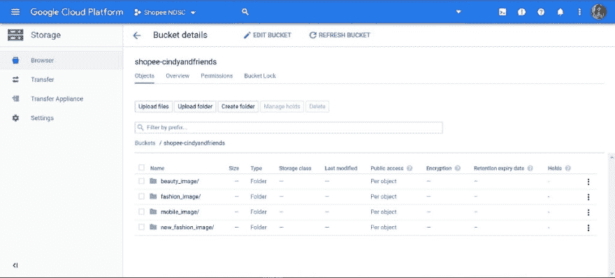
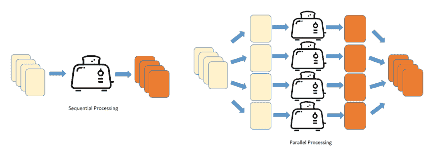

# 使用 gsutil、numba 和 concurrent.futures 加速 Python 中图像的批处理

> 原文：<https://dev.to/hweecat/accelerating-batch-processing-of-images-in-python-with-gsutil-numba-and-concurrent-futures-59ah>

#### 如何从**几个月**到**几天**的时间内加速批量处理近百万张图像

在数据科学项目中，最大的瓶颈之一(就时间而言)是持续等待数据处理代码完成执行。缓慢的代码以及与 web 和远程实例的间歇性连接影响了典型数据科学管道的每一步—数据收集、数据预处理/解析、特征工程等。有时，巨大的执行时间甚至最终使项目不可行，并经常迫使数据科学家只处理整个数据集的子集，从而剥夺了数据科学家通过更大的数据集可以获得的洞察力和性能改进。

事实上，长执行时间导致的时间瓶颈对于图像数据的批处理来说更加突出，这些图像数据通常被读取为大尺寸的 numpy 数组。

### 问题描述

大约 2 个月前，我和我的同事参加了 2019 年 Shopee 国家数据科学挑战赛的高级组。比赛包括从产品名称中提取产品属性，我们得到了三个主要类别的产品:手机、时尚和美容产品。此外，我们还获得了每个项目的图像路径和相关的图像文件——总共 77.6 GB！

这是我们在 Kaggle 上的第一次竞争，我们开始对我们心目中的混合文本和图像模型充满信心——只是在下载和处理大型图像数据集到 Numpy 数组以将其作为我们模型的输入时遇到了瓶颈。以下是我尝试解决这些问题的方法的一些笔记，特别关注我如何使用 numba 和 concurrent.futures 来加速近百万张图像的批处理，从几个月的**到几天的**。****

 **### 数据处理工作流程

首先，以下是我们数据处理工作流程中的**一般步骤**:

1.  使用 *wget* 命令从源下载大型图像数据集
2.  使用 *gsutil* 将大量图像文件上传到 Google 云存储
3.  将每个图像文件从云存储导入到 Colab
4.  将每个图像转换为标准化数组

#### 步骤 1:使用 wget 命令下载大型图像数据集

我们面临的第一个瓶颈是从 Shopee 提供的 Dropbox 链接下载图像文件。由于时尚类别的数据泄露，我们不得不再次下载更新的 CSV 文件和图像文件。其中一个包含时尚类别中训练集的图像的存档文件(包括属性标签泄露的原始测试集)达 35.2 GB，我们在一周内多次尝试使用 Google Chrome 下载包含图像文件的. tar.gz 存档文件，但由于“网络错误”而失败。

在 Windows 10 WSL(Linux 的 Windows 子系统)中的 Ubuntu 上使用 ***wget* 命令**解决了这个瓶颈。使用 *wget* 命令下载大文件最好的一点是，它对于不良或不稳定的连接非常有效，因为 *wget* 会不断重试，直到整个文件都被检索到，并且足够智能地从停止的地方继续下载。

我打开了 Ubuntu for WSL 的两个实例，并在每个实例上运行 *wget* 命令来下载包含三个类别的图像的 *.tar.gz* 归档文件。所有四个存档文件在 16 小时后成功下载，幸免于连接不良和网络错误。使用 **tar -xvzf** 命令从归档文件中提取图像文件总共又花了 12 个小时。

提示:使用命令行通常比使用 GUI 更快——所以了解一点命令行是有好处的。

#### 第二步:使用 gsutil cp 上传图片文件到 Google 云存储

我的团队使用 Google Colab 来共享我们的 Jupyter 笔记本并训练我们的模型。Colab 非常适合使用 TensorFlow 和 Keras 等流行框架开发深度学习应用程序——它提供免费的 GPU 和 TPU。

然而，我们在使用 Colab 时面临一些限制:

*   内存限制:启动后大约有 12 GB 内存可用
*   超时:你在 90 分钟不活动后与你的内核断开连接——这意味着我们不能在让我们的进程运行并等待我们的文件上传的同时小睡一会儿(时刻保持警惕！).
*   重置运行时:内核在 12 小时的执行时间后被重置——这意味着所有的文件和变量都将被删除，我们必须将文件重新上传到 Colab。在持续待机的情况下，必须不断地将成千上万的图像文件重新上传到 Colab 上，这太繁琐、太慢了。
*   Google Drive:从技术上讲，我们可以将 Google Drive 安装到 Colab 上，以访问 Google Drive 中的文件。由于我们没有人为 Google Drive 上的额外存储空间付费，我们没有足够的存储空间来存储 77.6 GB 的图像文件。通过便携式驱动器访问文件也不是一个合理的选择，因为这将增加台式机/笔记本电脑和便携式驱动器之间的数据连接方面的额外考虑。

简而言之，我们需要一个解决方案，让我们可以在需要时存储和访问我们的文件，同时只为我们使用的内容付费，而不是为了在 Google Drive 上购买更多存储空间而支付额外的费用。

最后，我们决定使用**谷歌云存储(GCS)** 来存储和访问我们的图像文件。GCS 是 Google 云平台(GCP)上的一个 RESTful 在线文件存储 web 服务，允许在全球范围内随时存储和检索任意数量的数据。谷歌为免费用户提供 12 个月和 300 美元的 GCP 积分，这对我们来说是完美的，因为如果我们明智地使用这些积分，它们将至少持续一个月。

首先，我在 **Cloud SDK** 上使用 **gsutil mb** 创建了一个 GCS bucket(关于安装和设置 Cloud SDK 的说明可以分别在[这里](https://cloud.google.com/sdk/install)和[这里](https://cloud.google.com/sdk/docs/initializing)找到——我使用 *apt-get* 在我的 Ubuntu 镜像上安装 Cloud SDK，而 Cloud SDK 在 Colab 中可用)。

```
# Replace 'my-bucket' with your own unique bucket name
! gsutil mb gs://my-bucket 
```

假设我决定将我的存储桶命名为“shopee-cindyandfriends”:

```
! gsutil mb gs://shopee-cindyandfriends 
```

接下来，我使用 **gsutil cp** 将我所有的图像文件从每个文件夹目录上传到我的存储桶。因为我有大量的文件要传输，所以我使用 **gsutil -m** 选项执行了并行复制。语法如下:

```
# Replace 'dir' with directory to copy from
! gsutil -m cp -r dir gs://my-bucket 
```

假设我正在将所有图像文件从 fashion_image 目录上传到我的存储桶:

```
! gsutil -m cp -r fashion\_image gs://shopee-cindyandfriends 
```

现在，在 *gsutil* 上传你的文件时，耐心等待，继续你平常的一天(也许小睡一会儿或喝杯咖啡充电)。不必过于担心连接不良或不稳定，因为:

1.  *gsutil* 进行重试处理—*gsutil CP*命令将在出现故障时重试。
2.  如果您的上传被中断，或者在 *gsutil cp* 运行结束时没有成功重试任何失败，您可以通过运行与开始上传时相同的 *gsutil cp* 命令来重新开始上传。

使用 *gsutil cp* 命令将图像文件上传到 GCS bucket 总共花费了大约 12-15 个小时，在连接不良和网络中断的情况下仍然存在。不要尝试使用 GCP 网络控制台上传大量文件——你的浏览器会崩溃！

<figure>[](https://res.cloudinary.com/practicaldev/image/fetch/s--A0odNfFP--/c_limit%2Cf_auto%2Cfl_progressive%2Cq_auto%2Cw_880/https://cdn-images-1.medium.com/max/1024/1%2A2vmUe8ClFeJL7dbt6XUU6Q.jpeg) 

<figcaption>我们存储桶中的所有 4 个文件夹—成功！</figcaption>

</figure>

#### 第三步:将每个图像文件从云存储导入到 Colab

既然我们已经在云存储上上传了完整的图像文件集，我们需要能够通过数据集中每个项目的图像路径在 Colab 上访问这些文件。每个项目的图像路径都是从数据帧中提取的，而数据帧又是从相应数据集的 CSV 文件中提取的。

```
def define\_imagepath(index):
 '''Function to define image paths for each index'''
 imagepath = fashion\_train.at[index, 'image\_path']
 return imagepath 
```

还记得连接不好的问题吗？为了确保在从 GCP 的导入操作过程中也执行重试处理，我使用了 **retrying** 包作为向 Google API 客户端函数添加重试行为的简化方法。下面是我使用的 Python 代码:

```
from retrying import retry
from google.colab import auth

[@retry](http://twitter.com/retry)(wait\_exponential\_multiplier=1000, wait\_exponential\_max=10000)
def gcp\_imageimport(index):
 '''Import image from GCP using image path'''
 from googleapiclient.discovery import build
 # Create the service client.
 gcs\_service = build('storage', 'v1')

from apiclient.http import MediaIoBaseDownload

 colab\_imagepath = '/content/' + define\_imagepath(index)

with open(colab\_imagepath, 'wb') as f:
 request = gcs\_service.objects().get\_media(bucket = bucket\_name, object = define\_imagepath(index))
 media = MediaIoBaseDownload(f, request)

done = False
 while not done:
 \_, done = media.next\_chunk() 
```

好了，让我们继续定义将图像预处理成 numpy 数组的函数。

#### 第四步:将每幅图像转换成标准化的 *numpy 数组*

观察到数据集中的图像具有不同的格式(一些是 RGB，而另一些是具有附加阿尔法通道的 RGBA)和不同的维度。由于机器学习模型通常需要相等维度的输入，因此需要预处理来将数据集中的每个图像转换为标准化格式，并将图像的大小调整为相等维度。下面是用于 RGB 转换、调整大小和 numpy 数组转换的 Python 函数:

```
**from**  **PIL**  **import** Image
**def** image\_resize(index):
_'''Convert + resize image'''_  
 im = Image.open(define\_imagepath(index))
 im = im.convert("RGB")
 im\_resized = np.array(im.resize((64,64)))  
**return** im\_resized 
```

似乎很容易理解？好了，让我们将以上所有步骤放在一起，并尝试为整个图像数据集编写处理代码:

```
**def** image\_proc(image, start, end): 

 gcp\_imageimport(image)
_#download\_blob('shopee-cindyandfriends', image)_

 im\_resizedreshaped = image\_resize(image)

**if** (image + 1) % 100 == 0 **or** (image == N - 1):
 sys.stdout.write(' **{0:.3f}% c** ompleted. '.format((image - start + 1)\*100.0/(end - start)) + 'CPU Time elapsed: **{}** seconds. '.format(time.clock() - start\_cpu\_time) + 'Wall Time elapsed: **{}** seconds. **\n**'.format(time.time() - start\_wall\_time))
 time.sleep(1)

**return** im\_resized

**def** arraypartition\_calc(start, batch\_size):
 end = start + batch\_size
**if** end \> N:
 end = N
 partition\_list = [image\_proc(image, start, end) **for** image **in** range(start, end)]
**return** partition\_list

_###### Main Code for Preprocessing of Image Dataset ######_
**import** sys
**import** time

N = len(fashion\_train['image\_path'])
start = 0
batch\_size = 1000
partition = int(np.ceil(N/step))
partition\_count = 0

imagearray\_list = [None] \* partition

start\_cpu\_time = time.clock()
start\_wall\_time = time.time()

**while** start \< N:
 end = start + batch\_size
**if** end \> N:
 end = N

imagearray\_list[partition\_count] = [arraypartition\_calc(image) **for** image **in** range(start, end)]

start += batch\_size
 partition\_count += 1 
```

对于上面的代码示例，我尝试以 1，000 个为一批顺序处理图像数据集中的大约 300，000 个图像，并在图像处理函数中使用基本的输出指示器跟踪进度。列表理解用于为每个处理批次创建一个新的 numpy 数组列表。

在让代码在 CPU 集群上运行了 7 个多小时后，只有大约 1.1%(大约 3300 张)的图像得到了处理——这还只是一个数据集的数据。如果我们使用这种方法连续处理近 100 万张图像，将花费**近 3 个月**来完成所有图像的处理——这实际上是不可行的！除了切换到 GPU 集群之外，有没有其他方法可以加速这个批处理代码，以便我们可以更有效地预处理图像？

### 加速用 *numba 和 concurrent.futures*

在本节中，我将介绍两个 Python 模块，它们有助于加速计算密集型函数，如循环——*numba*和 *concurrent.futures* 。我还将记录我的代码实现背后的思考过程。

#### 用 numba 进行 JIT 编译

Numba 是一个用于 Python 的实时(JIT)编译器，它使用 LLVM 编译器库在运行时将 Python 函数转换成机器代码。它由 Anaconda Inc .赞助，并得到了包括英特尔、Nvidia 和 AMD 在内的几个组织的支持。

Numba 通过简单地在执行数值计算的 Python 函数周围应用一个装饰器(一个包装器),提供了将计算量大的代码(比如循环——Python 众所周知的慢)加速到接近 C/C++速度的能力。你根本不需要改变你的 Python 代码来获得基本的加速，你可以从其他类似的编译器如 Cython 和 pypy 中获得——如果你只是想加速简单的数字代码而没有手动添加类型定义的麻烦，这是很棒的。

下面是用于图像转换和调整大小的 Python 函数，用 **jit** 包装以创建一个高效的编译版本的函数:

```
**from**  **numba**  **import** jit _# JIT processing of numpy arrays_
**from**  **PIL**  **import** Image

@jit
**def** image\_resize(index):
_'''Convert + resize image'''_

 im = Image.open(define\_imagepath(index))
 im = im.convert("RGB")
 im\_resized = np.array(im.resize((64,64)))

**return** im\_resized 
```

我尝试使用*njit*(JIT 编译的加速**非 Python 模式**)和 *numba* 并行化( *parallel = True)* 来实现性能的最佳提升；但是，在非 Python 模式下，上述函数的编译会失败。因此，我不得不退回到使用 *jit* decorator，它既可以在非 Python 模式下运行，也可以在**对象模式下运行**(其中 *numba* 编译循环，它可以将这些循环编译成在机器码中运行的函数，同时在 Python 解释器中运行其余的代码)。 *njit* 失败的原因可能是 *numba* 无法将 PIL 代码编译成机器码；然而， *numba* 能够在函数中编译 numpy 代码，并且通过 *jit* 可以观察到速度上的轻微提高。

由于 *numba* 并行化只能与非 Python JIT 结合使用，我需要找到另一种方法来加速我的代码。

#### 并行处理

为了理解如何使用 Python 并行处理对象，直观地思考并行处理的概念是很有用的。

想象一下，我们必须通过单片烤面包机来执行烘烤面包片的相同任务，我们的工作是烘烤 100 片面包。如果我们说每片面包烘烤需要 30 秒，那么一台烤面包机完成所有面包片的烘烤需要 3000 秒(= 50 分钟)。然而，如果我们有 4 个烤面包机，我们将把一堆面包片分成 4 等份，每个烤面包机负责烘烤一堆面包片。使用这种方法，只需 750 秒(= 12.5 分钟)就能完成同样的工作！

<figure>[](https://res.cloudinary.com/practicaldev/image/fetch/s--l7H3Yevj--/c_limit%2Cf_auto%2Cfl_progressive%2Cq_auto%2Cw_880/https://cdn-images-1.medium.com/max/1024/1%2AxdfCfJgR8ttCyXMnnFXhjQ.png) 

<figcaption>顺序与并行处理——用祝酒词说明</figcaption>

</figure>

上述并行处理逻辑也可以在 Python 中执行，用于处理每个图像数据集中的约 300，000 幅图像:

1.  拆分列表。jpg 图像文件分成 *n* 个更小的组，其中 *n* 是正整数。
2.  运行 *n* 个 Python 解释器/ Colab 笔记本实例的独立实例。
3.  让每个实例处理 n 个较小的数据组中的一个。
4.  组合来自 *n* 个过程的结果，得到最终的结果列表。

在 Python 中执行并行处理任务的伟大之处在于，作为标准 Python 库的一部分，有一个高级 API 可用于启动异步并行任务——**concurrent . futures**模块。我需要做的只是稍微修改一下代码，这样我想要应用的函数(也就是要在每个图像上实现的任务)就会映射到数据集中的每个图像。

```
_#N = len(beauty\_train['image\_path']) # for final partition_
N = 35000
start = 0
batch\_size = 1000
partition, mod = divmod(N, batch\_size)

**if** mod:
 partition\_index = [i \* batch\_size **for** i **in** range(start // batch\_size, partition + 1)]
**else** :
 partition\_index = [i \* batch\_size **for** i **in** range(start // batch\_size, partition)]

**import**  **sys**
 **import**  **time**
 **from**  **concurrent.futures**  **import** ProcessPoolExecutor

start\_cpu\_time = time.clock()
start\_wall\_time = time.time()

**with** ProcessPoolExecutor() **as** executor:
 future = executor.map(arraypartition\_calc, partition\_index) 
```

从上面的代码来看，这一行:

```
**with** ProcessPoolExecutor() **as** executor: 
```

启动的进程数量与连接的实例上可用的内核数量一样多(在我的例子中，Colab 中在会话期间可用的 GPU 内核数量)。

**executor.map()** 将以下内容作为输入:

1.  您想要运行的功能，以及
2.  列表(iterable ),其中列表的每个元素都是该函数的单个输入；

并返回一个迭代器，该迭代器产生应用于列表中每个元素的函数的结果。

从 Python 3.5 开始，executor.map()还允许我们通过将这些块的(近似)大小指定为函数参数来将列表分割成块。由于每个数据集中的图像数量通常不是整数(即不是 10 的倍数),并且图像阵列的顺序在这种情况下很重要(因为我必须将处理后的图像映射回相应 CSV 数据集中的条目，所以我手动对数据集进行分区，以考虑包含数据集尾端剩余部分的最终分区。

为了将预处理后的数据存储到一个 numpy 数组中，以便于在 Python 中进行“酸洗”,我使用了下面一行代码:

```
imgarray\_np = np.array([x **for** x **in** future]) 
```

最终结果是一个 numpy 数组，它包含表示每个预处理图像的 numpy 数组列表，这些列表对应于构成数据集的分区。

通过对我的代码进行这些更改并切换到 Colab 中的 GPU 集群，我能够在 3.6 小时内预处理 35，000 张图像。再加上同时运行 4-5 台 Colab 笔记本电脑并将整个图像数据集分割成数据集的子集，我能够在**20-24 小时**内完成近 100 万张图像的预处理(提取、转换和调整大小)！考虑到我们最初预计图像预处理会花费不切实际的大量时间，Colab 上的加速不算太差。

### 一些反思和外卖

这是我们第一次参加数据科学竞赛——与我在学术作业中使用的干净有序的数据集相比，这绝对是我第一次使用如此大规模的真实数据集。在一个数据科学项目中，最先进的数据科学算法可能会备受关注；然而，我也从经验中了解到，如果数据处理成为处理时间方面的瓶颈，它通常也可以成就或破坏一个数据科学项目。

事后看来，我本可以在谷歌云平台上创建一个虚拟机，并在那里运行代码，而不是仅仅依赖于 Colab，并且必须跟踪代码执行情况，以防 GPU 运行时达到 12 小时的时间限制。

总之，以下是我的建议:

1.  命令行界面通常比 GUI 更快——如果可以的话，尽量使用命令行。
2.  面临连接不良的问题？重试处理可以帮助您省去重新上传或下载文件的麻烦。
3.  Numba 和 concurrent.futures 在您寻找一种简单的方法来加速大型数据集的预处理，而不需要手动添加类型定义或钻研并行处理的细节时非常有用。

作为参考，本文随附的代码可在此处找到[。](https://github.com/hweecat/numba-image-processing/)

#### 参考文献:

1.  [gsutil 上的官方 Google 云存储文档](https://cloud.google.com/storage/docs/gsutil)
2.  [带有外部数据处理方法的 Colab 笔记本](https://colab.research.google.com/notebooks/io.ipynb)
3.  Anaconda Inc .的 Numba 5 分钟指南
4.  [关于 concurrent.futures 的官方 Python 文档](https://docs.python.org/3/library/concurrent.futures.html)

* * ***