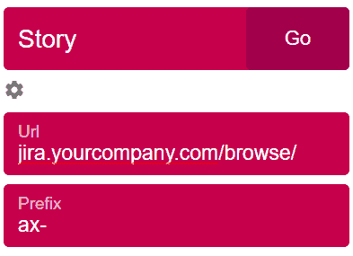

# 使用快捷方式访问您的每日网址

> 原文：<https://dev.to/stevcooo/access-your-daily-urls-using-a-shortcut-48od>

你好，
这是我在这里的第一个帖子，我决定把它贴在这里，因为我相信大多数使用这个网站的人都有和我一样的问题。我希望这能减轻你的日常工作，提高你的工作效率。

我做了 6 年多的开发人员，无论我在做哪个项目，总有一个我每天都会打开的 URL 列表。比如吉拉的故事。它们看起来都一样，但只有最后一部分路径不同。因为我在使用谷歌浏览器，所以我开发了一个扩展来帮助我访问这些网址。

你可以从[这里](https://chrome.google.com/webstore/detail/combine-url/lnmkibhfmgahenghonphjlepcdbdjpon)安装扩展。

例如，如果你在吉拉有很多任务，它们都有相同的基本 URL，但只有最后几个字符不同。

*   [https://jira.yourcompany.com/browse/AX-3830](https://jira.yourcompany.com/browse/AX-3830)
*   [https://jira.yourcompany.com/browse/AX-3822](https://jira.yourcompany.com/browse/AX-3822)
*   [https://jira.yourcompany.com/browse/AX-2592](https://jira.yourcompany.com/browse/AX-2592)

您可以将此分机设置为:

当你按下 CTR+SHIFT+F 时，会出现一个弹出窗口，你只需输入最后 4 个字符，例如 3830，按下 enter 或 Go 按钮，链接将在新标签页中打开。

如果你对源代码感兴趣，你可以在这里找到:[https://github.com/stevcooo/urlcombine](https://github.com/stevcooo/urlcombine)

# 博客

[https://blog.kostoski.com/blog/9](https://blog.kostoski.com/blog/9)