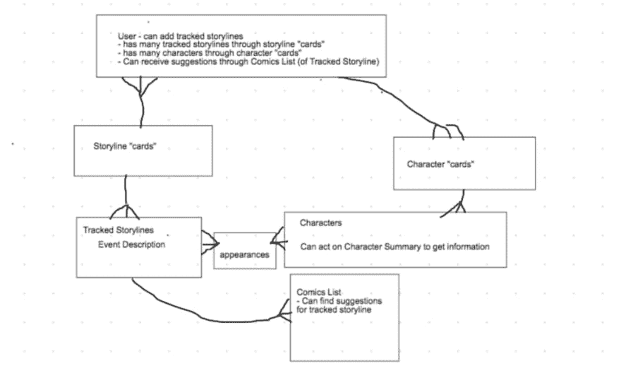
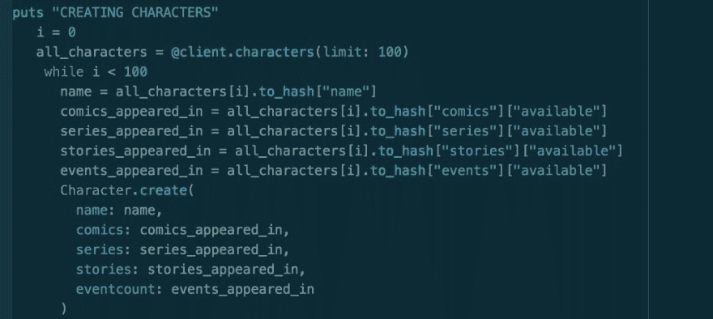
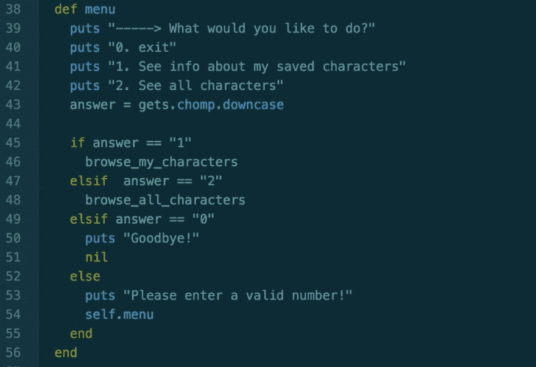
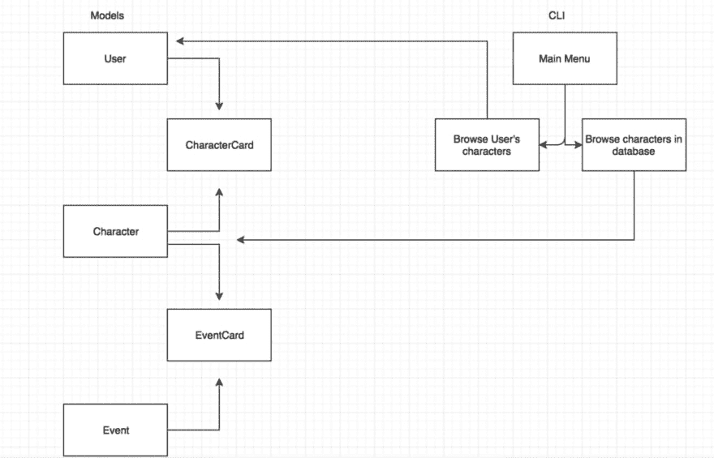
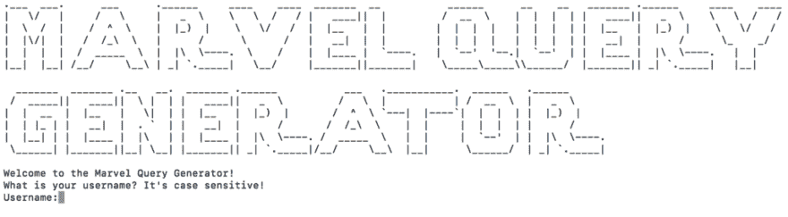
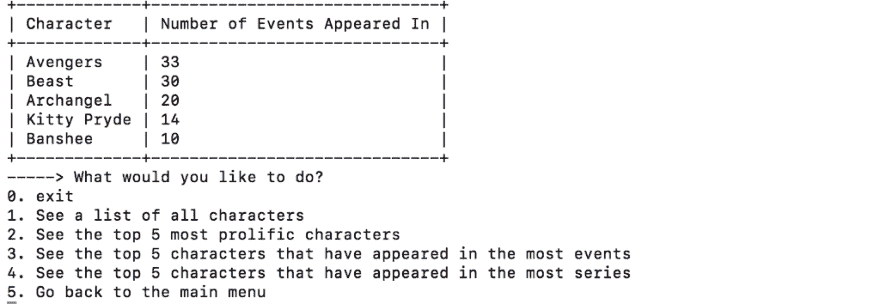
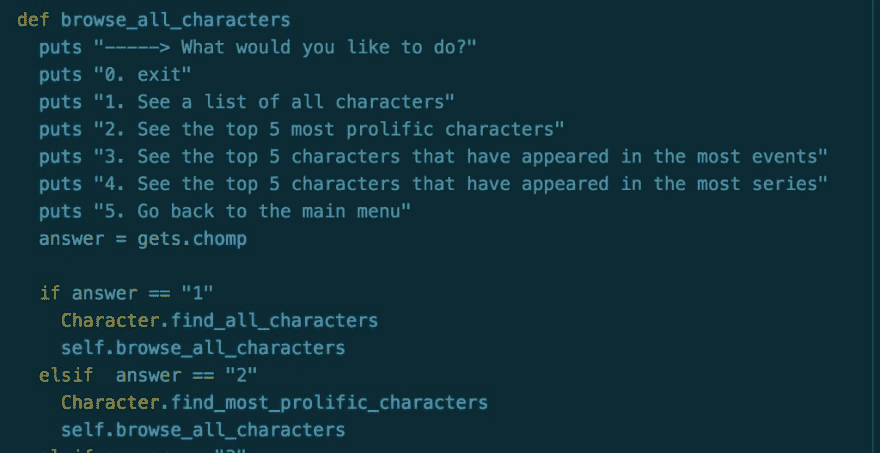
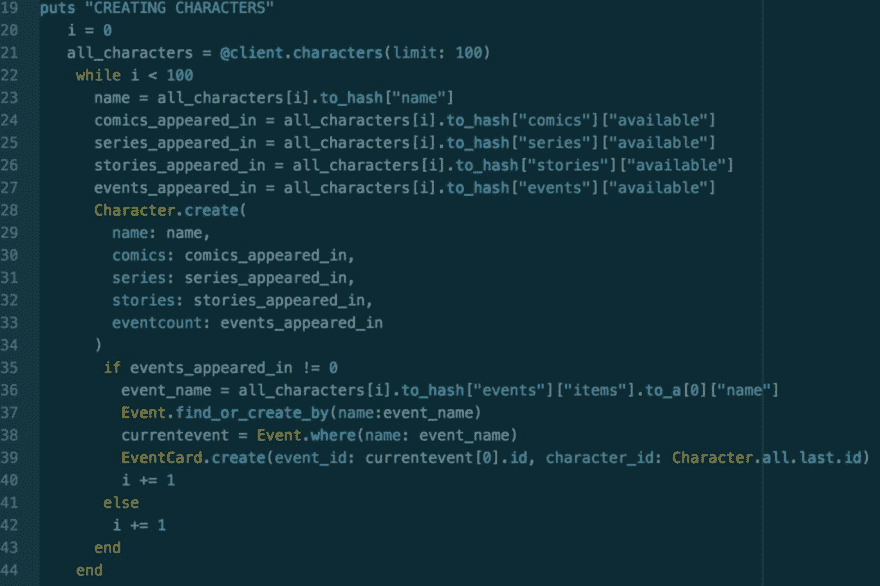

# ActiveRecord、数据库和 API——天哪！

> 原文：<https://dev.to/kcarrel/activerecord-databases-and-apis-oh-my-1473>

### ActiveRecord、数据库和 API——哎呀！

为了标志熨斗学校的软件工程沉浸式项目模块一的结束，我们被分配了合作伙伴，并接受了构建命令行数据库应用程序的挑战。所提供的说明考虑到了这个项目的各种方向，但是作为漫画迷，我和我的合作伙伴立即被漫威 API 吸引为我们的出发点。

我们的任务如下:

*   使用 ActiveRecord 访问 SQLITE3 数据库。
*   创建至少三个模型，包括一个连接模型。
*   使用从 CSV、抓取网站或 API 收集的信息来播种数据库。
*   创建一个 CLI 来显示显示数据库信息的方法的返回值

在我们最初的头脑风暴会议中，我们想到了一个应用程序，用户可以保存漫威的角色和故事情节以供参考，并接收相关内容的建议(例如，保存的故事情节中的所有角色)。

### 型号

最初，我们希望我们的项目总共有六个模型(用户、故事线卡(连接)、故事线、角色卡(连接)、角色和外观)，但是绘制关系使我们意识到我们需要缩小我们项目的范围。因此，我们决定在第一次迭代中关注三个模型:用户、角色和角色卡(我们的 join 类)。用户将能够通过角色卡“保存”许多角色，并能够查询所有可用角色的数据库。

<figure> 

<figcaption>出身卑微</figcaption>

</figure>

### 处理数据库

我的项目合作伙伴为漫威 API 找到了一个 [Ruby 包装器，它允许我们使用内置方法调用漫威 API，这些内置方法将返回一个 Hashie::Mash 对象数组，供我们植入数据库。](https://github.com/O-I/marvel)

利用 gem marvel_api，我们能够播种我们的角色数据库，但是这也带来了一些困难:

*   漫威 API 本身对一次调用的字符数(最多 100 个)和一天调用的字符数(3000 个)有限制
*   需要一个 API 密钥，因此需要在推送到 Github 之前将其隐藏起来

用户是通过使用 [Faker gem](https://github.com/stympy/faker) 随机分配名字来创建的(在我们的演示中，我们使用了塞尔达字符)。我们希望我们的用户也可以通过角色卡(join class)来“保存”角色，所以我们使用这个示例通过一个新的角色卡将一个用户与一个角色随机关联起来。

### CLI

现在我们已经在数据库中植入了 200 个漫威角色，10 个随机用户和角色卡来关联这两者，我们开始构建我们的 CLI。在这个过程的早期，我们意识到我们将在 CLI 文件中创建多个菜单选项，这些选项将调用我们的用户和角色类文件中的 helper 方法。

<figure> 

<figcaption>我们菜单系统的基本轮廓</figcaption>

</figure>

<figure> 

<figcaption>与模型交互的 CLI 菜单流程</figcaption>

</figure>

### 改头换面时间

既然我们已经设置了模型，植入了数据库并运行了 CLI，是时候让我们的程序易于阅读和导航了。

<figure>

<figcaption>[https://github . com/kcarrel/module-one-final-project-guidelines-Seattle-web-career-012819](https://github.com/kcarrel/module-one-final-project-guidelines-seattle-web-career-012819)</figcaption>

</figure>

使用 ASCII 文本生成器，我们为程序创建了一个更加动态的打开屏幕。然而，我们选择了一种包含转义字符(" \ ")的字体，这需要进一步的操作才能在终端中正确显示。

我们使用 [gem 终端表](https://github.com/tj/terminal-table)在一个简单的 ASCII 表中表示来自数据库的信息。我们还在 CLI 菜单中添加了 helper 方法，在用户收到请求的信息后，这些方法会将用户返回到之前所在的菜单选项。

<figure> 

<figcaption>调用 browse_all_characters 并选择下面代码</figcaption>

</figure>

的“2”的终端输出

### 现在怎么样了？

在完成我们项目的第一次迭代后，我们将目光放在为其他模型和关联建立延伸目标上。我们最终创建了“Event”和“EventCard”模型，这将允许我们将漫威事件的名称与角色联系起来。然而，我们立即遇到了一个问题——考虑到漫威 API 的局限性，我们如何在播种数据库时建立这些关联？我们设计的解决方案是在角色创建中找到或创建事件，然后通过创建事件卡将角色与事件关联起来。一旦我们有了满意的扩展数据库，我们很快添加了额外的助手方法和菜单项来导航扩展的项目。

### 项目外卖

我从这个结对编程项目中学到了两个重要的经验——尽早寻求帮助，尽可能留出时间来测试你的程序。

在我们项目的第 4 天，我和我的伙伴已经完成了我们项目的第一次迭代，并且正在头脑风暴我们可以扩展的方法，以包括我们的延伸目标。然而，这次集思广益会议却成了我们的牺牲品，我们在原地打转了几个小时，而没有邀请外部顾问。在第二天寻求帮助后，我们意识到我们浪费了三个小时，而不是简单地寻求帮助！

在我们准备向全班展示我们的项目前一个小时，我正在为我们完成的项目的第二次迭代录制一个演示，这时我在我们实现的新代码中发现了一个问题。我们创建事件的方法只创建了角色关联的第一个事件，而不是所有的事件。我们没有足够的时间来完全解决这个新发现的问题，因此不得不继续开发一个没有达到我们期望的最大程度的代码。这个经验强调了计划测试阶段的重要性，以便对尽可能多的情况进行战略性测试。