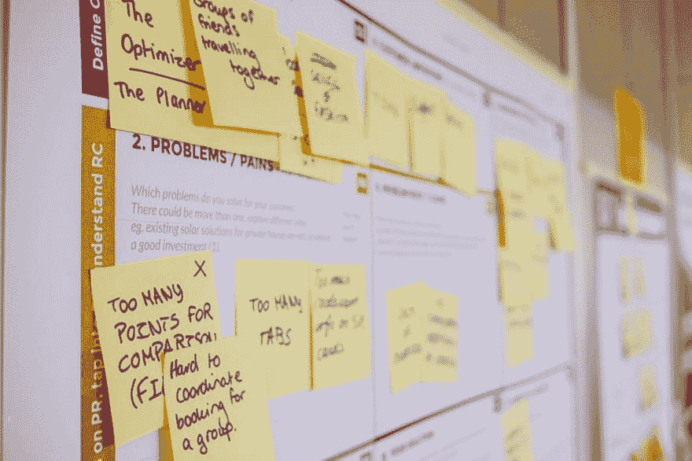

# 适应性最佳实践

> 原文：<https://dev.to/vetswhocode/adaptive-best-practices-53oa>

 

<figcaption>图片由马库斯·斯皮斯克提供于[unsplash.com](https://unsplash.com/photos/qjnAnF0jIGk)</figcaption>

*原载于 2015 年 11 月 10 日我的网站，*[*【semperfried.com】*](http://semperfried.com/best-practices/2015/11/20/adaptive-best-practices.html)

最近，我一直在研究最佳实践，不仅仅是软件方面的，而是所有方面的，并且看到了 Lindsey Dunn 的文章，标题是[最佳实践不重要，重要的是……](http://www.beckershospitalreview.com/healthcare-blog/best-practices-don-t-matter-here-s-what-does.html)。文章提出了一些关于盲目实施最佳实践的重要观点，并以丰田的巨大成功以及他们如何教授适应性方法为例，论证了适应性文化。现在，这可能会让一些人有点挠头…你可能会问在线医院评论杂志上的一篇文章和汽车制造商关于最佳实践的决策与软件开发有什么关系。有些人会读到相关的文章，在他们的脑海中，他们赤裸着胸膛，在头上摆动着他们的衬衫，尖叫着“呜-呼！！！没有规则！！!"。伙计们，把你们的衬衫穿上，你们所有人都忍耐一下，这是有道理的。

这篇文章中给我印象最深的一句话是这样的:

> “我们知道我们无法实施完美的流程，因为首先，我们是人，人并不完美。其次，我们知道，即使我们设计了一个完美的过程，环境也会以未知和不可知的方式围绕着这个过程发生变化。因此，尽管我们努力设计尽可能最好的流程，但更重要的是，我们要知道我们的流程何时失败，然后以尽可能低的成本快速、简单、轻松地改进它们或它们周围的环境。”

因此，识别流程故障，然后快速实施新的“最佳实践”来解决它们。虽然从表面上看，这篇文章似乎反对最佳实践，但它实际上指出的是，我们不能成为它们的盲目奴隶；如果您的流程中的某些东西中断或改变，那么您之前认为的最佳实践最终可能并不那么好(当您想到它时，它本身就是一种“最佳实践”——很讽刺，是吧？).到目前为止，这与软件开发的关系应该是显而易见的，因为这是敏捷编程模型的本质，也是技术和产品生命周期变化影响我们作为开发人员的生活的速度的隐喻。

**案例一:**2010 年，OpenStruct 被列入 [Rails 最佳实践](http://rails-bestpractices.com/posts/2010/08/25/use-openstruct-when-advance-search/)，直到 2013 年，Ruby devs 还在对 [OpenStruct 大加赞赏，超过了 Hashie::Mash](http://www.schneems.com/2014/12/15/hashie-considered-harmful.html) 。当然，到这个时候，人们已经开始[怀疑](http://rubyrailroad.com/2013/06/04/pass-openstruct-or-object-to-controller-from-view/)，随着 2015 年对 Ruby 2.x 代码库的改进，现在有证据表明，用关键字 args 构造的 POROs 不仅大大优于 OpenStruct，而且也优于 Hash，这促使至少一个开发人员提出[你永远不应该使用 OpenStruct](http://palexander.posthaven.com/ruby-data-object-comparison-or-why-you-should-never-ever-use-openstruct) 。

**案例二:**大家还记得[瀑布模型](https://en.wikipedia.org/wiki/Waterfall_model)吗？当软件开发首次成为一件事情时，没有开发周期的过程模型，所以瀑布模型是从生产和制造中直接提升出来的——有一段时间，它是行业中项目工作的事实上的标准；尽管有人反对这一模式，也有人对其进行了修改，但它或多或少在很长一段时间内都发挥了作用。

然而，没有什么是永恒的。

当[敏捷软件开发](https://en.wikipedia.org/wiki/Agile_software_development)在 2001 年被引入时，它的迭代性质、短时间框架、反馈循环和即时满足感让我们很多人想知道为什么我们曾经在瀑布上浪费时间。我最不喜欢的英语短语之一是“这是我们一直做的方式”(好像这是继续做某事的任何理由，即使你知道可能有更好的选择)，敏捷似乎完全符合我当时的思维方式。

> *敏捷宣言的 12 条原则:*
> 
> 通过早期和持续交付有价值的软件来满足客户
> 
> 欢迎不断变化的需求，即使是在开发后期
> 
> 工作软件经常交付(几周而不是几个月)
> 
> 业务人员和开发人员之间密切的日常合作
> 
> 项目是围绕有积极性的个人建立的，他们应该被信任
> 
> 面对面的交谈是最好的沟通方式(共处一地)
> 
> 工作软件是进步的主要衡量标准
> 
> 可持续发展，能够保持不变的速度
> 
> 持续关注技术优势和优秀设计
> 
> 简单——最大化未完成工作量的艺术——至关重要
> 
> 自组织团队
> 
> 对不断变化的环境的正常适应

 

<figcaption>图片由 Daria Nepriakhina 提供，来自[unsplash.com](https://unsplash.com/photos/zoCDWPuiRuA)</figcaption>

然而，敏捷也不是完美的——自从它被引入以来，已经有了许多改进(有人可能会说这本身符合敏捷的精神，因为它都是关于响应变化并快速适应变化的)，甚至是对其假设的公然挑战……软件工艺宣言就是这样一种回应。如今，我倾向于站在这场争论的中间——没有理由为什么软件工艺和敏捷不能和谐地共存。“项目是围绕值得信任的有积极性的个人构建的”——为什么要信任他们？如果一个开发人员致力于精确性、可预测性、度量、风险缓解和专业性的严格性，那么没有理由有任何怀疑。在许多组织中，适应性是职业精神的重要标志(美国海军陆战队就是其中之一——“适应和克服”是他们在基础训练中反复灌输给你的咒语之一)，在软件行业中也应该如此。“工作软件是进步的主要衡量标准”；当一个人应用专业的思维方式(和工具集)来测试和衡量自己代码的质量时，工作软件是一个自然的结果，(并且运用它们符合“对技术卓越和良好设计的持续关注”)。此外，应用所述规程可以导致寻找更多的方法来自动化现有过程，允许一个人“……最大化未完成的工作量”。

因此，OpenStruct 从最佳实践变成了不被认可的东西，因为它不仅没有性能，而且从安全角度来看也相对危险。瀑布从镇上唯一的游戏，到被敏捷击败，反过来又受到软件工艺人群的挑战。我们可以从中吸取一个教训(除了“不使用 OpenStruct 或瀑布方法”)这个教训是:

> “现在做某事的最佳方式不一定是昨天做得最好的方式，而且几乎肯定不是将来可用的最佳方式”。

变化是唯一不变的。最佳实践是可以遵循的好规则(总的来说，我永远不会反对它们)——它们帮助我们在日常工作中培养纪律性和专业性，并且经常帮助我们写出更好的代码。然而，如果没有学习新事物和适应行业变化的能力和意愿，你最终会发现你的“最佳实践”会让你实践错误的东西。

* * *