# 广告拦截器性能研究

> 原文：<https://dev.to/remusao/adblockers-performance-study-5b47>

在这里，我们详细分析了一些最流行的内容拦截器引擎的性能: *uBlock Origin* 、 *Adblock Plus* 、 *Brave* 、 *DuckDuckGo* 和 *Cliqz/Ghostery 的*高级广告拦截器(自 Ghostery 8 开始提供)，在本文的其余部分，我们将它们称为 *Ghostery* 。

这项研究是由最近的 [Manifest V3 争议](https://bugs.chromium.org/p/chromium/issues/detail?id=896897)引发的。提议的变化之一涉及削弱 WebRequest APIs 以限制它们的阻塞能力。提出了两个理由:一个与*的表演*有关，另一个与隐私有关。隐私问题值得单独分析，这里不做讨论。在这项研究中，我们证明了*性能*的论点不成立。我们的比较表明，最流行的内容拦截器已经非常高效了(每个请求的中值决策时间不到 1 毫秒),并且不会导致用户明显的开销。我们在另一项研究中展示了追踪器税，屏蔽广告和追踪器实际上减少了网站的加载时间达 2 倍。此外，效率不断提高，WebAssembly 等技术将允许走得更远。

这种比较不涉及完全扩展，而是**关注网络请求拦截引擎**，这是由内容拦截器执行的 CPU 最密集的任务(特别是，这不考虑化妆品引擎或订阅管理)。以下是比较的所有内容拦截器的主页:

*   [Ghostery 和 Cliqz 的广告拦截器](https://github.com/cliqz-oss/adblocker)
*   [Brave 的广告拦截器](https://github.com/brave/ad-block)
*   [DuckDuckGo 的广告拦截器](https://github.com/duckduckgo/abp-filter-parser)
*   [子块原点](https://github.com/gorhill/uBlock)
*   [Adblock Plus](https://github.com/adblockplus/adblockpluscore)

我们没有包括 Chromium 和 Safari 项目中的原生拦截器，因为这需要付出很大的努力来打包它们，以允许对其他库进行基准测试。我们把这个留给以后的工作。

除了*子块来源*之外的所有拦截器都可以作为 JavaScript 库在 Node.js 中加载。为了允许比较*子块来源*，我们必须从扩展中提取静态网络过滤引擎[。在基准测试*中运行的*子块原点*版本不使用域匹配的 Webassembly* 版本。](https://github.com/cliqz-oss/adblocker/blob/master/bench/comparison/ublock.js)

所有基准都是在 Node.js 11.9.0 中的 X1 Carbon 2016 (i7 U6600 + 16 GB)上运行的。使用内存快照工具在 Google Chrome 版本 72.0.3626.96 中执行内存测量。

## 结果

在对结果进行详细分析之前，让我们概括地强调一下我们的发现:

*   除了 *DuckDuckGo* 之外，所有内容拦截器对每个请求都有**亚毫秒级的平均决策时间**。
*   **在 Ghostery 中处理请求的时间**(中值): **0.007 毫秒**

    *   比*子块原点*快 2.7 倍
    *   比 *Adblock 加*快 2.9 倍
    *   比 *Brave* 的广告拦截器快 6.3 倍
    *   比 *DuckDuckGo* 的广告拦截器快 1258.4 倍
*   **加载 Ghostery 的拦截引擎**(来自缓存): **0.03 毫秒**

    *   比 *Brave* 的广告拦截器快 368 倍
    *   比*子块原点*快 588 倍
    *   比 *Adblock 加*快 3575 倍
    *   DuckDuckGo 的广告拦截器不提供序列化，所以加载成本总是解析列表的成本。
*   **Ghostery 的阻塞引擎的内存消耗**(启动时，在 Chrome 中): **1.8 MB**

    *   内存比*子块原点*少 1.6 倍
    *   内存比 *Adblock 加*少 8.4 倍
    *   比 *DuckDuckGo* 的广告拦截器少 8.8 倍的内存
    *   无法使用 devtools 评估 *Brave* 的内存使用情况，因此不包括在本节中。

### 0。关于数据集

为了测量每个内容拦截器的性能，我们将来自热门域的请求重播一次，并跟踪决定是否应该拦截它们所花费的时间。然后，我们用三种不同的方式分析结果:所有请求、仅阻塞的请求和未阻塞的请求(取自同一次运行)。

这个请求数据集是使用 Chrome 无头浏览器池(由 [`puppeteer`库](https://github.com/GoogleChrome/puppeteer)驱动)创建的，用于访问*500 强域名*(由 Cliqz Search 报告)的主页，以及每个域名的多达 3 个页面(从主页中随机选取)，并收集所有看到的网络请求(URL、框架 URL 和类型)。数据集以这样一种方式被混洗，即不同的页面以随机的顺序被访问，但是在每个页面上看到的请求在它们最初被记录时被重放。

该数据集由 242944 个请求组成。我们在这个网址公开发布了数据: [requests_top500.json.gz](https://cdn.cliqz.com/adblocking/requests_top500.json.gz) 。创建数据集的脚本也是可用的: [create_dataset.js](https://github.com/cliqz-oss/adblocker/blob/master/bench/comparison/create_dataset.js) 和 [shuffle_dataset.js](https://github.com/cliqz-oss/adblocker/blob/master/bench/comparison/shuffle_dataset.js) 用于混洗请求以产生最终数据。

### 1。请求的构成

为了进行比较，我们认为每个网络请求都可以被内容拦截器拦截或允许；我们把决定一个请求是否应该被阻塞的过程叫做:*匹配*。我们观察到，从我们的数据集中，只有大约 19.2%被阻止(所有内容阻止者的平均值)。

[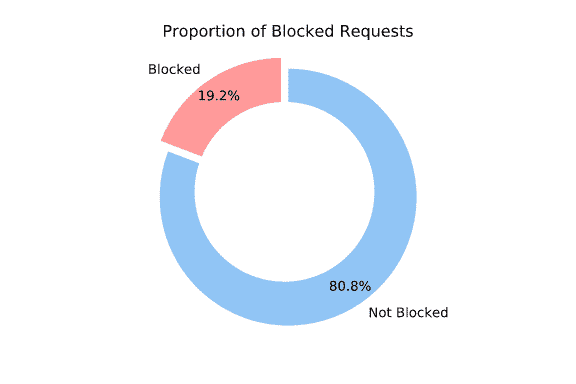](https://res.cloudinary.com/practicaldev/image/fetch/s--3a2vHveB--/c_limit%2Cf_auto%2Cfl_progressive%2Cq_auto%2Cw_880/https://whotracks.me/static/img/blog/adblockers_performance/requests-composition.svg)

根据这一观察结果，如果内容拦截器能够有效地决定哪些请求*不拦截*，那么它们的平均表现会更好。

用来决定一个请求是否被阻塞的过滤器是来自 [Easylist](https://easylist-downloads.adblockplus.org/easylist.txt) 的过滤器，在运行基准测试之前，我们删除了所有的表面规则。最终列表包含 *38978 网络过滤器*，可在此处获得: [easylist.txt](https://github.com/cliqz-oss/adblocker/blob/master/bench/comparison/easylist.txt) 。

在这一点上应该注意的是，通过启用额外的过滤器列表，例如 *EasyPrivacy* ，可以阻止更大比例的请求。

### 2。匹配所有请求的时间

我们首先查看所有的请求(它们最终是否会被阻塞)。我们使用 x 轴的对数标度(以毫秒为单位的时间)来比较内容拦截器决定是否应该拦截请求所花费的时间的累积分布。

以下是每个内容拦截器的第 99 个百分位数和平均时间的细分:

|  | 99%的请求 | 中位数 |
| --- | --- | --- |
| **幽灵特工** | **0.050 毫秒** | **0.007 毫秒** |
| 子块来源 | 0.124 毫秒(**比**慢 2.5 倍) | 0.017 毫秒(**比**慢 2.7 倍) |
| 阿德布洛克加 | 0.103 毫秒(**比**慢 2.1 倍) | 0.019 毫秒(**慢 2.9 倍**) |
| 勇敢的 | 1.288 毫秒(**慢了 25.9 倍**) | 0.041 毫秒(**比**慢 6.3 倍) |
| 达克达克戈 | 12.085 毫秒(**比**慢 242.5 倍) | 8.270 毫秒(**比**慢 1258.4 倍) |

下面您可以找到这些计时的累积分布图:

[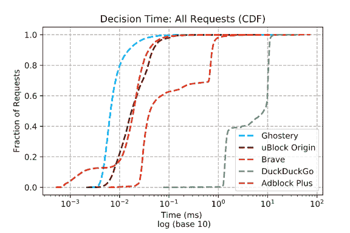](https://res.cloudinary.com/practicaldev/image/fetch/s--EK1um6Mx--/c_limit%2Cf_auto%2Cfl_progressive%2Cq_auto%2Cw_880/https://whotracks.me/static/img/blog/adblockers_performance/ghostery-ublock-origin-brave-duckduckgo-adblock-plus-all.svg)

### 3。匹配未被阻塞的请求的时间

下表详细说明了未阻塞请求的第 99 个百分位数和中间计时:

|  | 99%的请求 | 中位数 |
| --- | --- | --- |
| **幽灵特工** | **0.049 毫秒** | **0.006 毫秒** |
| 子块来源 | 0.112 毫秒(**比**慢 2.3 倍) | 0.018 毫秒(**比**慢 2.8 倍) |
| 阿德布洛克加 | 0.105 毫秒(**比**慢 2.2 倍) | 0.020 毫秒(**比**慢 3.1 倍) |
| 勇敢的 | 1.270 毫秒(**比**慢 26.2 倍) | 0.038 毫秒(**慢 5.9 倍**) |
| 达克达克戈 | 11.190 毫秒(**比**慢 230.5 倍) | 6.781 毫秒(**比**慢 1060.5 倍) |

[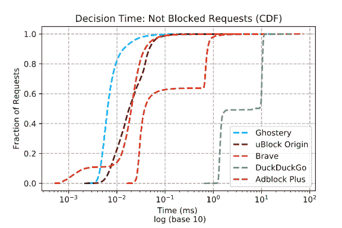](https://res.cloudinary.com/practicaldev/image/fetch/s--NsLltq-Y--/c_limit%2Cf_auto%2Cfl_progressive%2Cq_auto%2Cw_880/https://whotracks.me/static/img/blog/adblockers_performance/ghostery-ublock-origin-brave-duckduckgo-adblock-plus-not-blocked.svg)

### 4。匹配被阻止的请求的时间

下表详细说明了被阻止请求的第 99 个百分位数和中值计时:

|  | 99%的请求 | 中位数 |
| --- | --- | --- |
| **幽灵特工** | **0.052 毫秒** | **0.007 毫秒** |
| 子块来源 | 0.165 毫秒(**比**慢 3.1 倍) | 0.016 毫秒(**比**慢 2.2 倍) |
| 阿德布洛克加 | 0.099 毫秒(**慢 1.9 倍**) | 0.014 毫秒(**慢 1.9 倍**) |
| 勇敢的 | 1.468 毫秒(**比**慢 28.0 倍) | 0.062 毫秒(**比**慢 8.5 倍) |
| 达克达克戈 | 13.025 毫秒(**比**慢 248.5 倍) | 8.31 毫秒(**比**慢 1130.6 倍) |

[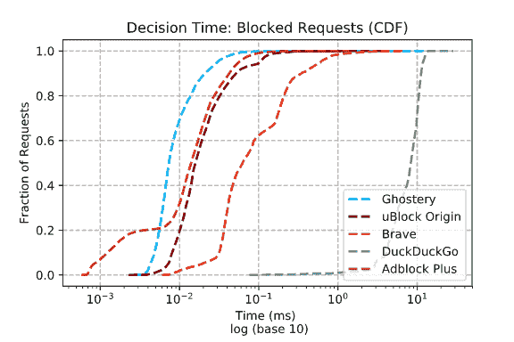](https://res.cloudinary.com/practicaldev/image/fetch/s--F-w2QZ_4--/c_limit%2Cf_auto%2Cfl_progressive%2Cq_auto%2Cw_880/https://whotracks.me/static/img/blog/adblockers_performance/ghostery-ublock-origin-brave-duckduckgo-adblock-plus-blocked.svg)

在这些图中，我们观察到 *Adblock 加*、 *Brave* 和 *Duckduckgo* 的平稳状态。这可以通过以下事实来解释:这些引擎在内部实现了某种形式的缓存，因此对一些已经看到的请求具有非常快的响应时间(请求中的冗余来自多个网站上看到的常见第三方，以及我们为每个域加载多个页面的事实)。这种缓存可以在任何内容拦截器的基础上实现，但并不能说明每个内容拦截器的效率；我们可以将此视为一种用*内存*换取 *CPU 使用*的手段。

从之前的测量中，我们看到 Ghostery 在匹配速度方面优于其他库。无需深入细节，以下是一些可以解释这些结果的优化:

*   Ghostery 利用反向索引将令牌与过滤器关联起来。与其他库不同，我们确保在构建时为每个过滤器选择最好的标记(最好定义为最少出现的标记(T3)的 T2)。这导致了一次性的额外成本，但是导致了最大化的调度能力。
*   过滤器以一种非常紧凑的形式存储在类型化的数组中，只有当它们有可能被阻塞时(如果我们在 URL 中遇到相同的标记)，才会被延迟加载到内存中。
*   加载到内存中的滤波器可以实时优化，并且可以组合多个滤波器以提高效率。优化是基于 Easylist 中观察到的常见情况精心制作的。

### 5。序列化和反序列化

在这一节中，我们来看看内容拦截器在序列化其内部表示以加快后续加载时的性能。只有 *DuckDuckGo* 的发动机不提供这个功能。*子块原点*、*幽灵*、 *Adblock Plus* 和*勇者*都允许序列化或缓存(*子块原点*的术语是:*自拍*)整个阻塞引擎到一个字符串或缓冲区，然后可以用来加速后续的加载。

因为这是一次性操作，所以更长的加载时间不会对桌面用户产生显著影响。另一方面，快速初始化内容拦截器的能力在手机上至关重要。

这种功能允许的另一个用例是在后端执行列表解析，并将内容拦截器的序列化形式直接发送给客户端，这完全消除了初始化的成本。

我们对每个内容拦截器执行了 100 次序列化，结果如下所示:

[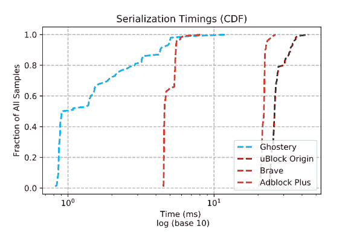](https://res.cloudinary.com/practicaldev/image/fetch/s--O6ctxIpw--/c_limit%2Cf_auto%2Cfl_progressive%2Cq_auto%2Cw_880/https://whotracks.me/static/img/blog/adblockers_performance/ghostery-ublock-origin-brave-adblock-plus-serializationtimings.svg)

此条形图包含序列化每个内容阻止程序的引擎所用的平均时间:

[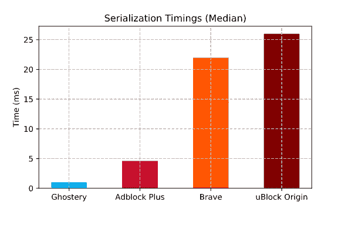](https://res.cloudinary.com/practicaldev/image/fetch/s--bpS5NWNO--/c_limit%2Cf_auto%2Cfl_progressive%2Cq_auto%2Cw_880/https://whotracks.me/static/img/blog/adblockers_performance/serializationtimings.svg)

同样，我们测量了从序列化形式恢复内容阻止程序所需的时间:

[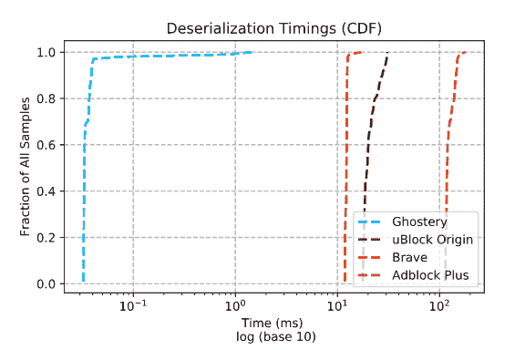](https://res.cloudinary.com/practicaldev/image/fetch/s--KE1CO_qg--/c_limit%2Cf_auto%2Cfl_progressive%2Cq_auto%2Cw_880/https://whotracks.me/static/img/blog/adblockers_performance/ghostery-ublock-origin-brave-adblock-plus-deserializationtimings.svg)

这是平均时间:

[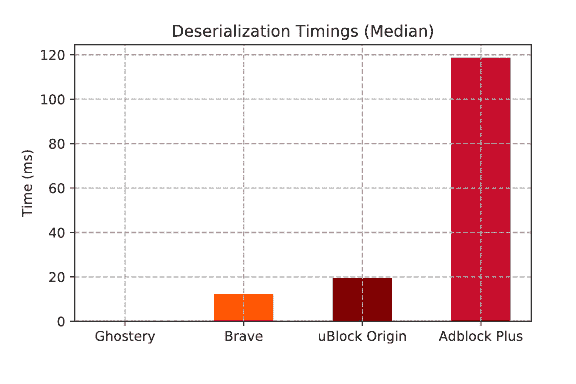](https://res.cloudinary.com/practicaldev/image/fetch/s--GbcWQtTW--/c_limit%2Cf_auto%2Cfl_progressive%2Cq_auto%2Cw_880/https://whotracks.me/static/img/blog/adblockers_performance/deserializationtimings.svg)

最后但同样重要的是，我们测量了每个内容拦截器的序列化缓冲区的大小:

[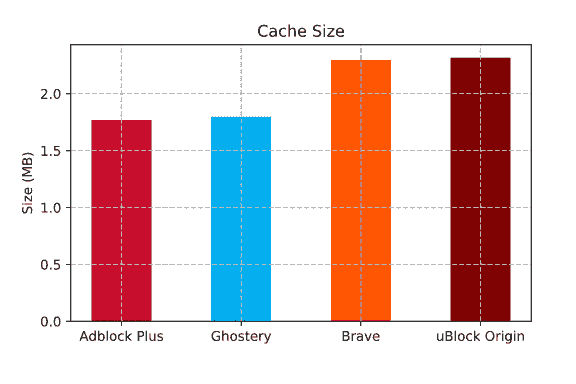](https://res.cloudinary.com/practicaldev/image/fetch/s--IaWDcFsz--/c_limit%2Cf_auto%2Cfl_progressive%2Cq_auto%2Cw_880/https://whotracks.me/static/img/blog/adblockers_performance/cache-size.svg)

从这些测量中，我们看到 *Ghostery* 提供了显著更快的序列化和反序列化时间以及更小的缓存大小。

原因如下:内部表示已经大部分以紧凑形式存储(使用类型化数组)；这意味着序列化只包括在已经可用的数组旁边添加少量的元数据，而反序列化基本上是瞬时的(T2 ),因为这足以在序列化的缓冲区上创建一些类型化的数组视图(想想使用类型化数组的`mmap`)。这也解释了内存消耗非常低的原因:初始化后，内存使用量只比序列化形式的大小略高。

### 6。启动时的内存消耗

这里，我们考虑每个内容拦截器的内存使用情况，在一次完整的垃圾收集后，从列表(而不是从缓存)初始化。测量是使用 Chrome 的 devtools 内存快照进行的。我们在这里没有测量 Brave，因为在快照中似乎没有考虑 C++端使用的内存。还要记住，这种内存使用在运行时会有所不同，因为内容拦截器可能会缓存经常使用的资源等。

[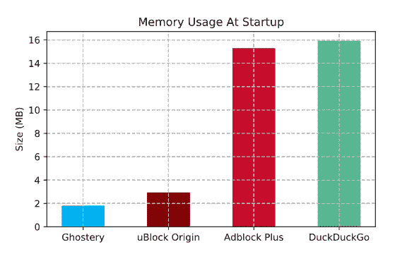](https://res.cloudinary.com/practicaldev/image/fetch/s--CgvHvmqG--/c_limit%2Cf_auto%2Cfl_progressive%2Cq_auto%2Cw_880/https://whotracks.me/static/img/blog/adblockers_performance/memory-usage-at-startup.svg)

正如前面关于序列化的部分所提到的， *Ghostery* 非常低的内存使用量可以解释为内部表示主要由非常紧凑的类型化数组组成，并带有一些额外元数据的小开销。我们需要再次强调，这只是测量 Ghostery 的网络过滤引擎，而不是完整的扩展，如简介中所述。

### 7。解析列表

在此图中，我们显示了从列表中初始化每个内容阻止程序所花费的时间(没有任何预先缓存，这意味着通过解析原始列表来初始化所有内部资源)。我们看到，只有勇者似乎明显慢了很多，并且 *uBlock Origin* 、 *Ghostery* 、 *Adblock Plus* 和 *DuckDuckGo* 都表现不错。

[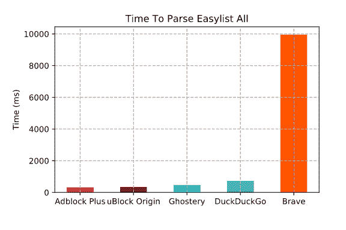](https://res.cloudinary.com/practicaldev/image/fetch/s--TyHdoHxB--/c_limit%2Cf_auto%2Cfl_progressive%2Cq_auto%2Cw_880/https://whotracks.me/static/img/blog/adblockers_performance/time-to-parse-easylist-all.svg)

Brave 的长解析时间似乎是 GitHub 仓库中的一个已知问题。

现在如果去掉勇者，我们看到 *uBlock Origin* 、 *Ghostery* 、 *Adblock Plus* 和 *DuckDuckGo* 还是有区别的。 *Ghostery* 比*子块原点*和 *AdblockPlus* 慢的一个原因是，为了在匹配的同时实现最高性能并最小化内存使用，需要预先做更多的工作。在实践中，这并不重要，因为这是一次性操作，后续加载是从缓存中执行的，这非常快(事实上，我们甚至可以执行后端解析，只需发布拦截器的序列化版本，这完全消除了这一步骤)。

### 8。结论

在这项研究中，我们仔细观察了目前使用的一些最流行的内容拦截器的性能。我们特别关注他们的网络过滤引擎的效率，这是他们执行的最消耗 CPU 的任务。

这项工作是由 Chromium 项目的 [Manifest V3 提案](https://bugs.chromium.org/p/chromium/issues/detail?id=896897)中的一个声明所激发的:*“扩展然后执行任意的(并且可能非常慢的)JavaScript”*，谈论内容拦截器处理所有网络请求的能力。从测量结果来看，我们不认为这种说法成立，因为所有流行的内容拦截器已经非常有效，不应该引起任何明显的用户速度下降。此外，内容拦截器的效率*正在不断提高*，这要么归功于更具创新性的方法，要么归功于使用 WebAssembly 等技术来达到原生性能。

虽然大多数内容拦截器确实有效，但它们并不等同，我们观察到 *Ghostery* 在所有维度上的表现都一样好或更好，经常超过其他库。

我们希望这些基准能给内容拦截器开发者一个机会，来衡量他们自己相对于其他流行库的进步；随着内容拦截器效率的提高，所有用户都将受益，无论他们使用哪种扩展。