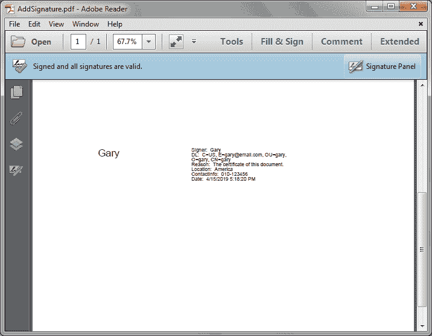
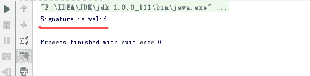

# 用 Java 在 PDF 中添加和验证数字签名

> 原文：<https://dev.to/eiceblue/add-and-verify-digital-signature-in-pdf-with-java-ofg>

# 简介

数字签名是保护 PDF 文件不被他人擅自更改的一种有效且常用的方法。本文将展示如何将数字签名添加到 PDF 文件中，并使用免费的 Java PDF API 来验证数字签名。

# 先决条件

对于 maven 项目，我们可以通过在 pom.xml 中添加以下代码，轻松地将依赖项添加到免费的 Java Spire.PDF API 中:

```
<repositories>
        <repository>
            <id>com.e-iceblue</id>
            <name>e-iceblue</name>
            <url>http://repo.e-iceblue.com/nexus/content/groups/public/</url>
        </repository>
</repositories>
<dependencies>
    <dependency>
        <groupId>e-iceblue</groupId>
        <artifactId>spire.pdf.free</artifactId>
        <version>2.4.4</version>
    </dependency>
</dependencies> 
```

(maven 资源库中最新版本的 Java 免费 Spire.PDF 可以在[这里](http://repo.e-iceblue.com/nexus/content/groups/public/e-iceblue/spire.pdf.free/)找到)

对于常见的 Java 项目，下载最新版本的免费 Java Spire.PDF([下载链接](https://www.e-iceblue.com/Download/pdf-for-java-free.html))，然后添加 Spire。将 Pdf.jar 从 lib 文件夹复制到项目中。

# 使用代码

。在 PDF 文件中添加数字签名

要创建数字签名，我们需要创建一个 PdfSignature 类的对象，然后设置签名属性。以下代码示例显示了如何将数字签名添加到 PDF 页面的指定位置。

```
import com.spire.pdf.PdfDocument;
import com.spire.pdf.PdfPageBase;
import com.spire.pdf.security.GraphicMode;
import com.spire.pdf.security.PdfCertificate;
import com.spire.pdf.security.PdfCertificationFlags;
import com.spire.pdf.security.PdfSignature;
import java.awt.geom.Rectangle2D;
import java.util.Date;

public class AddDigitalSignature {
    public static void main(String[] args) {

        //Load the PDF file
        PdfDocument doc = new PdfDocument();
        doc.loadFromFile("Input.pdf");
        //Get the first Page
        PdfPageBase page = doc.getPages().get(0);

        Rectangle2D.Float rec = new Rectangle2D.Float(100, 450, 310, 100);

        //Load the .pfx certificate file
        PdfCertificate certificate = new PdfCertificate("gary.pfx", "e-iceblue");

        //Add digital signature to the first page at specified location
        PdfSignature signature = new PdfSignature(doc, page, certificate, "signature1", rec);

        //Set signature details
        signature.setNameLabel("Signer:  ");
        signature.setName("Gary");
        signature.setContactInfoLabel("ContactInfo:  ");
        signature.setContactInfo("010-123456");
        signature.setDateLabel("Date:  ");
        signature.setDate(new Date());
        signature.setLocationInfoLabel("Location:  ");
        signature.setLocationInfo("America");
        signature.setReasonLabel("Reason:  ");
        signature.setReason("The certificate of this document.");
        signature.setDistinguishedNameLabel("DL:  ");
        signature.setDistinguishedName(signature.getCertificate().get_IssuerName().getName());
        signature.setGraphicMode(GraphicMode.Sign_Name_And_Sign_Detail);
        signature.setDocumentPermissions(PdfCertificationFlags.Allow_Form_Fill);
        signature.setCertificated(true);

        //Save the file
        doc.saveToFile("AddSignature.pdf");
    }
} 
```

[](https://res.cloudinary.com/practicaldev/image/fetch/s--89ouZTuS--/c_limit%2Cf_auto%2Cfl_progressive%2Cq_auto%2Cw_880/https://thepracticaldev.s3.amazonaws.com/i/n49pja5zrg2xwpbyunpq.png)

。验证数字签名

PdfSignature 类中的 verifySignature()方法用于验证数字签名是否有效。

```
import com.spire.pdf.PdfDocument;
import com.spire.pdf.security.PdfSignature;
import com.spire.pdf.widget.PdfFormFieldWidgetCollection;
import com.spire.pdf.widget.PdfFormWidget;
import com.spire.pdf.widget.PdfSignatureFieldWidget;

public class VerifyDigitalSignature {
    public static void main(String[] args) {

        //Load the PDF file
        PdfDocument doc = new PdfDocument();
        doc.loadFromFile("AddSignature.pdf");

        //Get the forms collection
        PdfFormWidget pdfFormWidget = (PdfFormWidget) doc.getForm();
        PdfFormFieldWidgetCollection pdfFormFieldWidgetCollection = pdfFormWidget.getFieldsWidget();

        //Get the signature field
        for (int i = 0; i < pdfFormFieldWidgetCollection.getCount(); i++) {
            if (pdfFormFieldWidgetCollection.get(i) instanceof PdfSignatureFieldWidget) {
                PdfSignatureFieldWidget signatureFieldWidget = (PdfSignatureFieldWidget) pdfFormFieldWidgetCollection.get(i);
                //Get the signature in the signature field
                PdfSignature signature = signatureFieldWidget.getSignature();
                //Verify the signature
                boolean result = signature.verifySignature();
                if(result) {
                    System.out.println("Signature is valid");
                }else {
                    System.out.println("Signature is invalid");
                }
            }
        }
    }
} 
```

[](https://res.cloudinary.com/practicaldev/image/fetch/s--FPvYfzLj--/c_limit%2Cf_auto%2Cfl_progressive%2Cq_auto%2Cw_880/https://thepracticaldev.s3.amazonaws.com/i/563bpbxvxbbvwnixvode.png)