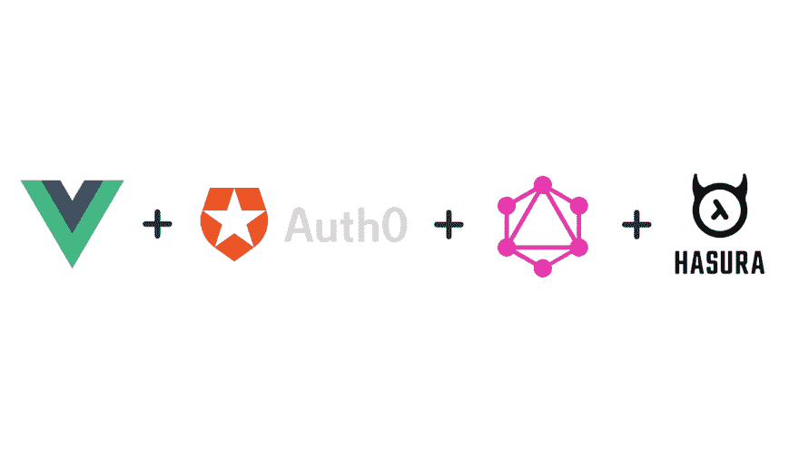
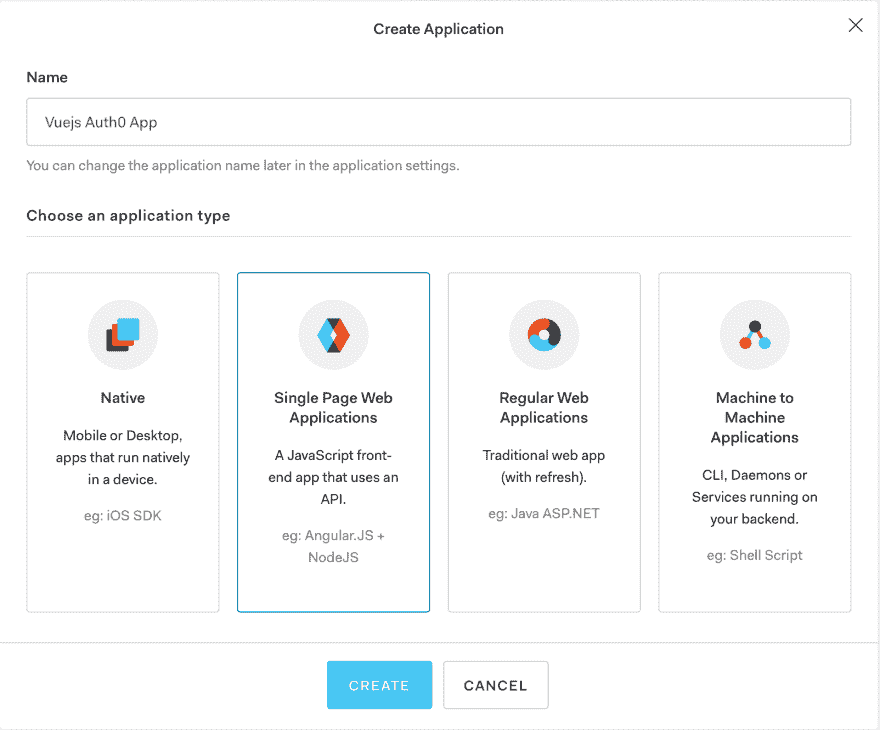
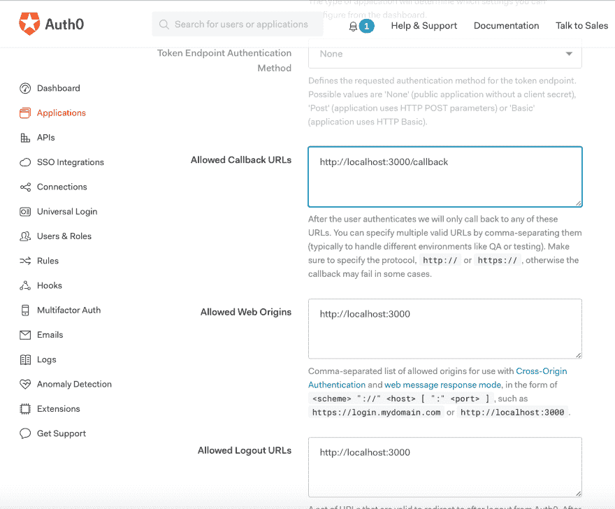
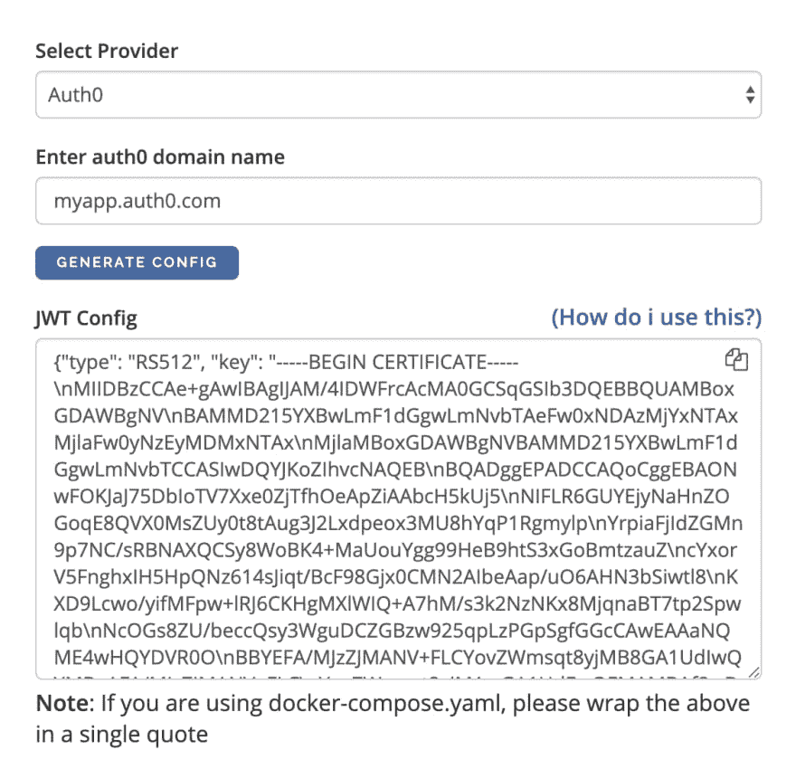
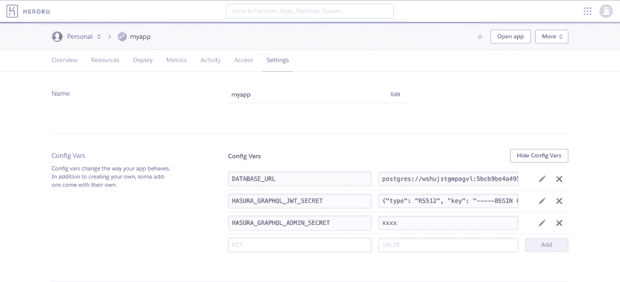
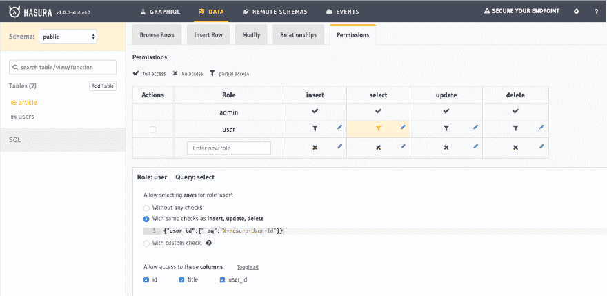
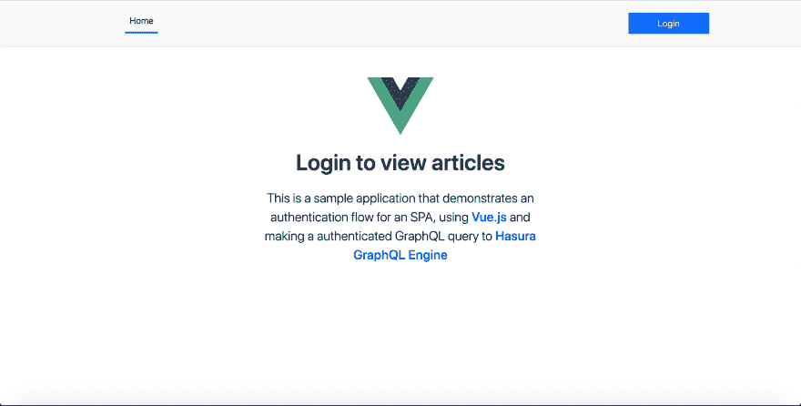

# 使用 Auth0 和 GraphQL 向 Vue.js 应用程序添加身份验证和授权

> 原文：<https://dev.to/hasurahq/add-authentication-and-authorization-to-vue-js-apps-with-auth0-and-graphql-45ob>

## TL；速度三角形定位法(dead reckoning)

*   使用 Auth0 向 Vue.js 应用程序添加身份验证
*   使用 JWT 和 Hasura GraphQL 权限进行授权
*   一个受登录保护的样例 Vue 应用程序，用于获取登录用户写的文章
*   [示例应用的源代码](https://github.com/hasura/graphql-engine/tree/master/community/sample-apps/vuejs-auth0-graphql)

<figure>[](https://res.cloudinary.com/practicaldev/image/fetch/s--UKFU-RJs--/c_limit%2Cf_auto%2Cfl_progressive%2Cq_auto%2Cw_880/https://blog.hasura.io/conteimg/2019/04/vuejs-auth-graphql-1.png)

<figcaption>vue . js+auth 0+graph QL+Hasura</figcaption>

</figure>

## 技术堆栈

该应用程序使用以下堆栈，需要对其进行设置和配置才能正常工作:

*   带有 [vue-cli-plugin-apollo](https://vue-cli-plugin-apollo.netlify.com) 和 [vue-router](https://github.com/vuejs/vue-router) 的 Vue.js
*   [Auth0](https://auth0.com) 用于认证
*   [Hasura GraphQL 引擎](https://github.com/hasura/graphql-engine)用于即时图形 apis

让我们一起部署 Hasura 和 postgres 来准备好我们的 GraphQL APIs。

## 部署 Hasura

[Hasura](https://hasura.io/) 是一个[开源](https://github.com/hasura/graphql-engine)引擎，为您提供新的或现有 Postgres 数据库上的实时 graph QL API，内置支持拼接定制 graph QL API 和在数据库更改时触发 webhooks。

按照[文档](https://docs.hasura.io/1.0/graphql/manual/getting-started/heroku-simple.html)中的说明部署 Hasura。注意 GraphQL 端点的 Heroku URL。稍后您将在应用程序中对此进行配置。

按照本[部分](https://github.com/hasura/graphql-engine/tree/master/community/sample-apps/vuejs-auth0-graphql/app#create-the-initial-tables)中的说明应用迁移，以创建必要的数据库模式和权限。

现在后端已经准备好了！您将能够使用 Hasura GraphQL APIs 进行即时查询。端点将看起来像([https://myapp.herokuapp.com/v1alpha1/graphql](https://myapp.herokuapp.com/v1alpha1/graphql))。在与 Vue 应用程序集成的过程中，我们将回到这一点。

## 在 Auth0 中创建应用程序

1.  前往 [Auth0 dashboard](http://manage.auth0.com/) 并创建一个单页 Web 应用程序类型的应用程序。

[](https://res.cloudinary.com/practicaldev/image/fetch/s--4KPx0vBG--/c_limit%2Cf_auto%2Cfl_progressive%2Cq_auto%2Cw_880/https://blog.hasura.io/conteimg/2019/03/Auth0-Vuejs-App.png)

1.  在应用程序的设置中，添加`http://localhost:3000/callback`作为“允许的回拨 URL ”,添加`http://localhost:3000`作为“允许的 Web 源”,以支持应用程序的本地开发

[](https://res.cloudinary.com/practicaldev/image/fetch/s--FJYS9ZpR--/c_limit%2Cf_auto%2Cfl_progressive%2Cq_auto%2Cw_880/https://blog.hasura.io/conteimg/2019/03/Auth0-URL-Setup.png)

## 为自定义 JWT 索赔添加规则

在 Auth0 控制面板中，导航至“规则”。添加以下规则来添加我们的自定义 JWT 声明:

```
function (user, context, callback) {
  const namespace = "https://hasura.io/jwt/claims";
  context.idToken[namespace] = 
    { 
      'x-hasura-default-role': 'user',
      // do some custom logic to decide allowed roles
      'x-hasura-allowed-roles': user.email === 'admin@foobar.com' ? ['user', 'admin'] : ['user'],
      'x-hasura-user-id': user.user_id
    };
  callback(null, user, context);
} 
```

Enter fullscreen mode Exit fullscreen mode

## 获得您的 JWT 签约证书

前往[https://hasura.io/jwt-config](https://hasura.io/jwt-config)，为你的 Auth0 域生成配置。

[](https://res.cloudinary.com/practicaldev/image/fetch/s--afZEZO5U--/c_limit%2Cf_auto%2Cfl_progressive%2Cq_auto%2Cw_880/https://blog.hasura.io/conteimg/2019/03/jwt-config.png)

复制为 Autho 应用程序生成的 JWT 配置。

## 在 Hasura 上启用 JWT 模式

上面生成的配置需要在`HASURA_GRAPHQL_JWT_SECRET`环境变量中使用。我们还需要设置`HASURA_GRAPHQL_ADMIN_SECRET`键来使 JWT 模式工作。

[](https://res.cloudinary.com/practicaldev/image/fetch/s--qmek3O1L--/c_limit%2Cf_auto%2Cfl_progressive%2Cq_auto%2Cw_880/https://blog.hasura.io/conteimg/2019/03/heroku-jwt-mode-1.png)

一旦添加了这个，GraphQL 端点只能使用`Authorization`头或`X-Hasura-Admin-Secret`头来查询。

## 创建 Auth0 规则

每次用户在 Auth0 上注册时，我们需要将该用户同步到我们的 postgres 数据库中。这是使用 Auth0 规则完成的。创建另一个**规则**并插入以下代码:

```
function (user, context, callback) {
  const userId = user.user_id;
  const nickname = user.nickname;

  request.post({
  headers: {'content-type' : 'application/json', 'x-hasura-admin-secret': '<your-admin-secret>'},
  url: 'http://myapp.herokuapp.com/v1alpha1/graphql',
  body: `{\"query\":\"mutation($userId: String!, $nickname: String) {\\n insert_users(\\n objects: [{ auth0_id: $userId, name: $nickname }]\\n on_conflict: {\\n constraint: users_pkey\\n update_columns: [last_seen, name]\\n }\\n ) {\\n affected_rows\\n }\\n }\",\"variables\":{\"userId\":\"${userId}\",\"nickname\":\"${nickname}\"}}`
}, function(error, response, body){
    console.log(body);
    callback(null, user, context);
});
} 
```

Enter fullscreen mode Exit fullscreen mode

适当更换`admin secret`和`url`。

最后，我们已经准备好了完整的后端和认证设置。让我们配置 Vue.js 前端，使 GraphQL 查询具有正确的头。

## [T1】配置 Vue-CLI-Apollo-Plugin](#configure-vuecliapolloplugin)

我们将使用 [Auth0 的示例应用](https://github.com/auth0-samples/auth0-vue-samples/tree/master/01-Login)来开始样板代码。

以下命令为 Vue 应用程序生成 apollo 客户端设置。

```
vue add apollo 
```

Enter fullscreen mode Exit fullscreen mode

这将在`src`中生成一个名为`vue-apollo.js`的文件。在这个文件中，我们将通过定义以下内容来配置`options`对象`getAuth`:

```
getAuth: tokenName => {
    // get the authentication token from local storage if it exists
    // return the headers to the context so httpLink can read them
    const token = localStorage.getItem('apollo-token')
    if (token) {
      return 'Bearer ' + token
    } else {
      return ''
    }
}, 
```

Enter fullscreen mode Exit fullscreen mode

这种配置确保了 ApolloClient 在进行查询或订阅时使用 Auth0 为`Authorization`头返回的令牌。

## 认证查询

在上面的设置中，Apollo 客户机已经配置了正确的头。因此，让我们添加一个简单的查询来获取登录用户撰写的文章列表。

```
export default {
  apollo: {
    // Simple query that will update the 'article' vue property
    article: gql`query {
      article {
        id
        title
      }
    }`,
  },
} 
```

Enter fullscreen mode Exit fullscreen mode

现在，只有当用户登录到应用程序时，我们才会显示这一点。

所以在我们的`Home.vue`的`<template>`标签中，我们将使用下面的代码片段来列出文章

```
<template>
    ...
    ...
    <div v-if="isAuthenticated">
      <h1 class="mb-4">
        Articles written by me
      </h1>
      <div v-for="a in article" :key="a.id">
        {{a.id}}. {{ a.title }}
      </div> 
    </div>
    ...
    ...
</template> 
```

Enter fullscreen mode Exit fullscreen mode

请注意，我们正在确保只有当`isAuthenticated`返回 true 时，才必须呈现这个标记。为了实现这一点，我们在每次成功登录后发出一个事件。

前往`src/auth/authService.js`查看 Auth0 登录和事件发出的实现细节。

在这个文件中，一旦登录成功，就会发出一个事件。

```
this.emit(loginEvent, {
  loggedIn: true,
  profile: authResult.idTokenPayload,
  state: authResult.appState || {}
}); 
```

Enter fullscreen mode Exit fullscreen mode

已经在`src/plugins`
注册了一个`plugin`来处理该事件

```
import authService from "../auth/authService";

export default {
  install(Vue) {
    Vue.prototype.$auth = authService;

    Vue.mixin({
      created() {
        if (this.handleLoginEvent) {
          authService.addListener("loginEvent", this.handleLoginEvent);
        }
      },

      destroyed() {
        if (this.handleLoginEvent) {
          authService.removeListener("loginEvent", this.handleLoginEvent);
        }
      }
    });
  }
}; 
```

Enter fullscreen mode Exit fullscreen mode

所以一旦一个`loginEvent`发生，就调用`handleLoginEvent`方法。

在我们`Home.vue`组件中，我们处理方法来更新`isAuthenticated`值。默认情况下是`false`，一旦登录成功，就会更新为`true`。

```
methods: {
    handleLoginEvent(data) {
      this.isAuthenticated = data.loggedIn;
      this.isLoading = false;
    }
}, 
```

Enter fullscreen mode Exit fullscreen mode

上面的 GraphQL 查询是使用 Auth0 返回的令牌头发送的，它负责身份验证。

## 授权使用 JWT

尽管用户已经登录，但我们希望只显示同一用户写的文章。权限的配置方式是只有撰写文章的用户才能获取数据。

前往 Heroku 应用程序 URL，打开 Hasura 控制台，导航至**数据- >文章- >权限**，查看为`user`角色定义的权限。

[](https://res.cloudinary.com/practicaldev/image/fetch/s--UEIz0bA5--/c_limit%2Cf_auto%2Cfl_progressive%2Cq_auto%2Cw_880/https://blog.hasura.io/conteimg/2019/03/hasura-console-permissions-page.png)

权限检查看起来像:

```
{ "user_id": {"_eq": "X-Hasura-User-Id"}} 
```

Enter fullscreen mode Exit fullscreen mode

这意味着当客户端发送带有`Authorization: Bearer <token>`的请求时，它将从令牌有效负载中寻找`X-Hasura-User-Id`值，并针对`user_id`列对其进行过滤，确保只有登录的用户才能获得数据，而**也只能获得他们的数据**。用户有权访问所有列。

## 使用 Vue 路由器保护路由

由于我们使用的是 **[Vue 路由器](https://github.com/vuejs/vue-router)** ，我们可以使用一个`Global Before Guard`来添加`Navigation Guards`。每当导航被触发并且导航被认为是挂起的直到被解决时，就调用这个函数。

在`src/router.js`中，我们定义了`beforeEach`守卫，它在解析之前检查布尔`auth.isAuthenticated()`。

```
router.beforeEach((to, from, next) => {
  if (to.path === "/" || to.path === "/callback" || auth.isAuthenticated()){
    return next();
  }

  auth.login({ target: to.path });
}); 
```

Enter fullscreen mode Exit fullscreen mode

如果页面不是`/`、`/callback`或者用户没有通过认证，则使用`auth.login`方法将用户重定向到登录页面。

## 运行 App

我们需要在 Vue.js 应用程序中配置 Hasura GraphQL 端点。转到`src/vue-apollo.js`并适当修改`httpEndpoint`和`wsEndpoint`值。

通过运行以下命令运行示例应用程序:

```
npm install
npm run serve 
```

Enter fullscreen mode Exit fullscreen mode

您应该会看到这样的屏幕:

[](https://res.cloudinary.com/practicaldev/image/fetch/s--hPQxIVFk--/c_limit%2Cf_auto%2Cfl_progressive%2Cq_auto%2Cw_880/https://blog.hasura.io/conteimg/2019/04/vuejs-auth-landing-page.png)

我整理了一个样板文件，这样你就可以快速开始了！

在 [github](https://github.com/hasura/graphql-engine/tree/master/community/sample-apps/vuejs-auth0-graphql) 上查看。

尝试一下，让我们知道你的想法。如果您有任何问题或遇到任何麻烦，请随时通过 [twitter](https://twitter.com/hasurahq) 、 [github](https://github.com/hasura/graphql-engine) 或我们的 [discord 服务器](https://discord.gg/vBPpJkS)联系我们。

* * *

这篇文章最初发表在 [Hasura 博客](https://blog.hasura.io/)上，作者是 Praveen Durairaj。