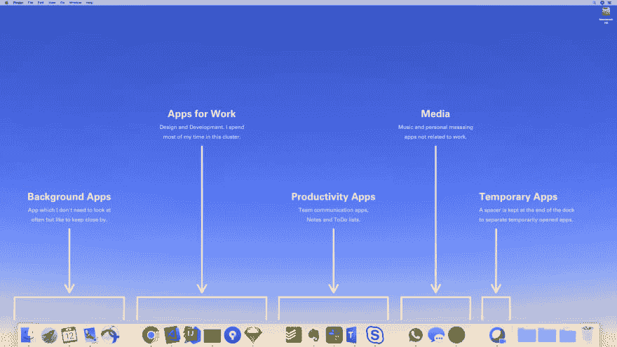

# 在 macOS 中将空间添加到 Dock

> 原文：<https://dev.to/ajaykarwal/add-spaces-to-the-dock-in-macos-372h>

如果你想更好地控制应用程序在 macOS Dock 上的组织方式，一个很好的方法是在应用程序组之间添加空间。

在您的终端中运行这个一行程序，在您的 Dock 中创建一个新的空白区域

```
defaults write com.apple.dock persistent-apps -array-add '{"tile-type"="spacer-tile";}' && killall Dock 
```

它的作用是向 Dock 的“持久应用程序”数组(永久位于 Dock 中的应用程序列表)添加一个新的“间隔-平铺”项目，然后重新加载 Dock。

新空间将被添加到 Dock 的末尾。当然它是不可见的，所以确认它存在的最好方法是打开任何其他当前不在你的 Dock 中的应用程序。现在您应该看到一个空间，您可以将它拖动到所需的位置。

要创建更多空间，只需再次运行该命令。

这是我的码头的样子。我喜欢按功能对我的应用程序进行分组。

[](https://res.cloudinary.com/practicaldev/image/fetch/s--p2AxfGkq--/c_limit%2Cf_auto%2Cfl_progressive%2Cq_auto%2Cw_880/https://thepracticaldev.s3.amazonaws.com/i/84cjsye4w990nvgk8qvy.png)