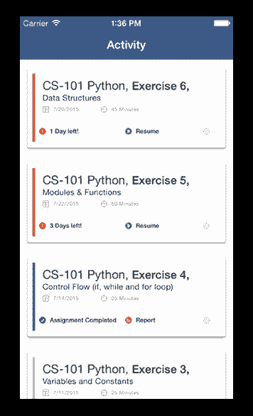
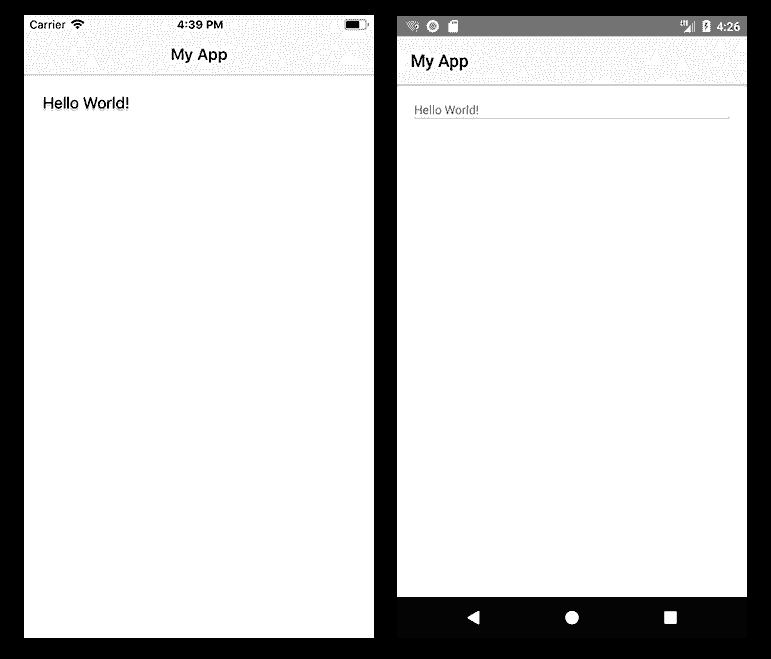
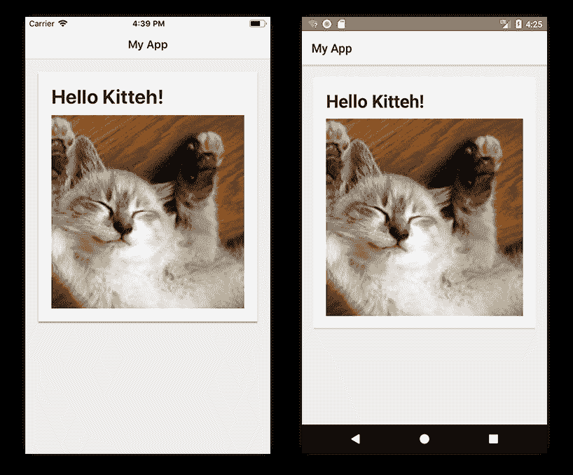

# 将材料设计 CardView 添加到 NativeScript 应用程序

> 原文：<https://dev.to/progress/adding-a-material-design-cardview-to-a-nativescript-app-njj>

当今最流行的移动用户界面组件之一是卡片(也称为 CardView)。

[](https://res.cloudinary.com/practicaldev/image/fetch/s--2HcXL-7o--/c_limit%2Cf_auto%2Cfl_progressive%2Cq_auto%2Cw_880/https://d2odgkulk9w7if.cloudfront.nimg/default-source/blogs/cardview.png%3Fsfvrsn%3D49ac0dfe_0)

单独的卡片通常用于以视觉上独特的方式显示关于单个组件或主题的信息。来自谷歌的[材料设计](https://material.io/design/)系统已经成为参与 UI 的黄金标准，因此能够在你的 NativeScript 应用中利用这些组件比以往任何时候都更受欢迎。

当 NativeScript 团队(和我们的社区)致力于全面的材料设计支持时，其他人开始用各种 NativeScript 插件来填补这一空白是非常方便的。以 Brad Martin 的 [nativescript-cardview 插件](https://market.nativescript.org/plugins/nativescript-cardview)为例。这个插件为 Android 和 iOS 的*实现了材质设计 CardView 组件。*

> 🤫是的，我们将很快在 NativeScript 中围绕材料设计支持发布一个更大的公告！

## 给我看看一些代码

像任何其他 NativeScript 插件一样，您可以用一个简单的命令安装它:

```
tns plugin add nativescript-cardview 
```

如果你正在开发一个普通的 JavaScript 或者普通的类型脚本(相对于 [Angular](https://www.nativescript.org/nativescript-is-how-you-build-native-mobile-apps-with-angular) 或者 [Vue.js](https://www.nativescript.org/vue) ，确保你给你的`<Page>`元素添加了合适的名称空间，就像这样:

```
<Page xmlns:Card="nativescript-cardview"> 
```

然后，您的标记应该包括一个布局容器和`CardView`组件。大概是这样的:

```
<StackLayout class="p-20">
    <Card:CardView>
        <StackLayout>
            <Label text="Hello World!" />
        </StackLayout>
    </Card:CardView>
</StackLayout> 
```

> **提示:**如果你正在使用 Angular，你可以在这里看到一些类似的示例代码[。](https://github.com/bradmartin/nativescript-cardview#nativescript--angular)

这将导致用户界面看起来像这样:

[](https://res.cloudinary.com/practicaldev/image/fetch/s--Q3HNclCz--/c_limit%2Cf_auto%2Cfl_progressive%2Cq_auto%2Cw_880/https://d2odgkulk9w7if.cloudfront.nimg/default-source/blogs/cardview-test-1.png%3Fsfvrsn%3D59ac0dfe_0)

等一下。对我来说看起来不太好。看起来我们需要添加一些 CSS 来增加趣味。💃

让我们在`<CardView>`和`<StackLayout>`元素上添加一些`class`属性:

```
<Card:CardView class="cardStyle">
    <StackLayout class="cardContent"> 
```

并在我们的`app.css`文件中跟进相关的样式:

```
.page {
    background-color: rgb(237, 237, 237);
}

.cardStyle {
    background-color: #fff;
    color: rgb(43, 43, 43);
}

.cardContent {
    padding: 20;
    font-weight: bold;
    font-size: 30;
} 
```

稍微修改一下我们的文字，放一张可爱的 kitteh 图片进去🐈：

```
<Label text="Hello Kitteh!" class="m-b-10" />
<Image src="https://placekitten.com/200/200" /> 
```

...我们得到了一些看起来像我们一直期待的卡片界面的东西！

[](https://res.cloudinary.com/practicaldev/image/fetch/s--PLULFXwb--/c_limit%2Cf_auto%2Cfl_progressive%2Cq_auto%2Cw_880/https://d2odgkulk9w7if.cloudfront.nimg/default-source/blogs/cardview-test-2.png%3Fsfvrsn%3D69ac0dfe_0)

## 自定义属性

关于 [nativescript-cardview 插件](https://market.nativescript.org/plugins/nativescript-cardview)的一个棘手的方面是，iOS 和 Android 实现都有独立的唯一属性。

您可以对元素应用一个`radius`来定制`border-radius`。(这在两个平台上实际上是一样的)。

无耻地从插件文档中撕下来，这里是特定于平台的属性(都是可选的):

### 安卓专用

`elevation` *int* (考虑一下这张牌背后“投影”的强度)

`ripple` *布尔*(设定为“真”以显示当你点击卡片时的波纹动作)

### iOS 专用

`shadowOffsetWidth` *int* (设置阴影的 x 位置)

`shadowOffsetHeight` *int* (设置阴影的 y 位置)

`shadowColor` *弦*(设置阴影的颜色)

`shadowOpacity` *int* (设置阴影的不透明度)

`shadowRadius` *int* (设置阴影的半径——不同于卡片本身的半径)

## {N}插件 FTW🔌

你可以[发现几乎任何场景的插件](https://market.nativescript.org/)(更不用说[应用模板](https://market.nativescript.org/?tab=templates&category=all_templates)和[代码样本](https://market.nativescript.org/?tab=samples&framework=all_frameworks&category=all_samples)！)在 NativeScript 市场上。