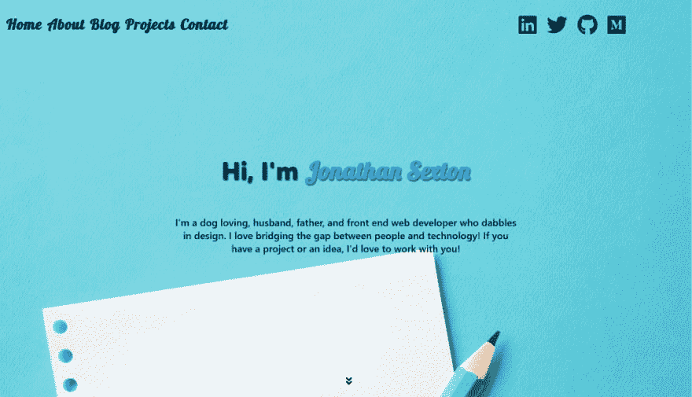
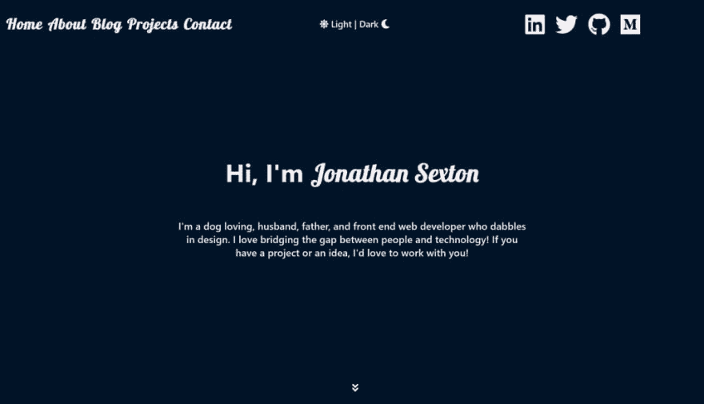
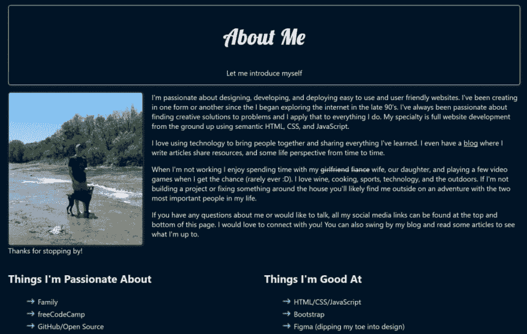
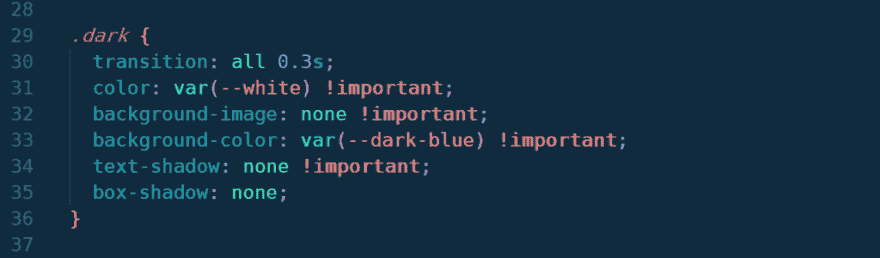
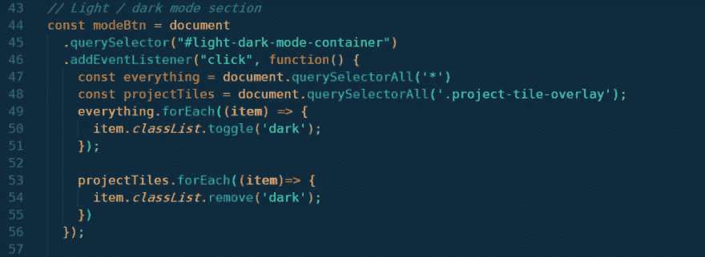

# 将黑暗模式添加到我的网站

> 原文：<https://dev.to/jsgoose/adding-dark-mode-to-my-website-20be>

去年，我决定从头开始重新设计我的网站。我想要一些简单和极简的外观，清楚地说明这是什么-一个投资组合网站。

在我从头开始重建我的网站后，似乎我所到之处都有另一篇关于给你的网站添加黑暗模式的文章。

起初我并不认为这会有很大的不同，因为虽然我偏爱深色，但我觉得我的网站在明亮有趣的颜色和深色字体之间取得了很好的平衡。

<figure> 

<figcaption>我的网站之前添加了亮/暗模式切换选项</figcaption>

</figure>

我读了一些我之前提到的文章，我想得越多，我就越决定去做。

我从 Flavio Copes 那里得到了一些灵感，他就这个主题写了一篇很棒的文章。与 Flavio 决定对他的站点所做的不同，我没有将用户的选择添加到本地存储中。

这在一定程度上是由于我们站点之间的差异。我有一个静态网站，除了在不同平台上的博客，没有重定向/单独的页面，所以用户一般不会刷新页面。这是一个很酷的选择，我以后可能会加入。

<figure> 

<figcaption>我的网站启用黑暗模式</figcaption>

</figure>

<figure> 

<figcaption>黑暗模式启用- 2</figcaption>

</figure>

## 代码

实现这一点的代码相当简单。我采用了与 Flavio 相同的方法，并通过 CSS 添加了样式变化。我不得不多走几步，因为我的登录页面上有一张图片。

<figure> 

<figcaption>我把类应用到网站上使其成为黑暗模式</figcaption>

</figure>

我不得不使用**！一些规则上的重要**标志，因为它们没有被正确应用。这是最容易实现的方法，我知道不建议使用这个标志，所以我将在不久的将来寻找一个替代方法。

下面是我用来让我的切换开关正常工作的 JavaScript:

<figure> 

<figcaption>为我的切换开关</figcaption>

</figure>

添加功能的 JavaScript

我首先选择我的 id 为`light-dark-mode-container`的`div`，并向它添加一个[事件监听器](https://developer.mozilla.org/en-US/docs/Web/API/EventTarget/addEventListener)。

接下来，我设置我的变量`everything`，它选择页面上的所有内容，以及`projectTiles`，因为这个类属于一个特定的覆盖集，我不想有纯色的背景。

接下来，因为我使用了返回静态[节点列表](https://developer.mozilla.org/en-US/docs/Web/API/NodeList)的`[querySelectorAll](https://developer.mozilla.org/en-US/docs/Web/API/Document/querySelectorAll)`，所以我循环遍历两个节点列表中的所有元素，或者切换类`dark`或者从变量`projectTiles`返回的元素中完全删除它。

我留下的是我的网站顶部的一个容器，它有一个拨动开关，允许用户在亮暗模式之间切换。

* * *

我希望你喜欢这篇文章，也许你也学到了一些东西！如果你决定在你自己的网站或你的下一个项目中实现它，请与我分享(给我留言或在 [Twitter](https://twitter.com/jj_goose) 上对我大喊)。我总是很高兴看到别人创造的作品。

这篇文章最初发表在我的博客上，在那里我写了一些关于前端 web 开发的文章。我也在[媒体](https://medium.com/@joncsexton)上交叉发布我的文章，所以你也可以在那个平台上找到我的作品！

既然你在那里，为什么不注册我的**时事通讯**？我保证我永远不会给你的收件箱发垃圾邮件，你的信息也不会与其他人分享。

祝你有一个充满爱、快乐和编码的美好的一天！