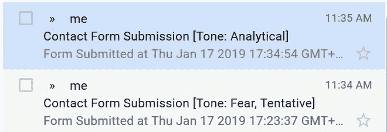
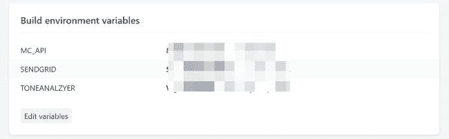

# 在你的联系表格中加入情感基调分析

> 原文：<https://dev.to/raymondcamden/adding-emotional-tone-analysis-to-your-contact-form-2n76>

几天前，我[在博客](https://dev.to/raymondcamden/customized-form-handling-on-netlify-with-serverless-functions-f83)上发表了关于在 Netlify 的静态网站上添加定制表单处理的文章。这是通过一个简单的无服务器功能完成的，该功能监听表单提交，并使用 [SendGrid](https://sendgrid.com/) API 发送电子邮件。虽然这样做很好，但实际上我有更有趣的想法，我不得不推迟一点。想象一下，如果您不只是收到关于提交联系表单的电子邮件，而是收到内容带有警告的邮件:

[](https://res.cloudinary.com/practicaldev/image/fetch/s--Ragm8ZjS--/c_limit%2Cf_auto%2Cfl_progressive%2Cq_auto%2Cw_880/https://static.raymondcamden.cimg/2019/01/tone1.jpg)

在上图中，你可以根据邮件的语气看到邮件内容的一些基本信息。这将是一个很好的方法来知道在阅读和回复方面什么是优先的。为了构建这个，我使用了 IBM Watson Tone Analyzer 服务。过去我已经用 OpenWhisk 在各种无服务器演示中多次使用过这种方法，但是我想我应该用 Netlify 和 Lambda 来尝试一下。下面是完整的脚本(请务必阅读[的最后一篇文章](https://dev.to/raymondcamden/customized-form-handling-on-netlify-with-serverless-functions-f83)，以了解它是如何工作的)，并添加了新功能:

```
const helper = require('sendgrid').mail;
const SG_KEY = process.env.SENDGRID;

const axios = require('axios');

const ToneAnalyzerV3 = require('watson-developer-cloud/tone-analyzer/v3')
const TA_KEY = process.env.TONEANALZYER;

exports.handler = async (event, context, callback) => {
    console.log('submission created error testing');

    let payload = JSON.parse(event.body).payload;
    let analysis = '';
    let toneString = '';

    //lets analyze the text

    if(payload.data.comments && payload.data.comments.length) {
        analysis = await analyze(payload.data.comments);

        /*
        if we get results, its an array of tones, ex:

        [ { score: 0.633327, tone_id: 'fear', tone_name: 'Fear' },
        { score: 0.84639, tone_id: 'tentative', tone_name: 'Tentative' } ]

        So what we will do is create an analysis string based on tone_names where score > 0.5
        */
        analysis = analysis.filter(t => t.score > 0.5);
        // and now we'll build an array of just tones
        let tones = analysis.map(t => t.tone_name);
        // and then a string
        toneString = tones.join(', ');
    } 

    // note - no validation - booooo
    let from_email = new helper.Email(payload.data.email);
    let to_email = new helper.Email('raymondcamden@gmail.com');
    let subject = 'Contact Form Submission';

    if(toneString.length > 0) subject += ` [Tone: ${toneString}]`;

    let date = new Date();
    let content = `
Form Submitted at ${date}
--------------------------------
`;

    for(let key in payload.data) {
        content += `
${key}: ${payload.data[key]}
`;
    }

    let mailContent = new helper.Content('text/plain', content);
    let mail = new helper.Mail(from_email, subject, to_email, mailContent);
    let sg = require('sendgrid')(SG_KEY);

    let request = sg.emptyRequest({
        method: 'POST',
        path: '/v3/mail/send',
        body: mail.toJSON()
    });

    await sg.API(request, function(error, response) {
        if(error) {
            console.log(error.response.body);
        } else console.log(response);
    });
    console.log('And done...');
};

async function analyze(str) {
    console.log('going to tone analzye '+str);

    let toneAnalyzer = new ToneAnalyzerV3({
        username: 'apikey',
        password: TA_KEY,
        version: '2017-09-21',
        url: 'https://gateway.watsonplatform.net/tone-analyzer/api/'
    });

    const result = await new Promise((resolve, reject) => {
        toneAnalyzer.tone(
            {
                tone_input: str,
                content_type: 'text/plain'
            },
            function(err, tone) {
                if (err) {
                    console.log(err);
                    reject(err);
                } else {
                    resolve(tone.document_tone.tones);
                }
            }
        );
    });
    return result;

} 
```

好吧，我们来分析一下。首先，我加载了 [Watson Node.js SDK](https://www.npmjs.com/package/watson-developer-cloud) 。虽然这不是必需的，但我在直接使用 REST API 进行音调分析时遇到了问题，于是决定简单地走捷径，使用他们的包。

```
const ToneAnalyzerV3 = require('watson-developer-cloud/tone-analyzer/v3')
const TA_KEY = process.env.TONEANALZYER; 
```

`process.env.TONEANALZYER`键从何而来？不要忘记，您可以为您的网络站点定义自定义环境变量。

[](https://res.cloudinary.com/practicaldev/image/fetch/s--EDIjvC2p--/c_limit%2Cf_auto%2Cfl_progressive%2Cq_auto%2Cw_880/https://static.raymondcamden.cimg/2019/01/tone2.jpg)

接下来看看有没有数据可查。在这种情况下，我假设我有一个名为`comments`的字段，它是一个文本块。您可以使其更加通用，或者甚至使用隐藏的表单域作为说明应该检查什么的方式。

```
let analysis = '';
let toneString = '';

//lets analyze the text

if(payload.data.comments && payload.data.comments.length) {
    analysis = await analyze(payload.data.comments); 
```

注意`await`的奇特用法。作为一个警告，请注意我仍然在摸索`async/await`的道路。我们来看看`analyze` :

```
async function analyze(str) {
    console.log('going to tone analzye '+str);

    let toneAnalyzer = new ToneAnalyzerV3({
        username: 'apikey',
        password: TA_KEY,
        version: '2017-09-21',
        url: 'https://gateway.watsonplatform.net/tone-analyzer/api/'
    });

    const result = await new Promise((resolve, reject) => {
        toneAnalyzer.tone(
            {
                tone_input: str,
                content_type: 'text/plain'
            },
            function(err, tone) {
                if (err) {
                    console.log(err);
                    reject(err);
                } else {
                    resolve(tone.document_tone.tones);
                }
            }
        );
    });
    return result;

} 
```

这基本上只是包装对音调分析器 API 的调用，并返回结果数据。我保留了这个大部分通用的。现在回到呼叫者:

```
/*
if we get results, its an array of tones, ex:

[ { score: 0.633327, tone_id: 'fear', tone_name: 'Fear' },
{ score: 0.84639, tone_id: 'tentative', tone_name: 'Tentative' } ]

So what we will do is create an analysis string based on tone_names where score > 0.5
*/
analysis = analysis.filter(t => t.score > 0.5);
// and now we'll build an array of just tones
let tones = analysis.map(t => t.tone_name);
// and then a string
toneString = tones.join(', '); 
```

正如评论所说，你得到了一系列的音调，但它们似乎没有被分类。我做了一个快速的“质量”过滤，去掉了分数小于 0.5 的音调。那是武断的。然后我绘制出名字，最后形成一个字符串。

顺便说一句，我 99%确信这三件事可以由在谷歌工作的人用一行精美的 JavaScript 代码完成。我不在谷歌工作。

最后一点是简单地添加音调，如果我们得到了它们:

```
if(toneString.length > 0) subject += ` [Tone: ${toneString}]`; 
```

就是这样！所以让我们玩得开心点。警告，成人语言传入。如果成人语言对你没有意义，问问你的孩子。

```
I AM SO FUCKING MAD AT YOU I WISH YOU WOULD DIE I HATE YOUR SERVICE.
I HATE EVERYTHING YOU DO.
I HATE KITTENS.
i HATE PUPPIES.
I HATE BEER.

OH MY GOD IM SO MAD AT EVERYTHING 
```

这将返回您所期望的结果:`Contact Form Submission [Tone: Anger]`

现在检查这个输入:

```
i'm so happy with your service, but i'm nervous that if i commit to a monthly
payment i'll not actually make use of it enough to get value. can you give me
some more details on what i get with this service and help convince me it's worth
it? 
```

虽然我知道沃森并不完美，但看看结果吧:我认为它近乎完美。

你可以想象将这与你的邮件服务器中的一些规则联系起来，这样有处理愤怒客户历史的客户服务人员会自动收到那些电子邮件，等等。不管怎样，请在下面留言告诉我你的想法。提醒一下，这些都是通过一个所谓的“静态”网站完成的。相当令人印象深刻，对吧？