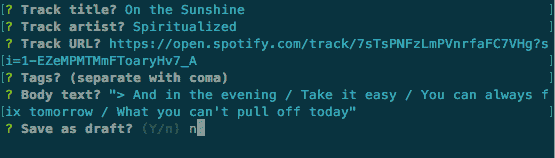
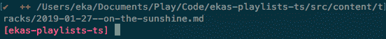

# 用扑通一声将发电机添加到您的 Gatsby 站点

> 原文：<https://dev.to/ekafyi/adding-generators-to-your-gatsby-site-with-plop-2gd5>

在这篇文章中，我将把[扑通](https://github.com/amwmedia/plop)整合到我的播放列表网站(还没有在线回购，抱歉！).这是一个简单的“微博”类型的网站，它简单地列出了我在 repeat 上听的歌曲和专辑，盖茨比使用本地 Markdown 文件作为数据源。

**扑通**，在他们自己的定义中是*“一个小工具，给你一个简单的方法，以一致的方式生成代码或任何其他类型的平面文本文件”*。

我想用它，因为它让我更容易创建新帖子。目前，如果我想添加一个新的“跟踪”帖子，我必须:

*   在`src/contents`目录中创建一个具有特定名称模式的新文件(例如`2019-01-20--star-guitar.md`
*   打开文件
*   如果我记住了所有的字段名，输入 frontmatter(和可选的正文)；否则，从现有文件复制。

一个“track”post 文件看起来是这样的:

```
------
title: 'Star Guitar'
artist: 'The Chemical Brothers'
date: '2019-01-19'
url: https://www.youtube.com/watch?v=0S43IwBF0uM
tags:
 - cover
draft: false
--- 
```

使用扑通将*节省时间和精力*以及*确保一致性*(例如，没有错误，因为我不小心写了`tag`而不是`tags`)。

## 第一步:安装扑通，准备目录

首先，我通过在我的项目目录中运行`yarn add plop`来添加扑通，并通过运行`npm install -g plop`来全局安装扑通。我简单浏览了一下[扑通的 Github repo](https://github.com/amwmedia/plop) 上的文档，了解了一下他们的 API。

虽然我使用[Gatsby-starter-typescript-plus](https://github.com/resir014/gatsby-starter-typescript-plus)来创建我的站点，但这里我指的是另一个启动器，fabien0102 的 [gatsby-starter](https://github.com/fabien0102/gatsby-starter) ，它已经有了现有的扑通生成器。所以我并不是完全从零开始。

我从查看`generators`目录内容开始。

<figure>

```
 ├── generators                    // generators (`npm run generate`)
  │   ├── blog-post-generator.js    // `blog post` generator
  │   ├── component-generator.js    // `component` generator
  │   ├── page-generator.js         // `page` generator
  │   ├── plopfile.js               // generators entry
  │   ├── templates                 // all templates (handlebar notation)
  │   └── utils.js                  // utils scripts for generators 
```

<figcaption>plop generator folder structure in the starter’s README</figcaption>

</figure>

对于每个生成器，我应该有一个生成器文件(例如`blog-post-generator.js`)和一个对应的模板文件(例如`templates/blog-post-md.template`)。这个启动器有一个`plopfile.js`,作为从上述文件加载和导出每个生成器的索引；还有包含帮助函数的`utils.js`。

除了`setGenerator`之外，我还不确定这些都是如何工作的，但是我将把这些文件一个一个地复制并实现到我的站点上，以便在实践中看到它们。

## 第二步:准备文件夹、plopfile 和 helper

我在项目根目录下创建了一个空的`generators`文件夹。我从参考启动器复制了`plopfile.js`，用我自己的名称更改了生成器名称。我先从“轨迹发生器”开始。

```
// generators/plopfile.js
module.exports = plop => {
    plop.load('./track-generator.js')
} 
```

最初的`utils.js`文件由两个助手函数组成:`inputRequired`和`addWithCustomData`。我没有生成需要样本数据的复杂组件，所以我只是将前者复制到我的`utils.js`中。

```
// generators/utils.js
const inputRequired = name => {
    return value => (/.+/.test(value) ? true : `${name} is required`)
}
module.exports = { inputRequired } 
```

## 第三步:制作发电机！

使用 [setGenerator](https://github.com/amwmedia/plop#setgenerator) 方法创建一个生成器，该方法采用一个可选的`description`和一个配置对象。配置对象由`prompts`和`actions`数组组成。

我正在制作一个描述为“轨道入口”的生成器。

```
// generators/track-generator.js
const { inputRequired } = require('./utils')

module.exports = plop => {
    plop.setGenerator('track entry', {
        prompts: [], // empty for now
        actions: [], // empty for now
    })
} 
```

## 第四步:提问(提示)

`prompts`数组包含表示要问用户的问题的对象。例如，我希望我的“跟踪”生成器询问六个问题:

1.  音轨标题
2.  音轨艺术家
3.  曲目的 URL(在 Spotify、Youtube 等网站上)
4.  标签
5.  身体
6.  草稿(创建帖子，但不发布)

接下来，我用相应的问题对象填充`prompts`。

```
// generators/track-generator.js
// (truncated to `prompts`)
module.exports = plop => {
    plop.setGenerator('track entry', {
        prompts: [
            // question 1
            {
                type: 'input',
                name: 'title',
                message: ' f',
                validate: inputRequired('title')
            },
            // question 2
            {
                type: 'input',
                name: 'artist',
                message: 'Track artist?',
                validate: inputRequired('artist')
            },
            // question 3
            {
                type: 'input',
                name: 'url',
                message: 'Track URL?'
            },
            // question 4
            {
                type: 'input',
                name: 'tags',
                message: 'Tags? (separate with comma)'
            },
            // question 5
            {
                type: 'input',
                name: 'body',
                message: 'Body text?'
            },
            // question 6
            {
                type: 'confirm',
                name: 'draft',
                message: 'Save as draft?',
                default: false
            }
        ], 
    })
} 
```

扑通将 [inquirer.js](https://github.com/SBoudrias/Inquirer.js) 用于**提问**对象。让我们仔细看看对象关键点。

*   **类型**指提示类型。我使用`input`类型获得问题 1 到 5 的*文本输入*，使用`confirm`类型获得问题 6 的*布尔(真/假)输入*。如果你想要一个*选择题*像这篇文章顶部的(虚构的)封面图片，使用`list`类型。

*   **名称**作为变量存储输入。我使用名称，例如`title`，来存储要返回的数据，并显示在模板文件中。

*   **消息**是命令行中显示的消息。例如，我正在打印消息*“音轨标题？”*询问`title`数据时。

*   **validate** 是一个返回`true`或错误信息的函数。我使用了`utils.js`中的`inputRequired`函数，它确保问题得到了回答(非空白)，对于两个必填字段`title`和`artist`。

*   **默认**不言自明。我用它做`draft`，因为我想默认发布帖子。

你可以点击阅读 Inquirer.js 文档中的完整规格[。](https://github.com/SBoudrias/Inquirer.js/#question)

现在，我通过在项目目录中键入`plop --plopfile ./generators/plopfile.js`来运行生成器

<figure>

[](https://res.cloudinary.com/practicaldev/image/fetch/s--7cqBpo0V--/c_limit%2Cf_auto%2Cfl_progressive%2Cq_auto%2Cw_880/https://thepracticaldev.s3.amazonaws.com/i/atxu2f611ifnlq3jo5h3.png)

<figcaption>Running my “track generator” in the CLI (kindly ignore the typo 🙈)</figcaption>

</figure>

它像预期的那样工作，但是它还没有做任何事情。现在让我们填充`actions`!

## 第五步:做事(动作)

`actions`属性可以是包含 [ActionConfig](https://github.com/amwmedia/plop#interface-actionconfig) 对象的数组；或者我们可以有一个[动态动作数组](https://github.com/amwmedia/plop#using-a-dynamic-actions-array)作为“一个将答案数据作为参数并返回动作数组的函数”。

[gatsby-starter 生成器](https://github.com/fabien0102/gatsby-starter/blob/master/generators/blog-post-generator.js#L32)执行后者:以用户输入作为数据运行一个函数。这个函数做两件事:使用`new Date()`自动填充`date` frontmatter 字段(少了一件手动输入的事情！)，并将`tags`解析为 YAML 数组。

最后，它使用指定的模板、文件名将 actions 数组返回到指定目录中的一个文件。除了改变了`path`和`templateFile`，这里不做其他修改。

```
// generators/track-generator.js
// (truncated to `actions`)
module.exports = plop => {
    plop.setGenerator('track entry', {
        actions: data => {
            // Get current date
            data.date = new Date().toISOString().split('T')[0]

            // Parse tags as yaml array
            if (data.tags) {
                data.tags = `tags:\n  - ${data.tags.split(',').join('\n - ')}`
            }

            // Add the file
            return [
                {
                    type: 'add',
                    path: '../src/content/tracks/{{date}}--{{dashCase title}}.md',
                    templateFile: 'templates/track-md.template'
                }
            ]
        }
    })
} 
```

你可能会注意到`dashCase`，它是扑通有用的[内置助手](https://github.com/amwmedia/plop#case-modifiers)的一部分。

## 第六步:制作模板

接下来，我将在`templates`目录中创建一个名为`track-md.template`的模板文件。这是一个简单的文件，类似于 Markdown 文件结构。

```
---
title: {{title}}
artist: {{artist}}
date: "{{date}}"
url: {{url}}
{{tags}}
draft: {{draft}}
---

{{body}} 
```

如果您对 frontmatter 中缺少`tags:`感到疑惑，那么该字符串将作为上面的`actions`函数中的`data.tags`对象的一部分返回。

我回到命令行，重复之前相同的过程，运行`plop --plopfile ./generators/plopfile.js`并回答问题。现在，在回答了所有的问题后，我收到了这条消息，通知我这个文件已经在我的**目录/轨道**文件夹中创建好了。

<figure>

[](https://res.cloudinary.com/practicaldev/image/fetch/s--7fCxuV2s--/c_limit%2Cf_auto%2Cfl_progressive%2Cq_auto%2Cw_880/https://thepracticaldev.s3.amazonaws.com/i/t19brqmu0x7f555b65l9.png)

<figcaption>Success message after running my track generator in the command line</figcaption>

</figure>

我打开文件**2019-01-27—on-the-sunshine . MD**，瞧，它填充了我从命令行输入的数据。

```
---
title: On the Sunshine
artist: Spiritualized
date: "2019-01-27"
url: https://open.spotify.com/track/6xALY6wGGzQZl36A3ATnFq?si=lUwasuJmQbaWZOQsxg2G2Q
tags:
  - test
draft: false
---

&gt; And in the evening / Take it easy / You can always do tomorrow / What you cannot do today 
```

一个小问题是在 Markdown 中创建[块引用的`>`字符被转义到 HTML `&gt;`中。我做了几次尝试来修复它，比如检查文档中的提示，运行](https://daringfireball.net/projects/markdown/syntax#blockquote)[。替换()](https://developer.mozilla.org/en-US/docs/Web/JavaScript/Reference/Global_Objects/String/replace)和[。un scalpe()](https://lodash.com/docs/#unescape)，一切无济于事。

我在[这个问题](https://github.com/amwmedia/plop/issues/142)中找到了解决方案，原来是车把专用的，而不是扑通或 JS 一个。为了避免把手的 HTML 转义，我们使用“triple stash”(`{{{body}}}`)而不是 double。我还将它用于`url`字段，这样特殊字符就不会被编码。我重新运行了代码，它运行得很好。

## 加成:制造捷径

每次打字`plop --plopfile ./generators/plopfile.js`都很繁琐，很难记住；让我们在`package.json`中做一个捷径。

```
// package.json
{
    "scripts": {
        "generate": "plop --plopfile ./generators/plopfile.js",
        "generate-build": "plop --plopfile ./generators/plopfile.js && gatsby build"
    }
} 
```

我可以通过输入`yarn generate`来运行发电机。如果我正在写一篇想立即发表的短文(不需要检查或编辑)，我可以运行`yarn generate-build`，它将在我输入所有数据后运行 Gatsby build 命令。

## 心愿单

其他我想以后用扑通试试的东西:

*   自动创建组件(例如，组件文件、相应的样式文件、故事书`.stories.js`文件、自述文件、测试文件等)。它已经存在于这个入门网站中，但是我现在不能浏览它。
*   使用[自定义操作功能](https://github.com/amwmedia/plop#custom-action-function)将图像文件从外部 URL 保存到本地路径，以便在 Markdown frontmatter 中使用。只是一个想法；不确定有没有可能，顺便说一句。

感谢您的阅读，下次再见！