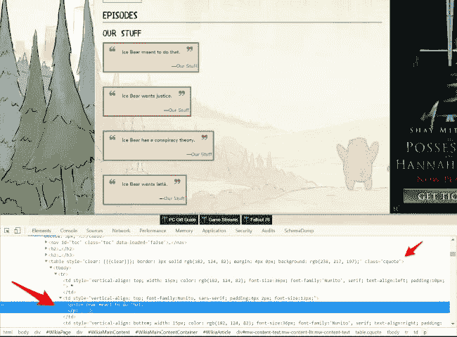
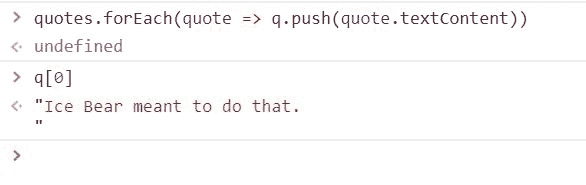
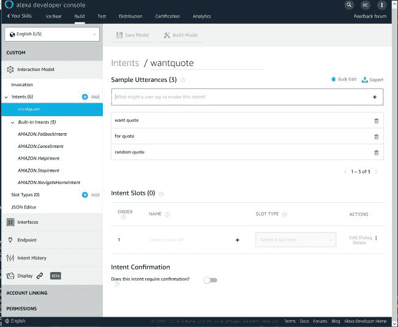

# 给 Alexa 加冰熊，因为为什么不呢？

> 原文：<https://dev.to/raymondcamden/adding-ice-bear-to-alexa-because-why-not-2k6l>

在我开始之前，让我强调，这不是一个旨在向您介绍亚马逊 Alexa 开发的帖子。我有一系列关于 Alexa 开发的博客文章,我计划在明年年初创建一个更新的教程。相反，我只是想分享我大约一周前建立的一个简单的技巧——纯粹是为了好玩——作为一种证明做起来有多容易的方式。提醒一下，你可以为你的 Alexa 设备构建*任何你想要的*技能，而不必向公众发布。这意味着你可以为自己的设备制造疯狂、愚蠢、完全私人的东西。举个例子，我的 Alexa 设备有一个技能，可以让我问 Carol 是谁的错。因为说实话，看看这张脸，不可能是她的错吧？

[](https://res.cloudinary.com/practicaldev/image/fetch/s--Y94ARy0y--/c_limit%2Cf_auto%2Cfl_progressive%2Cq_auto%2Cw_880/https://static.raymondcamden.cimg/2018/11/carol_glasses.jpg)

所有的技能只是从她的兄弟姐妹，奥巴马和特朗普的随机列表中选择。

是的，愚蠢，但这让她高兴得要命，重点是——我认为你可以像这样在 Alexa 设备上黑东西真是太酷了。上次我检查你*仍然*不能用谷歌家庭设备做这个，这就是为什么我的大部分被忽略了。

好吧，那就去找北极熊。谁，或者什么，是冰熊？冰熊是“我们裸熊”节目中的一个角色。

[](https://res.cloudinary.com/practicaldev/image/fetch/s--KKg5fQI7--/c_limit%2Cf_auto%2Cfl_progressive%2Cq_auto%2Cw_880/https://static.raymondcamden.cimg/2018/11/wbb.jpg)

这是一个儿童节目，像现在的许多节目一样，对成年人来说也很有趣。(还是还在玩星球大战玩具的成年人。)冰熊是三只熊之一，用第三人称说话。比如说…

[](https://res.cloudinary.com/practicaldev/image/fetch/s--XCrQnccc--/c_limit%2Cf_auto%2Cfl_progressive%2Cq_auto%2Cw_880/https://static.raymondcamden.cimg/2018/11/icebear.jpg)

它在这里可能翻译得不好，但在这部剧里它非常有趣。我认为这将是很酷的建立一个 Alexa 技能，将选择一个随机的冰熊报价。我是这样建造的。

首先，我谷歌了一下“冰熊语录”，不出所料，找到了一个包含这些语录的维基页面。然后，我检查了其中一个引用，以查看 DOM:

[](https://res.cloudinary.com/practicaldev/image/fetch/s--vVWjFsTL--/c_limit%2Cf_auto%2Cfl_progressive%2Cq_auto%2Cw_880/https://static.raymondcamden.cimg/2018/11/dom1.jpg)

在上面的屏幕截图中，我特别提到了两件事。您可以看到主引号是一个简单的`P`元素。但后来我注意到它被包在一个带有 class `cquote`的表中。酷毙了。所以我切换到我的控制台，输入:

```
quotes = document.querySelectorAll('table.cquote p') 
```

Enter fullscreen mode Exit fullscreen mode

那里的 CSS 选择器应该匹配表格中的`P`标签。它返回了一个包含 133 个条目的节点列表，这在我看来是正确的。但现在我需要得到文本。我创建了一个新的空数组(同样，所有这些都在我的浏览器控制台中):

```
let q = [] 
```

Enter fullscreen mode Exit fullscreen mode

然后在`quotes`上循环以获得文本内容。

```
quotes.forEach(quote => q.push(quote.textContent)) 
```

Enter fullscreen mode Exit fullscreen mode

我做了一个快速测试来看看:

[](https://res.cloudinary.com/practicaldev/image/fetch/s--q9GrhIo4--/c_limit%2Cf_auto%2Cfl_progressive%2Cq_auto%2Cw_880/https://static.raymondcamden.cimg/2018/11/dom2.jpg)

酷毙了。所以结尾额外的换行让我有点困扰。我用一个正则表达式解决了这个问题:

```
q = q.map(quote => quote.replace(/\n/,'')) 
```

Enter fullscreen mode Exit fullscreen mode

注意，我在这里使用的是时髦的 JavaScript 胖箭头函数，尽管我的数独解决方案测试器很糟糕，但谷歌完全应该雇用我。最后一步是将这些数据从浏览器中取出。幸运的是，您可以通过控制台复制到剪贴板:

```
copy(q) 
```

Enter fullscreen mode Exit fullscreen mode

Woot。好的，我有一系列的引用。现在来写服务器端代码。我创建了一个新的 [Webtask](https://webtask.io) ，这是我目前最喜欢的无服务器平台，并创建了以下内容:

```
const quotes = ["Ice Bear meant to do that.", "Ice Bear wants justice.", "Ice Bear has a conspiracy theory.", "Ice Bear wants lattè.", "Ice Bear wants to move in.", "Ice Bear bought these legally.",];

/**
 * Returns a random integer between min (inclusive) and max (inclusive)
 * Using Math.round() will give you a non-uniform distribution!
 */
function getRandomInt(min, max) {
    return Math.floor(Math.random() * (max - min + 1)) + min;
}

function getQuote() {
  return quotes[getRandomInt(0, quotes.length - 1)];
}

/**
* @param context {WebtaskContext}
*/
module.exports = function(context, cb) {

  var response = {
    "version": "1.0",
    "response" :{
      "shouldEndSession": true,
      "outputSpeech": {
        "type": "PlainText",
        "text": getQuote()
        }
      }
  };

  cb(null, response);

}; 
```

Enter fullscreen mode Exit fullscreen mode

请注意，上面的`quotes`变量在这篇文章中被大量删减。我的代码只是随机选择一个报价，然后为 Alexa 输出正确的 JSON 响应。同样，我不打算详细介绍如何使用 Alexa，但是对于像我这样的*非常*简单的技能来说，这已经足够了。我进入 Alexa 开发门户，创建了我的新技能，并设置了它运行所需的一个意图。意图就像你技能的广泛交流。例如，当你去星巴克和柜台后面的人说话时，通常你们的对话仅限于点餐和询问菜单。你可以把它想成两个意图——“订单”和“菜单”。每个意图都有一套表达意图的基本方式。你不必列出每一个可能的迭代，但是你做得越多，你的技能就越灵活。这里有一个截屏让你对界面有个概念。

[](https://res.cloudinary.com/practicaldev/image/fetch/s--_Ysj_GYt--/c_limit%2Cf_auto%2Cfl_progressive%2Cq_auto%2Cw_880/https://static.raymondcamden.cimg/2018/11/alexa1.jpg)

然后，我必须将它指向我的 webtask 的 URL，对于我自己的目的来说，这就是我所需要做的。但是为了好玩，我决定尝试公开发布它。公开发布 Alexa 技能需要做很多事情，其中之一就是给你的技能增加一个复杂的安全层。幸运的是，你可以通过我在这里描述的方法在几秒钟内做到这一点:[使用 Alexa 和 Webtasks](https://goextend.io/blog/using-alexa-with-webtask) 。

通常我的“发布”过程是——我提交技能——亚马逊发现 bugs 然后我重复。这有时是一个痛苦的过程，但亚马逊的评审人员做得很好，给了你*非常明确的步骤来重现他们发现的错误。在这种情况下，我实际上通过了第一次尝试。(他们肯定漏掉了什么。)如果你有一个 Alexa 驱动的设备，你现在就可以问她:“Alexa，问冰熊要报价。”也可以在这里访问“产品”页面:[https://www . Amazon . com/Raymond-Camden-Ice-Bear/DP/b 07 kjn 4k 13](https://www.amazon.com/Raymond-Camden-Ice-Bear/dp/B07KJN4K13)。我有点惊讶没有人声称“冰熊”是一个祈祷的名字，但我想我很幸运。*

无论如何，我希望这是有趣的，如果你对我所做的有任何疑问，请在下面添加评论。

[](https://res.cloudinary.com/practicaldev/image/fetch/s--8w3b_n7Q--/c_limit%2Cf_auto%2Cfl_progressive%2Cq_auto%2Cw_880/https://static.raymondcamden.cimg/2018/11/icebearcomments.jpg)