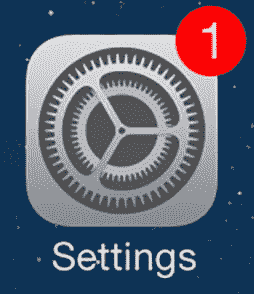

# 向您的应用程序添加手动应用程序徽章:一步一步

> 原文：<https://dev.to/evandeaubl/adding-manual-app-badges-to-your-app-step-by-step-2d6b>

对于支持通知的应用程序来说，使用它们来更新应用程序徽章以显示未读消息、未完成任务等的数量是非常常见的。但是，如果您不需要或不想增加支持推送通知甚至本地通知的复杂性，而是希望通过应用徽章提醒用户，该怎么办？

苹果关于这种使用应用徽章的特殊方式的文档并不是最好的。徽章与 UserNotifications 框架结合在一起，但是如果您想在通知之外自己设置徽章，这是 UIKit 的一部分。文档中缺少一些要点，比如:你需要检查你是否被授权展示徽章来手动设置徽章吗？它会出错吗？崩溃？导致奇怪的 app 行为？

手动应用程序徽章被证明是非常容易的，但文档并没有让它看起来像那样。让我们现在就揭开它们的神秘面纱。

* * *

首先，正如我上面提到的，徽章是 iOS 通知功能的一部分。这意味着在您对通知做任何事情之前，您需要获得用户的授权。

```
let center = UNUserNotificationCenter.current()
center.requestAuthorization(options: [.badge]) 
   { (granted, error) in
   } 
```

如果您想在用户拒绝授权时做些什么，那么您可以在块中包含处理这种情况的代码。更有可能的是，如果用户拒绝应用程序徽章授权，你的应用程序将不会遇到任何问题，因为我们将稍后触及，所以我通常不做任何事情来处理这种情况(但你必须通过一个块，因为它不是可选的……)。

Apple 建议您在应用首次启动时进行授权。我见过一些应用程序将此延迟到初始入职流程，这样他们可以更好地向用户解释为什么他们需要通知权限。不管怎样，你应该在应用程序生命周期的早期完成这一步。

一旦你有了授权，就该设置徽章了。虽然其他通知功能更复杂，但设置徽章数量确实很容易，尽管不是很明显。手动设置徽章数量是你的`UIApplication`对象的一个属性，但是在苹果的通知文档中没有任何地方指出，只有在 UIKit 文档中。

一旦你知道了这一点，那就非常非常简单了:

```
UIApplication.shared.applicationIconBadgeNumber = 1 
```

这将导致您的应用程序显示一个带有数字 1 的徽章，如下所示:

[](https://res.cloudinary.com/practicaldev/image/fetch/s--mssJyspF--/c_limit%2Cf_auto%2Cfl_progressive%2Cq_auto%2Cw_880/https://www.appsdissected.com/wp-content/uploads/2019/04/Settings-Update-app-iOS-7.jpg)

将`applicationIconBadgeNumber`设置为 0 将清除徽章。(这也有清除应用程序产生的任何通知的副作用，因为标记通常与通知结合在一起，但对于这个例子，我们只是实现手动标记，所以这里没有什么可担心的)。

现在，您可能已经注意到，在设置徽章号时没有检查徽章是否被用户授权。这完全没问题。如果用户没有为你的应用程序授权徽章，或者稍后撤销授权，iOS 将简单地忽略任何设置徽章的请求。您可能希望使用 [`UNUserNotificationCenter.getNotificationSettings(completionHandler:)`](#) 来检查您是否想要做其他事情而不是应用徽章。对于应用程序徽章，如果你没有被授权，你几乎总是想什么都不做，所以不需要检查。

简单的几行代码，你就有了对应用徽章的支持，这是通知你的用户在你的应用中有事情要做的最简单的方式！

* * *

你喜欢这个建议吗？关于[的下一个技巧——构建新应用](https://www.appsdissected.com/blank-page-getting-started-new-app-development/)的工作流程已经在等着你了。

或者[注册，将所有提示直接发送到您的收件箱](https://www.appsdissected.com/newsletter/)，另外还有时事通讯提示和网站文章的深度挖掘以及未来产品发布的折扣。

这篇文章最初发表在 [Apps 剖析。](https://www.appsdissected.com/manual-app-badge-tutorial/)