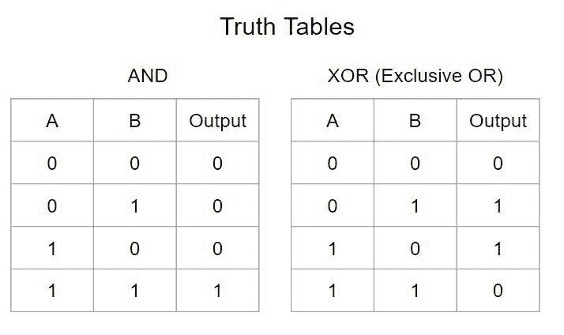
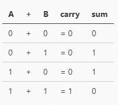
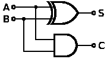

# 在 JavaScript 中使用布尔运算添加数字

> 原文：<https://dev.to/dance2die/adding-numbers-using-boolean-operations-in-javascript-2d04>

*照片由[克里斯·贾维斯](https://unsplash.com/photos/gdL-UZfnD3I?utm_source=unsplash&utm_medium=referral&utm_content=creditCopyText)在[Unsplash](https://unsplash.com/search/photos/abacus?utm_source=unsplash&utm_medium=referral&utm_content=creditCopyText)T5 拍摄*

你知道怎么用程序加数字，对吗？

`1 + 1`基本上会给你 2。

数字以二进制形式在机器层向下相加。但是数字是如何在引擎盖下相加的呢？

我将展示如何使用布尔运算将“正”整数相加(无浮点)。

## 💭假定

我会假设[二进制数](https://en.wikipedia.org/wiki/Binary_number)和布尔运算的知识。

你可以继续关注 [CodeSandbox](https://codesandbox.io/s/3vnqknj0o1) 。

#### 📊和&异或真值表

下面是所有可能的 XOR & AND 运算的真值表，我将回头参考。

## 1️⃣加一位

当你相加两个一位数时，你得到的和是 0 或 1，进位是 0 或 1。

你有没有注意到，`carry`的输出看起来和 AND 真值表的输出一样，和等于 XOR 的输出？

该操作可以用逻辑 XOR & AND 门来表示，如下所示。

这样形成的电路称为[半加法器](https://en.wikipedia.org/wiki/Adder_(electronics)#Half_adder)。

有了这些知识，我们现在可以使用异或&和实现加法。