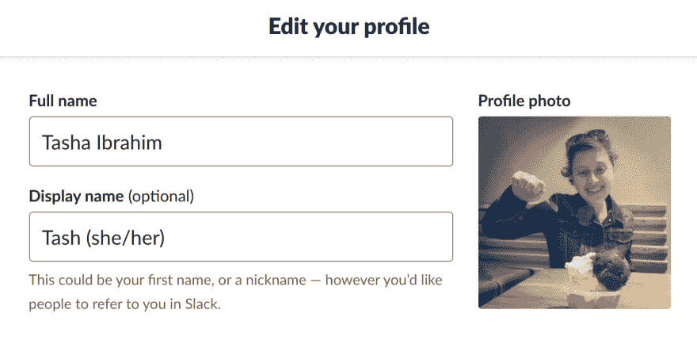
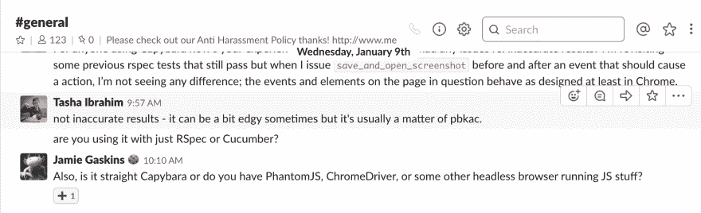
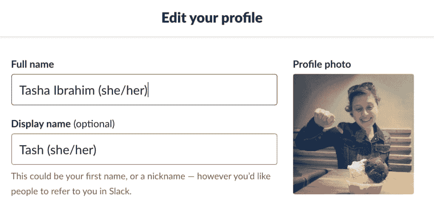
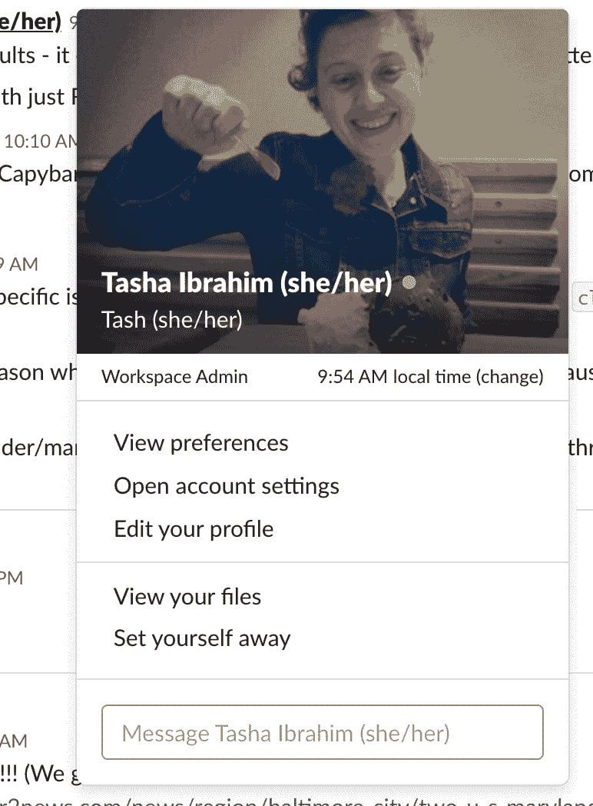
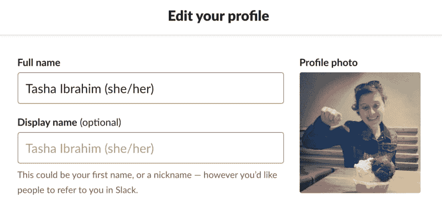
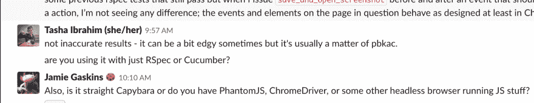

# 向我的备用名添加代词

> 原文：<https://dev.to/latazzajones/adding-pronouns-to-my-slack-name-ld0>

自从去年删除了我的脸书和 Twitter 账户后，Slack 已经成为我作为一名工程师与职业网络保持联系的一个越来越重要的工具。

最近，我注意到我的一个熟人修改了他们的名字，加入了(他们/他们)，这启发了我也加入了我的代词。作为一个 cis 性别的女性意味着，包括我的代词不太可能有任何后果，因为“她”和“她的”符合人们的假设。这也使我处于一个强有力的位置，来规范共享代词是有帮助的这一想法。这很有帮助，因为它帮助我们避免对他人的性别做出假设。

所以——我决定试着弄清楚如何以一种既一致又优雅的方式把我的性别代词加到我的名字里。

## 尝试#1:

首先，我尝试将它们添加到我的用户名中。

这种解决方案的问题是，根据其他 slack 用户如何为组配置设置，他们可能看不到我的代词。以下是一个用户对话的示例，该用户的设置设置为仅显示用户的全名:

## 尝试二:

然后我试着把我的代词加到我的全名和用户名上:

但是当你悬停在我的名字上时，我的个人资料显示出来，对我来说，到处都是名字和代词，看起来又忙又乱😖

我想要优雅的东西！所以-这不是我的解决方案。

## 尝试三次并成功:

最后，在修改了我的全名和用户名设置之后，我删除了我的用户名。没错——没有用户名*只有*我的全名和代词！

您会注意到用户名默认为您的全名。所以现在，我的悬停配置文件上只有一个名字，我的代词显示出来，不管用户如何设置他们的松弛时间！

## 一些最后的想法:

我知道这可能不是对每个人都有效。例如，有些人喜欢让他们的 slack 用户名与他们的 github 或 twitter 用户名相匹配。还有一些我不知道的情况会导致一个人想要一个不同的用户名和全名。然而，我喜欢现在我的代词是多么的直接和透明！自从上周添加了他们，我注意到另外两个人也添加了他们的，这是一个相当大的奖励。