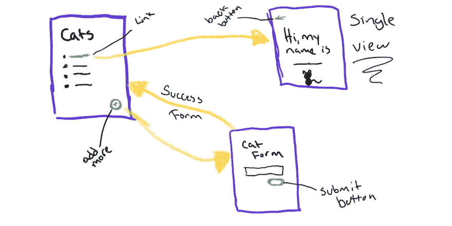
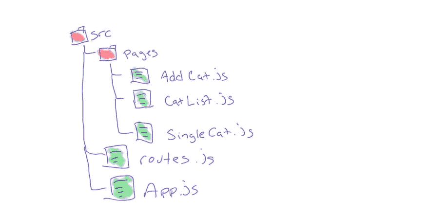
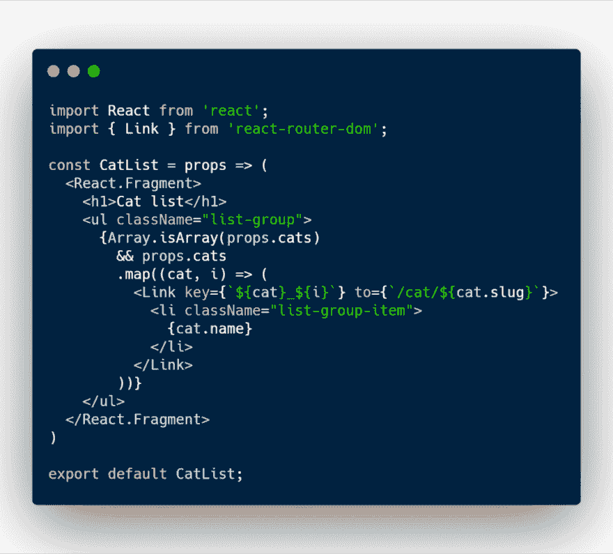
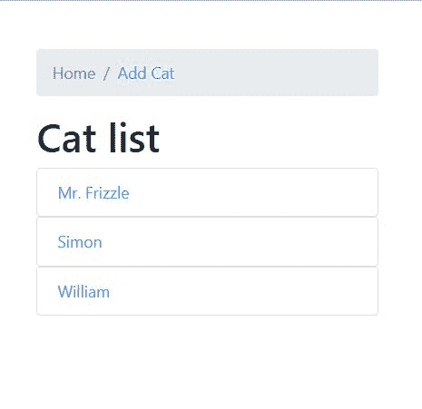
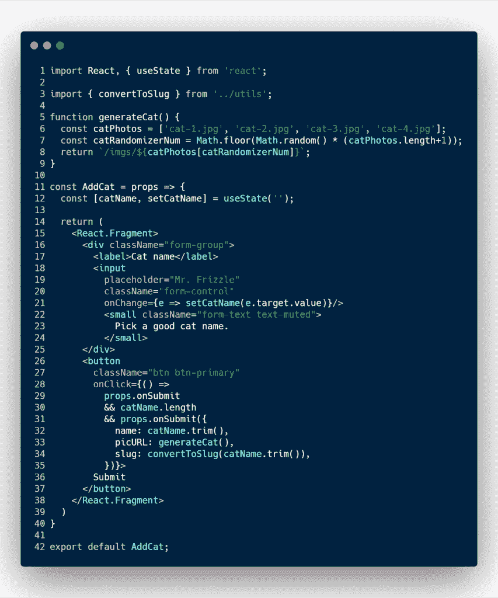
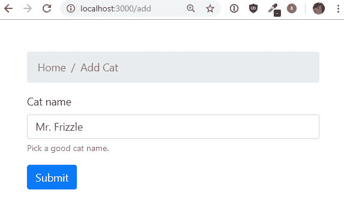
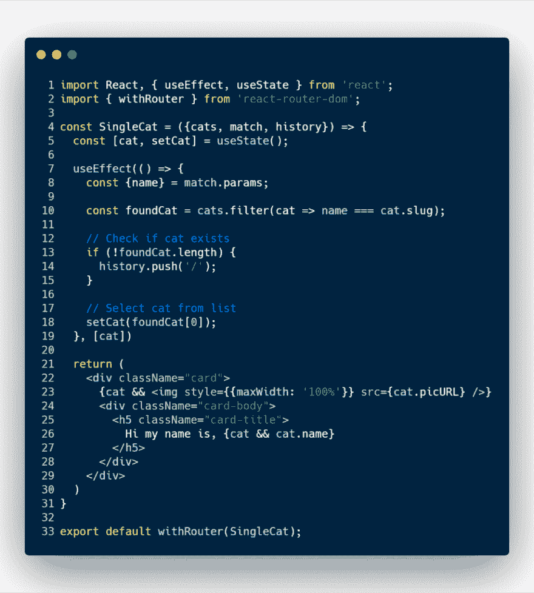
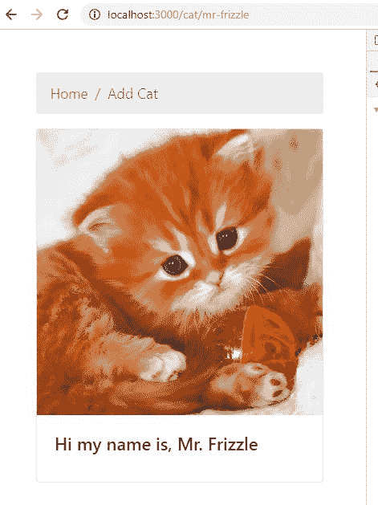
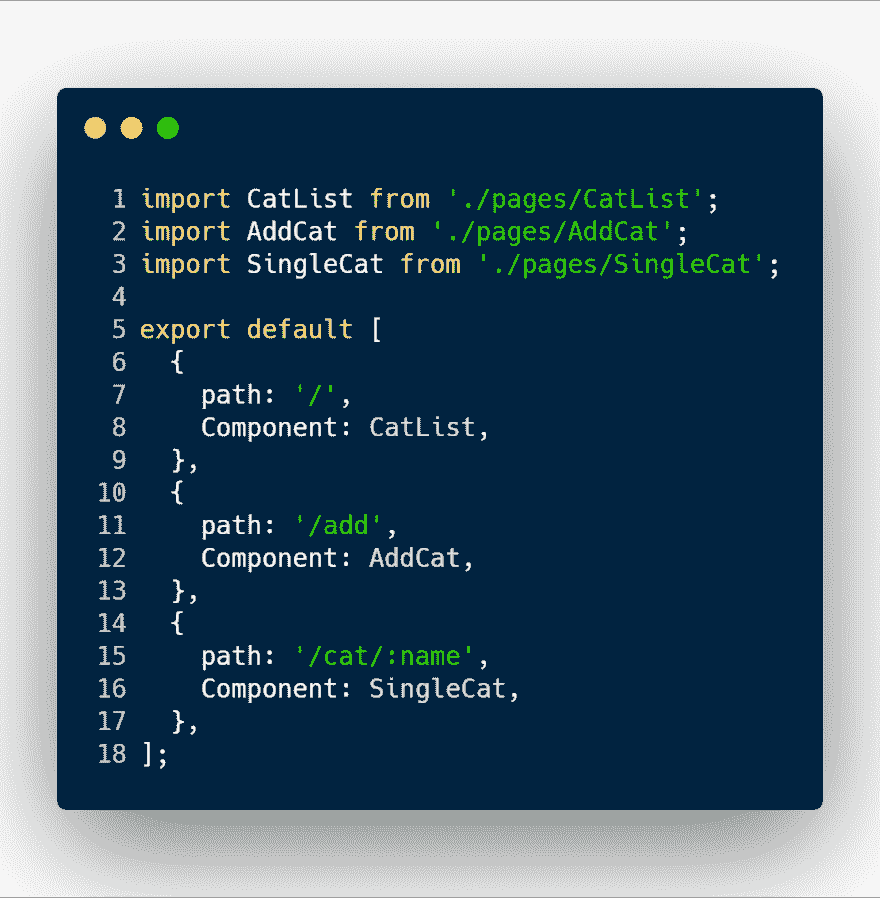

# 将 React 路由器添加到您的应用中

> 原文：<https://dev.to/rleija_/adding-react-router-to-your-app-80b>

*原帖@ [Linguine 博客](https://blog.linguinecode.com/post/add-react-router-to-react)T3】*

因此，您的 cat 应用程序正在增长，您希望让您的用户更容易消化这些内容。

太好了！让我们将 React 路由器 DOM 添加到 React cat 应用程序中。

## 什么是 React 路由器 DOM

React 路由器 DOM 是一个 React web 库。它利用了另一个名为 React Router 的核心库。

它的主要目的是允许工程师为 React 单页应用程序创建路线。

很简单。

## React 路由器目标

本教程的目标是构建一个有 3 条不同路线的 cat 应用程序。

第一条路线将是主页，显示猫名列表。

并且每个 cat 项目是将用户带到该 cat 项目唯一 URL 路径的链接。

目前为止有 2 页。

第三页将是，添加一个猫页面。这是一个简单的表格，允许你添加一只新的猫。

我还将使用新的 React hook API，所以如果您不熟悉它，请阅读以前的一篇文章。[反应钩子简介](https://blog.linguinecode.com/post/getting-started-with-react-hooks)。

## 安装 React 依赖项

在终端中，我将运行以下命令:

<mark>npm 安装–保存 react react-DOM react-router-DOM react-scripts</mark>

我们将安装 React、React 路由器 DOM 和 React 脚本。

React 脚本是用于创建 React 应用程序的命令工具。这将有助于我们更快地发展。

你的 package.json 文件应该看起来像这样。

## 项目结构

项目结构将会相当简单。

在项目的根目录下，我将有一个 <mark>public</mark> 和 <mark>src</mark> 目录。

公共目录保存了我们的 index.html 框架。

<mark>src</mark> 目录将保存 React 代码。

在 <mark>src</mark> 目录中，我添加了另一个名为 <mark>pages</mark> 的目录。

<mark>页面</mark>将保存 3 个 React JavaScript 文件。

一个用来添加新的猫，另一个用来查看所有猫的列表，最后一个用来查看特定的猫。

我们还有 <mark>routes.js</mark> 文件。这个文件是一个配置文件，它将是 React 路由的数组。

routes 数组中的每个对象都将包含诸如页面的路径值之类的数据，以及当 URL 路径匹配时要呈现的页面 React 组件。

当然，还有 <mark>App.js</mark> ，这个文件将把所有东西粘在一起，成为保存应用程序逻辑和状态数据的主文件。

## 建立猫的列表视图

在 *CatList.js* 文件中，我添加了以下代码。

在这个文件中，我从 React 路由器 DOM 节点模块导入了一个名为 <mark>Link</mark> 的 React 组件。

<mark>Link</mark> 组件允许我们包装 HTML 元素或 React 组件作为链接，它帮助用户浏览 React 路线。

现在， <mark>CatList</mark> 组件接受一个名为 cats 的道具。

React prop *cats* 需要是一个对象数组，该数组通过数组 **map** 函数进行循环，并输出链接到一只猫的内部视图的列表项。

## 创建 React 表单

在我开始为一只猫创建单一视图之前。我需要能够填充猫的列表。

这个应用程序将需要一个反应形式，允许一些用户输入。

这种反应形式也将是它自己的反应路线。

代码将保存在一个名为 <mark>AddCat.js</mark> 的文件中。

这里有很多东西需要消化，所以我将把它分解开来。

在第 5 行，我创建了一个名为 <mark>generateCat</mark> 的函数，它选择我的项目中的一个随机猫图像，并为该图像生成 URL 源。

在第 12 行，我使用 React 钩子， <mark>useState</mark> ，来跟踪新猫的名字。

我正在修改输入 HTML 元素中的一个 <mark>onChange</mark> 事件中猫的名字的值。

现在，当用户准备提交新的 cat 时，他们将单击 submit 按钮。

提交按钮有一个 <mark>onClick</mark> 事件，用于检查几个条件。

首先，它检查父 React 组件是否已经提供了一个自定义属性 <mark>onSubmit</mark> 。

然后它会检查用户是否输入了猫名。

如果这两个条件都满足，那么它会将一些猫的信息传递给 React 父组件，比如猫的名字、一个鼻涕虫和生成的随机猫图片。

在本例中，父 React 组件位于 <mark>App.js</mark> 文件中。

至于 slug，它使用了一个自定义的 helper 函数，将名称转换为 url 端点。

它去掉了空白，以及任何其他不属于 url 的特殊字符。

例如，它会将名称“Mr. Frizzle”转换为“mr-frizzle”。

## 建筑单体视图

既然我们从上面的表格中知道了数据将会是什么样子，那么我们就可以开始假设如何为单个视图筛选和找到正确的类别。

在第 2 行，我从 React Router DOM 导入了一个名为 <mark>withRouter</mark> 的 HOC(高阶组件),并将其包装在 <mark>SingleCat</mark> 组件上。

<mark>withRouter</mark> 让 React 组件访问历史、位置和匹配对象。

这很重要，因为这个 React 组件需要访问，所以它可能会尝试获取 URL 中唯一的 cat slug，并在 cat 列表中找到包含该唯一 slug 的对象。

在第 5 行，我启动了另一个<mark>使用状态</mark>钩子和一个<mark>使用效果</mark>钩子。

当组件挂载时，代码将获取一个名为 **name** 的参数，又名 slug。

然后，它将运行一个数组过滤器方法来查找包含该 slug 值的 cat 对象。

如果 filter 方法返回一个空数组，那么它将把用户送回主页。

如果 filter 方法确实返回了一个对象，那么它将触发 <mark>useState</mark> 钩子来更新 **cat** 的变量值。

一旦变量 **cat** 有了值，我们就把猫的数据渲染出来。

## 创建 React 路由器配置文件

这个配置存在于 <mark>route.js</mark> 文件中。

该文件的唯一目的是导入所有页面，并为我将要使用的 React route 组件分配一个路径值。

## 胶合与其路线发生反应

现在是把所有东西粘在一起的文件， <mark>App.js</mark> 。

不要让所有的 HTML 标记吓到你。这个文件的工作非常简单。

如果你看一下顶部，你会看到我正在从 React 路由器 DOM 库中导入一些 React 组件。

第一个导入是第 16 行中使用的 <mark>BrowserRouter</mark> 组件。

<mark>BrowserRouter</mark> 使用 HTML 5 历史 API，添加任何路由前必须使用。

下一个组件，可能是最重要的一个，是<mark>路由</mark>组件。

只有当位置(url)匹配时， <mark>Route</mark> 组件负责显示分配给它的 React 组件。

您可以在第 30 行看到我使用 Route 组件，因为我正在遍历之前创建的路由配置。

路由组件接受一个名为 *path* 的属性。

此属性接受常规字符串或正则表达式作为路径。也不需要提供 path 属性。

如果没有为路线组件指定路径值，则附着到该组件的组件将始终显示。

所以强烈建议您添加一个路径值。

在第 34 行，我附加了在路由配置文件中定义的 React 组件，并为列表页面和 add a cat 页面添加了一些自定义属性。

在第 10 行，我还创建了另一个名为 **cats** 的状态属性。

该变量负责跟踪和保存用户添加的所有猫。

## 结论

随着应用程序的增长，需要创建路线和页面视图。

React Router DOM，允许您非常容易地创建路线，并提供其他帮助功能和工具，允许用户通过 React 应用程序导航。

Github 来源:[带-路由器](https://github.com/rleija703/react-examples/tree/master/examples/with-router)。