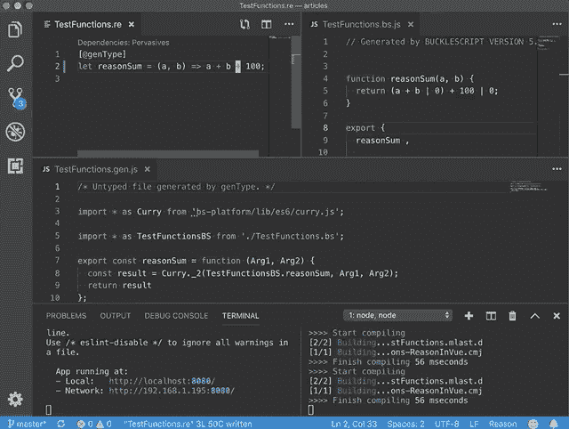

# 向 Vue 应用程序添加 ReasonML

> 原文：<https://dev.to/yakimych/adding-reasonml-to-a-vue-application-1j9c>

尽管事实上 [ReasonML](https://reasonml.github.io/) 是 React 的天然选择，但由于 [BuckleScript](https://bucklescript.github.io/) 它可以很容易地在任何 JavaScript 应用程序中使用。是的——这包括 [Vue.js](https://vuejs.org/) ！

如果你正在使用 Vue 并且喜欢 OCaml/ReasonML，或者你是否已经听说了所有的宣传并且很想尝试——在本文中我将展示如何使用 Vue 中用 Reason 编写的代码。

注意:这是我的迷你系列中关于将 Reason 集成到现有代码库中的第二篇文章。关于所有东西如何结合在一起的更基本的解释，请看第一篇文章:[向现有代码库添加 reason ml](https://dev.to/yakimych/adding-reasonml-to-an-existing-codebase-part-1-3kkg)。在《T2》第三部中，我们将把理性整合到一个[反应](https://reactjs.org/) [打字稿](https://www.typescriptlang.org/)代码库中。

## 第 0 步:起点

我们的起点是借助 [Vue CLI](https://cli.vuejs.org/guide/creating-a-project.html) 默认预设新创建的 Vue 应用程序。值得注意的是，由于有了 [genType](https://github.com/cristianoc/genType) ，这个指南对于 [TypeScript](https://www.typescriptlang.org/) 应用程序同样适用。

## 第一步:添加 BuckleScript

我们将需要 [BuckleScript](https://bucklescript.github.io/) 来将 ReasonML 或 OCaml 代码编译成 JavaScript 和 [genType](https://github.com/cristianoc/genType) 来简化 Reason 和 JS 之间的互操作。在迷你系列的[第一部](https://dev.to/yakimych/adding-reasonml-to-an-existing-codebase-part-1-3kkg)中有更多关于这个的内容。

让我们继续安装软件包:

```
npm install --save-dev bs-platform gentype
npm install -g bs-platform 
```

我们需要确保`bucklescript`在`babel`之前运行，所以让我们将命令添加到`package.json` :
中的`start`和`build`脚本中

```
"scripts":  {  "serve":  "bsb -make-world && vue-cli-service serve",  "build":  "bsb -make-world && vue-cli-service build"  } 
```

在我们开始编写代码之前，剩下的最后一件事是添加 [bsconfig.json](https://bucklescript.github.io/docs/en/build-configuration.html) :

```
{  "name":  "reason-in-vue",  "sources":  [  {  "dir":  "src/reason",  "subdirs":  true  }  ],  "package-specs":  [  {  "module":  "es6-global",  "in-source":  true  }  ],  "suffix":  ".bs.js",  "namespace":  true,  "refmt":  3,  "gentypeconfig":  {  "language":  "untyped"  }  } 
```

## 第二步:在 Reason 中编写函数

注意，`src/reason`被指定为源目录，所以让我们创建它并添加一个`TestFunctions.re`文件，这样我们就可以测试我们的设置:

```
let reasonSum = (a, b) => a + b; 
```

如果你使用的是带有[原因语言服务器](https://github.com/jaredly/reason-language-server)扩展名的 [VS 代码](https://code.visualstudio.com/)，那么在`.re`文件
旁边会立即生成一个`TestFunctions.bs.js`文件

```
function reasonSum(a, b) {
  return (a + b) | 0;
} 
```

用`[@genType]`注释函数会在`TestFunctions.bs.js` :
旁边产生一个`TestFunctions.gen.js`文件

```
[@genType]
let reasonSum = (a, b) => a + b; 
```

```
import * as Curry from "bs-platform/lib/es6/curry.js";

import * as TestFunctionsBS from "./TestFunctions.bs";

export const reasonSum = function(Arg1, Arg2) {
  const result = Curry._2(TestFunctionsBS.reasonSum, Arg1, Arg2);
  return result;
}; 
```

此时，我们可以使用 JavaScript 中的`reasonSum`函数——让我们从 Vue 组件中调用它:

```
<template>
  <div id="app">
    <div>The result is {{ result }}</div>
  </div> </template> 
<script>
import { reasonSum } from "./reason/TestFunctions.gen";

export default {
  name: "app",
  data() {
    return {
      result: reasonSum(1, 2)
    };
  }
};
</script> 
```

请注意，如果您从终端运行，并且希望原因文件中的更改被即时传输和获取，我们需要让`bsb -make-world -w`在后台运行:

[](https://res.cloudinary.com/practicaldev/image/fetch/s--4nBg4xx1--/c_limit%2Cf_auto%2Cfl_progressive%2Cq_66%2Cw_880/https://thepracticaldev.s3.amazonaws.com/i/dp4s4qgtjozpv4ohylqk.gif)

## 第三步:调用 API，合理解码响应

下一步是添加一个 API 调用，它将从[http://numbersapi.com](http://numbersapi.com)获取一些关于随机数的有趣信息。

对`http://numbersapi.com/random/math?json`的调用将产生以下响应:

```
{  "text":  "880 is the number of 4×4 magic squares.",  "number":  880,  "found":  true,  "type":  "math"  } 
```

我们将使用 [bs-axios](https://github.com/meafmira/bs-axios) 进行 API 调用，并使用 [bs-json](https://github.com/glennsl/bs-json) :
解码响应

```
npm install --save bs-axios @glennsl/bs-json 
```

容易忘记的一个重要步骤是将这些依赖项添加到`bsconfig.json` :

```
 "bs-dependencies":  ["@glennsl/bs-json",  "bs-axios"] 
```

现在我们可以创建一个新文件`NumberFacts.re`，对类型建模，并创建一个解码器:

```
[@genType]
type numberFact = {
  number: int,
  text: string,
  isFound: bool,
};

module Decode = {
  let fact = json =>
    Json.Decode.{
      number: json |> field("number", int),
      text: json |> field("text", string),
      isFound: json |> field("found", bool),
    };
}; 
```

API 调用本身可以这样执行:

```
[@genType]
let fetchNumberFact = () =>
  Js.Promise.(
    Axios.get("http://numbersapi.com/random/math?json")
    |> then_(response => response##data |> Decode.fact |> resolve)
  ); 
```

推理的类型是`unit => Js.Promise.t(numberFact)`，和预期的一样。在`NumberFacts.gen.js`函数中生成的 JavaScript 代码看起来是这样的:

```
import * as NumberFactsBS from "./NumberFacts.bs";

export const fetchNumberFact = function(Arg1) {
  const result = NumberFactsBS.fetchNumberFact(Arg1);
  return result.then(function _element($promise) {
    return { number: $promise[0], text: $promise[1], isFound: $promise[2] };
  });
}; 
```

我在这个迷你系列的[第一篇文章](https://dev.to/yakimych/adding-reasonml-to-an-existing-codebase-part-1-3kkg)中解释了 BuckleScript 和 genType 生成的代码之间的区别。

## 第四步:把所有东西绑在一起

这就是我们在理性方面所要做的一切。现在是时候从 Vue 组件调用我们的函数并显示结果:

```
<template>
  <div id="app">
    <div class="number-fact">
      <div>Number: {{numberFact.number}}</div>
      <div>Fact: "{{numberFact.text}}"</div>
      <div>{{numberFact.isFound ? "Found" : "Not found!"}}</div>
      <button @click="fetchNewFact">Fetch new fact</button>
    </div>
  </div> </template> 
<script>
import { fetchNumberFact } from "./reason/NumberFacts.gen";

export default {
  name: "app",
  data() {
    return {
      numberFact: {
        number: -1,
        text: "-1 is not an interesting number",
        isFound: false
      }
    };
  },
  methods: {
    fetchNewFact: function() {
      fetchNumberFact().then(numberFact => (this.numberFact = numberFact));
    }
  },
  mounted: function() {
    this.fetchNewFact();
  }
};
</script> 
```

组件安装后，将自动加载一个新的事实。单击“获取新事实”按钮将加载一个新的随机数事实——所有这些都通过 ReasonML 代码完成。

## 总结

向现有的 Vue 代码库添加 ReasonML 可以在几分钟内完成。在这个初始设置之后，就可以用 ReasonML 或 OCaml 编写逻辑，并在现有的 Vue 组件中使用它。源代码可以在 [GitHub](https://github.com/Yakimych/articles/tree/master/reason-in-vue) 上获得。

希望这篇教程能启发 Vue.js 开发者尝试 ReasonML！