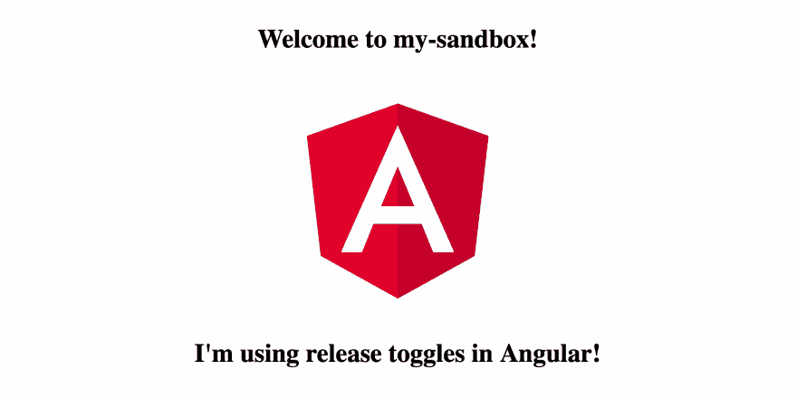

# 给 Angular 应用程序添加释放开关——简单的方法

> 原文：<https://dev.to/thekarel/adding-release-toggles-to-an-angular-app-the-easy-way-1caf>

本教程适用于从[用 Appknobs、React & CLI](https://dev.to/thekarel/implementing-release-toggles-with-appknobs-react-cli-3b06) 实现释放切换的 Angular。

## 让我们添加一个释放开关

当你进行基于主干的开发时，你的主分支中的任何东西——通常是 master——都会被推向生产。同时，您可能希望使用短命的特性分支，一次添加一些小的改进，并经常集成(合并)。为了防止半成品特征出现在生产中，你需要使用*释放开关*。这些开关——也称为发布标志——将允许您部署、演示和端到端测试由选定用户开发的功能，但对其他任何人隐藏它。

这是一个非常简单的概念，但如果你试图从头开始实现它，就会遇到一些困难。因此，我们将使用 Appknobs 的两个开源 NPM 包来快速完成这项工作:UI 的 [@appknobs/angular](https://www.npmjs.com/package/@appknobs/angular) 和命令行的 [@appknobs/cli](https://www.npmjs.com/package/@appknobs/cli) 。

## 创建新项目(可选)

我们假设你有一个工作的 Angular 7 应用程序为新的版本切换做好了准备。如果你需要一个快速沙盒，使用
生成一个

```
npm install -g @angular/cli
ng new my-sandbox --defaults 
```

或者用纱线:

```
yarn global add @angular/cli
ng config -g cli.packageManager yarn
ng new my-sandbox --defaults 
```

## 安装依赖项

在你的项目文件夹中，安装`@appknobs/angular`、`@appknobs/client`和`@appknobs/cli` :

```
npm install @appknobs/angular @appknobs/client && npm install -D @appknobs/cli 
```

或者

```
yarn add @appknobs/angular @appknobs/client && yarn add -D @appknobs/cli 
```

## 添加一个释放开关

`@appknobs/angular`带有一个声明性的特性切换组件`<ak-feature>`。在你用`<ak-feature name='...'><YourSection /></ak-feature>`封装了应用程序的一部分之后，它就变成了一个托管特性，所以你可以在不修改代码的情况下切换发布。

这取决于你选择你的用户界面的一部分隐藏在一个开关后面。如果您正在使用沙盒，请打开`src/app/app.component.html`并将其更改为

```
<div style="text-align:center">
  <h1>
    Welcome to {{ title }}!
  </h1>
  

  <ak-feature name="sandbox-message">
    <h1>I'm using release toggles in Angular!</h1>
  </ak-feature>
</div> 
```

这段代码将`<h1>I'm using release toggles in Angular!</h1>`隐藏在释放开关之后。是的，这有点简单，但作为一个例子很好。`<ak-feature>`组件可以包装你的 UI 层次结构的任何部分——所以它很灵活，可以满足复杂的场景。

请注意，一旦功能被管理，默认情况下它是隐藏的。因此您的消息暂时不会显示。

## 特征标志自动发现

使用`@appknobs/cli`-app knobs 的命令行界面-让特性管理服务知道你的发布标志。使用 Yarn，您可以简单地运行`yarn knobs`来调用它，否则，在您的`package.json`中添加一行...

```
 "scripts":  {  "knobs":  "knobs"  } 
```

…然后运行`npm run knobs`。将`@appknobs/cli`作为一个全局包安装或者运行`npx @appknobs/cli —help`也可以。对于下面的例子，我们假设它是一个全球包。

为了让你的生活更容易，Appknobs 可以查看你的代码库，自动找到并注册所有的特性标志。无需手动复制粘贴。

从项目的顶层调用`knobs parse src/`，该工具将引导您完成整个过程:

```
$ knobs parse src

You need to log in before you can upload feature flags from your project

? Would you like to log in or register now? …
  Log in
❯ Register
  Quit 
```

基本上，你需要选择*注册*，输入你的邮箱和密码，回车:

```
App name: my-sandbox
App ID: DfXPWwujs4YxZc2~Ay8~9
Framework: auto-guessing

Found the following feature flags:
👉 sandbox-message

👍 sandbox-message saved 
```

好了👏

你的释放切换被自动发现并记录在 Appknobs 服务中。

## 获取您的应用 ID

请记下你的应用 ID，因为你很快就会用到它。要在以后找到它，请运行以下命令:

```
$ knobs app-info

✔ App name: my-app-xxx
✔ appID: TfXPkjh3ysHYxZc2~Ay8~9 
```

## 获取您的 API 密钥

您将需要一个 API 密钥来从您的应用程序访问 Appknobs 服务。

CLI 再次为您服务:

```
$ knobs apikey

✔ Your API key is: 62zYKyP8f8sAqxpPoYAcm and is valid until Mon May 13 2019 
```

💡提示:你可以随时去我们在 https://console.appknobs.io/的网络控制台找到这些信息。

## 连接 Appknobs 服务

为了确保每个特性在需要时“翻转”,我们提供了一个**服务**,它会自动将更改传播给所有的`<ak-feature>`。

在服务配置中，您**注入服务客户端**，它将在运行时获取应用程序的可用功能切换。你需要之前的`appId`和`apiKey`。

最后，您**发送运行时上下文**——例如用户名、主机名、cookie 值等。-提供给服务以对应用功能标志的状态做出决定。上下文负载的内容完全由您决定。下面的例子很简单，但是现在有效，并且允许你继续尝试。[在我们之前的博客文章中找到更多关于有效载荷和条件的信息。](https://dev.to/blog/getting-to-know-the-appknobs-console#define-the-conditions)

💡提示:查看 [`@appknobs/angular`](https://www.npmjs.com/package/@appknobs/angular) 和 [`@appknobs/client`](https://www.npmjs.com/package/@appknobs/client) 文档以了解高级主题，或者看看我们在[app knobs/app knobs-examples](https://github.com/appknobs/appknobs-examples)repo 中的代码示例。

对于沙盒示例，`src/app/app.module.ts`需要像这样修改:

```
import { BrowserModule } from '@angular/platform-browser';
import { NgModule } from '@angular/core';

import { AppComponent } from './app.component';

// Import the Appknobs modules
import { newBrowserClient } from '@appknobs/client';
import { AppknobsModule} from '@appknobs/angular';

// Configure the client
const appknobsClient = newBrowserClient({
  appId: 'YOUR_APP_ID',
  apiKey: 'YOUR_API_KEY'
});

@NgModule({
  declarations: [
    AppComponent
  ],
  imports: [
    BrowserModule,
    // Inject the client
    AppknobsModule.forRoot({client: appknobsClient})
  ],
  providers: [],
  bootstrap: [AppComponent]
})
export class AppModule { } 
```

## 抓取功能列表

您可以随时获取已启用功能的列表。一个快速简单的解决方案是在启动时做一次，但是当然，这可以在应用程序生命周期中的任何时候重复。

将`AppknobsService`注射到`app.component.ts`中，并拨打电话:

```
import { Component, OnInit } from '@angular/core';

import {AppknobsService} from '@appknobs/angular';

@Component({
  selector: 'app-root',
  templateUrl: './app.component.html',
  styleUrls: ['./app.component.css']
})
export class AppComponent {
  title = 'my-sandbox';

  private appknobs = null;

  constructor(appknobs: AppknobsService) {
    this.appknobs = appknobs;
  }

  ngOnInit() {
    // A quick-and-easy way to toggle features by deployment target:
    this.appknobs.evaluate({hostname: document.location.hostname});
  }
} 
```

使用
启动您的应用程序

```
ng serve 
```

## 你的代码已经准备好了

如前所述，释放切换背后的思想是您可以在不改变代码的情况下改变特性的可见性。既然“沙盒-消息”功能现在已经被管理了，让我们前往位于[https://console.appknobs.io/](https://console.appknobs.io/)的 web 控制台并设置条件。

💡提示:`knobs console`将打开 web UI

有一个[web 控制台](https://dev.to/blog/getting-to-know-the-appknobs-console)的详细指南，如果需要的话你可以参考。步骤非常简单:

*   参观[https://console.appknobs.io/](https://console.appknobs.io/)
*   **使用您的用户名和密码登录**
*   在你的应用程序下——在我们的例子中是“我的沙盒”——点击**编辑特征**
*   在您定义的特性下——在我们的例子中是“沙盒-消息”——点击**编辑条件**

在**条件表**中，我们添加:

*   `hostname`作为财产
*   `Equal to`作谓语
*   `localhost`作为论据

—然后保存。

## 搞定

重新加载您的应用程序，享受您的惊人消息！🥇

[](https://res.cloudinary.com/practicaldev/image/fetch/s--59qiQ9mo--/c_limit%2Cf_auto%2Cfl_progressive%2Cq_auto%2Cw_880/https://thepracticaldev.s3.amazonaws.com/i/9e7ngen87b4ff8qlytvp.png)

尝试将`app.component.ts`中的上下文负载设置为其他值，例如`{hostname: 'example.com'}`，看看会发生什么。

注意:评估被有效负载缓存 1 分钟，因此在控制台上所做的*更改可能需要几秒钟才能在应用程序中看到。*

希望本指南允许您使用发布开关开始一个更有成效的、基于主干的开发之旅。如果你喜欢它，请分享，或者让我知道我是否错过了什么！