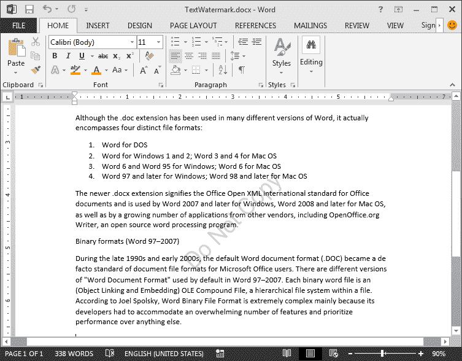
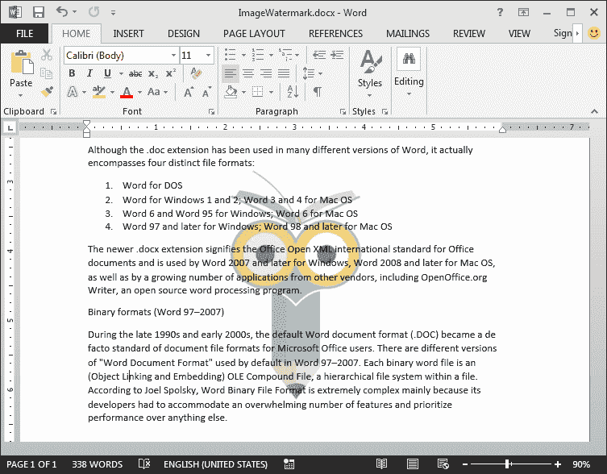
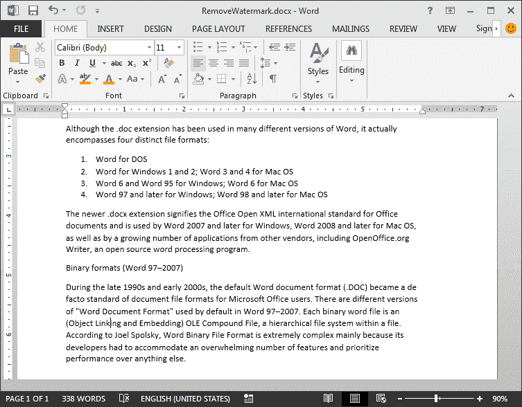

# 使用 Java 在 Word 中添加、删除文本水印和图像水印

> 原文：<https://dev.to/eiceblue/adding-removing-text-watermark-image-watermark-in-word-using-java-j7c>

水印是出现在文档内容后面的一段褪色的文本或褪色的图像。我们可以在 Word 文档中添加文本水印来指示文档的状态，如草稿、机密和已批准，或者添加图像水印来标识公司徽标。

在这篇文章中，我将演示如何添加文本水印和图像水印到一个 Word 文档，然后使用 [Free Spire 移除水印。Doc for Java](https://www.e-iceblue.com/Introduce/free-doc-for-java.html) 库。

## 添加水印

1.  添加文本水印

在自由塔尖。Doc for Java， **TextWatermark** 类用于处理文本水印。在创建文本水印时，我们可以自定义水印的设置，如字体、字号、文本颜色和布局。

```
public class TextWatermark {
    public static void main(String[] args){
        //Load the Word document
        Document doc = new Document();
        doc.loadFromFile("Input.docx");

        //Create a TextWatermark instance
        TextWatermark textWatermark = new TextWatermark();

        //Set the watermark display text
        textWatermark.setText("Do Not Copy");

        //Customize the settings of the text watermark
        textWatermark.setFontName("Arial");
        textWatermark.setFontSize(30f);
        textWatermark.setColor(Color.BLUE);
        textWatermark.setLayout(WatermarkLayout.Diagonal);

        //Add the text watermark to the document
        doc.setWatermark(textWatermark);

        //Save the document
        doc.saveToFile("TextWatermark.docx", FileFormat.Docx_2013);
    }
} 
```

[](https://res.cloudinary.com/practicaldev/image/fetch/s--PNScyJUz--/c_limit%2Cf_auto%2Cfl_progressive%2Cq_auto%2Cw_880/https://thepracticaldev.s3.amazonaws.com/i/fg1mcdgroot6iv971aj4.png)

1.  添加图像水印

**PictureWatermark** 类用于处理图像水印。当添加图像水印时，我们可以指定水印的缩放比例，并设置它是否褪色。图像水印可以来自我们的本地文件或流。

```
public class ImageWatermark {
    public static void main(String[] args){
        //Load the Word document
        Document doc = new Document();
        doc.loadFromFile("Input.docx");

        //Create a PictureWatermark instance
        PictureWatermark imageWatermark = new PictureWatermark();
        //Set the watermark image
        imageWatermark.setPicture("C:\\Users\\Administrator\\Desktop\\PIC\\Logo.jpg");
        //Disable wash out
        imageWatermark.isWashout(false);
        //Add to the document
        doc.setWatermark(imageWatermark);

        //Save the document
        doc.saveToFile("ImageWatermark.docx", FileFormat.Docx_2013);
    }
} 
```

[](https://res.cloudinary.com/practicaldev/image/fetch/s--79ol4PtS--/c_limit%2Cf_auto%2Cfl_progressive%2Cq_auto%2Cw_880/https://thepracticaldev.s3.amazonaws.com/i/f35rp3aq15xxs4hvotxp.png)

## 去除水印

我们可以通过使用方法 **doc.setWatermark(null)** 很容易地从 Word 文档中去除水印。

```
public class RemoveWatermark {
    public static void main(String[] args){
        //Load the Word document
        Document doc = new Document();
        doc.loadFromFile("ImageWatermark.docx");

        //Remove the watermark
        doc.setWatermark(null);

        //Save the document
        doc.saveToFile("RemoveWatermark.docx", FileFormat.Docx_2013);
    }
} 
```

[](https://res.cloudinary.com/practicaldev/image/fetch/s--CS5wpO6k--/c_limit%2Cf_auto%2Cfl_progressive%2Cq_auto%2Cw_880/https://thepracticaldev.s3.amazonaws.com/i/kykiwace7ohmua2t81bq.png)