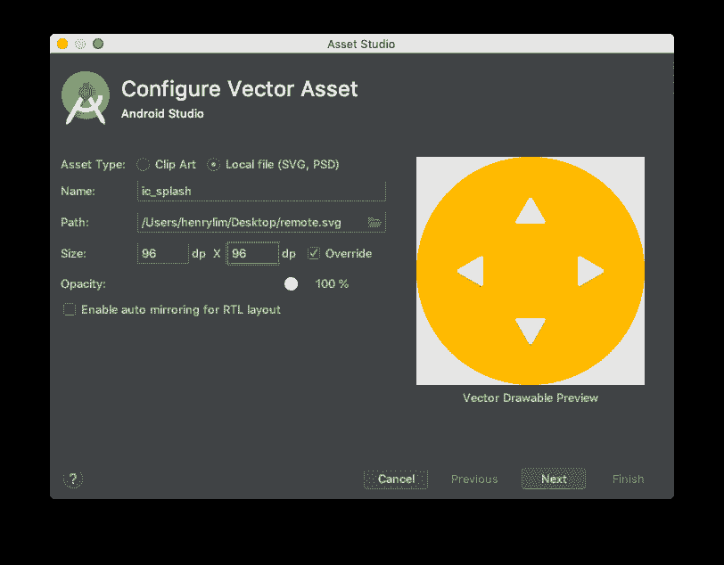
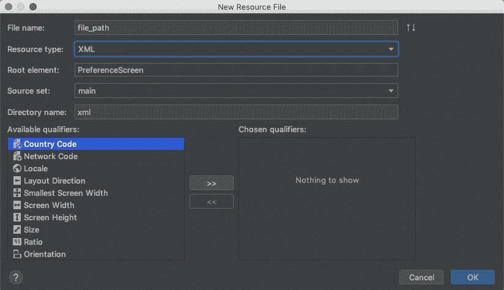

# 使用 Android 的 FileProvider 为可信网络活动添加闪屏

> 原文：<https://dev.to/henrylim96/adding-splash-screen-to-trusted-web-activity-48p3>

> **⚠️这篇文章已经 1 年多了。
> 请参考[这篇文章](https://developer.chrome.com/docs/android/trusted-web-activity/integration-guide/#making-a-splash)关于如何给可信网络活动添加闪屏。**

* * *

了解如何使用 Android 的 FileProvider 为您的可信网络活动(TWA)添加闪屏。

## 什么是可信 Web 活动？

*可信网络活动(TWA)是一种新的方式，它使用基于自定义标签的协议将您的网络应用内容(如 PWA)与您的 Android 应用集成在一起。*

* * *

⚠️ **这种方法还没有准备好生产，它只适用于 Chrome 75+。你已经被警告了！️** ️️⚠️

* * *

## 第一步:添加标志

将您的应用徽标添加到 drawable 文件夹中(使用 Asset Studio)。在这种情况下，我将徽标大小设置为 96dp，并将其命名为`ic_splash`。

<figure>

<figcaption>drawable/ic_splash</figcaption>

</figure>

## 第二步:创建 XML 文件

在 XML resources 文件夹中创建新的 XML 文件。在这种情况下，我称之为`file_path.xml`。

<figure>

<figcaption>Adding "file_path.xml"</figcaption>

</figure>

然后，将以下代码添加到刚刚创建的 XML 文件中: