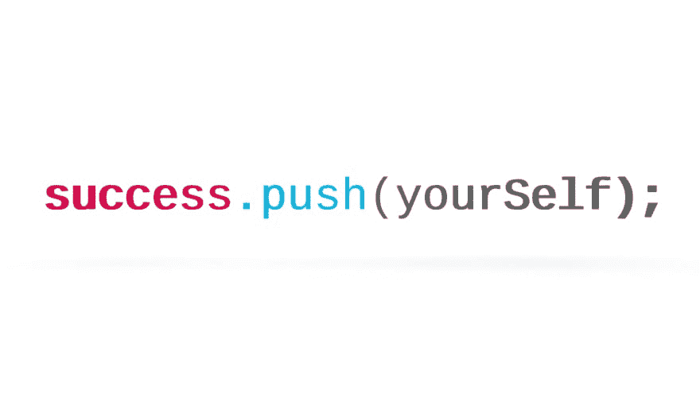

# 给训练营学生的建议

> 原文：<https://dev.to/nielsenjared/advice-for-coding-bootcamp-students-63>

我在一所著名的大学教编码训练营。在从全栈 web 开发和数据可视化的六个团队和 100 多个个人毕业后，我观察到一些让成功学生与众不同的事情。这是我给训练营学生的建议。

非常感谢所有教过我的学生，也感谢你们写这篇文章时的反馈。免责声明&声明:这些观点是我个人的，不一定代表我雇主的观点。本文原载于[jarednielsen.com](http://jarednielsen.com/advice-coding-bootcamp-students/)T3】

## 添加

在你的简历中，你将增加你的技术技能，但更重要的是，你将增加团队合作和翻译的软技能。这些是你新行业的工具。保持警惕。

### ...你的技能

做算法。

每天都是。

你会想，“检查一个字符串是否是一个回文的真实应用是什么？”

算法提供了一个有限的环境来练习(并获得)编程技巧。与可能需要几天或几周时间的项目不同，算法在最好的情况下只需要几分钟，在最坏的情况下需要几个小时。

一个马拉松运动员不会在比赛日出现并期望获胜。为了准备这次活动，我们在跑步机和跑道上度过了无数“毫无意义”的时间。当申请工作时，我的大多数学生都会面临编码挑战。这些挑战基本上都是伪装成故事问题的算法或者数据结构。如果你能看穿这些噪音，你就能快速实现一个优雅的解决方案。

实践造就实践。

### ...到您的投资组合

开始你自己的项目。

不要等到你觉得准备好了。当你最终觉得准备好了，那就太晚了。

我最成功的学生开始了他们自己的兼职项目，探索我们在课堂上没有时间涉及的技术和概念。他们被迷住了。

让虫子咬你。

这就是你如何建立一个文件夹，将你从所有其他编码训练营的学生中区分出来。你想要炫耀的不仅仅是刽子手或待办事项。

### ...到您的网络

精明的学生很快就会意识到，他们真正花钱买的不是代码库，而是他们的同事。

这是我看到很多更强的学生失败的地方。他们通常有一些编程背景，并对他们的新手同行感到沮丧。他们选择独自工作，剥夺了训练营提供的最重要的资产和经验:人。

这是你专业人脉的开始。

交朋友。

建立社区。

学习如何在团队中工作。

更好的是，学习如何领导一个团队。

## 提交

我的许多优秀学生都是那些一开始就努力学习基础知识的人。让他们与众不同的是承诺。训练营就是不成功便成仁。无论如何他们都会成功。最经常失败的学生是那些带着“学术”心态来的学生，他们像上大学课程一样进入训练营，只关心分数，做最起码的事情来获得分数。是的，证书很重要，但更重要的是知识获取。你不只是承诺参加为期 *x* 个月的训练营。你承诺在 *y* 年内开始新的生活。

### ...到需要的时间

日复一日的生活已经够艰难了，尤其是如果你有家庭和工作的话，但是你必须找到一种方法，每天抽出大量的时间在这个领域做深入的工作。让你的时间表适应你的心流。建立一个常规，并坚持下去。

才几个月而已。放下你过去的生活，这样你就可以开始新的生活。

不要让你的坏习惯扼杀了你的梦想。

你做出了牺牲。

让它有价值。

### ...做这项工作

做工作。

更重要的是，做好自己的工作。

不要作弊。

是的，克隆那个回购协议，稍微伪装一下代码，然后作为你自己的提交，这很有诱惑力。

你只是在伤害你自己。

一张证书和一个精美的文件夹可能会让你进入面试的大门，但是当他们问你技术问题时，你该怎么办呢？

我向你保证答案不是`CTRL+C/CTRL+V`。

当您在文档或堆栈中搜索解决方案时，不要复制/粘贴它。打出来。尽你所能去理解引擎盖下正在发生的事情。你可以通过简单地使用例子来获得，但是从长远来看，花时间去理解它为什么有效会让你受益。

[RTFM](https://en.wikipedia.org/wiki/RTFM) 。

太棒了。

### ...成长的心态

编程就是解决问题。

不难。

这不是魔法。

It *具有挑战性。*

拥抱挑战。

挑战会支撑你的职业生涯。

爱上解决问题。

使用这些[启发法来培养解决问题的心态](http://jarednielsen.com/teach-adults-code/):

1.  定义问题
2.  设计一个计划
3.  执行计划
4.  检查解决方案

(如果你的导师在第一天没有对你使用类似的方法，立即退出。他或她在浪费你的时间和金钱。)

请记住，每个人对不同的事情都有不同的学习速度。不要拿自己和同龄人比，只拿自己的个人进步比。训练营是一种手段，而不是目的。你现在是一个终身学习者。

## 推送

我最成功的学生都是从最终目标开始的，他们不断地建立自己的投资组合，调整自己的简历，在他们觉得准备好之前申请工作。即便如此，离开巢穴回到现实世界还是会觉得很恐怖。

### ...掌握

你会觉得自己是个骗子。

你可能会在很长一段时间里觉得自己是个冒名顶替者。

软件开发的肮脏秘密？我们都是骗子。我们对此没意见。

不可能精通所有的事情。领域太广，变化太快。

你能获得的最有价值的技能是解决问题的能力。

为了战胜冒名顶替综合症，选择一个话题并深入研究。然后利用这个话题建立一个项目，或者写一篇关于这个话题的文章。然后继续下一件事。每一次你重复这个过程，你就在地上放了另一根木桩，扩大了你的领地。

总有一天你会意识到，精通是对自己快速自学解决任何特定问题所需技能的能力的信心。

让训练营之外的专业人士参与进来很重要。参加聚会和黑客马拉松，与人交谈。

你会意识到你知道的比你认为你知道的要多。

### ...过去

你在编写训练营代码之前的生活是你未来的关键。

你从以前的职业生涯中获得的技能，加上你新获得的技术能力，使你成为一个特定雇主的无价之宝，非常受欢迎。

你填补了一个非常特殊的位置。

在两个世界之间搭建桥梁。

### ...你自己

就像写一个函数一样，由你来决定你的经验的输出。

逼自己。

但不要太用力。

刚刚够硬。

别忘了照顾好自己。

睡觉。吃好。锻炼身体。休息一下。

最后一点极其重要。

你还是世界上的一个人。

关注你的人际关系。

它们比你在编码训练营中编写的任何代码都重要。

(休息的额外好处是，对棘手问题的见解会突然出现。但是不要让你的朋友和家人知道这是事实😜)

## 给训练营学生的最后一条建议

问问你自己代码中的生活是否适合你。我的大多数学生都成功地完成了职业转型。不幸的是，有些人意识到他们做了错误的决定时已经太晚了。编码训练营既费时又费钱，所以要做足功课。请确保您理解 UX/UI、全栈 web 开发和数据可视化(或其他任何主题)之间的区别。对你将要学习的语言和它将为你提供的职业道路做初步研究。这是你真正想做的吗？你不必为了成功而学习编码。但是你仍然需要`add`、`commit`和`push`才能到达你想去的地方。

祝你好运！

* * *

我每周写一份时事通讯，分享关于编程、解决问题和终身学习的文章。[立即加入](http://eepurl.com/cP8CMn)