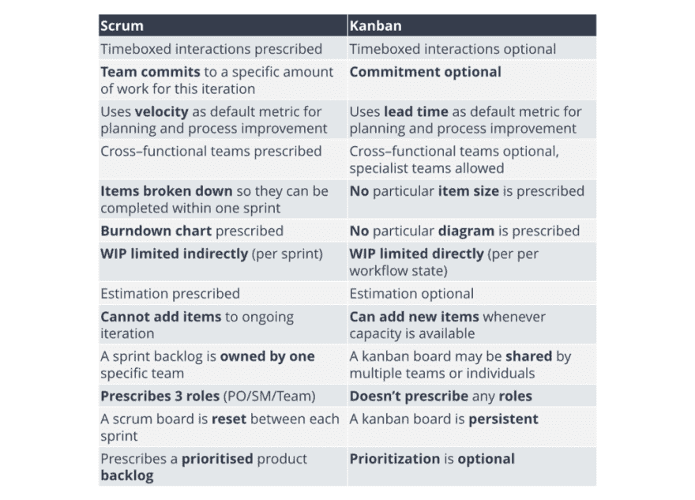
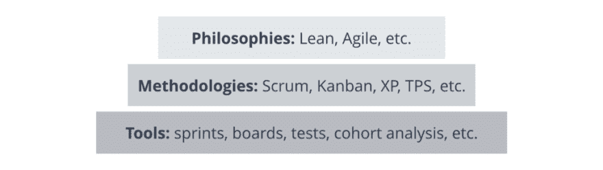

# 敏捷和精益。简单对比一下。

> 原文：<https://dev.to/mega6382/agile-lean-a-brief-introduction-87>

### 精益

精益说要无情地消除任何没有增加价值的事情，只专注于我们此时此刻绝对需要做的事情。消除浪费意味着消除无用的会议、任务和文件。但它*也*意味着消除花费在构建我们“知道”未来需要的东西上的时间(事物在不断变化，所以我们经常最终*不*需要它们——或者如果我们需要，我们不得不返工它们，因为那时条件和我们的理解已经改变)。这也意味着消除低效的工作方式——比如多任务处理。)—这样我们可以快速交付。

真正精益的组织拥有强大的竞争优势，因为他们对市场需求的反应非常迅速，并且非常有纪律，而不是试图预测未来 —玛丽·波彭迪克

### 敏捷

敏捷是一种以时间为中心的迭代哲学，允许一步一步地(增量地)构建产品，通过更小的部分交付它。它的一个主要好处是能够在任何一步适应和改变(取决于反馈、市场条件、公司障碍等。)并只向市场供应相关产品。 **Scrum**

一个优秀的敏捷团队挑选最适合他们的管理和技术实践。(一个糟糕的只是挑选了几个实践，并错误地认为某种程度上“使它们敏捷”——参见:[我们敏捷了吗？](https://hackerchick.com/are-we-agile-yet/))。

那么，有什么区别呢？

**敏捷哲学**

旨在更快地执行任务，更容易地适应变化

使开发过程灵活

最初是为软件开发而设计的，然后扩展到市场营销，目前应用于其他领域

行动循环:产品积压—冲刺积压—迭代(sprints) —潜在的可交付结果

展示进展的方法—“完成”的定义

方法:Scrum、XP、FDD、DSDM、Crystal Methods 等。

工具包:sprints、boards、Scrum Master、验收测试、用户故事映射等。

**精益理念**

是关于智能开发，当你通过消除任何不能给客户带来价值的东西来改进你所做的一切

使开发过程可持续

从传统制造业开始并扩展到所有现有行业

行动循环:构建-测量-学习

展示进展的方法——经验证的学习

方法:看板、改善等。

工具包:假设、分割(A/B)测试、客户访谈、漏斗和群组分析、客户成功经理等。

精益这个术语比敏捷更宽泛，因为它的 smart 方法会影响所有类型的损失(不仅仅是时间损失)，比如金钱、劳动力、能源等。

### Scrum

Scrum 是关于团队以敏捷的方式产生结果。Scrum 团队通过使用一套简单的规则来指导工作，无论如何都会取得成果。我们将把 Scrum 描述为一个简单的应用模型，这样就可以建立对 Scrum 的核心理解。应用 Scrum 的其他复杂性，如扩展、分发等。将在其他地方探索。

### [中的“T1”](#kanban)

看板是一种可视化管理的调度系统，旨在排除团队超载的准时交付。作为精益的一部分，该方法最初支持日本汽车行业。类似于 Scrum，看板跟踪“要做——进行中——完成”的活动，但是它通过“进行中的工作”活动的数量来限制它们(数量由团队经理定义，不能超过)。

欲了解更多信息，请访问:

如何在敏捷和精益、Scrum 和看板之间做出选择——哪种方法是最好的？

[看板 Vs Scrum](https://leankit.com/learn/kanban/kanban-vs-scrum/)