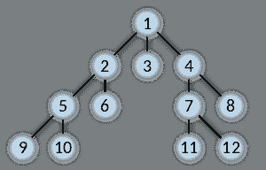
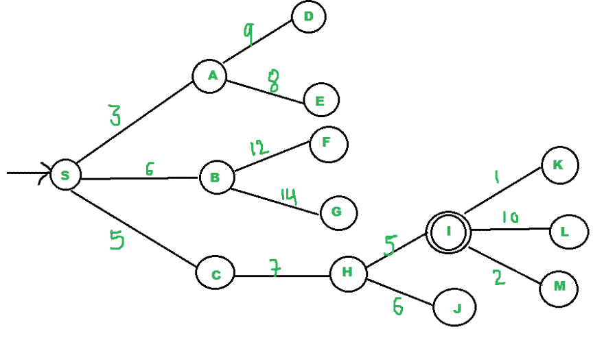
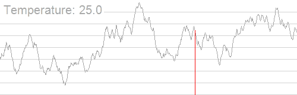
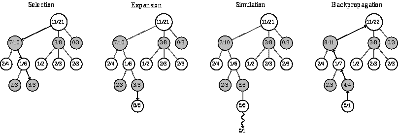

# 每个数据科学家都应该知道的人工智能搜索算法

> 原文：<https://dev.to/aribornstein/ai-search-algorithms-every-data-scientist-should-know-2j4n>

[](https://res.cloudinary.com/practicaldev/image/fetch/s--odoWdJbo--/c_limit%2Cf_auto%2Cfl_progressive%2Cq_auto%2Cw_880/https://cdn-images-1.medium.com/max/620/0%2AM-O2a5eQvWrB5lqN.jpg)

TL；下面的帖子概述了人工智能中的一些关键搜索算法，为什么它们很重要，它们有什么用途。

虽然近年来，[搜索和规划算法](https://en.wikipedia.org/wiki/Automated_planning_and_scheduling)已经让位于机器和深度学习方法，但更好地理解这些算法可以提高模型的性能。此外，随着量子计算等更强大的计算技术的出现，基于搜索的人工智能很可能会卷土重来。

### AI 中的搜索算法是什么？

在我们开始之前，让我们定义一下人工智能中的搜索是什么意思。

<figure>[](https://res.cloudinary.com/practicaldev/image/fetch/s--yQYvaAmc--/c_limit%2Cf_auto%2Cfl_progressive%2Cq_auto%2Cw_880/https://cdn-images-1.medium.com/max/777/1%2Ajuds84wKbdAGe4FKqIw5sA.png) 

<figcaption>搜索算法和搜索引擎不是一回事。</figcaption>

</figure>

**AI 中的搜索**是通过**过渡**到**中间状态**从**起始状态**导航到**目标状态**的过程。

几乎任何人工智能问题都可以用这些术语来定义。

*   **状态** —问题的潜在结果
*   **转换** —在不同状态之间移动的行为。
*   **开始状态—** 从哪里开始搜索。
*   **中间状态**——我们需要转换到的起始状态和目标状态之间的状态。
*   **目标状态—** 停止搜索的状态。
*   **搜索空间** —状态的集合。

### 不知情的搜索

[](https://res.cloudinary.com/practicaldev/image/fetch/s--wsrmY9un--/c_limit%2Cf_auto%2Cfl_progressive%2Cq_auto%2Cw_880/https://cdn-images-1.medium.com/max/300/0%2A0P1HFZynxL3OdGPO.png)

当没有关于在州之间导航的成本的信息时，使用无信息搜索。

对于不知情的搜索，有三种主要的经典算法:

*   **DFS —** 使用 [LIFO 堆栈](https://en.wikipedia.org/wiki/Stack_(abstract_data_type))遍历搜索空间，以确定下一个节点。**优点**:适合深度图形，内存效率高。**缺点:**会卡在循环中。

[深度优先搜索](https://en.wikipedia.org/wiki/Depth-first_search)

*   **IDFS —** 遍历搜索空间，使用一个 [*LIFO 堆栈*](https://en.wikipedia.org/wiki/Stack_(abstract_data_type)) *，*来确定下一个节点，当它到达某个深度时，它清除堆栈，增加深度限制并再次开始搜索。

[迭代深化深度优先搜索-维基百科](https://en.wikipedia.org/wiki/Iterative_deepening_depth-first_search)

*   **BFS-** 使用一个 [*队列 FIFO*](https://en.wikipedia.org/wiki/Queue_(abstract_data_type)) 遍历搜索空间以确定下一个节点。

[广度优先搜索-维基百科](https://en.wikipedia.org/wiki/Breadth-first_search)

### 知情搜索

[](https://res.cloudinary.com/practicaldev/image/fetch/s--HkMyxLfv--/c_limit%2Cf_auto%2Cfl_progressive%2Cq_auto%2Cw_880/https://cdn-images-1.medium.com/max/901/0%2Al4jWWaONrcPZgYo6.png)

当我们知道成本或对各州之间的成本有一个可靠的估计时，就使用知情搜索。

**UCF-** 用一个[优先级队列](https://en.wikipedia.org/wiki/Priority_queue)和一个分数遍历搜索空间。给定状态的分数是通过沿着它被发现的路径从父状态到达该状态的成本来计算的。

[人工智能-统一成本搜索(UCS)](https://algorithmicthoughts.wordpress.com/2012/12/15/artificial-intelligence-uniform-cost-searchucs/)

**A* —** 用优先级队列和分数遍历搜索空间。一个状态的得分是通过沿着它被发现的路径从父状态到达该状态的成本，结合给定状态的启发式值来计算的。

试探法的*容许值*必须符合以下两个性质。

*   一个状态的启发式值必须小于从一个状态到目标节点的最低成本路径。
*   试探值必须小于到状态的路径和每个父节点的试探值之间的成本值。

[A*搜索算法-维基百科](https://en.wikipedia.org/wiki/A*_search_algorithm)

**IDA***——IDFS 版的 A *

[迭代深化 A* -维基百科](https://en.wikipedia.org/wiki/Iterative_deepening_A*)

### 本地搜索

[](https://res.cloudinary.com/practicaldev/image/fetch/s--UB9hPf2X--/c_limit%2Cf_auto%2Cfl_progressive%2Cq_66%2Cw_880/https://cdn-images-1.medium.com/max/500/0%2Ak3abJNZb-9nrs_1t.gif)

当有不止一个可能的目标状态，但是一些结果比其他结果更好，并且我们需要发现最好的结果时，我们使用局部搜索算法。大量用于机器学习算法的优化。

**爬山-** 一种贪婪的搜索方法，基于最小值损害下一个状态，直到达到局部最大值。

[爬山-维基百科](https://en.wikipedia.org/wiki/Hill_climbing)

**模拟退火-** 从爬山开始，直到达到局部最大值，然后使用温度函数来决定是停止还是继续处于更差的状态，希望找到更好的状态

[模拟退火-维基百科](https://en.wikipedia.org/wiki/Simulated_annealing)

**GSAT**—CNF 领域爬山的实现。为每个可能的参数选择一组随机的布尔值，如果这些值匹配所有的前提条件，则返回目标状态，否则我们翻转这些值，以满足目标状态的最大数量的可能前提条件，然后为我们在最后一次迭代中翻转的每个布尔值重复这个过程。

[漫游-维基百科](https://en.wikipedia.org/wiki/WalkSAT)

**遗传搜索** -生成状态的初始群体，使用适应度函数删除阈值以下具有最低值的群体。随机组合幸存者，然后变异一对夫妇位，并评估适应度和重复。

[遗传算法](https://en.wikipedia.org/wiki/Genetic_algorithm)

**波束搜索** -使用模型当前和先前输出的前 n 个似然值执行统一成本搜索。

[光束搜索-百科](https://en.wikipedia.org/wiki/Beam_search)

**蒙特卡洛搜索—** 一种随机搜索算法，当终止时将返回正确搜索结果的最佳估计。蒙特卡罗算法总是很快，但只是可能是正确的。

[](https://res.cloudinary.com/practicaldev/image/fetch/s--zZooINqO--/c_limit%2Cf_auto%2Cfl_progressive%2Cq_auto%2Cw_880/https://cdn-images-1.medium.com/max/808/0%2AxlmSiIxUPAC-XTMj.png)

[蒙特卡洛树搜索-维基百科](https://en.wikipedia.org/wiki/Monte_Carlo_tree_search)

**拉斯维加斯搜索**是一种随机搜索算法，与蒙特卡洛不同，它只会在找到正确结果时返回。拉斯维加斯的算法总是正确的，但可能只是很快。

```
_// Las Vegas algorithm_
2 repeat:
3 k = RandInt(n)
4 **if** A[k] == 1,
5 **return** k; 
```

Enter fullscreen mode Exit fullscreen mode

[拉斯维加斯算法-维基百科](https://en.wikipedia.org/wiki/Las_Vegas_algorithm)

**大西洋城搜索** —是一种有界概率多项式时间搜索算法，结合了拉斯维加斯和蒙特卡洛搜索算法的优点和缺点。

[大西洋城算法-维基百科](https://en.wikipedia.org/wiki/Atlantic_City_algorithm)

### 下一步

如果你喜欢这篇文章，请马上关注新内容，并在 medium 或 twitter 上关注我。要开始试验这些算法，请查看 [Azure 笔记本](https://docs.microsoft.com/en-us/azure/notebooks/?WT.mc_id=medium-blog-abornst)以及 Azure 上 [CosmosDB](https://docs.microsoft.com/en-us/azure/cosmos-db/?WT.mc_id=medium-blog-abornst) 的图形数据库特性。

如果你还没有，你可以在下面免费订阅 Azure。

[立即创建您的 Azure 免费帐户| Microsoft Azure](https://azure.microsoft.com/en-us/offers/ms-azr-0044p/?WT.mc_id=medium-blog-abornst)

### 关于作者

亚伦(阿里) 是一个狂热的人工智能爱好者，对历史充满热情，致力于新技术和计算医学。作为微软云开发倡导团队的开源工程师，他与以色列高科技社区合作，用改变游戏规则的技术解决现实世界的问题，然后将这些技术记录在案、开源并与世界其他地方共享。

* * *