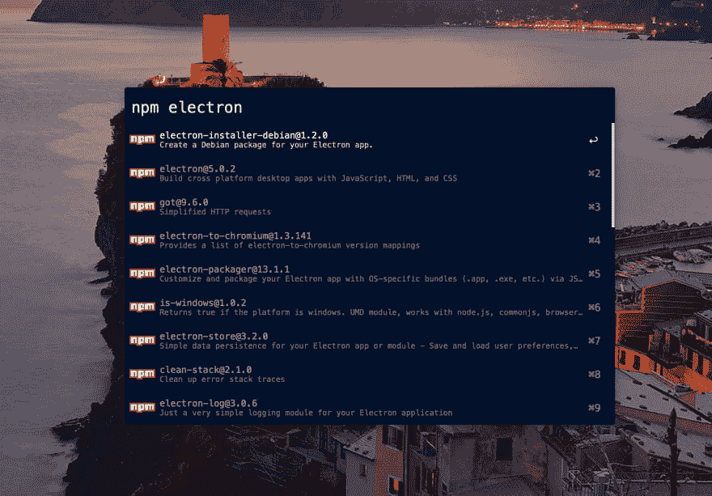

# [Alfred]如何使用包管理器工作流显示最新版本的 npm 包

> 原文：<https://dev.to/craftzdog/alfred-how-to-display-the-latest-version-of-npm-packages-with-package-managers-workflow-2kh7>

我在 Alfred 4 上使用[包管理器工作流](https://github.com/willfarrell/alfred-pkgman-workflow)。
但它不会在搜索结果中显示最新版本。
下面是如何让它像这样显示它们:

[](https://res.cloudinary.com/practicaldev/image/fetch/s--BiUHavv0--/c_limit%2Cf_auto%2Cfl_progressive%2Cq_auto%2Cw_880/https://thepracticaldev.s3.amazonaws.com/i/f73gerqkf9b1dwz7eeen.png)

## 打开工作流目录

[](https://res.cloudinary.com/practicaldev/image/fetch/s--2NQu6kFD--/c_limit%2Cf_auto%2Cfl_progressive%2Cq_auto%2Cw_880/https://thepracticaldev.s3.amazonaws.com/i/ybluxme7axanpssnnjqp.png)

然后，用编辑器打开`code/Npm.php`文件。

编辑从第 29 行开始的行，如下所示:

```
 $this->cache->w->result(
                $this->id,
                $this->makeArg($name, $p->links->npm, "{$p->name}: {$p->version}"),
                "{$name}@{$p->version}", // Display version
                $p->description,
                "icon-cache/{$this->id}.png"
            ); 
```

Enter fullscreen mode Exit fullscreen mode

就是这样！