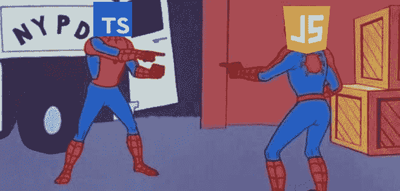
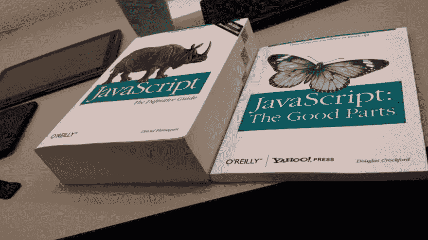
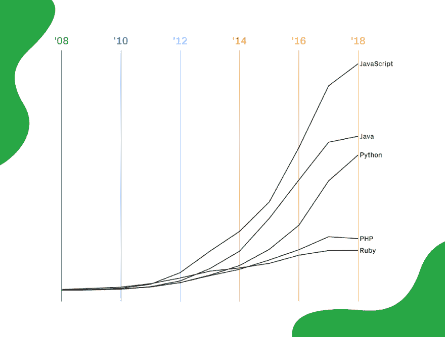
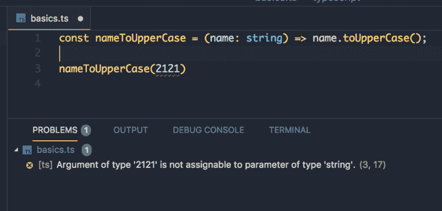
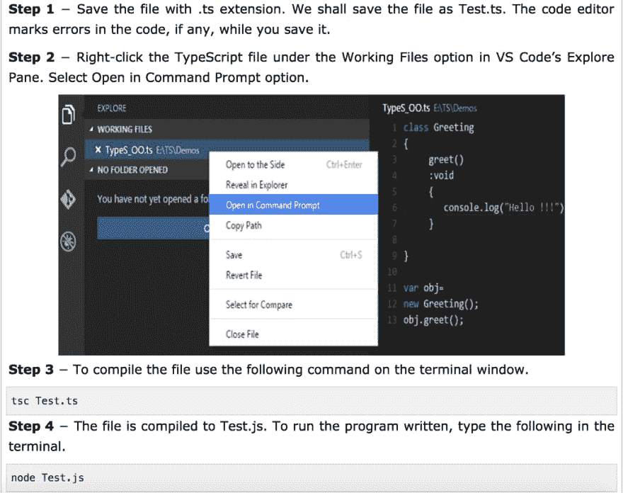

# 都在打字列车上？

> 原文：<https://dev.to/kcarrel/all-aboard-the-typescript-train-5a6p>

> “如果你知道 JavaScript，你就已经知道了 TypeScript”——安德斯·海尔斯伯格

<figure>

<figcaption>[https://www . Reddit . com/r/programmer humor/comments/ax 9 r 6 f/typescript _ be _ like/](https://www.reddit.com/r/ProgrammerHumor/comments/ax9r6f/typescript_be_like/)</figcaption>

</figure>

作为一个初次尝试开发的新手，我发现在寻找我想尝试的不同框架或技术时，很容易感到疲劳。我学习过程的一部分是弄清楚在哪里划分和投资我的可用时间来学习熨斗学校课程中不一定包括的技术。当我们在模块 3 中学习 JavaScript 时，我花了一些时间研究有关 JS 的行业趋势，并不断看到“TypeScript”一次又一次出现。那么什么是 TypeScript，我应该在我的学生开发者之旅中投入时间吗？(剧透警告:所有迹象都指向是)。

### JavaScript 的缺点

<figure> 

<figcaption>用 JavaScript 准确再现我的体验</figcaption>

</figure>

<figure>

<figcaption>[https://github . blog/2018-11-15-state-of-the-octo verse-top-programming-languages/](https://github.blog/2018-11-15-state-of-the-octoverse-top-programming-languages/)</figcaption>

</figure>

Javascript 无疑非常受欢迎。Github 的“Octoverse 报告”提供了 Github 活动的趋势和见解，一直将 JavaScript 列为 Github 项目中最常用的语言。然而，这种巨大的流行并没有阻止 JavaScript 同时成为学习和使用的 Worst™️。

使用 JavaScript 有时会感觉像是在和一个不听话的小孩打交道，因为有时它的行为会让你感到困惑。供参考——加里·伯恩哈特臭名昭著的“Wat”演讲。JavaScript 是一种弱类型语言，通常被解释为“松散的规则会产生大量的代码删除错误”！JavaScript 代码也可能悄无声息地失败，追踪罪魁祸首可能非常耗时。

开发人员社区中似乎有一个很大的观点，即 JavaScript 有太多这些令人愉快的小怪癖，因此需要额外的工具，如 transpilers 或框架，来帮助开发人员实际使用这种语言，而不至于伤透脑筋。考虑到成为 JavaScript 的第一个语言版本是在 [10 天](https://thenewstack.io/brendan-eich-on-creating-javascript-in-10-days-and-what-hed-do-differently-today/)内编写的，我觉得这听起来很对。

撇开怪癖和死马当活马医的迷因不谈，JavaScript 是一种占主导地位的编程语言，估计有 95.1%的网站使用这种语言，而且这种区别可能会持续一段时间。因此，学习这门语言并找到有助于这门语言与你合作而不是对立的工具是很重要的。

### 什么是 TypeScript，为什么要用？

TypeScript 是由安德斯·海尔斯伯格(也是 C#的首席架构师)领导的微软团队在 2012 年开发的。这个开源工具可以在 GitHub 上获得，被誉为“可伸缩的 JavaScript”。TypeScript 是 JavaScript 一些最令人沮丧的缺点的解决方案。它是 JavaScript 的超集，可以编译成 JavaScript，这意味着它并不是一种全新的语言(就像它的一些竞争对手一样),只是 JavaScript 的扩展，更适合应用程序规模的 JavaScript 开发。TypeScript 建立在 Javascript 的基础上，填补了像 JavaScript 这样的弱类型语言的漏洞。TypeScript 编译器和编译后的代码可以在任何浏览器、主机或操作系统上使用。TypeScript 对于尽早捕捉 bug 并帮助 JavaScript 开发人员变得更高效非常有用。

*   TypeScript transpiler 具有错误检查功能，有助于在脚本运行之前突出显示错误，并支持源代码级调试。

<figure>

<figcaption>[https://medium . freecodecamp . org/typescript-JavaScript-with-super-powers-a 333 b 0 fc ABC 9](https://medium.freecodecamp.org/typescript-javascript-with-super-powers-a333b0fcabc9)</figcaption>

</figure>

*   IDE 支持
*   可选的类型推理和静态类型
*   易于编码、编译和重构
*   具有强大社区的开源软件(StackOverflow 上有 76，000 多个问题)
*   [不断增长的行业采用率](https://www.typescriptlang.org/community/friends.html)

### 示例类型脚本到 JavaScript

<figure>

<figcaption>[https://www . tutorialspoint . com/typescript/typescript _ quick _ guide . htm](https://www.tutorialspoint.com/typescript/typescript_quick_guide.htm)</figcaption>

</figure>

### 分四步编译执行

<figure>

<figcaption>[https://www . tutorialspoint . com/typescript/typescript _ quick _ guide . htm](https://www.tutorialspoint.com/typescript/typescript_quick_guide.htm)</figcaption>

</figure>

### 打字稿接管？

如前所述，Github 发布了一份年度“Octoverse 状态”,报告了网站上最常用的编程语言，因此高度反映了基于开发者的行业趋势。根据 2018 年的调查受访者，TypeScript 已被列为增长第三快的语言。

最近一个特别有趣的行业标志是 Jest(Facebook 开发的 JavaScript 测试工具)据报道将在下一个版本中从使用 Flow 迁移到 TypeScript。为什么这很重要？Flow 是 facebook 开发的静态类型检查器，是 TypeScript 的直接竞争对手。在日益流行的打字稿的谈话中，流动总是不可避免地被提及。脸书似乎已经看到了行业潮流的不祥之兆，正在寻找更好的产品。

*   [46%的国家预防机制调查受访者报告使用打字稿](https://blog.npmjs.org/post/180868064080/this-year-in-javascript-2018-in-review-and-npms)
*   [在 Lyft 打字稿](https://eng.lyft.com/typescript-at-lyft-64f0702346ea)
*   [松弛时的打字稿](https://slack.engineering/typescript-at-slack-a81307fa288d)
*   Vue 3 是用 TypeScript 编写的
*   Babel 支持类型脚本

### 参考文献

来自创建者的概述:[https://channel 9 . msdn . com/posts/Anders-Hejlsberg-Introducing-TypeScript](https://channel9.msdn.com/posts/Anders-Hejlsberg-Introducing-TypeScript)

打字稿文件:[https://www.typescriptlang.org/docs/home.html](https://www.typescriptlang.org/docs/home.html)

试验打字稿:[http://www.typescriptlang.org/Playground/](http://www.typescriptlang.org/Playground/)

快速打字稿概述:[https://learnxinyminutes.com/docs/typescript/](https://learnxinyminutes.com/docs/typescript/)

2019 年的 TypeScript:[https://medium . com/@ jtomaszewski/why-TypeScript-is-the-best-way-to-write-front-end-in-2019-feb 855 f9b 164](https://medium.com/@jtomaszewski/why-typescript-is-the-best-way-to-write-front-end-in-2019-feb855f9b164)