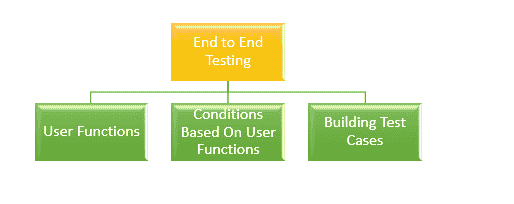

# 关于端到端测试，您需要知道的是

> 原文：<https://dev.to/lambdatest/all-you-need-to-know-about-end-to-end-testing-4nbb>

端到端测试是一种非常常见的测试方法，其目标是通过从头到尾检查流程来测试应用程序是如何工作的。不仅要测试开发环境下的应用程序流，测试人员还要检查它在与外部接口集成后的行为。通常，这个测试阶段在功能测试和系统测试完成后执行。端到端测试的技术定义是——一种测试类型，通过执行完整、彻底的测试，从产品-用户交互的开始到结束，确保应用程序的行为流按预期工作，以发现应用程序工作流中的任何依赖性或缺陷。

## 为什么需要端到端测试？

在当前的[敏捷世界](https://www.lambdatest.com/blog/agile-vs-waterfall-methodology/)中，一个应用程序与应用程序环境之外的多个系统相互连接和集成。因此，应用程序的整个流程变得复杂了。端到端测试确保从所有层测试应用程序——从前端到后端，以及其接口和端点。让我们看看为什么需要它。

**后端运行状况**–端到端测试检查数据库以及应用程序的后端层。由于应用程序的核心功能依赖于后端和数据库层，因此测试这一层可以检查应用程序执行关键功能的准确性。

**分布式环境中的错误**–端到端测试使得测试基于 [SOA](https://www.lambdatest.com/blog/testing-challenges-related-to-microservice-architecture/) 或云环境的应用成为可能。此外，在由需要全面检查的多个组件组成的应用中，它有助于查明核心中的问题。

**多层系统中的应用行为验证**–在具有复杂架构或细分为多层的工作流的应用中，端到端测试检查整体功能以及各个层的功能。它还确定了应用程序在连接系统中的行为。

**确保交互准确性**–由于还涉及前端测试，因此可确保应用程序准确运行，并提供跨多个平台、设备和环境的一致用户体验。

**测试用例的可重用性**–在应用生命周期的不同过程中，端到端测试提供了执行可重复测试用例的选项。此外，它还增加了测试覆盖率，并使所有者对应用程序的性能充满信心。

现在我们已经知道了为什么需要 E2E 测试，让我们看看它是如何进行的。

## 如何进行端到端测试？

让我们总结一下端到端测试期间必须包括的关键活动。

*   在开始测试阶段之前，彻底分析需求。
*   按照所有先决条件设置测试环境。
*   分析软件和硬件要求(最低配置和推荐配置)。
*   研究主系统和相连的子系统。
*   列出所有相关系统的责任。
*   列出测试方法以及要遵循的标准的描述。
*   设计[测试用例](https://www.lambdatest.com/blog/17-lessons-i-learned-for-writing-effective-test-cases/)，同时追踪需求矩阵。
*   在测试每个系统之前，保存输出结果和输入数据。

关键活动已经确定，让我们深入探讨一下。

端到端测试过程可以分为 3 类。

## 用户功能

作为用户功能的一部分，应执行以下活动。

*   列出软件系统的特征和相互连接的子系统。
*   跟踪对任何功能执行的操作以及输入数据和输出结果。
*   在从用户端执行的不同功能之间找出是否有任何关系。
*   检查用户功能是否独立或可重用。简而言之——找到它们的本质。

让我们探索一个有助于理解 E2E 测试的场景。我们会考虑像 BookMyShow 这样的在线剧院预订服务。

1.  登录应用程序
2.  搜索电影。
3.  预订你的座位。
4.  检查支付网关。
5.  检查已预订机票的信息确认。
6.  从应用程序中注销。

**条件取决于用户功能**
作为构建条件的一部分，执行以下操作:

*   对于每个用户函数，建立一组条件。
*   条件应该包括像定时、数据条件和序列这样的参数。

考虑到我们之前的 BookMyShow 示例，我们可以进行以下条件检查。
登录页面中的

1.  如果密码或用户名不正确，检查错误消息是否正确反映。
2.  使用有效的用户详细信息检查相同的场景，并查看登录是否成功。
3.  检查密码的强度。
4.  检查电子邮件地址验证。
5.  如果要转账的金额大于您的钱包余额，请查看错误消息。

**支付页面**

1.  无效的 pin。
2.  CVV 无效。
3.  无效的借方/贷方凭证。
4.  验证所有必填字段是否正常工作。

**构建测试用例**
在构建测试用例之前，考虑以下因素。

*   为每个场景和每个功能编写不止一个测试用例。
*   将每个条件登记为单独的测试用例。

## 端到端测试中涉及的参数

让我们继续讨论端到端测试中涉及的重要参数。

1.  **测试用例准备**–要跟踪的一件重要事情是测试用例准备的当前状态。测试人员可以用图表的形式跟踪这一点。它给出了测试用例准备过程的概念(当前的与计划的)。
2.  **每周测试的进度**–提供测试完成的百分比报告。每周将当前执行的、未执行的和失败的测试用例与计划的报告进行比较。
3.  **缺陷的细节**–该报告提供了一周结束时关闭或打开的缺陷的百分比。基于优先级和关键程度的每周缺陷分布也被考虑在内。
4.  **环境可用性**–该报告提供了每天计划测试的总时间与实际花费的总时间的比较。

## 和系统测试有什么不同？

在讨论了端到端测试的所有方面之后，让我们讨论一下它与系统测试有什么不同。在继续之前，我们应该知道什么是系统测试。它基本上是一种黑盒测试，应用程序在与外部系统集成后进行测试。考虑到真实世界的条件，从用户的角度执行测试。
但是端到端测试有多大的不同呢？嗯，

*   系统测试只验证集成的软件系统，而端到端测试检查主系统和互联系统。
*   系统测试检查系统的特性和功能，而 E2E 测试检查系统的完整流程。
*   在系统测试中只考虑非功能性和功能性测试，而在 E2E 测试中，考虑后端系统以及所有其他接口。
*   一旦集成测试完成，就执行系统测试。系统测试完成后，立即进行端到端测试。
*   自动化和手动程序都可以用于系统测试。然而，对于端到端测试，这个过程变得非常复杂，因为很难对外部接口进行自动化测试。因此，手动测试是首选。

## 自动化和 E2E 测试

无论自动化有多么有利，它在端到端测试中的作用都很小。这是因为以下原因:

*   复杂的应用程序和更加互联的系统的架构使得编写测试用例变得困难。
*   当涉及数据库测试时，需要不断地更新和删除表或数据，不可能编写一个自动化的脚本来完成这项工作。

然而，部分自动化测试是可能的。特别是对于应用程序的 UI 层或测试功能，selenium web driver 或相关工具可用于编写部分测试的自动化脚本。

## e2e 测试面临的挑战

尽管在复杂的工作流程中检测 bug 被认为是端到端测试中最大的挑战，除此之外还有其他复杂的问题。让我们来看看。

*   **构建工作流**——e2e 测试中的测试用例必须按顺序执行。在分布式工作流中，很难管理一个可以按顺序运行一千个案例的工作流。
*   **访问问题**–可以在虚拟开发环境中轻松测试定制应用。当您必须在客户端或生产环境中测试离线应用程序时，真正的挑战就来了。测试环境的可用性有限，您必须安装本地代理并登录虚拟机。在所有这些之后，您将需要找出一种方法在测试期间保持机器运行，并防止不可预见的情况，如系统更新，中断测试用例的执行。

## e2e 测试的最佳实践

手动执行典型的端到端测试会非常耗时，而且非常复杂。然而，遵循某些最佳实践将确保测试的顺利完成和有效的成本管理。让我们来看看它们。

*   **从最终用户的角度进行测试**–像用户一样思考，更多地关注特性，而不是功能是如何实现的。使用与验收测试相关的文档，用户故事，这将帮助你捕捉用户的观点并相应地设计测试用例。
*   **限制涉及异常测试的场景**–仅使用端到端测试来捕获典型的用户场景。对于异常场景，使用集成测试和低级单元测试。
*   **[风险分析](https://www.lambdatest.com/blog/common-risk-analysis-and-management-strategies-and-why-it-should-be-done/)**——这是需要考虑的重要事情。专注于应用程序的特性，这些特性的失败会导致高风险。为此，风险评估矩阵将成为非常有用的工具。
*   **维护一个顺序**——随着测试用例的复杂性和组件的增加，故障点也在增加，调试它们变得很困难。如何避免？提前执行单元测试和集成测试，并解决容易发现的错误。一旦 E2E 测试开始，运行冒烟测试、健全性测试以及其他高风险测试场景。
*   **管理环境**–确保为运行测试用例而设置的系统足够熟练。记录需求，并确保在测试开始前系统管理员满足了这些需求。更简单的解决方案是遵循生产环境的系统要求。此外，让您的[试运行环境](https://www.lambdatest.com/blog/13-reasons-why-staging-environment-is-failing-for-your-organization/)尽可能接近生产环境。
*   **安装和拆卸优化**–确保您的环境随时准备好开始工作。测试完成后，清除测试数据，以便将环境恢复到原来的状态，并可以随时用于下一轮测试。

## 未来会发生什么？

随着物联网的进步和现代应用的引入，我们看到越来越多的互联应用与我们周围环境中的每一个设备相连。他们的工作流程有点复杂，但是非常有益。

当一个组织的应用程序被部署在组织之外的某个地方，并且它失败了，影响了业务流程，这样的场景经常出现。如果有效地执行了端到端测试，这种情况是可以避免的。它确保应用程序在所有层都能正常运行，尤其是当它与外部系统集成时。

随着信息技术的发展，测试行业已经成为任何软件开发方法的一个强制性部分。如果添加了正确的解决方案和最佳实践，那么在端到端测试上花费的精力会非常有益。此外，随着软件系统变得日益复杂，正如之前所说，物联网将成为软件行业的下一个[顶级趋势](https://www.lambdatest.com/blog/top-trends-in-software-testing-infographic/)，未来对于专门从事端到端测试的测试专业人员来说意义重大。

原文出处:[lambdatest.com](https://www.lambdatest.com/blog/all-you-need-to-know-about-end-to-end-testing/)

**相关文章:**

1.  [用量角器进行自动跨浏览器测试& Selenium](https://www.lambdatest.com/blog/automated-cross-browser-testing-with-protractor-selenium/)
2.  [2019 年为什么需要关心自动化功能测试？](https://www.lambdatest.com/blog/why-you-need-to-care-about-automated-functional-testing-in-2019/)
3.  代码评审对质量保证有什么帮助？
4.  [使用左移测试方法进行连续测试](https://www.lambdatest.com/blog/continuous-testing-using-shift-left-testing-approach/)