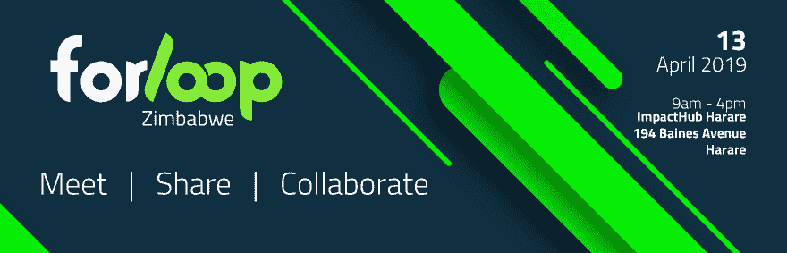
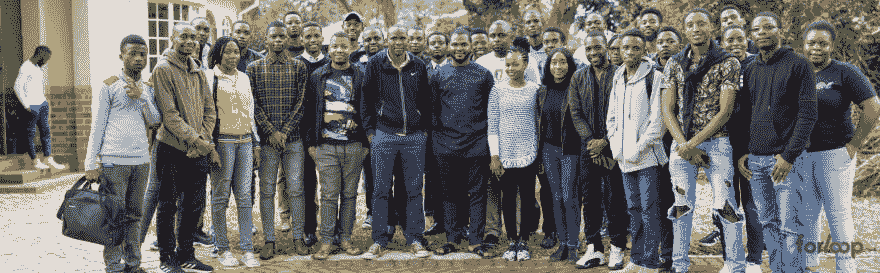
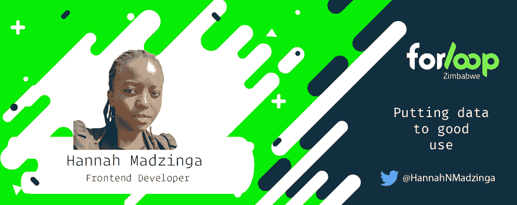
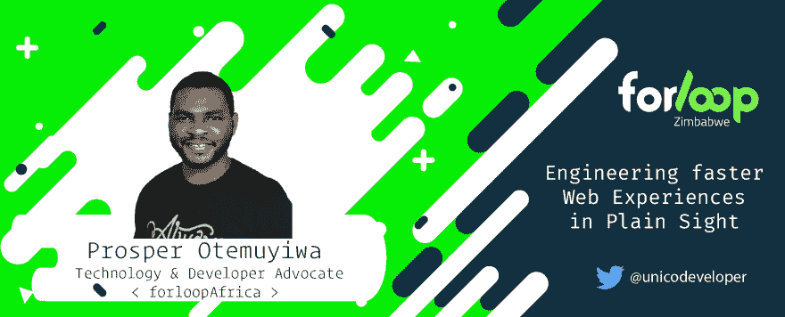
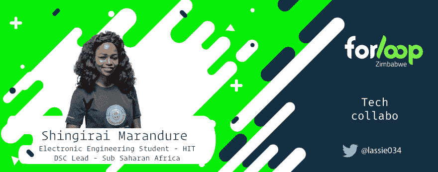
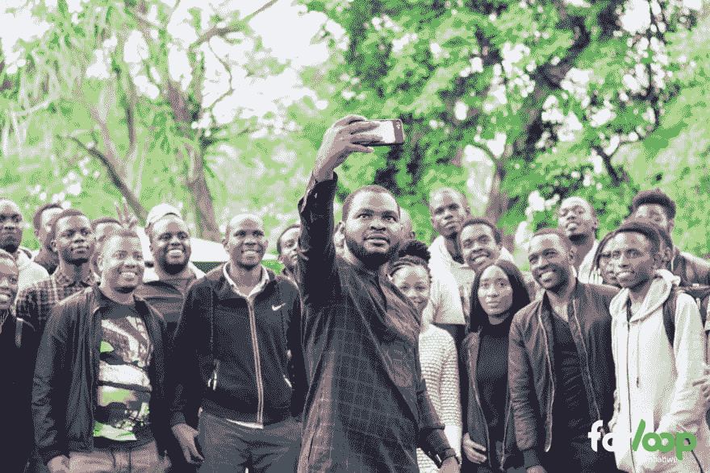

# 一个贫穷的津巴布韦出现了

> 原文：<https://dev.to/maffsojah/along-came-forloopzimbabwe-2gdk>

## 来自南非的新篇章

> 没有什么比一个社区发现它所关心的东西更能推动变革的了
> 
> > 玛格丽特·j·惠特利

建立社区文化，学会互相倾听，分享知识，共同建设。从一群对知识如饥似渴、对成功充满热情、渴望展现最佳状态的人身上，我们可以学到很多东西。

欢迎来到***[forloop 津巴布韦！！](https://forloopzim.co.zw)***

## 见面、分享、协作

 * [【津巴布韦】2019 年 4 月 13 日在津巴布韦哈拉雷举办的首次活动](https://twitter.com/hashtag/forloopZimbabwe?src=hash)*

相遇、分享、协作从# forloop 津巴布韦首次活动中的一个单纯的主题，发展成为津巴布韦科技界的一种准则、一种价值观和一项有价值的事业。它始于对 Zim 技术社区的发展、他们多年来面临的问题以及解决这些问题的解决方案的大量讨论。

> > "… So you are good at JavaScript, he is good at social media marketing, and she is a big data expert. How can we help each other get good jobs, work remotely, or build life-changing projects? "

会面(远程或物理)、共享(建议、知识、资源，甚至联系人)和协作(构建解决方案、教授他人)。这些成为了 for #津巴布韦成长社区的核心价值观。作为第一项活动，主题必须是包容性的，不要太技术性，并且与非洲发展组织的核心价值观和目标相关。

## 处女事件…

*[# forloop 津巴布韦](https://twitter.com/hashtag/forloopZimbabwe?src=hash)首次活动出席者 2019 年 4 月 13 日— ImpactHub Harare*

如果有人预言了组织# for loop 津巴布韦处女活动的整个经历，我想我不会同意😅。这段经历成了我 2019 年做过的最有压力最刺激的事。让许多人聚在一起、建立网络、获得场地、食物以及其他东西的想法似乎是一个不可能的任务，直到发布的那一天。这是一个为期一天的活动，有 5 场演讲，不幸的是，来自赞比亚的第 6 位演讲者 Olivier J.M .未能到场。

我们的演讲者来自不同的技术领域，这使得他们的会议很有趣。每个讲座都有一个问答环节，并有 15 分钟的休息时间进行交流，因为活动的主要目标是会见不同的参与者并找到共同点。

## 演讲者

#### 布莱顿·穆科瑞拉——《从旧到区块链》

布莱顿谈到了如何利用你从编程基础中学到的技能成为一名区块链开发者。

在 Twitter 上关注布莱顿，查看他的谈话

#### Hannah Madzinga—“善用数据”

Hannah 谈到了我们如何充分利用已经掌握的数据。

在推特上关注汉娜，检查她的谈话

#### Prosper Otemuyiwa——“在众目睽睽之下设计更快的网络体验”

Prosper 谈到了为各个地区的用户构建快速加载 web 体验的即时待办规则和最佳策略。

在 Twitter 上关注 Prosper 并查看他的演讲

#### Shingirai Maran dure—“科技协作”

Shingirai 鼓励开发者在项目上合作，并呼吁增加和改善女性在技术领域的参与。

在推特上关注辛吉，查看她的谈话

#### Lennex Zin yando—“遥远的可能:如何在丛林中工作”

Lennex 就如何让求职过程不那么痛苦，同时让自己成为更好的开发人员以获得工作机会给出了一些建议。

在 Twitter 上关注 Lennex，查看他的演讲

## 午后秀

这是一个下午的会议，交流，提问和理解为非洲社区带来的价值观。本次会议成功引导了讨论，回答了人群中的不同问题，同时谈论了非洲贫困的根源以及社区的未来。

他收到了各种各样的问题，包括他的技能、非洲、科技行业的女性、远程工作以及人们最喜欢的尼日利亚人和加纳人的比较(有视频证据)😂。他甚至进一步将尼日利亚的 jollof 与 Laravel 代码进行了比较，因为它的呈现方式。我们还收到了一些在 Twitter 上直播活动的人提出的问题。

## 接下来是什么？

首次活动显示了人们有多么喜欢作为一个社区工作，人们对发展的最佳实践有多么好奇，以及他们愿意分享和相互学习。#forloop 津巴布韦的目标是将津巴布韦的科技社区放在世界地图上，同时与不同国家的其他 forloopAfrica 分会合作。我们相信我们可以从学习和教导他人中成长。这将通过更多的活动、训练营或黑客马拉松来实现。

*[Prosper Otemuyiwa](https://twitter.com/unicodeveloper)合影自拍*

Cloudinary 使首次参赛的***for loop 津巴布韦*** 成为可能，如果我们得到赞助，更多的比赛将成为可能。***for loop 津巴布韦*** 赞助套餐可在[for loop 津巴布韦网站](https://forloopzim.co.zw)上获得。

特别要感谢 [Remy Muhire](https://twitter.com/kenessarjr) 推荐我们创建一个 for loop 津巴布韦， [Prosper Otemuyiwa](https://twitter.com/unicodeveloper) 帮助我们创建了这个美好的社区并飞往津巴布韦参加这个活动， [Lennex Zinyando](https://twitter.com/zinyando) 和[Adonis rumb wer](https://twitter.com/thedoer_)共同组织了这个活动，感谢所有的发言者， [ImpactHub Harare](https://twitter.com/ImpactHubHarare) 接待了我们、与会者和参加 forloopAfrica 的人们。

这是因为；

> > "Alone, we can do very little; Together, we can do so much. "
> > 
> > > Helen Keller

✌🏾