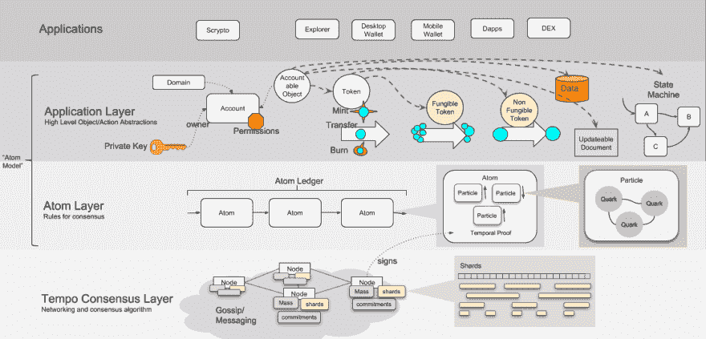
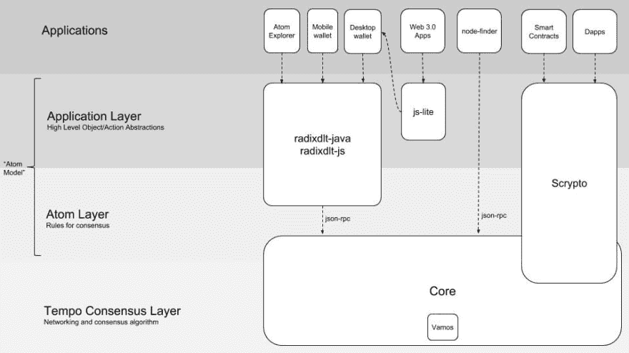
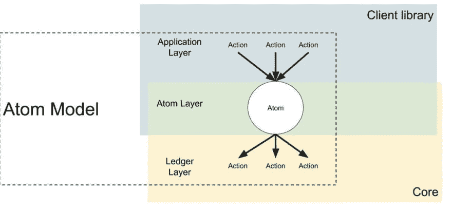

# 基数分类帐上的 Alpha 网络体系结构

> 原文：<https://dev.to/radixdlt/alpha-network-architecture-of-the-radix-ledger-1a40>

# 简介

当前 Radix Alpha 网络可帮助您:

-存储财富，
-促进货币交易或转移价值，
-记录不可变的数据，如消息、散列或元数据。

Radix 网络中的每个节点都公开了一个 [JSON-RPC](https://www.radixdlt.com/post/json-rpc-vs-rest) 接口，以便使用客户端库与应用层进行交互。Radix 已经开源了这些客户端库，以便从 Java、Kotlin 和 JavaScript 开始，用您喜欢的编程语言轻松构建去中心化应用程序。

# 技术架构

# 逐层抽象

# 按层编码

# 原子模型

如果这是您第一次在 Radix Alpha 网络上构建分散式应用程序，您可以从我们的客户端库开始:

- [Java 库](https://docs.radixdlt.com/alpha/develop/java-client-library-guide)
- [Kotlin 库](https://docs.radixdlt.com/alpha/develop/kotlin-client-library-guide)-
-[JavaScript 库](https://docs.radixdlt.com/alpha/develop/javascript-client-library-guide/quick-start)

# 加入 Radix 社区

[电报](https://t.me/radix_dlt)普通聊天
[不和](https://discord.gg/7Q7HSZZ)开发者聊天
[Reddit](https://reddit.com/r/radix) 普通讨论
[论坛](https://forum.radixdlt.com/)技术讨论
[推特](https://twitter.com/radixdlt)发布公告
[电子邮件](https://radixdlt.typeform.com/to/nyKvMV)简讯每周更新
邮件[hello@radixdlt.com](//hello@radixdlt.com)普通查询