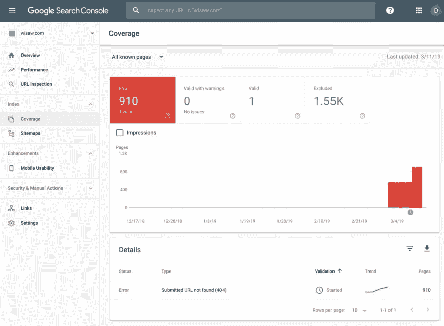

# 启动新网站时，请始终使用谷歌的 URL 检查工具。

> 原文：<https://dev.to/dmitryame/always-use-google-s-url-inspection-tool-when-launching-a-new-site-55l1>

最近，我推出了“我所看到的”网站，该网站旨在确保通过我的移动应用程序提供的所有内容都被谷歌机器人编入索引，并且可以被搜索和找到。随着时间的推移，移动应用程序设法积累了近 3000 条内容。这些帖子没有特别的主题——真的是关于任何事情和任何事情。因此，希望有人偶然发现这个网站，从而导致下载手机应用程序的可能性很高。

我构建的是一个非常简单的用 reactJS 编写的单页应用程序(SPA)。技术选择是自然的——相应的移动应用程序是用反应式语言编写的。我的意图是测试 React 背后的“学习一次，到处写”的口号。每个页面都包含一张图片、一些评论、浏览提要的“下一页”和“上一页”按钮，以及促使人们下载移动应用的应用商店链接。这么简单的应用程序怎么可能出错呢？嗯，事实上，我学到了很多东西，我希望我在开始之前就知道这些东西——这会节省我很多时间和悲伤。在这篇文章中，我将分享我的一些经历。希望这将为其他开发者节省一些时间，他们即将推出下一个杀手级应用，这将改变世界。

所以，我只是启动了我的应用程序，除了坐着等待新的流量之外，没有其他事情可做。

谷歌表示，抓取和索引你网站上的页面可能需要 4 天到 4 周的时间。4 天和 4 周之间有巨大的差别，我猜没有人真正知道谷歌如何决定你的网站何时会被抓取。在我的情况下，我每天都访问谷歌搜索控制台，每天几次，持续了至少两周。终于有一天，谷歌开始报告它试图抓取。不幸的是，Goggle 试图抓取的所有页面都以“404 未找到”失败。

这是一场灾难——当发现我的网站的用户蜂拥而至时，我已经做好了解决可伸缩性问题的心理准备。不幸的是，网站上线两周后，什么也没发生，我感觉自己被骗了。那是我第一次尝试使用谷歌搜索控制台提供的 URL 检查工具。事实上，根据 URL 检测工具，除了主页，我网站上的每个 URL 都返回 404。虽然，当我在浏览器中直接找到网址时，它显示的是正确的内容，一切似乎都正常工作。

发生了什么事？像往常一样，在这种情况下，我卷起袖子，开始挖掘潜在的解决方案。我找到的与我的问题相关的大多数搜索结果都在谈论 Google 如何无法抓取 spa，正确的解决方案是编写同构应用程序，它将支持客户端和服务器端的渲染。有点出乎意料。看起来我不得不学习另一个概念，选择另一个框架，并且，基本上，再一次重写我的简单应用程序。我发现了一些看起来很有希望的东西——一个名为 Next 的 React 的服务器端渲染 NPM。我对 Next 了解得越多，我就越喜欢它，我就越意识到——尽管它很简单，但对我来说，让它起步将是一项重大的努力。我真的不想再重写了。当我年轻的时候——我可能会那样做(重写)，但多年的经验告诉我，一个好的开发人员是懒惰的——在研究上花更多时间，但最终找到最简单的可能解决方案。

我确实碰到了一些关于谷歌爬行温泉的链接。不是很多——大多数人仍然坚持认为我需要支持服务器端渲染，但这足以让我挑战自己找到一个不需要重写的解决方案。

接下来，我转向了老式的 Chrome 开发工具。当导航到我的应用程序的入口点时，它被称为[我所看到的](https://www.wisaw.com)，正如所料，我注意到大量的网络请求，最终页面会正确呈现。当我通过点击“下一页”或“上一页”链接浏览网站时，一切似乎都像预期的那样工作，没有“404 未找到”错误。然而，谷歌的 URL 检查工具坚持认为每个页面都返回 404。我仔细检查了网址，甚至试图复制粘贴它们，以尽量减少出错的可能性。总是同样的结果——页面在浏览器中看起来不错，但是 Google URL 检查失败，出现 404。我真的开始怀疑，也许这是谷歌的 bug，我应该等它被修复？然后，我没有通过点击链接来浏览网站，而是尝试直接进入一个特定的 URL，并使用 Chrome Dev 工具对其进行分析。我无法相信我所看到的——第一个网络请求会以“404 not found”失败，但是，不知何故(我仍然不知道 Chrome 是如何做到这一点的),它仍然会下载所有必要的 JS，执行它，加载并呈现我所请求的页面。

事实证明，谷歌网址检查工具一直是正确的。因此，接下来，我必须弄清楚为什么，当直接访问 URL 时，我得到 404，但浏览器仍然正确地呈现它。我继续了解 SPA 应用程序的工作原理，答案就在表面上——SPA 只有一个入口点，这是一个主页 URL，它加载所有的 Java 脚本，执行它，从这一点开始，当通过单击页面上的链接进行导航时，它只是替换 DOM 片段，以及操纵浏览器 URL 和历史记录，但从不重新加载整个页面。很明显，我在学习 React 时就知道这些，但这是一次很好的复习。

坦白地说，我无法找到任何有意义的解释，为什么浏览器仍然呈现我的 URL，即使它不能加载必要的 Java 脚本。我唯一的猜测是，它能够使用 JS 的缓存版本，但我可能是错误的(如果有人能向我解释为什么以及它是如何工作的——请伸出手来分享)。

我找到的解决方案有点反直觉，但非常简单。我必须配置我的 web 服务器总是返回 200，即使它应该是 404。此外，当它遇到对服务器上找不到的资源的请求时，它总是返回/index.html

当我将这一更改应用到 web 服务器配置时，一切都开始按预期工作了。谷歌网址检查工具很高兴。当通过链接导航到它们或者直接进入它们的 URL 时，页面被加载，Web Dev 工具不再报告初始页面加载的 404。

我第一次做 SPA 已经快一个月了。吸取的教训是——如果我一启动应用程序就尝试 Google URL Inspection(正式名称为“Fetch as Google”)，如果我从一开始就信任它，而不是试图说服自己 Google 中的潜在 bug，我就可以将等待时间至少减少一半。

现在已经快 4 周了——仍然在等待潮水般的请求，这样我终于可以开始解决预期的可伸缩性问题了...