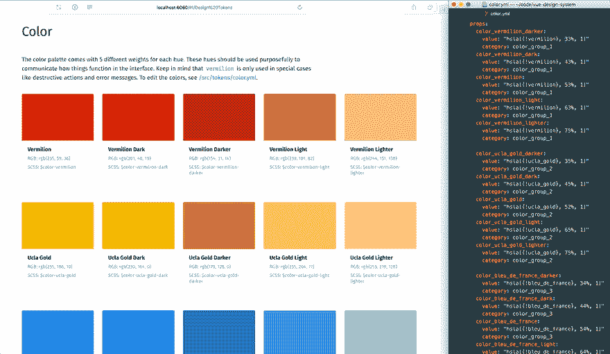
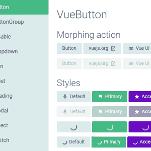
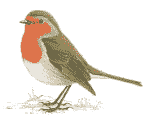

# 惊人的 Vue.js 开源项目列表

> 原文：<https://dev.to/alicannklc/amazing-vue-js-open-source-project-list-1ih8>

[Vuepress](https://github.com/vuejs/vuepress)
极简 Vue 供电的静态现场发电机

[vue 化](https://github.com/vuetifyjs/vuetify)
材料构件框架为 Vue.js 2

自举+视图

[Vue 材质](https://github.com/vuematerial/vue-material)
材质设计为 Vue.js

[Vuesax](https://github.com/lusaxweb/vuesax)
新框架组件为 Vue.js 2

一个用于网站界面的响应式 Vue UI 库

[Vue 设计系统](https://github.com/viljamis/vue-design-system) 
用 Vue.js
 构建 UI 设计系统的开源工具

[Vue UI 框架](https://github.com/vuejs/ui)
官方 Vue 组织应用的 UI 组件

[Proppy](https://github.com/fahad19/proppy)
UI 组件的功能道具构成(react . js&vue . js)

[Gridsome](https://github.com/gridsome/gridsome)
一个 Vue.js 驱动的现代网站生成器

[Vue api 查询](https://github.com/robsontenorio/vue-api-query)
优雅简单的方式构建请求 REST API

[Vuex pathify](https://github.com/davestewart/vuex-pathify)
Vue / Vuex 插件为 Vuex 商店提供统一的路径语法
