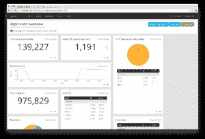

# Graylog 简介

> 原文：<https://dev.to/klauenboesch/an-introduction-to-graylog-79o>

最近在[版本 2.5](https://www.graylog.org/post/announcing-graylog-v2-5) 中发布的 Graylog 是众所周知的 ELK stack (Elasticsearch，Logstash，Kibana)的替代。与 ELK-stack 相比，Graylog 使用 MongoDB 作为设置和认证的存储后端，并利用 Elasticsearch 作为文档存储。

这篇文章是详细探索 Graylog 系列文章的一部分。敬请期待！

<figure> 

<figcaption>示例仪表板如 graylog 文档所示。</figcaption>

</figure>

如果你正在寻找一个易于使用的应用程序，它非常强大并且可以很好地定制——除此之外，还有[开源](https://github.com/Graylog2/graylog2-server)——gray log 可能是你的解决方案。此外，与“经典的”ELK 堆栈相比，Graylog 提供了一个成熟的认证后端，还允许与任何 LDAP 目录(例如，ActiveDirectory)集成。

Graylog 的关键概念是输入，它只不过是“如何接收消息”的定义。它支持众所周知的 Syslog 格式和 GELF 格式，后者是由 Graylog 自己维护的 JSON 定义。GELF 通过 UDP 和 TCP 得到支持，这使得 Graylog 非常强大——通过互联网传递日志消息根本不是问题，因为 TCP 连接确实支持加密传输的 TLS。Graylog 也可以很容易地配置成一个中继，将任何(或符合模式的消息)转发给另一个实例。

输入被路由到流中，流表示消息的集合。可以将流配置为由匹配某个模式(例如正则表达式)的消息填充。如果您需要从日志消息中提取信息，提取器可以提供帮助。提取器允许通过应用正则表达式从消息中提取数据，并将数据转换成各种格式，如日期或 IP 地址。

如果这还不够，Graylog 提供了一个叫做管道的概念。管道基本上允许您对如何处理传入日志消息的自定义复杂流程进行“编码”。这可以包括修改和路由消息。一个典型的例子是，基于 IP 地址将消息路由到流中，但是在存储之前必须从消息中删除 IP 地址(例如，任何 GDPR 遵从性)。

我们已经在多个项目中实施了 Graylog，我们很乐意在您的下一个项目中帮助您，该项目需要一个可扩展的、集中的和强大的日志应用程序。

[格劳介绍](https://globalelements.ch/2019/01/07/an-introduction-to-graylog/)的投稿首先出现在[环球元素有限公司](https://globalelements.ch)上。