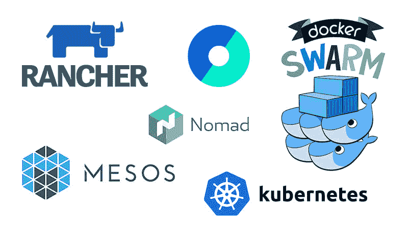
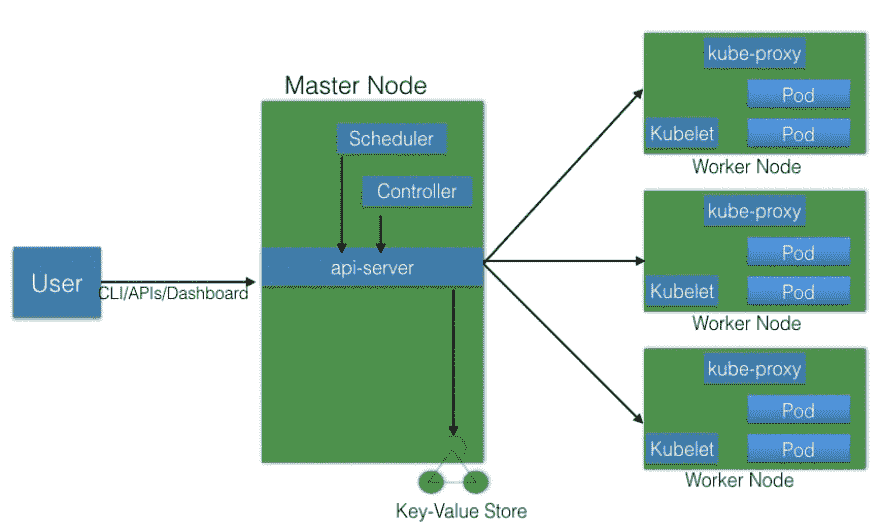

# 库伯内特人简介

> 原文：<https://dev.to/_mertsimsek/an-introduction-to-the-kubernetes-ib5>

在这篇文章中，我的目标是得到库伯涅茨的目的，理解哲学。如果我需要告诉一点，所有的方式导致依赖。想象一下，你有一个软件项目。所有的阶级都是互相依赖的。此时，**依赖注入**可能是解井。让我们从盒子外面看一点。我们来弄一个 Php 项目。我们需要其他的库，其他程序员写的包。是的，你知道答案。**作曲家**是我们最好的解决方案。在说“完美！”事实上，我们还有十几个依赖项。操作系统的服务，可以是 Nginx，Mysql，Rabbitmq，Redis 等。这还没完。直接来说，我们取决于操作系统。另外，网络？解决的办法是为像这些事情，**码头工人**。但是，管理大量的容器还是有一些令人困惑的问题。为此，幸运的是，我们遇到了像 **Kubernetes** 这样的容器编排。

我将简单介绍一下 Kubernetes，并展示哪些问题是可以解决的。

基本上，Kubernetes 就是容器编排。容器编排是确保管理我们的容器。我们能够在一台计算机上运行容器来开发或测试应用程序。然而，当我们进行生产时，我们的优先事项会有所不同。

*   它能承受错误吗？
*   可扩展性。
*   尽可能少地使用机器资源。
*   可以从外部进入。
*   我们能在不停机的情况下更新/回滚吗？

容器编排器是帮助我们实现所有这些的系统。有许多可用的容器编排器。

*   [Docker Swarm](https://docs.docker.com/engine/swarm/)
    它是由 Docker，Inc .提供的容器编排器，是 Docker Engine 的一部分。

*   [Kubernetes](https://kubernetes.io/)
    Kubernetes 由谷歌创立，但现在，它是云原生计算基金会项目的一部分。

*   [Mesos 马拉松](https://mesosphere.github.io/marathon/)
    马拉松是在 Apache Mesos 上大规模运行容器的框架之一。

*   亚马逊 ECS
    亚马逊 EC2 容器服务(ECS)是由 AWS 提供的一项托管服务，用于在其基础设施上大规模运行 Docker 容器。

*   [Hashicorp Nomad](https://www.hashicorp.com/)
    Nomad 是 Hashicorp 提供的容器编制器。

从现在开始，让我们稍微谈一谈 Kubernetes。根据 Kubernetes 网站。顺便说一下，Kubernetes 也被称为 k8s，因为 k 和 s 之间有 8 个字符。

`"Kubernetes is an open-source system for automating deployment, scaling, and management of containerized applications."`

Kubernetes 为容器编排提供了非常丰富的特性。它的一些完全支持的功能。Kubernetes 用 Go 编程语言写的。

*   **自动装箱**
    Kubernetes 根据资源使用情况和限制自动安排集装箱，而不牺牲可用性。

*   **自我修复**
    Kubernetes 自动替换并重新调度来自故障节点的容器。它还会根据现有的规则/策略，终止并重新启动不响应健康检查的容器。

*   **水平扩展**
    Kubernetes 可以根据 CPU 和内存等资源使用情况自动扩展应用程序。在某些情况下，它还支持基于客户指标的动态扩展。

*   **服务发现和负载平衡**
    Kubernetes 将容器集合分组，并通过域名系统(DNS)引用它们。这个 DNS 也被称为 Kubernetes 服务。Kubernetes 可以自动发现这些服务，并在给定服务的容器之间对请求进行负载平衡。

*   **机密和配置管理**
    Kubernetes 可以管理应用程序的机密和配置细节，而无需重新构建相应的映像。有了 secrets，我们可以将机密信息共享给我们的应用程序，而不用像在 GitHub 上那样暴露给堆栈配置。

在我们深入 Kubernetes 之前，我们需要先了解一下**云本地计算基础。**

云本地计算基金会(CNCF)是 Linux 基金会主持的项目之一。CNCF 旨在加速容器、微服务和云原生应用的采用。CNCF 为每个项目提供资源，但与此同时，每个项目继续在其现有的治理结构和现有的维护者下独立运行。

我们将看到 Kubernetes 架构、主节点和工作节点的不同组件、使用 etcd 的集群状态管理以及网络设置要求。我们还会谈到网络，这是由 Kubernetes 使用的。

### 主节点

主节点负责管理 Kubernetes 集群，它是所有管理任务的入口点。我们可以通过 CLI、GUI(仪表板)或 API 与主节点通信。

### 工作者节点

工作节点是一台机器(虚拟机、物理服务器等)。)运行应用程序，并由主节点控制。Pods 被安排在 worker 节点上，这些节点拥有运行和连接它们的必要工具。Pod 是 Kubernetes 中的调度单元。

### 得出结论

我们将在以后的章节中对此进行更深入的探讨。Kubernetes 可能是你最好的解决方案，你应该基本上衡量你的目标。此外，我们将讨论**主节点**和**工作者节点**。因此，在那之后，我们将会遇到令人困惑的话题。