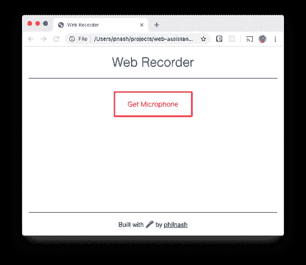
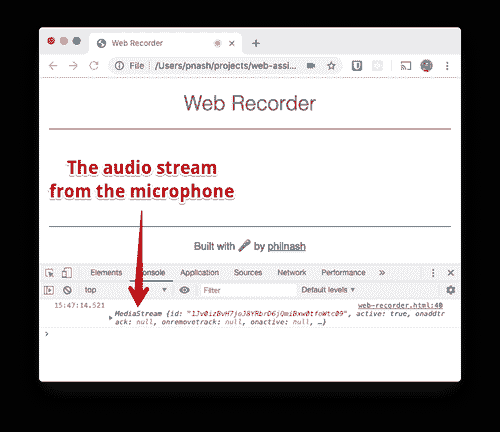
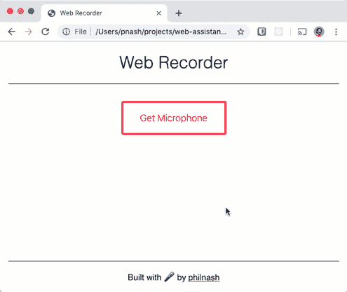

# MediaRecorder API 简介

> 原文：<https://dev.to/twilio/an-introduction-to-the-mediarecorder-api-2k8i>

在网络上，我们可以[从用户的摄像头、麦克风](https://www.twilio.com/blog/2018/04/choosing-cameras-javascript-mediadevices-api.html)和[甚至桌面](https://www.twilio.com/blog/2018/05/screen-capture-in-microsoft-edge.html)捕捉媒体流。我们可以使用这些媒体流通过 WebRTC 进行[实时视频聊天，通过](https://www.twilio.com/docs/video) [MediaRecorder API](https://developer.mozilla.org/en-US/docs/Web/API/MediaStream_Recording_API) ，我们还可以直接在网络浏览器中记录和保存来自用户的音频或视频。

为了探索 MediaRecorder API，让我们用 HTML、CSS 和 JavaScript 构建一个简单的音频记录器应用程序。

## 入门

要构建这个应用程序，我们只需要一个文本编辑器和一个支持 MediaRecorded API 的浏览器。在撰写本文时，支持的浏览器包括 Firefox、Chrome 和 Opera。将这个 API 引入 Edge 和 Safari 的工作也在进行中。

首先，创建一个工作文件夹，保存[这个 HTML 文件](https://github.com/philnash/web-assistant/blob/master/media-recorder/web-recorder-starter.html)和[这个 CSS 文件](https://github.com/philnash/web-assistant/blob/master/media-recorder/web-recorder-style.css)，给我们一个开始。确保它们在同一个文件夹中，并且 CSS 文件被命名为`web-recorder-style.css`。在浏览器中打开 HTML 文件，您应该看到以下内容:

[](https://res.cloudinary.com/practicaldev/image/fetch/s--nR9UYP56--/c_limit%2Cf_auto%2Cfl_progressive%2Cq_auto%2Cw_880/https://s3.amazonaws.com/com.twilio.prod.twilio-doimg/oVQ9H3NH773crqhbdIBTdhkl0zYHy1PmnjSyn_3G5W14TF.width-500.png)

现在让我们来看看 MediaRecorder API。

## 媒体记录器 API

要从 MediaRecorder API 开始，您需要一个 MediaStream。你可以从`<video>`或`<audio>`元素中获取一个，或者通过调用`getUserMedia`来获取用户的摄像头和麦克风。一旦你有了一个流，你可以用它初始化`MediaRecorder`，你就可以开始录制了。

在记录过程中，`MediaRecorder`对象将发出带有记录数据的`dataavailable`事件，作为事件的一部分。我们将监听这些事件，并整理数组中的数据块。一旦记录完成，我们将在一个`Blob`对象中把这些数据块重新组合在一起。我们可以通过调用`MediaRecorder`对象上的`start`和`stop`来控制录制的开始和结束。

让我们来看看实际情况。

### getUserMedia

我们将首先连接一些 UI，并使用第一个按钮来访问用户的麦克风流。在您下载的 starter HTML 底部的`<script>`标记之间，首先注册一个在页面内容加载后运行的事件，然后收集我们将使用的 UI 片段:

```
<script>
  window.addEventListener('DOMContentLoaded', () => {
    const getMic = document.getElementById('mic');
    const recordButton = document.getElementById('record');
    const list = document.getElementById('recordings');

  });
</script> 
```

Enter fullscreen mode Exit fullscreen mode

接下来，我们将检查浏览器是否支持我们正在编写的代码。如果没有，我们将在页面上显示一个错误。

```
<script>
  window.addEventListener('DOMContentLoaded', () => {
    const getMic = document.getElementById('mic');
    const recordButton = document.getElementById('record');
    const list = document.getElementById('recordings');
    if ('MediaRecorder' in window) {
      // everything is good, let's go ahead
    } else {
      renderError("Sorry, your browser doesn't support the MediaRecorder API, so this demo will not work.");
    }
  });
</script> 
```

Enter fullscreen mode Exit fullscreen mode

对于`renderError`方法，我们将用错误消息替换`<main>`元素的内容。在事件侦听器后添加此方法。

```
 function renderError(message) {
      const main = document.querySelector('main');
      main.innerHTML = `<div class="error"><p>${message}</p></div>`;
    } 
```

Enter fullscreen mode Exit fullscreen mode

如果我们可以使用`MediaRecorder`，那么我们现在需要使用麦克风进行记录。为此我们将使用 [`getUserMedia` API](https://developer.mozilla.org/en-US/docs/Web/API/MediaDevices/getUserMedia) 。我们不会马上要求使用麦克风，因为这对任何用户来说都是一种糟糕的体验。相反，我们将等待用户点击按钮来访问麦克风，然后询问。

```
 if ('MediaRecorder' in window) {
      getMic.addEventListener('click', async () => {
        getMic.setAttribute('hidden', 'hidden');
        try {
          const stream = await navigator.mediaDevices.getUserMedia({
            audio: true,
            video: false
          });
          console.log(stream);
        } catch {
          renderError(
            'You denied access to the microphone so this demo will not work.'
          );
        }
      });
    } else { 
```

Enter fullscreen mode Exit fullscreen mode

调用`navigator.mediaDevices.getUserMedia`会返回一个承诺，如果用户允许访问媒体，该承诺将成功完成。由于我们使用现代 JavaScript，我们可以使用`async/await`让这个承诺看起来是同步的。我们声明点击处理程序是一个`async`函数，然后当调用`getUserMedia`时，我们`await`结果，然后继续。

用户可能会拒绝访问麦克风，我们将通过将呼叫包装在一个`try/catch`语句中来处理这个问题。拒绝将导致`catch`块执行，我们将再次使用我们的`renderError`函数。

保存文件并在浏览器中打开它。点击*获取麦克风*按钮。您将被询问是否要访问麦克风，当您接受时，您将看到结果`MediaStream`记录到控制台。

[](https://res.cloudinary.com/practicaldev/image/fetch/s--OG7T50O_--/c_limit%2Cf_auto%2Cfl_progressive%2Cq_auto%2Cw_880/https://s3.amazonaws.com/com.twilio.prod.twilio-doimg/ki7kNEUselR9FFmSiSTF7WYV46Tw_j4CCvkRt7xJ97Uf4D.width-500.png)

### 录音

现在我们有麦克风，我们可以准备我们的录音机。我们将存储一些我们也需要的其他变量。首先是我们将要使用的 MIME 类型，“audio/webm”。这似乎是目前浏览器记录到的最广泛支持的格式。我们还将创建一个名为`chunks`的数组，我们将使用它来存储创建时的部分记录。

[`MediaRecorder`用我们从用户麦克风捕获的媒体流和一个选项对象初始化](https://developer.mozilla.org/en-US/docs/Web/API/MediaRecorder/MediaRecorder)，我们将传递我们之前定义的 MIME 类型。将之前的`console.log`替换为:

```
 try {
          const stream = await navigator.mediaDevices.getUserMedia({
            audio: true,
            video: false
          });
          const mimeType = 'audio/webm';
          let chunks = [];
          const recorder = new MediaRecorder(stream, { type: mimeType }); 
```

Enter fullscreen mode Exit fullscreen mode

现在我们已经创建了我们的`MediaRecorder`,我们需要为它设置一些事件监听器。记录器出于多种不同的原因发出事件。许多都与记录器本身的交互有关，因此您可以在记录器开始记录、暂停、恢复和停止时监听事件。最重要的事件是`dataavailable`事件，它在记录器活动记录时定期发出。事件包含一大块记录，我们将把它放到我们刚刚创建的`chunks`数组中。

对于我们的应用程序，我们将监听`dataavailable`事件收集数据块，然后当`stop`事件触发时，我们将把所有数据块收集到一个 [`Blob`](https://developer.mozilla.org/en-US/docs/Web/API/Blob) 中，然后我们可以使用一个`<audio>`元素并重置`chunks`的数组。

```
 const recorder = new MediaRecorder(stream, { type: mimeType });
           recorder.addEventListener('dataavailable', event => {
             if (typeof event.data === 'undefined') return;
               if (event.data.size === 0) return;
               chunks.push(event.data);
             });
           recorder.addEventListener('stop', () => {
             const recording = new Blob(chunks, {
               type: mimeType
             });
             renderRecording(recording, list);
             chunks = [];
           }); 
```

Enter fullscreen mode Exit fullscreen mode

我们将很快实现`renderRecording`方法。我们只需要再做一点工作来启用一个按钮来开始和停止记录。

我们需要取消隐藏录音按钮，然后当它被点击时，根据录音机本身的状态开始或停止录音。这段代码看起来像这样:

```
 const recorder = new MediaRecorder(stream, { type: mimeType });
           recorder.addEventListener('dataavailable', event => {
             if (typeof event.data === 'undefined') return;
               if (event.data.size === 0) return;
               chunks.push(event.data);
             });
           recorder.addEventListener('stop', () => {
             const recording = new Blob(chunks, {
               type: mimeType
             });
             renderRecording(recording, list);
             chunks = [];
           }); 
```

Enter fullscreen mode Exit fullscreen mode

为了完成这个小应用程序，我们将把录音呈现到`<audio>`元素中，并提供一个下载链接，这样用户就可以将他们的录音保存到桌面上。这里的关键是我们可以使用`URL.createObjectURL`方法将我们创建的`Blob`转换成一个 URL。然后这个 URL 可以被用作一个`<audio>`元素的`src`和一个锚点的`href`。为了让锚点下载文件，我们设置了`download`属性。

这个函数主要是创建 DOM 元素，并根据录制的时间生成一个文件名。将其添加到您的`renderError`函数下面。

```
 function renderRecording(blob, list) {
    const blobUrl = URL.createObjectURL(blob);
    const li = document.createElement('li');
    const audio = document.createElement('audio');
    const anchor = document.createElement('a');
    anchor.setAttribute('href', blobUrl);
    const now = new Date();
    anchor.setAttribute(
      'download',
      `recording-${now.getFullYear()}-${(now.getMonth() + 1).toString().padStart(2, '0')}-${now.getDay().toString().padStart(2, '0')}--${now.getHours().toString().padStart(2, '0')}-${now.getMinutes().toString().padStart(2, '0')}-${now.getSeconds().toString().padStart(2, '0')}.webm`
    );
    anchor.innerText = 'Download';
    audio.setAttribute('src', blobUrl);
    audio.setAttribute('controls', 'controls');
    li.appendChild(audio);
    li.appendChild(anchor);
    list.appendChild(li);
  } 
```

Enter fullscreen mode Exit fullscreen mode

[](https://res.cloudinary.com/practicaldev/image/fetch/s--apg5AJzO--/c_limit%2Cf_auto%2Cfl_progressive%2Cq_auto%2Cw_880/https://s3.amazonaws.com/com.twilio.prod.twilio-docs/original_images/9dpCqwpYg0gxuPp8SGEy0WMYsZXkDr4_hi_R68Hrz37qNxuJzwTP2Balg71Ds4AfZEDdRLltwbIajw)

## 试探一下

在网络浏览器中打开页面，点击*获取麦克风*按钮。接受权限对话框，然后单击开始录制。为自己录制一条消息，并从页面上回放。

### WebM 文件

如果你下载了你的录像，你可能会发现你没有能够播放 WebM 文件的媒体播放器。WebM 是一种音频和视频的开源格式，但是它主要由浏览器支持。如果你有 [VLC 播放器](https://www.videolan.org/vlc/index.html)，你很可能可以播放音频，否则你可能想使用像 [convertio](https://convertio.co/webm-mp3/) 这样的在线工具将其转换为 MP3 或 WAV 文件(或者如果你觉得大胆，在你的终端中使用 [ffmpeg](https://ffmpeg.org/) )。

## 你的浏览器现在是一个记录器

API 是浏览器的一个强大的新功能。在这篇文章中，我们看到了它录制音频的能力，但它不仅仅停留在那里。目前应用程序不保存音频文件，所以页面刷新会丢失它们。你可以用 IndexedDB 保存它们或者把它们发送到服务器。您还可以播放录音，想象在录音之前通过 Web Audio API 传递音频。如果你不喜欢 WebM 格式，你可以考虑在前端重新编码音频，尽管这可能是 WebAssembly(或你的服务器)的工作。

如果你想试试这篇文章中的代码，你可以看看一个现场演示。所有代码都可以在这个 [GitHub repo](https://github.com/philnash/web-assistant/tree/master/media-recorder) 中获得，你也可以在 [Glitch](https://glitch.com/~web-recorder) 上[重新混合这个项目。](https://glitch.com/~web-recorder)

让我知道你对`MediaRecorder` API 的看法以及你可以用它做什么。点击下面的评论或者在推特上给我留言，地址是 [@philnash](https://twitter.com/philnash) 。