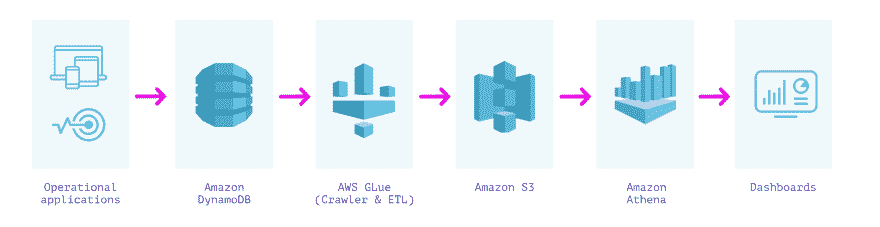
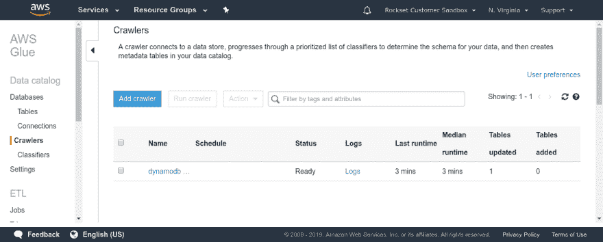
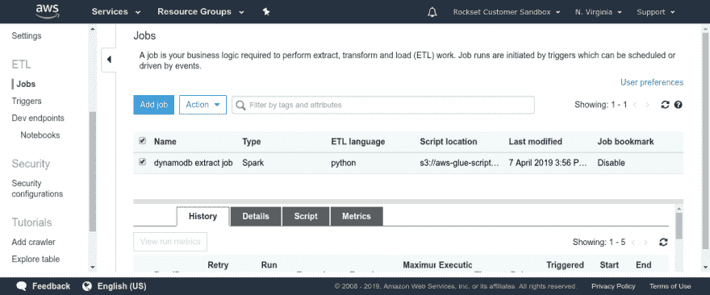
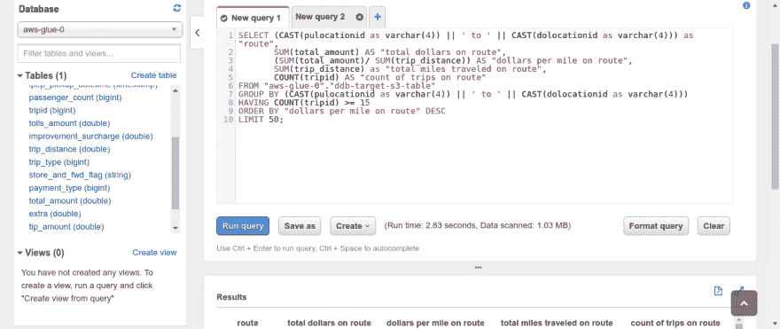
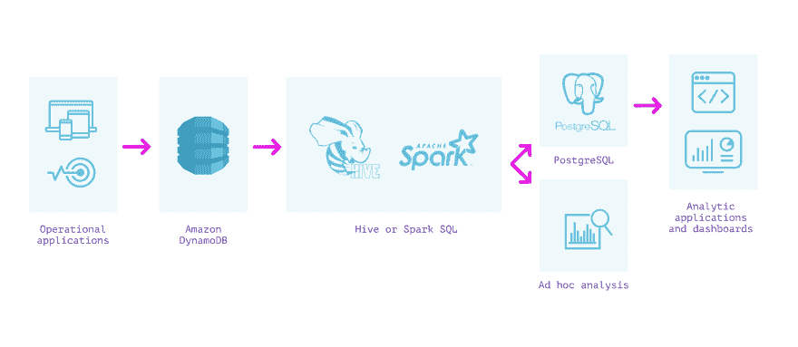
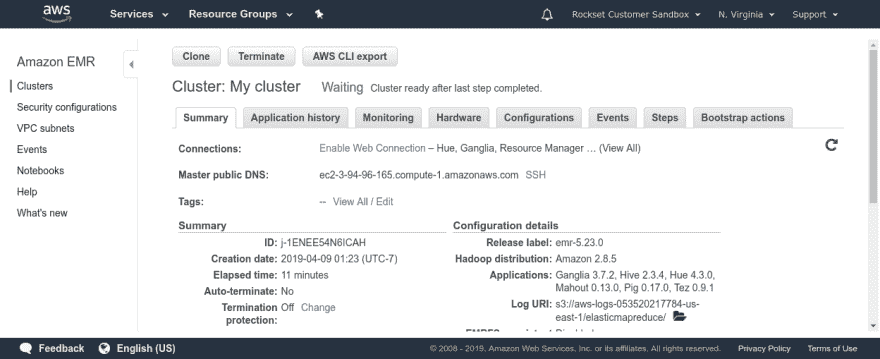

# DynamoDB 分析:Athena、Spark 和 Elastic 的比较

> 原文：<https://dev.to/rocksetcloud/analytics-on-dynamodb-comparing-athena-spark-and-elastic-19b7>

*作者为[阿尼鲁德·拉马纳森](https://www.linkedin.com/in/anirudhrx/)T3】*

在这篇博客中，我比较了 DynamoDB 上的实时分析选项——Athena、Spark 和 Elastic——在设置、维护、查询能力和延迟方面的便利性。其中一些选项对 SQL 分析的支持有限。我还评估了它们各自最适合的用例。

开发人员经常需要对 Amazon DynamoDB 中的数据进行快速分析查询，以实现业务和应用程序功能的实时视图，如个性化和实时用户反馈。然而，作为一个为事务处理而优化的运营数据存储，DynamoDB 并不适合提供实时分析。在 Rockset，我们最近增加了对创建集合的支持，这些集合[从 Amazon DynamoDB](https://docs.rockset.com/amazon-dynamodb/) 中提取数据——这基本上意味着您可以[在 DynamoDB 表上运行快速 SQL](https://rockset.com/blog/running-fast-sql-on-dynamodb-tables/)而无需任何 ETL。作为这项工作的一部分，我花了大量时间评估开发人员用来对 DynamoDB 数据进行分析的方法，并根据用例了解哪种方法最适合，发现 Athena、Spark 和 Elastic 各有利弊。

自 2012 年推出以来，DynamoDB 一直是云中最受欢迎的 NoSQL 数据库之一。它是广告技术、游戏、物联网和金融服务中许多现代应用的核心。[与 PostgreSQL 等传统 RDBMS](https://docs.aws.amazon.com/amazondynamodb/latest/developerguide/SQLtoNoSQL.html) 不同，DynamoDB 可以水平扩展，因此不需要仔细的容量规划、重新共享和数据库维护。虽然像 DynamoDB 这样的 NoSQL 数据库通常具有出色的伸缩特性，但是它们只支持有限的一组集中于在线事务处理的操作。这使得直接对它们进行分析变得困难。

为了支持分析查询，开发人员通常将大量不同的系统与 DynamoDB 结合使用。在接下来的小节中，我们将探索其中的一些方法，并从设置的容易程度、维护、查询能力、延迟以及它们适合的用例等方面对它们进行比较。

如果您希望支持分析查询而不会遇到令人望而却步的扫描成本，那么您可以利用 DynamoDB 中的二级索引，它支持有限类型的查询。然而，对于大多数分析用例来说，将数据从 DynamoDB 导出到不同的系统(如 Athena、Spark、Elastic 或 Rockset，如下所述)是具有成本效益的，因为它们允许您以更高的保真度进行查询。

### **DynamoDB +胶水+ S3 +雅典娜**

一种方法是将 DynamoDB 中的数据提取、转换并加载到亚马逊 S3 中，然后使用类似 Amazon Athena 的服务对其进行查询。我们可以使用 AWS Glue 来执行 ETL 过程，并在 S3 创建 DynamoDB 表的完整副本。

Amazon Athena 希望提供一个模式，以便能够对 S3 的数据运行 SQL 查询。DynamoDB 是一个 NoSQL 存储，对存储的文档没有固定的模式。因此，我们需要提取数据，并根据 DynamoDB 表中观察到的数据类型计算一个模式。AWS Glue 是一个完全托管的 ETL 服务，让我们可以做到这两点。我们可以使用 AWS Glue 提供的两个功能——爬虫和 ETL 作业。Crawler 是一种连接到数据存储(如 DynamoDB)并扫描数据以确定模式的服务。另外，Glue ETL Apache Spark 作业可以将任何 DynamoDB 表的内容以 Parquet 格式扫描并转储到 S3。根据 DynamoDB 表的大小和 DynamoDB 表上的读取带宽，这个 ETL 作业可能需要几分钟到几小时才能运行。一旦这两个过程都完成了，我们就可以启动 Amazon Athena 并对 DynamoDB 中的数据进行查询。

 

整个过程不需要配置任何服务器或容量，也不需要管理基础架构，这是非常有利的。使用 Glue 触发器按计划运行，可以很容易地实现自动化。Amazon Athena 可以连接到 Amazon QuickSight 等仪表板，用于探索性分析和报告。Athena 基于 Apache Presto，它支持查询 JSON 中的嵌套字段、对象和数组。

这种方法的一个主要缺点是不能实时或接近实时地查询数据。转储 DynamoDB 的所有内容可能需要几分钟到几小时，然后才能用于运行分析查询。没有增量计算来保持两者同步——每次加载都是全新的同步。这也意味着亚马逊 Athena 中正在运行的数据可能会过时几个小时。

如果我们的 DynamoDB 数据包含跨不同项的混合类型的字段，ETL 过程也会丢失信息。Glue 爬行 DynamoDB 时会推断字段类型，检测到的主要类型将被指定为列的类型。尽管 Athena 中有 JSON 支持，但它需要一些 DDL 设置和管理来将嵌套字段转换成列，以便有效地运行查询。当 DynamoDB 中的数据结构发生变化时，还需要做一些工作来维护 DynamoDB、Glue 和 Athena 之间的同步。

* * *

**优势**

*   所有组件都是“无服务器”的，不需要配置基础架构
*   易于自动化的 ETL 管道

**缺点**

*   数小时的高端到端数据延迟，这意味着数据陈旧
*   查询延迟从几十秒到几分钟不等
*   模式实施可能会丢失混合类型的信息
*   如果源中的数据结构发生变化，ETL 过程可能需要不时地进行维护

* * *

对于那些不需要查询最新数据，而是可以使用稍微旧一点的快照的仪表板和分析，这种方法可以很好地工作。Amazon Athena 的 SQL 查询延迟为几秒到几分钟，加上 ETL 过程的端到端延迟很大，这使得这种方法不适合在 DynamoDB 上构建操作应用程序或实时仪表板。

### **DynamoDB +蜂巢/火花**

将整个 DynamoDB 表卸载到 S3 的另一种方法是使用 DynamoDB 的 Hive 集成直接对其运行查询。Hive 集成允许使用 HiveQL 直接查询 DynamoDB 中的数据，Hive QL 是一种类似 SQL 的语言，可以表达分析查询。我们可以通过设置一个安装了 Hive 的 Amazon EMR 集群来做到这一点。

 

一旦我们的集群建立起来，我们就可以登录到我们的主节点，并在 Hive 中指定一个外部表，指向我们要查询的 DynamoDB 表。它要求我们用数据类型的特定模式定义来创建这个外部表。有一点需要注意，Hive 是读取密集型的，DynamoDB 表必须设置有足够的读取吞吐量，以避免它所服务的其他应用程序被饿死。