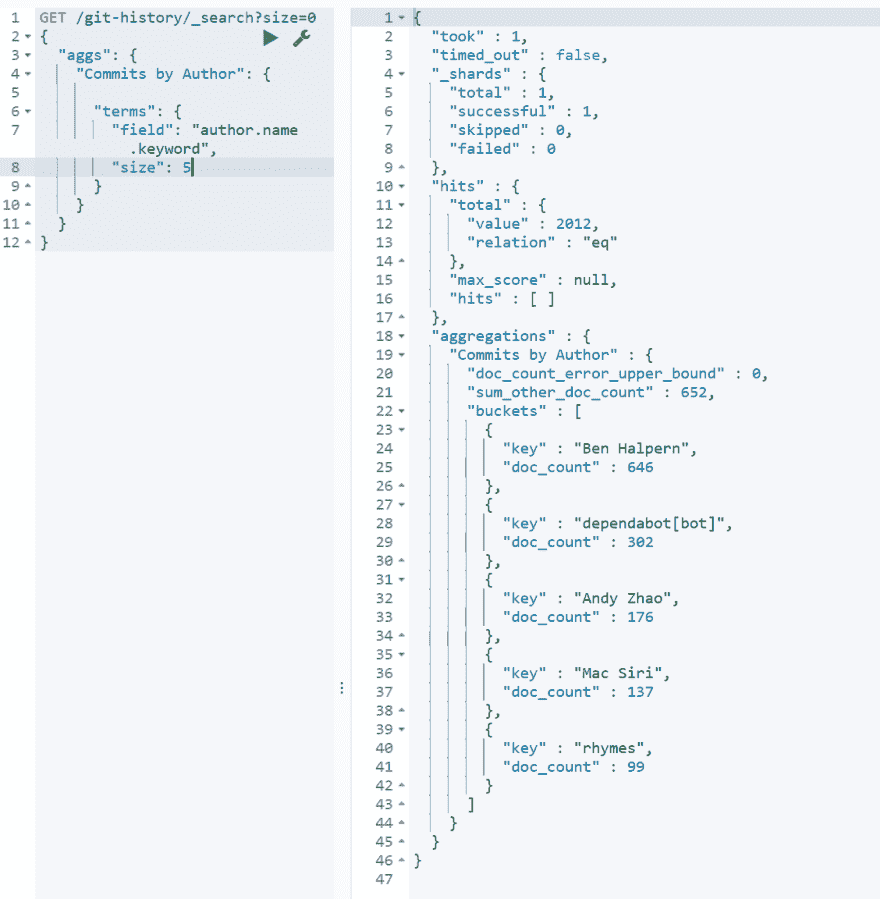
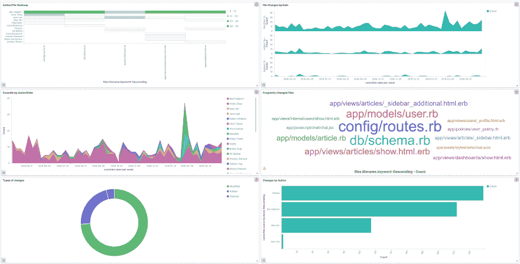

# 使用 Elasticsearch 分析开发人员的 Git 历史记录

> 原文：<https://dev.to/_codingblocks/analyzing-dev-to-git-history-with-elasticsearch-3cn2>

由于缺少 git 格式选项，将 Git 历史记录导入到 Elasticsearch 并不十分有趣，但是一旦你让它工作起来，它会变得非常酷！

我导入的提交有 22 个数据点，包括一个一对多的变更文件列表。我将 git 历史从 [dev .导入到](https://github.com/thepracticaldev/dev.to),看看情况如何。

现在，我可以运行这样的简单查询来查看每个贡献者提交了多少次:

这很好，但我更喜欢可视化的东西，所以我在 [Kibana](https://www.elastic.co/products/kibana) 中组装了一个简单的仪表板。

这是我整理的图表截图。我可以在控制面板顶部应用过滤器和搜索，这将影响所有图表。

例如，我可以查看 Ben Halpern 在过去 90 天内提交的涉及“Algolia”的内容。

观看视频，了解更多可视化效果:

[https://www.youtube.com/embed/ejeHzxOBiOQ](https://www.youtube.com/embed/ejeHzxOBiOQ)

很酷吧？

## 结论

最终，我想花一些时间清理导入过程，使它更容易运行，但现在我打算花一些时间探索我自己的几个项目，看看我是否能挖掘出任何有趣的东西。