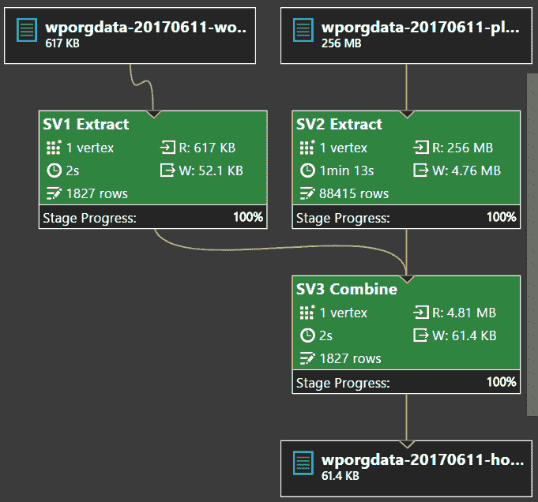

# 用 Azure 数据湖分析 WordPress 钩子的使用

> 原文：<https://dev.to/nabsul/analyzing-wordpress-hook-usage-with-azure-data-lake-nb0>

注意:我在 2017 年写了这篇文章，所以请记住，代码可能需要更新，Azure 价格等内容可能已经发生了变化。

WordPress 提供了大量的钩子，允许插件扩展和修改它的行为。几个月前，我很好奇这些挂钩中哪些比较流行，哪些几乎没用过。我也在寻找一个借口给微软的数据湖分析一个旋转。U-SQL 看起来特别有吸引力，因为它带回了在 Bing 上处理 Pb 级数据的美好回忆。

考虑到这一点，我开始构建一些工具来计算 WordPress 钩子的使用情况。把它分解成更小的步骤，我想到了:

*   抓取 WordPress.org 上所有已发布的插件
*   提取每个插件使用的钩子
*   提取 WordPress 挂钩列表
*   对于每个 WordPress 钩子，计算它的用法

在技术方面，我为这个项目设定了以下目标:

*   代码应该在 C#和 U-SQL 开发
*   项目应该使用。NET 核心，所以它是跨平台的(Windows，Linux，Mac)
*   该项目应该可以在 Visual Studio、VS 代码或命令行中使用

在这篇文章中，我将讨论一般的方法和算法。关于本质细节，你可以在这里查看源代码:[https://github.com/nabsul/WordPressPluginAnalytics](https://github.com/nabsul/WordPressPluginAnalytics)。

参见 [README.md](https://github.com/nabsul/WordPressPluginAnalytics/blob/master/README.md) 文件，了解构建和运行代码的说明。

## 抓取插件

我决定抓取[WordPress.org 插件目录](https://wordpress.org/plugins/?s=)来提取所有插件的列表。所有的插件也可以从一个公共的 SVN 库访问，但是有不同的分支和标签文件夹，我觉得这比抓取 html 页面提取每个 zip 文件的官方链接要稍微乏味一些。HtmlAgilityPack 库使得解析 HTML 和提取信息变得非常容易。我用它来解析插件的每个页面，以获得到每个插件页面的链接，然后解析每个插件页面，以获得 zip 文件的 URL。

一旦我有了 zip 文件的 URL，我就把它上传到 Azure Blob 存储。我考虑过跳过这一步，直接处理来自 WordPress.org 的数据，但我觉得这种方法让我可以获得原始数据的稳定快照来进行实验，而不必为了相同的数据重复访问 wordpress.org。

从一个数字海洋液滴开始，按顺序运行该过程需要近 5 个小时，但其中大约 90%的时间都在等待 I/O。因此，在该过程中添加一些并行性是非常有意义的。这是通过并行获取每页所有 12 个插件非常简单地完成的。这使得运行时间缩短到一个多小时。

## 提取数据

现在我有了原始数据，下一步是从中提取有用的信息。我使用了`System.IO.Compression.ZipArchive`来迭代 zip 文件中的每个 PHP 文件。然后，我考虑编写自己的代码来解析每个 PHP 文件，但当我意识到这会变得多么复杂时，我很快放弃了这个想法。于是我四处找了找`Devsense.Php.Parser`。使用这个库，我能够直接处理标记化的数据，避免了自己解析文本的麻烦。

有了这个库，我提取了 PHP 文件中每个钩子的用法和创建。我只计算钩子名称是常量字符串的情况，因为不可能预测像`add_action( "updated_$myvar", ...)`这样的代码的钩子名称。

最终的结果需要是一种可以用 U-SQL 和 Azure Data Lake Analytics 轻松分析的格式。U-SQL 带有内置的 TSV 提取器，所以如果你上传这种格式的原始数据，你不需要定制的 C#代码来处理它。数据湖分析可以自动解压缩 gzip 文件，这是伟大的，因为我的 TSV 文件压缩到大约 10%的未压缩大小。

提取插件需要不到 1 个小时，所以我懒得并行运行部分代码。

## 运行分析

该流程的最后一步是运行一个 U-SQL 脚本来分析数据并生成最终报告。您可以手动上传数据，也可以使用项目中包含的命令行工具上传数据。你应该有两个解压文件:一个用于 WordPress 源代码，一个用于所有插件。最后一步是运行 U-SQL 脚本。同样，您可以手动编辑和提交脚本，或者如果您遵循程序中使用的命名约定，您可以使用命令行工具提交作业。

U-SQL 是一种类似 SQL 的语言。如果您熟悉 SQL，脚本中的代码应该都有意义。从上传的文件中读取原始数据。WordPress 数据由创建的钩子过滤，插件由使用的钩子过滤。使用一个`GROUP BY`语句来计算钩子的使用。WordPress 的钩子和插件使用一个`JOIN`进行交叉引用。该作业的图表如下所示:

## 数据湖分析的成本

这项工作应该需要几分钟的时间来运行，成本约为 0.03 美元(美国)。然而，我从数据湖工作的定价中学到了一些重要的经验。首先，当运行几 GB 的数据时，确保并行度为 1。在小数据集上增加并行性只是浪费金钱。例如，当我以 5 的并行度运行 3 美分的作业时，它只花费了 12 美分。我还怀疑压缩我的数据文件有助于降低工作成本。压缩数据应该意味着更少的数据通过网络传输，这通常会导致更快(更便宜)的工作。

第二点也是更重要的一点是关于在脚本中使用定制代码和库:上传和使用定制代码是可能的。NET DLLs，但是我强烈建议避免这样做，除非绝对必要。我尝试将单个插件 zip 文件上传到 Data Lake 存储器，并使用一个定制的提取器库直接处理 zip 文件并标记 PHP。运行这样一个任务的成本大约是 5 美元。这比处理 TSV 文件的成本高得多，但确实有意义，因为在微软的 Azure 基础设施上进行 Zip 解压缩和 PHP 解析将消耗比单独进行大多数预处理多得多的 CPU 周期。

如您所见，与存储等更简单的服务不同，使用这类服务的成本会因您如何设计数据管道而有很大差异。因此，在确定方法之前，花一些时间研究和仔细考虑这些决定是很重要的。

## 查看结果

运行该脚本的最终结果是一个 TSV 格式的小报告，包含以下信息:

*   钩子名称:钩子的名称(前缀为 action_ 和 filter_ 以区分这两种类型的钩子)
*   插件数量:使用挂钩的插件数量
*   使用次数:钩子被使用的次数

可以将数据导入到电子表格中，以便进一步分析和绘制图表:

*   [https://1drv.ms/x/s!AoNGbuElNYPMjMUVzq5931eX9YzSuA](https://1drv.ms/x/s!AoNGbuElNYPMjMUVzq5931eX9YzSuA)

## 结论

总的来说，我觉得 Azure 数据湖服务肯定有一个学习曲线，但也不是太糟糕。我很好奇这一切是如何在我不太熟悉的 Hadoop 生态系统中完成的。如果有人想尝试在 Hadoop 中复制这些结果，我将非常感谢教程和/或共享的源代码。

这个代码可以很容易地扩展来执行其他类型的分析。例如，查看各种 WordPress 函数和类的用法可能会很有趣。将插件列表减少到最流行的插件，以获得钩子更真实的使用信息，这可能也很有趣。