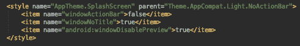
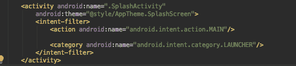
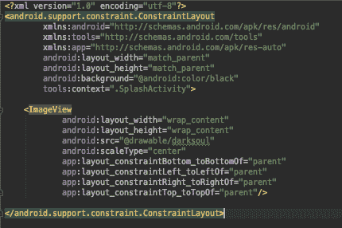
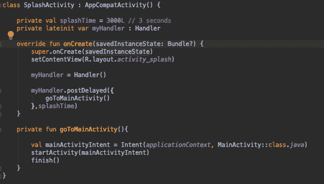

# Android:在你的应用中实现闪屏的简单方法

> 原文：<https://dev.to/artesanoandroid/android-simple-way-to-implement-a-splashscreen-in-your-app-3k0f>

# 首先，什么是闪屏？

闪屏是在移动设备上打开应用程序时出现的屏幕。所以，我们可以说这是用户的第一印象。它通常用于显示应用程序的徽标或与应用程序相关的图像。

在我个人看来，这是实现静态闪屏最简单的方法。

所以，我们来编码吧。

首先，用一个名为 SplashActivity 的空活动创建一个新的 android 项目。

完成后，我们就可以开始实施闪屏了:

## 1。在 res/values 文件夹下的 styles.xml 中创建一个自定义样式。

 

<figure>

<figcaption>图 1 -闪屏主题。</figcaption>

</figure>

## 2。在 AndroidManifest.xml 上，将我们之前创建的主题添加到 SplashActivity。

 

<figure>

<figcaption>图 2 -给 SplashActivity 添加主题。</figcaption>

</figure>

## 3。添加任何你想要的图像到 drawable 文件夹，我们将在闪屏中使用它。

 

<figure>

<figcaption>图 3 -可抽取文件夹。</figcaption>

</figure>

## 4。修改 activity_splash.xml。

 

<figure>

<figcaption>图 4 - activity_splash.xml.</figcaption>

</figure>

## 5。添加新活动。我称之为主要活动。

 

<figure>

<figcaption>图 4 - activity_splash.xml.</figcaption>

</figure>

## 6。现在，在 SplashActivity 中实现这段代码。我将使用一个处理程序来创建一个小的延迟，然后转到 MainActivity。

 

<figure>

<figcaption>图 5-splash activity . kt</figcaption>

</figure>

仅此而已！你的应用程序中有一个闪屏。当然，你可以使用一个动画，让它真的很棒，但我会在另一篇文章中展示它。

感谢阅读！

以防万一，以下是回购协议:

[回购](https://github.com/AlonsoAndroidDev/SplashActivitySample.git)