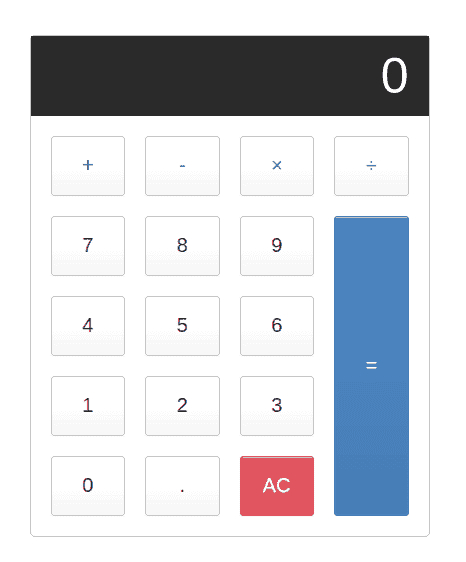

# Angular 8 教程:构建你的第一个 Angular 应用

> 原文：<https://dev.to/techiediaries/angular-8-tutorial-build-your-first-angular-app-5al7>

在本教程中，您将学习从头构建您的第一个 Angular 8 应用程序。

您将从模块、组件和指令等基本概念开始。

您还将了解事件和属性绑定。

我们将构建一个简单的计算器应用程序来演示所有提到的概念。

## 先决条件

让我们从先决条件开始。您需要具备:

*   打字稿，HTML 和 CSS 的知识。
*   节点和 NPM 安装在您的系统上。
*   系统上安装的 Angular CLI 8。
*   生成我们的角度计算器项目

在通过在系统中安装 Node 和 Angular CLI 来设置您的环境之后，让我们创建一个项目。所以打开一个终端，执行下面的命令:

```
$ ng new ngcalculator 
```

Enter fullscreen mode Exit fullscreen mode

CLI 将询问您是否希望将路由添加到您的项目中，您可以说“否”,因为在本演示中我们不需要路由。对于样式表格式，选择 CSS。

然后，您可以等待 CLI 生成您的项目，并从 npm 安装所需的依赖项。

之后，您可以使用 ng serve 命令:
启动一个 live development 服务器

```
$ cd ./ngcalculator
$ ng serve 
```

Enter fullscreen mode Exit fullscreen mode

等待 CLI 编译您的项目，并在 [http://localhost:4200](http://localhost:4200) 启动服务器。

## 角度模块&组件

Angular 遵循模块化和基于组件的架构。事实上，这是两种架构——模块化架构，在这种架构中，您将应用程序构建为一组模块。一般规则是，您需要为应用程序的每个特性使用一个模块。基于组件的架构，在这种架构中，您将应用程序构建为一组组件。

> **注意**:在我们用 CLI 生成的 Angular 8 项目中，我们已经有了一个根模块(通常称为 AppModule)和一个根组件(通常称为 AppComponent)。

根模块和组件首先由 Angular 应用程序引导(在 main.js 和 app.module.ts 文件中)

根据[角度文件](https://angular.io/guide/architecture-modules)，这是一个模块的定义:

> Angular 应用程序是模块化的，Angular 有自己的模块化系统，称为 NgModules。NgModules 是专用于应用程序域、工作流或一组密切相关的功能的内聚代码块的容器。它们可以包含组件、服务提供者和其他代码文件，这些文件的范围由包含它们的 NgModule 定义。他们可以导入从其他 ng module 导出的功能，并导出选定的功能供其他 ng module 使用。

由于我们正在构建一个简单的计算器应用程序，我们实际上不需要一个以上的模块，所以让我们保持简单，使用根模块来实现我们的功能。

> **注**:您可以使用命令行生成模块生成一个新的模块

## 组件呢？

组件控制屏幕的一部分。它只是一个带有显示视图的 HTML 模板的 TypeScript 类(用@Component 修饰)。

我们的计算器应用程序中也不需要很多组件，但是让我们创建一个组件来封装计算器视图和逻辑。打开一个新的终端，导航到您的项目文件夹，运行以下命令:

```
$ ng generate component calculator --skipTests 
```

Enter fullscreen mode Exit fullscreen mode

我们添加了`--skipTests`选项来告诉 CLI 跳过为组件测试生成文件，因为在本教程中我们不会添加任何测试。

CLI 在`src/app/calculator`文件夹中生成了以下文件:

*   `src/app/calculator/calculator.component.css`对于 CSS 样式。
*   `src/app/calculator/calculator.component.html`为组件的模板或视图。
*   `src/app/calculator/calculator.component.ts`为元件逻辑。

打开`src/app/calculator/calculator.component.ts`文件:

```
import { Component, OnInit } from '@angular/core';

@Component({
  selector: 'app-calculator',
  templateUrl: './calculator.component.html',
  styleUrls: ['./calculator.component.css']
})
export class CalculatorComponent implements OnInit {

  constructor() { }

  ngOnInit() {
  }

} 
```

Enter fullscreen mode Exit fullscreen mode

由于采用以下元数据的`@Component()`装饰器，`CalculatorComponent`类知道模板和 CSS 文件:

*   这允许我们给组件一个标签名，它可以用来引用其他模板中的组件，就像标准 HTML 标签一样。templateUrl 指向呈现组件视图的 HTML 模板。也可以改为使用带有 template 属性的内联模板。
*   这允许我们将一个或多个样式表关联到我们的组件。

因为我们的应用程序中没有包含路由，所以我们需要一种从根组件访问计算器组件的方法。这就是组件的`selector`属性派上用场的地方——我们可以使用`<app-calculator>`标签调用计算器组件。

打开`src/app/app.component.html`文件，删除现有内容，添加:

```
<app-calculator></app-calculator> 
```

Enter fullscreen mode Exit fullscreen mode

## 创建我们的计算器 UI

我们将使用来自[这个 JS 小提琴](https://jsfiddle.net/ayoisaiah/c8b9zsaq/10/?utm_source=website&utm_medium=embed&utm_campaign=c8b9zsaq)的 HTML 和 CSS 代码来创建我们的计算器 UI:

打开`src/app/calculator/calculator.component.html`文件，添加以下代码:

```
<div class="calculator">

  <input type="text" class="calculator-screen" value="0" disabled />

  <div class="calculator-keys">

    <button type="button" class="operator" value="+">+</button>
    <button type="button" class="operator" value="-">-</button>
    <button type="button" class="operator" value="*">&times;</button>
    <button type="button" class="operator" value="/">&divide;</button>

    <button type="button" value="7">7</button>
    <button type="button" value="8">8</button>
    <button type="button" value="9">9</button>

    <button type="button" value="4">4</button>
    <button type="button" value="5">5</button>
    <button type="button" value="6">6</button>

    <button type="button" value="1">1</button>
    <button type="button" value="2">2</button>
    <button type="button" value="3">3</button>

    <button type="button" value="0">0</button>
    <button type="button" class="decimal" value=".">.</button>
    <button type="button" class="all-clear" value="all-clear">AC</button>

    <button type="button" class="equal-sign" value="=">=</button>

  </div>
</div> 
```

Enter fullscreen mode Exit fullscreen mode

接下来，打开`src/app/calculator/calculator.component.css`文件并添加以下 CSS 样式:

```
 .calculator {
    border: 1px solid #ccc;
    border-radius: 5px;
    position: absolute;
    top: 50%;
    left: 50%;
    transform: translate(-50%, -50%);
    width: 400px;
  }

  .calculator-screen {
    width: 100%;
    font-size: 5rem;
    height: 80px;
    border: none;
    background-color: #252525;
    color: #fff;
    text-align: right;
    padding-right: 20px;
    padding-left: 10px;
  }

  button {
    height: 60px;
    background-color: #fff;
    border-radius: 3px;
    border: 1px solid #c4c4c4;
    background-color: transparent;
    font-size: 2rem;
    color: #333;
    background-image: linear-gradient(to bottom,transparent,transparent 50%,rgba(0,0,0,.04));
    box-shadow: inset 0 0 0 1px rgba(255,255,255,.05), inset 0 1px 0 0 rgba(255,255,255,.45), inset 0 -1px 0 0 rgba(255,255,255,.15), 0 1px 0 0 rgba(255,255,255,.15);
    text-shadow: 0 1px rgba(255,255,255,.4);
  }

  button:hover {
    background-color: #eaeaea;
  }

  .operator {
    color: #337cac;
  }

  .all-clear {
    background-color: #f0595f;
    border-color: #b0353a;
    color: #fff;
  }

  .all-clear:hover {
    background-color: #f17377;
  }

  .equal-sign {
    background-color: #2e86c0;
    border-color: #337cac;
    color: #fff;
    height: 100%;
    grid-area: 2 / 4 / 6 / 5;
  }

  .equal-sign:hover {
    background-color: #4e9ed4;
  }

  .calculator-keys {
    display: grid;
    grid-template-columns: repeat(4, 1fr);
    grid-gap: 20px;
    padding: 20px;
  }
view rawcalculator.component.css hosted with ❤ by GitHub
We also need to add some global styling so open the src/styles.css file and add:

html {
    font-size: 62.5%;
    box-sizing: border-box;
  }

*, *::before, *::after {
    margin: 0;
    padding: 0;
    box-sizing: inherit;
} 
```

Enter fullscreen mode Exit fullscreen mode

现在，如果您转到 web 浏览器并导航到您的应用程序，您应该会看到以下界面:

[](https://res.cloudinary.com/practicaldev/image/fetch/s--PMqVK-kz--/c_limit%2Cf_auto%2Cfl_progressive%2Cq_auto%2Cw_880/https://www.diigo.com/file/image/bbccosoazobaoooccdzdrocqebd/Ngcalculator.jpg)

现在，我们需要使用角魔术把这个模板变成一个工作的计算器。

## 结论

在第一部分中，我们创建了 Angular 8 计算器应用程序。在下一个教程中，我们将使用角度数据绑定来制作一个工作计算器。