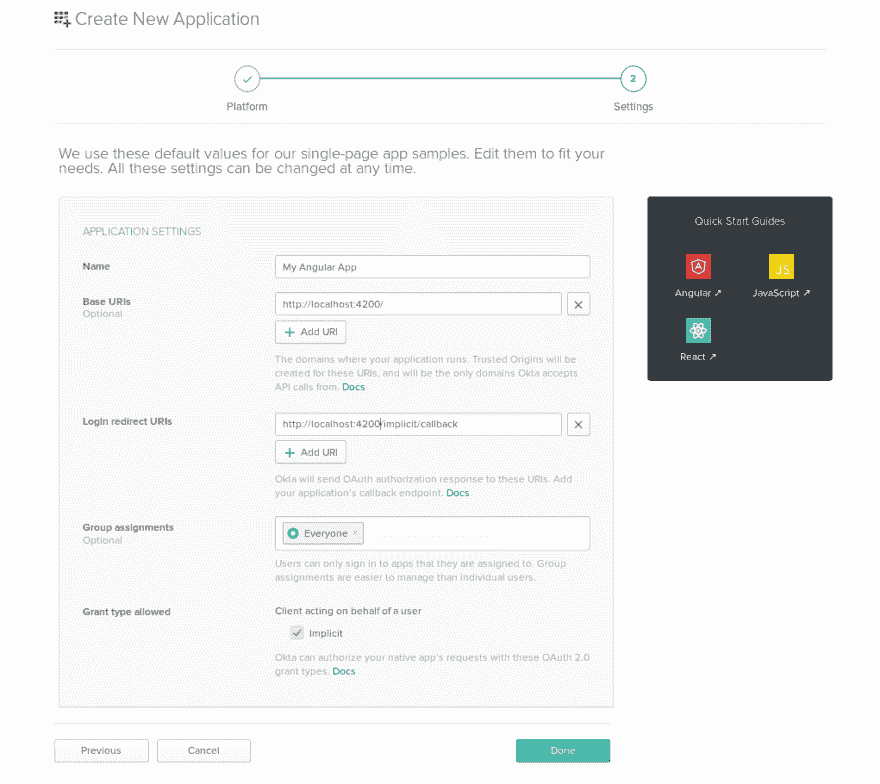
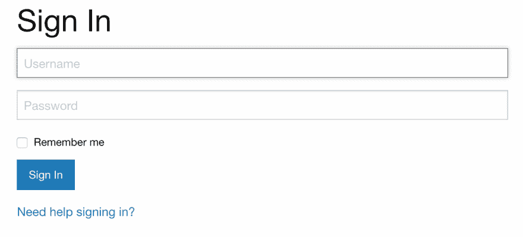
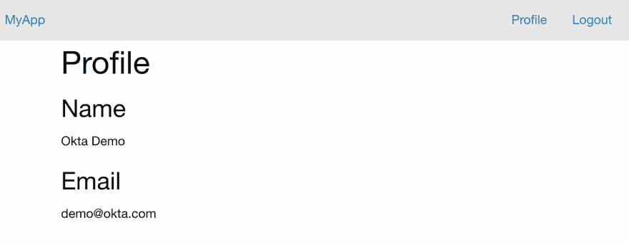

# JWT 的角度认证

> 原文：<https://dev.to/oktadev/angular-authentication-with-jwt-31b0>

用户注册和认证是几乎所有 web 应用程序都不可或缺的特性之一。身份验证通常包括用户使用用户名和密码进入，然后被授权访问各种资源或服务。就其本质而言，身份验证依赖于保持用户的状态。这似乎与 HTTP 的一个基本属性相矛盾，HTTP 是一个无状态协议。

JSON Web 令牌(jwt)提供了一种解决这个问题的方法。你的 Angular 应用可以与产生令牌的后端对话。然后，Angular 应用程序可以在一个`Authorization`头中将该令牌传递给后端，以证明它们已经过身份验证。后端应该验证 JWT，并根据其有效性授予访问权限。

解决这个问题的另一种方法是基于会话的身份验证和 cookies。在这种情况下，后端将产生所谓的“会话 cookie”这个 cookie 为服务器提供了一种机制来证明用户已经过身份验证。

## 会话 vs JWT 角中认证

如果你像我一样，你已经为 web 开发了一段时间。你可能遇到过解决这个问题的不同方法。传统的方法使用会话来保持状态。当用户访问网站并登录时，服务器将在会话中存储身份验证状态。然后，它向客户端返回一个唯一的会话 ID，该 ID 通常存储在浏览器 cookie 中。每次客户端向服务器发出请求时，cookie 都会在请求标头中发送，服务器可以从会话 ID 中查找会话数据。虽然这种方法已经成功地应用了许多年，但是它有一些缺点。

基于会话的身份验证依赖于存储在服务器上的会话数据。对用户进行身份验证的服务器必须是检查身份验证和提供服务的服务器。想象一下，一个 web 服务部署在多个服务器上，位于负载平衡器或反向代理之后。客户端发出的每个请求最终都可能被不同的服务器处理。然后，会话数据必须在所有服务器之间共享。这将抵消负载平衡器带来的大部分改进。

基于会话的身份验证的另一个缺点是单点登录服务的使用增加了。在这里，用户通过中央认证服务登录一次。之后，用户可以自由地使用任何信任认证服务的服务器。这不仅在使用谷歌或脸书账户注册网站时有用。越来越多的企业使用大量独立的工具来组织他们的工作流程。使用单点登录，员工只需注册一次，就可以使用所有工具，无需进一步验证。使用会话实现单点登录是非常不切实际的，因为不同的应用程序必须相互通信并交换它们的私有会话数据。

## jwt 前来救援进行角度认证

由于上述问题，服务越来越多地使用所谓的 JSON Web 令牌(JWT)来实现认证。使用 JWT 身份验证，服务器不需要存储任何会话数据。服务器可以是真正无状态的。那么这是如何工作的呢？当用户登录服务时，服务器会检查用户的凭据。如果成功，服务器会将关键的用户数据(比如用户 ID 或用户的电子邮件地址)编码成一个 JSON 字符串。然后使用秘密密钥对该字符串进行签名。这个数据就是 JSON Web 令牌。它可以被发送回客户端，并由客户端用来验证自身。

如果服务器可以用适当的密钥验证令牌，就可以确定它是由身份验证服务器生成的。但是不能伪造，因为只有认证服务器知道私钥。身份验证可以由独立于想要限制访问的服务的服务来提供。

## 用 Node 和 Angular 实现一个 JWT 服务器和客户端

在这一节中，我将向您展示如何使用 Node 和 Express 服务器以及用 Angular 编写的客户端来实现 JWT 认证。您将会看到，尽管这个概念很简单，但是实现需要安全最佳实践的知识。这里给出的示例并不完整，缺少生产服务器所需的许多功能。在下一节中，我将向您展示 [Okta](https://developer.okta.com/) 为这些缺点提供了一个简单而优雅的解决方案。

我假设您对 JavaScript 有所了解，并且已经在服务器上安装了 Node 和`npm`命令行工具。

### 建立 JWT 认证服务器

为了开始实现使用 JSON Web 令牌认证用户的服务器，打开一个终端并创建一个包含服务器应用程序的目录，我将我的目录命名为`jwt-server`。导航到该目录并运行以下命令来初始化您项目。

```
npm init -y 
```

Enter fullscreen mode Exit fullscreen mode

您将需要许多包来实现服务器。然后通过运行以下命令进行安装。

```
npm install --E cors@2.8.5 nodemon@1.18.10 bcryptjs@2.4.3 sqlite3@4.0.6 njwt@1.0.0 \
  express@4.16.4 body-parser@1.18.3 express-bearer-token@2.2.0 
```

Enter fullscreen mode Exit fullscreen mode

当这些库出现在代码中时，我会逐一解释。打开你最喜欢的文本编辑器，用以下内容创建一个新文件`index.js`。

```
const express = require('express');
const cors = require('cors');
const bodyParser = require('body-parser');
const bearerToken = require('express-bearer-token');
const profile = require('./profile');

const port = process.env.PORT || 10101;

const app = express()
  .use(cors())
  .use(bodyParser.json())
  .use(bearerToken());

app.use('/', profile);

app.listen(port, () => {
  console.log(`Express server listening on port ${port}`);
}); 
```

Enter fullscreen mode Exit fullscreen mode

这是主服务器应用程序。它首先创建一个`express`服务器，用于监听传入的 HTTP 请求，并允许您注册回调函数来生成对这些请求的响应。服务器使用许多扩展 express 服务器行为的中间件。`cors`中间件允许服务器响应跨来源的请求。需要“body-parser”来解析 HTTP 请求正文，并创建一个附加到请求数据的对象。类似地，`express-bearer-token`从请求头中提取一个不记名令牌，并通过请求对象使其可用。

快速应用程序将路由器连接到主路由`/`。这个路由器在一个名为`profile.js`的单独文件中定义。您将在这个文件中实现的第一个路由让用户注册一个帐户。

```
const express = require('express');
const bcrypt = require('bcryptjs');
const sqlite3 = require('sqlite3').verbose();

const db = new sqlite3.Database(':memory:');

db.serialize(() => {
  db.run("CREATE TABLE users (id INTEGER PRIMARY KEY, name TEXT, email TEXT, password TEXT)");
});

const router = express.Router();

router.post('/register', function(req, res) {
  var hashedPassword = bcrypt.hashSync(req.body.password, 8);

  db.run("INSERT INTO users (name, email, password) "
        + "VALUES (?, ?, ?)", req.body.name, req.body.email, hashedPassword,
  function (err) {
    if (err) return res.status(500).send("An error occurred during registration");

    res.status(200).send({ status: 'ok' });
  });
});

module.exports = router; 
```

Enter fullscreen mode Exit fullscreen mode

我正在使用`sqlite3`来模拟一个用户数据库。在这个例子中，数据库完全保存在内存中。这意味着当服务器停止时，所有数据都将丢失。在生产服务器中，您应该用合适的 SQL 或 NoSQL 数据库来替换它。

当用户注册时，他们的密码被使用`bcryptjs`库散列。只有哈希密码存储在数据库中。如果成功，服务器会响应一个`ok`状态。一旦用户注册，他们需要能够登录。这可以通过另一条路线`/login`完成。这是您开始使用 JSON Web 令牌的地方。在开始实现之前，创建一个文件`config.js`，它将存储创建 web 令牌的秘密。

```
module.exports = {
  'secret': 'my_special_secret'
}; 
```

Enter fullscreen mode Exit fullscreen mode

接下来，为`njwt`添加 require 语句，并为`profile.js`添加新的`config.js`。

```
const nJwt = require('njwt');
const config = require('./config'); 
```

Enter fullscreen mode Exit fullscreen mode

然后，在同一个文件中创建`/login`路线。

```
router.post('/login', function(req, res) {
  db.get("SELECT id, name, email, password FROM users " 
        + "WHERE email=?", req.body.email, function (err, user) {
    if (err) return res.status(500).send({status: 'Server error', err:err});
    if (!user) return res.status(404).send('User not found');

    if (!bcrypt.compareSync(req.body.password, user.password)) {
      return res.status(401).send({ auth: false, token: null });
    }

    var jwt = nJwt.create({ id: user.id }, config.secret);
    jwt.setExpiration(new Date().getTime() + (24*60*60*1000));

    res.status(200).send({ auth: true, token: jwt.compact() });
  });
}); 
```

Enter fullscreen mode Exit fullscreen mode

这条路线需要两个参数，`email`和`password`。第一步是在数据库中搜索用户的电子邮件，并获得用户的记录。然后使用`bcrypt`来比较用户的密码和散列密码。如果成功，`jwt`用于创建一个存储用户 ID 的令牌。然后，令牌在响应中被发送回客户端。

当客户端试图访问受限资源时，它需要在请求头中发送令牌。然后，服务器需要认证令牌。您可以编写一个快速中间件来执行这个身份验证任务。用以下内容创建一个新文件`auth.js`。

```
const nJwt = require('njwt');
var config = require('./config');

function jwtAuth(req, res, next) {
  if (!req.token) {
    return res.status(403).send({ auth: false, message: 'No token provided' });
  }

  nJwt.verify(req.token, config.secret, function(err, decoded) {
    if (err) {
      return res.status(500).send({ auth: false, message: 'Could not authenticate token' });
    }
    req.userId = decoded.body.id;
    next();
  });
}

module.exports = jwtAuth; 
```

Enter fullscreen mode Exit fullscreen mode

还记得从请求中提取 JWT 令牌并通过`req.token`使其可用的`express-bearer-token`中间件吗？`jwt.verify`用于检查令牌是否有效。该函数还提取存储在令牌中的用户 ID，并允许您将其附加到请求对象。

现在，所有这些都允许您创建一个受保护的路由，并且只对已登录的用户可用。再次打开`profile.js`并添加以下内容。

```
const jwtAuth = require('./auth');

router.get('/profile', jwtAuth, function(req, res, next) {
  db.get("SELECT id, name, email FROM users WHERE id=?", req.userId, function (err, user) {
    if (err) {
      return res.status(500).send("There was a problem finding the user.");
    }
    if (!user) {
      return res.status(404).send("No user found.");
    }
    res.status(200).send(user);
  });
}); 
```

Enter fullscreen mode Exit fullscreen mode

`/profile`路由只是返回用户的个人资料信息。看看如何将`jwtAuth`功能作为中间件添加到`/profile`路由中。这保护了路线。它还允许处理程序回调使用`req.userId`属性从数据库中查找用户。为了测试服务器，将下面一行添加到`package.json`的`scripts`部分。

```
"start":  "nodemon server.js", 
```

Enter fullscreen mode Exit fullscreen mode

现在，您可以使用以下命令运行服务器。

```
npm start 
```

Enter fullscreen mode Exit fullscreen mode

这就结束了使用 JSON Web 令牌进行身份验证的服务器的简单示例。接下来，是时候实现访问这个服务器的客户机了。

### 添加带 JWT 认证的 Angular 客户端

我将使用 Angular 来实现客户端。首先，确保您安装了最新版本的 Angular 命令行工具。根据您的系统，您可能需要使用`sudo`运行以下命令。

```
npm install -g @angular/cli@7.3.6 
```

Enter fullscreen mode Exit fullscreen mode

导航到您选择的目录，并为客户端创建一个新项目。

```
ng new jwt-client --routing --style=css 
```

Enter fullscreen mode Exit fullscreen mode

导航到此文件夹并安装 Foundation responsive CSS 框架的库。

```
npm install -E foundation-sites@6.5.3 ngx-foundation@1.0.8 
```

Enter fullscreen mode Exit fullscreen mode

打开`src/styles.css`并粘贴基础样式的导入。

```
@import '~foundation-sites/dist/css/foundation.min.css';
@import '~ngx-foundation/dist/css/ngx-foundation.min.css'; 
```

Enter fullscreen mode Exit fullscreen mode

首先创建一个与节点/快速服务器通信的服务。

```
ng generate service server 
```

Enter fullscreen mode Exit fullscreen mode

打开文件`src/app/server.service.ts`并用以下代码替换其内容。

```
import { Injectable } from '@angular/core';
import { HttpClient, HttpParams } from '@angular/common/http';

const baseUrl = 'http://localhost:10101';

@Injectable({
  providedIn: 'root'
})
export class ServerService {
  private loggedIn = false;
  private token: string;

  constructor(private http: HttpClient) {}

  setLoggedIn(loggedIn: boolean, token?: string) {
    this.loggedIn = loggedIn;
    this.token = token;
  }

  request(method: string, route: string, data?: any) {
    if (method === 'GET') {
      return this.get(route, data);
    }

    const header = (this.loggedIn) ? { Authorization: `Bearer ${this.token}` } : undefined;

    return this.http.request(method, baseUrl + route, {
      body: data,
      responseType: 'json',
      observe: 'body',
      headers: header
    });
  }

  get(route: string, data?: any) {
    const header = (this.loggedIn) ? { Authorization: `Bearer ${this.token}` } : undefined;

    let params = new HttpParams();
    if (data !== undefined) {
      Object.getOwnPropertyNames(data).forEach(key => {
        params = params.set(key, data[key]);
      });
    }

    return this.http.get(baseUrl + route, {
      responseType: 'json',
      headers: header,
      params
    });
  }
} 
```

Enter fullscreen mode Exit fullscreen mode

该服务提供了向服务器发送请求和获取数据的功能。该服务的一个重要任务是存储 JWT 令牌并将其添加到请求头中。另一个服务将负责与服务器进行身份验证并获得令牌。使用命令行创建此服务。

```
ng generate service auth 
```

Enter fullscreen mode Exit fullscreen mode

用这段代码填充新生成的文件`src/app/auth.service.ts`。

```
import { Injectable } from '@angular/core';
import { Router } from '@angular/router';
import { BehaviorSubject } from 'rxjs';
import { ServerService } from './server.service';

@Injectable()
export class AuthService {
  private loggedIn = new BehaviorSubject<boolean>(false);
  private token: string;

  get isLoggedIn() {
    return this.loggedIn.asObservable();
  }

  constructor(private router: Router, private server: ServerService) {
    console.log('Auth Service');
    const userData = localStorage.getItem('user');
    if (userData) {
      console.log('Logged in from memory');
      const user = JSON.parse(userData);
      this.token = user.token;
      this.server.setLoggedIn(true, this.token);
      this.loggedIn.next(true);
    }
  }

  login(user) {
    if (user.email !== '' && user.password !== '' ) {
      return this.server.request('POST', '/login', {
        email: user.email,
        password: user.password
      }).subscribe((response: any) => {
        if (response.auth === true && response.token !== undefined) {
          this.token = response.token;
          this.server.setLoggedIn(true, this.token);
          this.loggedIn.next(true);
          const userData = {
            token: this.token,
          };
          localStorage.setItem('user', JSON.stringify(userData));
          this.router.navigateByUrl('/profile');
        }
      });
    }
  }

  logout() {
    this.server.setLoggedIn(false);
    delete this.token;

    this.loggedIn.next(false);
    localStorage.clear();
    this.router.navigate(['/']);
  }
} 
```

Enter fullscreen mode Exit fullscreen mode

该服务负责对用户进行身份验证，如果成功，将令牌存储在浏览器的本地存储中，并通知`ServerService`令牌。您现在可以在您的应用程序组件中使用`AuthService`。打开`src/app/app.component.ts`，粘贴以下内容。

```
import { Component } from '@angular/core';
import { AuthService } from './auth.service';

@Component({
  selector: 'app-root',
  templateUrl: './app.component.html',
  styleUrls: ['./app.component.css']
})
export class AppComponent {
  title = 'jwt-client';

  constructor(private authService: AuthService) {}

  onLogout() {
    this.authService.logout();
  }
} 
```

Enter fullscreen mode Exit fullscreen mode

更改`src/app/app.component.html`中的应用程序组件，使其包含一个仅在用户登录时可见的顶栏。

```
<div class="top-bar" *ngIf="authService.isLoggedIn | async as isLoggedIn">
  <div class="top-bar-left">
    <a class="logo" routerLink="/">MyApp</a>
  </div>
  <div class="top-bar-right show-for-medium">
    <ul class="menu">
      <li><a routerLink="/profile">Profile</a></li>
      <li><a (click)="onLogout()">Logout</a></li>
    </ul>
  </div>
</div>

<router-outlet></router-outlet> 
```

Enter fullscreen mode Exit fullscreen mode

接下来，创建一个允许用户注册新用户的组件。

```
ng generate component register 
```

Enter fullscreen mode Exit fullscreen mode

打开`src/app/register/register.component.ts`并创建一个组件，其中包含一个可以提交给服务器的注册表单。

```
import { Component, OnInit } from '@angular/core';
import { FormGroup, FormBuilder, Validators } from '@angular/forms';
import { Router } from '@angular/router';
import { ServerService } from '../server.service';

@Component({
  selector: 'app-login',
  templateUrl: './register.component.html',
  styleUrls: ['./register.component.css']
})
export class RegisterComponent implements OnInit {
  form: FormGroup;

  constructor(
    private fb: FormBuilder,
    private server: ServerService,
    private router: Router
  ) {}

  ngOnInit() {
    this.form = this.fb.group({
      email: ['', Validators.email],
      name: ['', Validators.required],
      password: ['', Validators.compose([Validators.required, Validators.minLength(8)])]
    },);
  }

  onSubmit() {
    console.log('Submitting');
    if (!this.form.valid) {
      console.log('Form not valid. Please check that fields are correctly filled in');
      return;
    }

    console.log('Form valid');
    const request = this.server.request('POST', '/register', {
      email: this.form.get('email').value,
      name: this.form.get('name').value,
      password: this.form.get('password').value
    });

    request.subscribe(() => {
      this.router.navigate(['/login']);
    })
  }
} 
```

Enter fullscreen mode Exit fullscreen mode

请注意，用户在注册后没有登录。因此，当注册成功时，用户被重定向到登录路径。该组件的模板进入`src/app/register/register.component.html`。

```
<div class="grid-container">
  <div class="grid-x">
    <div class="small-12 medium-10 medium-offset-1 large-8 large-offset-2 cell">
      <form [formGroup]="form" (ngSubmit)="onSubmit()">
        <h2>Sign Up</h2>
        <p>Please enter your details</p>
        <label class="full-width-input">
          Email
          <input type="text" placeholder="Email" formControlName="email" required>
        </label>
        <label class="full-width-input">
          Name
          <input type="text" placeholder="Name" formControlName="name" required>
        </label>
        <label class="full-width-input">
          Password
          <input type="password" placeholder="Password" formControlName="password" required>
        </label>
        <button class="button">Register</button>
      </form>
      <div class="login-link">
        Already registered? <a routerLink="/login">Login Here!</a>
      </div>
    </div>
  </div>
</div> 
```

Enter fullscreen mode Exit fullscreen mode

创建用于登录的组件遵循相同的步骤。

```
ng generate component login 
```

Enter fullscreen mode Exit fullscreen mode

在`src/app/login/login.component.ts`中，创建显示表单和使用`AuthService`登录的逻辑。

```
import { Component, OnInit } from '@angular/core';
import { FormGroup, FormBuilder, Validators } from '@angular/forms';
import { AuthService } from '../auth.service';

@Component({
  selector: 'app-login',
  templateUrl: './login.component.html',
  styleUrls: ['./login.component.css']
})
export class LoginComponent implements OnInit {
  form: FormGroup;
  public loginInvalid: boolean;
  private formSubmitAttempt: boolean;

  constructor(private fb: FormBuilder, private authService: AuthService) {
  }

  ngOnInit() {
    this.form = this.fb.group({
      email: ['', Validators.email],
      password: ['', Validators.required]
    });
  }

  async onSubmit() {
    this.loginInvalid = false;
    this.formSubmitAttempt = false;
    if (this.form.valid) {
      try {
        await this.authService.login(this.form.value);      
      } catch (err) {
        this.loginInvalid = true;
      }
    } else {
      this.formSubmitAttempt = true;
    }
  }
} 
```

Enter fullscreen mode Exit fullscreen mode

模板`src/app/login/login.component.html`包含用户电子邮件和密码的 HTML 表单。

```
<div class="grid-container">
  <div class="grid-x">
    <div class="small-12 medium-10 medium-offset-1 large-8 large-offset-2 cell">
      <form [formGroup]="form" (ngSubmit)="onSubmit()">
        <h2>Log In</h2>
        <p>Please login to continue</p>
        <label class="full-width-input">
          Email
          <input type="text" placeholder="Email" formControlName="email" required>
        </label>
        <label class="full-width-input">
          Password
          <input type="password" placeholder="Password" formControlName="password" required>
        </label>
        <button class="button">Login</button>
      </form>
      <div class="register-link">
        Not yet registered? <a routerLink="/register">Register Now</a>
      </div>
    </div>
  </div>
</div> 
```

Enter fullscreen mode Exit fullscreen mode

最后，您需要一个显示用户资料的路径。

```
ng generate component profile 
```

Enter fullscreen mode Exit fullscreen mode

将下面的代码复制到`src/app/profile/profile.component.ts`中。该组件只是从服务器获取配置文件数据，并将其存储起来以供显示。

```
import { Component, OnInit } from '@angular/core';
import { ServerService } from '../server.service';

@Component({
  selector: 'app-profile',
  templateUrl: './profile.component.html',
  styleUrls: ['./profile.component.css']
})
export class ProfileComponent implements OnInit {
  name: string;
  email: string;

  constructor(private server: ServerService) { }

  ngOnInit() {
    this.server.request('GET', '/profile').subscribe((user: any) => {
      if (user) {
        this.name = user.name;
        this.email = user.email;
      }
    });
  }
} 
```

Enter fullscreen mode Exit fullscreen mode

`src/app/profile/profile.component.html`中的模板只是显示结果。

```
<div class="grid-container">
  <div class="grid-x">
    <div class="small-12 medium-10 medium-offset-1 large-8 large-offset-2 cell">
      <h2>Profile</h2>
      <h3>Name</h3>
      <p>
        {{name}}
      </p>
      <h3>Email</h3>
      <p>
        {{email}}
      </p>
    </div>
  </div>
</div> 
```

Enter fullscreen mode Exit fullscreen mode

好了，现在我已经扔给你很多代码了。但是这真的很简单。前两个组件只是向用户显示一个表单，当提交时，数据被发送到服务器。最后一个组件从服务器获取数据并显示出来。为了使整个工作正常，需要导入一些模块。打开`src/app/app.module.ts`并添加以下导入。

```
import { HttpClientModule } from '@angular/common/http';
import { FormsModule, ReactiveFormsModule } from '@angular/forms';
import { AuthService } from './auth.service'; 
```

Enter fullscreen mode Exit fullscreen mode

然后将以下内容添加到`imports`数组中。

```
@NgModule({
  ...
  imports: [
    ..
    HttpClientModule,
    FormsModule,
    ReactiveFormsModule  
  ],
  ...
}) 
```

Enter fullscreen mode Exit fullscreen mode

最后，将`AuthService`添加到`providers`数组中。

```
@NgModule({
  ...
  providers: [AuthService],
  bootstrap: [AppComponent]
}) 
```

Enter fullscreen mode Exit fullscreen mode

剩下要做的最后一件事是向路由器注册组件。打开`src/app/app-routing.module.ts`，用下面的代码替换它的内容。

```
import { NgModule } from '@angular/core';
import { Routes, RouterModule } from '@angular/router';
import { LoginComponent } from './login/login.component';
import { RegisterComponent } from './register/register.component';
import { ProfileComponent } from './profile/profile.component';

const routes: Routes = [
  { path: '', component: RegisterComponent },
  { path: 'login', component: LoginComponent },
  { path: 'register', component: RegisterComponent },
  { path: 'profile', component: ProfileComponent },
];

@NgModule({
  imports: [RouterModule.forRoot(routes)],
  exports: [RouterModule]
})
export class AppRoutingModule { } 
```

Enter fullscreen mode Exit fullscreen mode

你的委托人已经准备好了。通过运行以下命令启动它。

```
ng serve -o 
```

Enter fullscreen mode Exit fullscreen mode

客户端允许用户注册，然后登录，并查看他们的个人资料。这就是关于 JSON Web 令牌的全部知识吗？不，我还没有涉及许多问题。从用户体验来说，如果`/profile`路线能在客户端得到保护就好了。目前，没有登录到服务器的用户仍然可以导航到`/profile`路线。服务器将拒绝发送任何数据，因此将出现一个空白页面。

我完全避免的另一个大话题包括令牌过期和当用户与网站交互时刷新令牌。这两者都是在提供良好用户体验的同时保证安全性所必需的。

## 在角状和快递中建立安全的 JWT 认证

Okta 提供认证服务，可以轻松集成到您的应用程序中。Okta 服务是基于 JWT 的，它处理与安全和用户体验相关的所有问题。你不需要存储密码，自己生成令牌，或者考虑自动刷新。首先，你需要一个 Okta 的开发者账户。

在您的浏览器中，导航至[developer.okta.com](https://developer.okta.com/)，点击**创建免费账户**，并输入您的详细信息。您将收到一封激活电子邮件，以完成创建您的帐户。完成后，您将进入开发人员控制面板。点击**添加应用**按钮创建一个新的应用。首先创建一个新的单页应用程序。选择**单页 App** ，点击**下一步**。

[](https://res.cloudinary.com/practicaldev/image/fetch/s--qLHvwCVm--/c_limit%2Cf_auto%2Cfl_progressive%2Cq_auto%2Cw_880/https://developer.okta.com/assets-jekyll/blog/jwt-angular/new-app-8fae77e09db35043d71372c1d6507513c4a49d08a9e9b7197e7efea89435228a.png)

在下一页，您需要编辑默认设置。确保端口号为 4200。这是角度应用的默认端口。然后点击**完成**。

[](https://res.cloudinary.com/practicaldev/image/fetch/s--jD1JooRg--/c_limit%2Cf_auto%2Cfl_progressive%2Cq_auto%2Cw_880/https://developer.okta.com/assets-jekyll/blog/jwt-angular/angular-spa-okta-settings-727ad1166535f988fdbe4ddffd45ec3dfe49b91d7e4002a0aca1956525c488b2.png)

就是这样。现在您应该看到一个**客户端 ID** ，您需要将它粘贴到您的 JavaScript 代码中。

### 快递服务器进行认证

使用 Okta 服务进行身份验证的服务器不需要实现任何用户注册或登录。当然，注册对于跟踪用户数据是有用的，但不是绝对必要的。创建一个名为`okta-server`的新目录，并像运行`jwt-server`一样在其中运行`npm init -y`。所需的库略有不同。

```
npm install -E cors@2.8.5 nodemon@1.18.10 express@4.16.4 \
  @okta/jwt-verifier@0.0.14 body-parser@1.18.3 express-bearer-token@2.2.0 
```

Enter fullscreen mode Exit fullscreen mode

主应用文件`index.js`与`jwt-server/index.js`相同。认证中间件`auth.js`看起来略有不同，因为它现在使用 Okta。

```
const OktaJwtVerifier = require('@okta/jwt-verifier');

const oktaJwtVerifier = new OktaJwtVerifier({
  issuer: 'https://{yourOktaDomain}/oauth2/default',
  clientId: '{yourClientId}'
});

function oktaAuth(req, res, next) {
  if (!req.token) {
    return res.status(403).send({ auth: false, message: 'No token provided' });
  }

  oktaJwtVerifier.verifyAccessToken(req.token).then(function(jwt) {
    req.userId = jwt.claims.uid;
    req.userEmail = jwt.claims.sub;
    next();
  }, function(err) {
    return res.status(500).send({ auth: false, message: 'Could not authenticate token' });
  });
}

module.exports = oktaAuth; 
```

Enter fullscreen mode Exit fullscreen mode

这里，`{yourClientId}`是您之前在 Okta 仪表板中创建的应用程序的客户端 ID。`profile.js`中的路由器实现只包含一条路由。我去掉了`/register`和`/login`航线，只保留了`/profile`航线。

```
var express = require('express');
var oktaAuth = require('./auth');

var router = express.Router();

router.get('/profile', oktaAuth, function(req, res, next) {
  console.log('ME', req.userId);
  res.status(200).send({id: req.userId, email: req.userEmail});
});

module.exports = router; 
```

Enter fullscreen mode Exit fullscreen mode

此路由返回令牌中包含的数据。您可以选择使用数据库来存储额外的数据并将其发送给客户端，但是我想在这里向您展示这不是必需的。

在`package.json`的`scripts`部分添加以下行。

```
"start":  "nodemon server.js", 
```

Enter fullscreen mode Exit fullscreen mode

用`npm start`启动服务器。

### Angular 客户端的单点登录

以与创建`jwt-client`应用程序相同的方式开始，但将其命名为`okta-client`。

```
ng new okta-client --routing --style=css 
```

Enter fullscreen mode Exit fullscreen mode

安装`foundation-sites`和`ngx-foundation`，然后编辑`src/style.css`和`src/app/app.component.html`，方法与上一节的 Angular 客户端相同。

```
npm install -E foundation-sites@6.5.3 ngx-foundation@1.0.8 
```

Enter fullscreen mode Exit fullscreen mode

编辑`src/styles.css`并粘贴基础样式的导入。

```
@import '~foundation-sites/dist/css/foundation.min.css';
@import '~ngx-foundation/dist/css/ngx-foundation.min.css'; 
```

Enter fullscreen mode Exit fullscreen mode

将`jwt-client`中的`src/app/app.component.html`复制到`okta-client`中。

在`src/app/app.component.html`中，在第一行，将`*ngIf="authService.isLoggedIn | async as isLoggedIn"`改为`*ngIf="isLoggedIn | async as isLoggedIn"`。

```
<div class="top-bar" *ngIf="isLoggedIn | async as isLoggedIn"> 
```

Enter fullscreen mode Exit fullscreen mode

接下来，安装 Okta 包。

```
npm install -E @okta/okta-angular@1.2.1 @okta/okta-signin-widget@2.19.0 
```

Enter fullscreen mode Exit fullscreen mode

和前面一样，创建一个服务器服务。

```
ng generate service server 
```

Enter fullscreen mode Exit fullscreen mode

`src/app/server.service.ts`中服务的实现与之前的客户端非常相似。唯一的区别是 JWT 令牌是通过`OktaAuthService`获得的。

```
import { Injectable } from '@angular/core';
import { HttpClient, HttpParams } from '@angular/common/http';
import { OktaAuthService } from '@okta/okta-angular';
import { Subject } from 'rxjs';

const baseUrl = 'http://localhost:10101';

@Injectable({
  providedIn: 'root'
})
export class ServerService {

  constructor(public oktaAuth: OktaAuthService, private http: HttpClient) {
  }

  request(method: string, route: string, data?: any) {
    if (method === 'GET') {
      return this.get(route, data);
    }

    const subject = new Subject<any>();

    this.oktaAuth.getAccessToken().then((token) => {
      const header = (token) ? {Authorization: `Bearer ${token}`} : undefined;

      const request = this.http.request(method, baseUrl + route, {
        body: data,
        responseType: 'json',
        observe: 'body',
        headers: header
      });

      request.subscribe(subject);
    });

    return subject;
  }

  get(route: string, data?: any) {
    const subject = new Subject<any>();

    this.oktaAuth.getAccessToken().then((token) => {
      const header = (token) ? {Authorization: `Bearer ${token}`} : undefined;

      let params = new HttpParams();
      if (data !== undefined) {
        Object.getOwnPropertyNames(data).forEach(key => {
          params = params.set(key, data[key]);
        });
      }

      const request = this.http.get(baseUrl + route, {
        responseType: 'json',
        headers: header,
        params
      });

      request.subscribe(subject);
    });

    return subject;
  }
} 
```

Enter fullscreen mode Exit fullscreen mode

客户端仍然包含一个登录组件，但是在本例中，它只是包含一个由`@okta/okta-signin-widget`库提供的小部件。

```
ng generate component login --inlineStyle=true --inlineTemplate=true 
```

Enter fullscreen mode Exit fullscreen mode

修改`src/app/login/login.component.ts`的内容，如下所示。

```
import { Component, OnInit } from '@angular/core';
import { Router, NavigationStart} from '@angular/router';
import { OktaAuthService } from '@okta/okta-angular';
import * as OktaSignIn from '@okta/okta-signin-widget';

@Component({
  selector: 'app-login',
  template: `
    <div class="grid-container">
      <div class="grid-x">
        <div class="small-12 medium-10 medium-offset-1 large-8 large-offset-2 cell">
          <div id="okta-signin-container"></div>
        </div>
      </div>
    </div>
  `,
  styles: []
})
export class LoginComponent implements OnInit {
  widget = new OktaSignIn({
    baseUrl: 'https://{yourOktaDomain}'
  });

  constructor(private oktaAuth: OktaAuthService, router: Router) {
    // Show the widget when prompted, otherwise remove it from the DOM.
    router.events.forEach(event => {
      if (event instanceof NavigationStart) {
        switch (event.url) {
          case '/login':
          case '/profile':
            break;
          default:
            this.widget.remove();
            break;
        }
      }
    });
  }

  ngOnInit() {
    this.widget.renderEl({
      el: '#okta-signin-container'},
      (res) => {
        if (res.status === 'SUCCESS') {
          this.oktaAuth.loginRedirect('/profile', { sessionToken: res.session.token });
          // Hide the widget
          this.widget.hide();
        }
      },
      (err) => {
        throw err;
      }
    );
  }
} 
```

Enter fullscreen mode Exit fullscreen mode

将`jwt-client/src/app/profile`目录复制到您的`okta-client`项目中，并更改`ProfileComponent`以从 Okta 的 Angular SDK 中检索名称。

```
import { Component, OnInit } from '@angular/core';
import { ServerService } from '../server.service';
import { OktaAuthService } from '@okta/okta-angular';

@Component({
  selector: 'app-profile',
  templateUrl: './profile.component.html',
  styleUrls: ['./profile.component.css']
})
export class ProfileComponent implements OnInit {
  id: string;
  email: string;
  name: string;

  constructor(private server: ServerService, oktaAuth: OktaAuthService) { 
    oktaAuth.getUser().then(user => {
      this.name = user.name;
    })
  }

  ngOnInit() {
    this.server.request('GET', '/profile').subscribe((user: any) => {
      if (user) {
        this.id = user.id;
        this.email = user.email;
      }
    });
  }
} 
```

Enter fullscreen mode Exit fullscreen mode

接下来，打开`src/app/app.module.ts`并将以下代码粘贴到其中。

```
import { BrowserModule } from '@angular/platform-browser';
import { NgModule } from '@angular/core';
import { HttpClientModule } from '@angular/common/http';
import { FormsModule, ReactiveFormsModule } from '@angular/forms';
import { OKTA_CONFIG, OktaAuthModule } from '@okta/okta-angular';

import { AppRoutingModule } from './app-routing.module';
import { AppComponent } from './app.component';
import { LoginComponent } from './login/login.component';
import { ProfileComponent } from './profile/profile.component';

const oktaConfig = {
  issuer: 'https://{yourOktaDomain}/oauth2/default',
  redirectUri: 'http://localhost:4200/implicit/callback',
  clientId: '{yourClientId}',
  scope: 'openid profile'
};

@NgModule({
  declarations: [
    AppComponent,
    LoginComponent,
    ProfileComponent
  ],
  imports: [
    BrowserModule,
    AppRoutingModule,
    HttpClientModule,
    FormsModule,
    ReactiveFormsModule,
    OktaAuthModule
  ],
  providers: [{ provide: OKTA_CONFIG, useValue: oktaConfig }],
  bootstrap: [AppComponent]
})
export class AppModule { } 
```

Enter fullscreen mode Exit fullscreen mode

现在剩下要做的就是在`src/app/app-routing.module.ts`中向路由器注册组件。

```
import { NgModule } from '@angular/core';
import { Routes, RouterModule } from '@angular/router';
import { OktaCallbackComponent, OktaAuthGuard } from '@okta/okta-angular';

import { LoginComponent } from './login/login.component';
import { ProfileComponent } from './profile/profile.component';

export function onAuthRequired({ oktaAuth, router }) {
  router.navigate(['/login']);
}

const routes: Routes = [
  { path: '', component: ProfileComponent, canActivate: [OktaAuthGuard], data: { onAuthRequired } },
  { path: 'login', component: LoginComponent },
  { path: 'profile', component: ProfileComponent, canActivate: [OktaAuthGuard], data: { onAuthRequired } },
  { path: 'implicit/callback', component: OktaCallbackComponent }
];

@NgModule({
  imports: [RouterModule.forRoot(routes)],
  exports: [RouterModule]
})
export class AppRoutingModule { } 
```

Enter fullscreen mode Exit fullscreen mode

最后，打开`src/app/app.component.ts`，用下面的代码替换它的内容。

```
import { Component, OnInit } from '@angular/core';
import { OktaAuthService } from '@okta/okta-angular';
import { BehaviorSubject } from 'rxjs';

@Component({
  selector: 'app-root',
  templateUrl: './app.component.html',
  styleUrls: ['./app.component.css']
})
export class AppComponent implements OnInit {
  title = 'okta-client';
  isLoggedIn = new BehaviorSubject<boolean>(false);

  constructor(public oktaAuth: OktaAuthService) {
    this.oktaAuth.$authenticationState.subscribe(this.isLoggedIn);
  }

  ngOnInit() {
    this.oktaAuth.isAuthenticated().then((auth) => {this.isLoggedIn.next(auth)});
  }

  onLogout() {
    this.oktaAuth.logout('/');
  }
} 
```

Enter fullscreen mode Exit fullscreen mode

您的 Angular 应用程序现在使用 Okta 和 JWT 实现身份验证！它保护应该访问的路由，并在用户未登录时自动将用户重定向到登录页面。与上一节中的示例相比，本节中的实现是完整的。Okta 库处理了所有未被基本的 JWT 实现覆盖的遗留问题。

您可以像往常一样通过运行`ng serve`命令来测试客户端。出现提示时，请输入有效的凭据。

[](https://res.cloudinary.com/practicaldev/image/fetch/s--lo0o9_oo--/c_limit%2Cf_auto%2Cfl_progressive%2Cq_auto%2Cw_880/https://developer.okta.com/assets-jekyll/blog/jwt-angular/okta-signin-widget-80defac6b67808def46bb17e2d0dff7dab12ab96b4c98fac37c409477534837d.png)

登录后，您将被重定向到个人资料页面，您将看到您的用户信息，就像以前一样。

[](https://res.cloudinary.com/practicaldev/image/fetch/s--5GViOnfi--/c_limit%2Cf_auto%2Cfl_progressive%2Cq_auto%2Cw_880/https://developer.okta.com/assets-jekyll/blog/jwt-angular/okta-profile-page-4d76749768a128b6410fda67733fbe7db44855ad21f8577d9579521dd666cfb8.png)

## 了解更多关于 Angular 和 jwt 的信息

我希望，在本教程中，我已经让您对 JSON Web 令牌及其用途有了一些了解。它们通过加密用户信息并将其传递回客户端，解决了传统的基于会话的身份验证所面临的一些问题。我已经向您展示了如何使用 JWT 实现服务器和客户端。这个例子向您展示了基础知识，但是为了用于生产服务器，还需要采取额外的步骤。Okta 简化了创建基于令牌的认证的任务。只需几个步骤，您就可以实现一个完全正常工作的服务器和客户机。

本教程的代码可以在 GitHub 上的[oktadeveloper/angular-jwt-authentic ation-example](https://github.com/oktadeveloper/angular-jwt-authentication-example)找到。

如果您想了解更多关于 JWT、Okta 或用 Angular 和 Node 实现 RESTful 服务器的信息，请查看以下链接。

*   OAuth 到底是什么？
*   [在 Java 中创建和验证 JWTs】](https://developer.okta.com/blog/2018/10/31/jwts-with-java)
*   [用 Angular 和 Node](https://developer.okta.com/blog/2018/10/30/basic-crud-angular-and-node) 构建一个基本的 CRUD App
*   [为您的 Angular 应用建立安全登录](https://developer.okta.com/blog/2019/02/12/secure-angular-login)

如果你喜欢学习 Angular 和 jwt，你可能会喜欢我们的其他帖子。请[在 Twitter 上关注@ oktadev](https://twitter.com/oktadev)以便在我们发布新的博客帖子时得到通知。如果你喜欢截屏，你也可以[订阅我们的 YouTube 频道](https://www.youtube.com/c/oktadev)。