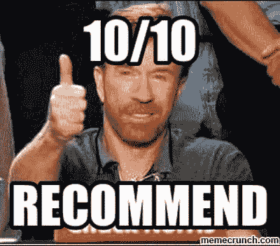

# 为您和您的团队提供角形课程，终极课程回顾

> 原文：<https://dev.to/wesgrimes/angular-courses-for-you-and-your-team-a-review-of-ultimate-courses-4oj9>

作为一个中小型软件公司的高级开发人员，我经常承担培训新开发人员或经验丰富的新技术开发人员的任务。我一直在寻找减轻负担的方法，并使所有相关方的流程标准化。

一对一的培训和讲师指导的培训课程非常好，但并不是每个人都有这样的资源，而且我们当前的工作量和“交付成果”往往会阻止我们留出一周(或更多)的时间来专门进行新主题的培训。阅读这篇文章的大多数人都很清楚现有的主流在线培训课程。脑海中浮现出复数和[琳达](http://lynda.com/)。

虽然这些都是很棒的资源，但通常很难找到教授最新和最棒的前端库和框架版本的培训课程。在这篇文章中，我将探索由[托德莫斯特](https://toddmotto.com/)(谷歌开发专家和 Angular extraordinaire)创建和策划的[终极课程](https://bit.ly/2WubqhW)。

* * *

# 让我们来看一下产品包

对于角度发展，[终极课程](https://ultimatecourses.com/courses/angular/ref/wes.grimes/)提供两种套餐可供选择:[角度 Kickstart 套餐](https://ultimatecourses.com/courses/angular/ref/wes.grimes/)和[角度终极套餐](https://ultimatecourses.com/courses/angular/ref/wes.grimes/)。让我们快速回顾一下不同之处。

# [角形 Kickstart 包](https://ultimatecourses.com/courses/angular/ref/wes.grimes/)

如果您的团队有以前的 TypeScript 经验，那么这是我推荐的软件包。它包括:

*   *角度基本原理*
*   *角临*

# [棱角分明的终极套装](https://ultimatecourses.com/courses/angular/ref/wes.grimes/)

对于大多数开发人员来说，学习 Angular 不仅仅是学习框架特性、约定和工具那么简单。对大多数人来说，这需要快速掌握 [TypeScript](http://www.typescriptlang.org/) ，这是 JavaScript 的一个强大的类型化超集。我推荐的任何在线解决方案都必须教授开发人员 TypeScript，谢天谢地，终极课程的 [Angular Ultimate Package](https://ultimatecourses.com/courses/angular/ref/wes.grimes/) 已经在这里介绍过了。它包括:

*   *角度基本原理*
*   *角临*
*   *打字稿基础知识*
*   *打字稿大师班*
*   *NGRX 商店+特效*

# 个别课程可用

如上所述，课程可以打包购买，但是也可以根据需要单独购买，这在某些情况下可能是有意义的。

# 团队授权可用

如果您正在与一个开发团队合作，Ultimate Courses 会随着用户数量的增长提供用户许可折扣。对于学习 Angular 的开发团队来说，这是一个很好的选择。

* * *

# 角度基础

本课程从高层次开始，慢慢深入到单页应用程序的基本构建模块。内容分为以下几个部分:

*   架构、设置、源文件
*   ES5 到 ES6 和类型脚本刷新程序
*   入门指南
*   模板基础
*   渲染流
*   组件架构和功能模块
*   服务、Http 和 Observables
*   模板驱动的表单、输入和验证
*   组件路由

我不会太深入这些部分，但我会说，作为一个入门课程，这个产品做了一件了不起的工作，给你足够的信息是危险的(以一种好的方式)，而不是压倒第一次有角度的开发人员。

* * *

# 角临

这门课程采用了角度基础学的概念，并且非常深入。本课程涵盖的主题对学习至关重要，因为任何复杂的 Angular 应用程序几乎总是需要处理这些情况。我很欣赏托德对细节的关注。涵盖的主题包括:

*   高级组件—包括动态组件创建
*   指令
*   管道
*   反应式——这是一个很好的方法，因为现在角形的最佳实践被认为是反应式。
*   路由——这包括深入惰性加载模块，这是一种加速大型应用程序初始加载时间的方法
*   单元测试——分布式团队和复杂应用程序的必备工具。Todd 围绕内置角度工具的单元测试介绍了一些需要了解的主题。
*   依赖注入和区域
*   用 Rx 进行语句管理——尽管我推荐 [NgRx](http://ngrx.io/)

* * *

# 打字稿基础

本课程是对[打字稿](https://typescriptlang.org/)的介绍。来自 C#的开发人员会特别喜欢这个课程。此外，如果您使用 TypeScript 进行构建，该课程可以从[包](https://ultimatecourses.com/courses/angular/ref/wes.grimes/)中单独购买。主题包括:

*   概述、设置和源文件
*   ES6/7 和类型脚本
*   原始类型
*   特殊类型
*   类型别名和断言
*   潜入界面
*   类、属性和继承

* * *

# 打字稿母版

就像任何语言一样，有些人使用基础语言，然后开始竞赛。然而，在某些情况下，你需要深入挖掘，真正理解发生了什么。如果您正在构建 Angular 或 NodeJS 库，那么本课程可能适合您。主题包括:

*   理解并键入“this”
*   类型查询
*   映射类型
*   探索型警卫
*   高级类型和实践
*   泛型和重载
*   探索枚举
*   申报文件
*   tsconfig 和编译器选项

* * *

# NGRX 商店+效果

> 我个人用 NgRx 已经很久了。没有它，我不再构建有角度的应用程序！所以对我来说，我非常好奇托德是如何解释这个话题的。对于第一次开发的人来说，Redux 是一个很复杂的模式，但是对于创建高质量的应用程序来说，它确实是必须的。

在 Angular 领域，Redux 模式在几个库中实现，最流行的是 NgRx 和 NGXS。对于不熟悉 redux 的人来说，Redux 是一种管理应用程序全局状态的模式。它最初是在脸书开发的，从那以后，它开始流行并被广泛应用于大多数现代前端框架中。NgRx 是迄今为止使用最广泛的 Angular redux 库。因此，Ultimate Courses 选择将其产品集中在 NgRx 上。当我们专注于这门课程时，我必须坦率地说，我对托德教授 NgRx 的方法感到惊喜和印象深刻。这个课程非常受欢迎，事实上，甚至连 Mike Ryan (NgRx 核心团队/Google 开发专家)都推荐这个课程作为入门的最佳方式！

# 课程演练

本课程首先介绍什么是状态管理，redux 如何实现状态管理，以及 JavaScript 如何应对突变带来的挑战。

一旦您掌握了使用 Redux 模式进行状态管理的概念，本课程将让您使用普通类型脚本构建自己的普通 Redux 存储。意识到 NgRx 是建立在这些概念之上的，学习 NgRx 就很容易了。

在建立了一个普通的 redux 商店之后，本课程将介绍使用 NgRx 提供的工具建立一个商店的过程。本课程将引导你创建动作、缩减器、选择器和效果。然后，本课程将介绍使用实体模式构建实体列表的过程。

即使有一些 NgRx 经验的人也会发现本课程很有帮助，因为它深入探讨了更高级的概念，如存储路由、预加载状态和单元测试 NgRx 存储。

以下是本课程涵盖的主题的详细列表:

*   Redux 架构
*   编写我们自己的 Redux 存储
*   架构:ngrx/store 和组件
*   核心要素
*   效果和实体
*   路由器状态组成
*   扩展我们的状态树
*   实体模式，CRUD 操作
*   通过调度路由
*   通过防护装置说明预载和保护
*   可观察性和变化检测
*   单元测试

* * *

# 结论

在参加了这些课程，并比较了其他可用的选项之后，我可以有把握地向希望进入 Angular 企业开发的团队推荐 [Angular Ultimate Package](https://ultimatecourses.com/courses/angular/ref/wes.grimes/) 。托德脚踏实地地解释复杂的概念，使得这些课程既有趣又有教育意义。作为额外的奖励，托德自己配音，这样你就可以学习带有英国口音的 Angular。三赢。

## 终极课程的更多信息

终极课程:JavaScript、Angular、NGRX 和 TypeScript 方面的专家在线课程
JavaScript、Angular、NGRX 和 TypeScript 方面的专家在线课程。通过[终极课程](https://ultimatecourses.com/courses/angular/ref/wes.grimes/)加入 50，000 名掌握新技术的人