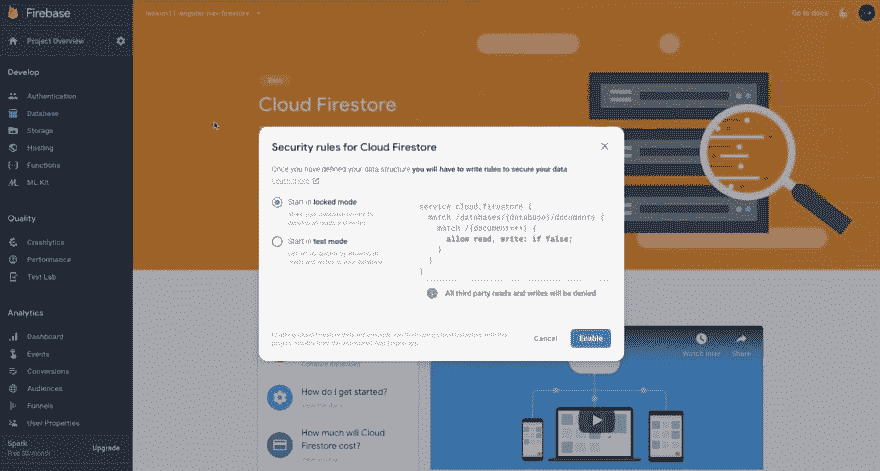
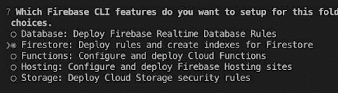
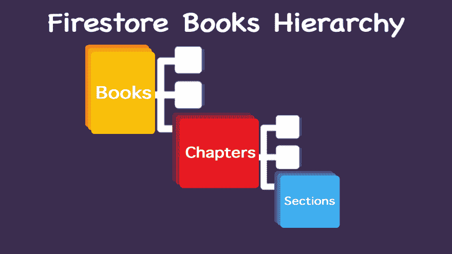

# 使用 firestorm 的角度材料动态导航

> 原文：<https://dev.to/codingcatdev/angular-material-dynamic-navigation-using-firestore-4ea4>

> 原帖:[https://ajonp . com/courses/angular material/angular-material-dynamic-navigation-using-firestore/](https://ajonp.com/courses/angularmaterial/angular-material-dynamic-navigation-using-firestore/)

[https://www.youtube.com/embed/sZoiLcq7N6Q](https://www.youtube.com/embed/sZoiLcq7N6Q)

# 使用 Firestore 进行角度素材动态导航

这一课的目标是利用我们的[第 10 课-角度材料主题化](http://ajonp.com/lessons/10-angular-material-theming/)并添加导航元素。本课的两个将包括[角材树](https://material.angular.io/components/tree/overview)和[角材展开面板](https://material.angular.io/components/expansion/overview)。

如果你精通 Firebase，只是想知道如何让这个树与 Firestore 一起工作，你可能想跳到本课的[树](#tree)部分。

### 🌎演示:[https://ajonp-lesson-11 . firebase app . com/books/](https://ajonp-lesson-11 . firebase app . com/books/)

## 上课步骤

1.  [项目设置](#project-setup)
2.  [Firestore](#firestore)
3.  [路由器更新](#router-updates)
4.  [组件更新](#component-updates)

# 项目设置

## 创建 Firebase 项目

Angular Firebase 有一个非常棒的 Firebase 初学者指南，所以你也可以看看。

> 你需要一个谷歌账户

请导航到 [Firebase 控制台](https://console.firebase.google.com/)在这里你可以用任何你喜欢的名字创建一个新项目。进入新项目后，请在`Database`选项卡下创建一个 firestore 数据库。

出现提示时，选择`locked mode`。
[](https://res.cloudinary.com/practicaldev/image/fetch/s--0auKNG8I--/c_limit%2Cf_auto%2Cfl_progressive%2Cq_auto%2Cw_880/https://res.cloudinary.com/ajonp/image/upload/f_auto%2Cfl_lossy%2Cq_auto/v1548346547/ajonp-ajonp-com/11-lesson-angular-navigation-firestore/krp63uw43udiq94ndkrw.jpg)

## GitHub 第十课克隆

对于我们的初学者模板，我们将使用我们的 previes 课程 repo，确保您在一个目录中，您希望在本地放置 repo 并开始工作。

在您的终端中，将回购克隆到一个新文件夹

```
git clone https://github.com/AJONPLLC/lesson-10-angular-material-theming.git lesson-11 
```

Enter fullscreen mode Exit fullscreen mode

移除旧原点

```
git remote rm origin 
```

Enter fullscreen mode Exit fullscreen mode

如果愿意，您可以添加自己的 git repo，或者只在本地跟踪更改。
添加遥控器

```
git remote add origin -yourgiturl- 
```

Enter fullscreen mode Exit fullscreen mode

## 添加火基

> 如果您尚未下载 firebase CLI，请安装`npm install -g firebase-tools`。

安装后

```
firebase login 
```

Enter fullscreen mode Exit fullscreen mode

现在我们将初始化这个项目

```
firebase init 
```

Enter fullscreen mode Exit fullscreen mode

确保选择 Firestore，并接受所有其他默认设置

[](https://res.cloudinary.com/practicaldev/image/fetch/s--r5Ez5RPQ--/c_limit%2Cf_auto%2Cfl_progressive%2Cq_auto%2Cw_880/https://res.cloudinary.com/ajonp/image/upload/f_auto%2Cfl_lossy%2Cq_auto/v1548346992/ajonp-ajonp-com/11-lesson-angular-navigation-firestore/x7r97se1ymusolimrtfz.jpg)

然后，您需要将 firebase 添加到您的项目中，请再次查看上面的链接，按照视频操作。

# Firestore

## Firestore 服务创建

> 如果你没有 Angular CLI `npm install -g @angular/cli`。

使用 Angular CLI，我们将从创建服务开始。

```
ng g service core/services/firestore 
```

Enter fullscreen mode Exit fullscreen mode

这项服务将允许我们连接到 Firebase Firestore。

## Firestore 数据库设置

我们想在 Firestore
[](https://res.cloudinary.com/practicaldev/image/fetch/s--1MwwIjle--/c_limit%2Cf_auto%2Cfl_progressive%2Cq_auto%2Cw_880/https://res.cloudinary.com/ajonp/image/upload/f_auto%2Cfl_lossy%2Cq_auto/v1548347396/ajonp-ajonp-com/11-lesson-angular-navigation-firestore/books_hierarchy.jpg) 内部建立这个结构

在 Firestore 中，我们将设置这个基本结构。请记住，每个收藏都必须有一个文档。您可以在 [Firestore 文档概述](https://cloud.google.com/firestore/docs/overview)中找到更多信息

<video controls=""><source src="https://res.cloudinary.com/ajonp/video/upload/v1548347631/ajonp-ajonp-com/11-lesson-angular-navigation-firestore/_firebase_setup.webm" type="video/webm"> <source src="https://res.cloudinary.com/ajonp/video/upload/v1548347631/ajonp-ajonp-com/11-lesson-angular-navigation-firestore/_firebase_setup.mp4" type="video/mp4"></video> 

## 添加角火基服务

这项服务是由杰夫在[高级 Firestore 使用指南和 Angular](https://angularfirebase.com/lessons/firestore-advanced-usage-angularfire/)
中创造的

```
ng g service core/services/angularfirebase 
```

Enter fullscreen mode Exit fullscreen mode

代码

```
import { Injectable } from '@angular/core';
import {
  AngularFirestore,
  AngularFirestoreDocument,
  AngularFirestoreCollection,
  DocumentChangeAction,
  Action,
  DocumentSnapshotDoesNotExist,
  DocumentSnapshotExists
} from '@angular/fire/firestore';
import { Observable, from } from 'rxjs';
import {
  map,
  tap,
  take,
  mergeMap,
  expand,
  takeWhile,
  finalize
} from 'rxjs/operators';

import * as firebase from 'firebase/app';
import { AngularFireStorage } from '@angular/fire/storage';

type CollectionPredicate<T> = string | AngularFirestoreCollection<T>;
type DocPredicate<T> = string | AngularFirestoreDocument<T>;

@Injectable({
  providedIn: 'root'
})
export class AngularfirebaseService {
  constructor(
    public aFirestore: AngularFirestore,
    public aFireStorage: AngularFireStorage
  ) {}

  /// **************
  /// Get a Reference
  /// **************

  col<T>(ref: CollectionPredicate<T>, queryFn?): AngularFirestoreCollection<T> {
    return typeof ref === 'string'
      ? this.aFirestore.collection<T>(ref, queryFn)
      : ref;
  }

  doc<T>(ref: DocPredicate<T>): AngularFirestoreDocument<T> {
    return typeof ref === 'string' ? this.aFirestore.doc<T>(ref) : ref;
  }

  /// **************
  /// Get Data
  /// **************

  doc$<T>(ref: DocPredicate<T>): Observable<T> {
    return this.doc(ref)
      .snapshotChanges()
      .pipe(
        map(
          (
            doc: Action<
              DocumentSnapshotDoesNotExist | DocumentSnapshotExists<T>
            >
          ) => {
            return doc.payload.data() as T;
          }
        )
      );
  }

  col$<T>(ref: CollectionPredicate<T>, queryFn?): Observable<T[]> {
    return this.col(ref, queryFn)
      .snapshotChanges()
      .pipe(
        map((docs: DocumentChangeAction<T>[]) => {
          return docs.map((a: DocumentChangeAction<T>) =>
            a.payload.doc.data()
          ) as T[];
        })
      );
  }

  /// with Ids
  colWithIds$<T>(ref: CollectionPredicate<T>, queryFn?): Observable<any[]> {
    return this.col(ref, queryFn)
      .snapshotChanges()
      .pipe(
        map((actions: DocumentChangeAction<T>[]) => {
          return actions.map((a: DocumentChangeAction<T>) => {
            const data: Object = a.payload.doc.data() as T;
            const id = a.payload.doc.id;
            return { id, ...data };
          });
        })
      );
  }

  /// **************
  /// Write Data
  /// **************

  /// Firebase Server Timestamp
  get timestamp() {
    return firebase.firestore.FieldValue.serverTimestamp();
  }

  set<T>(ref: DocPredicate<T>, data: any): Promise<void> {
    const timestamp = this.timestamp;
    return this.doc(ref).set({
      ...data,
      updatedAt: timestamp,
      createdAt: timestamp
    });
  }

  update<T>(ref: DocPredicate<T>, data: any): Promise<void> {
    return this.doc(ref).update({
      ...data,
      updatedAt: this.timestamp
    });
  }

  delete<T>(ref: DocPredicate<T>): Promise<void> {
    return this.doc(ref).delete();
  }

  add<T>(
    ref: CollectionPredicate<T>,
    data
  ): Promise<firebase.firestore.DocumentReference> {
    const timestamp = this.timestamp;
    return this.col(ref).add({
      ...data,
      updatedAt: timestamp,
      createdAt: timestamp
    });
  }

  geopoint(lat: number, lng: number): firebase.firestore.GeoPoint {
    return new firebase.firestore.GeoPoint(lat, lng);
  }

  /// If doc exists update, otherwise set
  upsert<T>(ref: DocPredicate<T>, data: any): Promise<void> {
    const doc = this.doc(ref)
      .snapshotChanges()
      .pipe(take(1))
      .toPromise();

    return doc.then(
      (
        snap: Action<DocumentSnapshotDoesNotExist | DocumentSnapshotExists<T>>
      ) => {
        return snap.payload.exists
          ? this.update(ref, data)
          : this.set(ref, data);
      }
    );
  }

  /// **************
  /// Inspect Data
  /// **************

  inspectDoc(ref: DocPredicate<any>): void {
    const tick = new Date().getTime();
    this.doc(ref)
      .snapshotChanges()
      .pipe(
        take(1),
        tap(
          (
            d: Action<
              DocumentSnapshotDoesNotExist | DocumentSnapshotExists<any>
            >
          ) => {
            const tock = new Date().getTime() - tick;
            console.log(`Loaded Document in ${tock}ms`, d);
          }
        )
      )
      .subscribe();
  }

  inspectCol(ref: CollectionPredicate<any>): void {
    const tick = new Date().getTime();
    this.col(ref)
      .snapshotChanges()
      .pipe(
        take(1),
        tap((c: DocumentChangeAction<any>[]) => {
          const tock = new Date().getTime() - tick;
          console.log(`Loaded Collection in ${tock}ms`, c);
        })
      )
      .subscribe();
  }

  /// **************
  /// Create and read doc references
  /// **************

  /// create a reference between two documents
  connect(host: DocPredicate<any>, key: string, doc: DocPredicate<any>) {
    return this.doc(host).update({ [key]: this.doc(doc).ref });
  }

  /// returns a documents references mapped to AngularFirestoreDocument
  docWithRefs$<T>(ref: DocPredicate<T>) {
    return this.doc$(ref).pipe(
      map((doc: T) => {
        for (const k of Object.keys(doc)) {
          if (doc[k] instanceof firebase.firestore.DocumentReference) {
            doc[k] = this.doc(doc[k].path);
          }
        }
        return doc;
      })
    );
  }

  /// **************
  /// Atomic batch example
  /// **************

  /// Just an example, you will need to customize this method.
  atomic() {
    const batch = firebase.firestore().batch();
    /// add your operations here

    const itemDoc = firebase.firestore().doc('items/myCoolItem');
    const userDoc = firebase.firestore().doc('users/userId');

    const currentTime = this.timestamp;

    batch.update(itemDoc, { timestamp: currentTime });
    batch.update(userDoc, { timestamp: currentTime });

    /// commit operations
    return batch.commit();
  }

  /**
   * Delete a collection, in batches of batchSize. Note that this does
   * not recursively delete subcollections of documents in the collection
   * from: https://github.com/AngularFirebase/80-delete-firestore-collections/blob/master/src/app/firestore.service.ts
   */
  deleteCollection(path: string, batchSize: number): Observable<any> {
    const source = this.deleteBatch(path, batchSize);

    // expand will call deleteBatch recursively until the collection is deleted
    return source.pipe(
      expand(val => this.deleteBatch(path, batchSize)),
      takeWhile(val => val > 0)
    );
  }

  // Detetes documents as batched transaction
  private deleteBatch(path: string, batchSize: number): Observable<any> {
    const colRef = this.aFirestore.collection(path, ref =>
      ref.orderBy('__name__').limit(batchSize)
    );

    return colRef.snapshotChanges().pipe(
      take(1),
      mergeMap((snapshot: DocumentChangeAction<{}>[]) => {
        // Delete documents in a batch
        const batch = this.aFirestore.firestore.batch();
        snapshot.forEach(doc => {
          batch.delete(doc.payload.doc.ref);
        });

        return from(batch.commit()).pipe(map(() => snapshot.length));
      })
    );
  }
} 
```

Enter fullscreen mode Exit fullscreen mode

## 更新 Firstore 服务

```
import { Author } from './../models/author';
import { Injectable } from '@angular/core';
import { AngularFirestore } from '@angular/fire/firestore';
import { Observable } from 'rxjs';
import { Book } from '../models/book';
import { switchMap } from 'rxjs/operators';
import { AngularfirebaseService } from './angularfirebase.service';
import { Chapter } from '../models/chapter';
import { Section } from '../models/section';
import { Graphicnovel } from '../models/graphicnovel';

@Injectable({
  providedIn: 'root'
})
export class FirestoreService {
  constructor(private afb: AngularfirebaseService) {}
  // Books
  getBooks(): Observable<Book[]> {
    // Start Using AngularFirebase Service!!
    return this.afb.colWithIds$<Book[]>('books');
  }
  getBook(bookId: string): Observable<Book> {
    // Start Using AngularFirebase Service!!
    return this.afb.doc$<Book>(`books/${bookId}`);
  }

  // Chapters
  getBookChapters(bookId: string): Observable<Chapter[]> {
    return this.afb.colWithIds$<Chapter[]>(`books/${bookId}/chapters`);
  }
  getBookChapter(bookId: string, chapterId: string): Observable<Chapter> {
    // Start Using AngularFirebase Service!!
    return this.afb.doc$<Chapter>(`books/${bookId}/chapters/${chapterId}`);
  }

  // Sections
  getBookSections(bookId: string, chapterId: string): Observable<Section[]> {
    // return this.fs.collection('books').doc(bookId).collection('chapters').doc(chapterId).collection('sections').valueChanges();
    // or you can use string template
    return this.afb.colWithIds$<Section[]>(
      `books/${bookId}/chapters/${chapterId}/sections`
    );
  }
  getBookSection(
    bookId: string,
    chapterId: string,
    sectionId: string
  ): Observable<Section> {
    // Start Using AngularFirebase Service!!
    return this.afb.doc$<Section>(
      `books/${bookId}/chapters/${chapterId}/sections/${sectionId}`
    );
  }

  // Get Authors
  getAuthors(): Observable<Author[]> {
    // Start Using AngularFirebase Service!!
    return this.afb.colWithIds$<Author[]>('authors');
  }

  // Graphic Novels
  getGraphicNovels(): Observable<Graphicnovel[]> {
    // Start Using AngularFirebase Service!!
    return this.afb.colWithIds$<Graphicnovel[]>('graphicnovels');
  }
} 
```

Enter fullscreen mode Exit fullscreen mode

# 路由器更新

下面的路径是按照它们将延迟加载并被遍历以显示图书路径的顺序设置的。

## App 路由器

需要更新主路由器到参考书

app-routing.module.ts

```
import { NgModule } from '@angular/core';
import { Routes, RouterModule } from '@angular/router';

const routes: Routes = [
  {
    path: 'welcome',
    loadChildren: './modules/welcome/welcome.module#WelcomeModule'
  },
  {
    path: 'books',
    loadChildren: './modules/books/books.module#BooksModule'
  },
  {
    path: 'kitchensink',
    loadChildren: './modules/kitchensink/kitchensink.module#KitchensinkModule'
  },
  {
    path: '',
    redirectTo: '/books',
    pathMatch: 'full'
  }
];

@NgModule({
  imports: [RouterModule.forRoot(routes)],
  exports: [RouterModule]
})
export class AppRoutingModule {} 
```

Enter fullscreen mode Exit fullscreen mode

## 预定顶级路由器

在我们的图书路由器的更新设置中，我们需要延迟加载图书列表(针对我们所有的图书)，以及图书细节(针对一本图书)。

books-routing.modules.ts

```
import { BooksComponent } from './books.component';
import { NgModule } from '@angular/core';
import { Routes, RouterModule } from '@angular/router';

const routes: Routes = [
  {
    path: '',
    component: BooksComponent,
    children: [
      {
        path: '',
        loadChildren: './book-list/book-list.module#BookListModule'
      },
      {
        path: ':bookId',
        loadChildren: './book-detail/book-detail.module#BookDetailModule'
      }
    ]
  }
];

@NgModule({
  imports: [RouterModule.forChild(routes)],
  exports: [RouterModule]
})
export class BooksRoutingModule {} 
```

Enter fullscreen mode Exit fullscreen mode

## 预订详细路由器

请记住，这是我们在上一课`book-drawer`中添加命名插座的地方。这个组件是我们将重点加载新树的地方。

```
import { BookDrawerComponent } from './../book-drawer/book-drawer.component';
import { BookDetailComponent } from './book-detail.component';
import { NgModule } from '@angular/core';
import { Routes, RouterModule } from '@angular/router';

const routes: Routes = [
  {
    path: '',
    component: BookDetailComponent
  },
  {
    path: '',
    component: BookDrawerComponent,
    outlet: 'book-drawer'
  }
];

@NgModule({
  imports: [RouterModule.forChild(routes)],
  exports: [RouterModule]
})
export class BookDetailRoutingModule { } 
```

Enter fullscreen mode Exit fullscreen mode

# 组件更新

现在我们已经有了所有的管道设置，我们可以向我们的`book-drawer`组件添加一个新组件。

## 创建图书列表

在导航到图书详细信息之前，我们需要首先能够选择一本书。为此，我们将创建一个图书列表模块。

```
ng g m modules/books/book-list && ng g c modules/books/book-list 
```

Enter fullscreen mode Exit fullscreen mode

### 书单展开面板

```
<mat-accordion [displayMode]="'flat'">
  <mat-expansion-panel [expanded]="rlaBooks.isActive">
    <mat-expansion-panel-header>
      <mat-panel-title
        routerLink="/books"
        routerLinkActive="active-link"
        (click)="$event.stopPropagation()"
        #rlaBooks="routerLinkActive"
        >Books</mat-panel-title
      >
    </mat-expansion-panel-header>

    <mat-nav-list class="nav-links">
      <a
        mat-list-item
        [routerLink]="['/books', book.id]"
        routerLinkActive="active-link"
        *ngFor="let book of (bookList | async)"
      >
        <h4 matLine>{{ book.title }}</h4>
      </a>
    </mat-nav-list>
  </mat-expansion-panel>
  <mat-expansion-panel>
    <mat-expansion-panel-header>
      <mat-panel-title>Graphic Novels</mat-panel-title>
    </mat-expansion-panel-header>
    <mat-nav-list class="nav-links">
      <a
        mat-list-item
        [routerLink]="['/graphicnovels', gn.id]"
        routerLinkActive="active-link"
        *ngFor="let gn of (graphicNovelList | async)"
      >
        <h4 matLine>{{ gn.title }}</h4>
      </a>
    </mat-nav-list>
  </mat-expansion-panel>
  <mat-expansion-panel>
    <mat-expansion-panel-header>
      <mat-panel-title (click)="$event.stopPropagation()"
        >Authors</mat-panel-title
      >
    </mat-expansion-panel-header>
    <mat-nav-list class="nav-links">
      <a
        mat-list-item
        [routerLink]="['/authors', author.id]"
        routerLinkActive="active-link"
        *ngFor="let author of (authorList | async)"
      >
        <h4 matLine>{{ author.name }}</h4>
      </a>
    </mat-nav-list>
  </mat-expansion-panel>
</mat-accordion> 
```

Enter fullscreen mode Exit fullscreen mode

### 填充扩展面板

使用 firestore 服务来填充每本书的 Observables。

```
@Component({
  selector: 'app-book-list',
  templateUrl: './book-list.component.html',
  styleUrls: ['./book-list.component.scss']
})
export class BookListComponent implements OnInit {
  bookList: Observable<Book[]>;
  graphicNovelList: Observable<Graphicnovel[]>;
  authorList: Observable<Author[]>;
  constructor(private fs: FirestoreService, private router: Router) {}

  ngOnInit() {
    this.bookList = this.fs.getBooks();
    this.graphicNovelList = this.fs.getGraphicNovels();
    this.authorList = this.fs.getAuthors();
  }
} 
```

Enter fullscreen mode Exit fullscreen mode

## 创建图书树

```
ng g m modules/books/book-tree && ng g c modules/books/book-tree 
```

Enter fullscreen mode Exit fullscreen mode

```
<mat-tree [dataSource]="dataSource" [treeControl]="treeControl">
  <mat-tree-node *matTreeNodeDef="let node" matTreeNodePadding>
    <button mat-icon-button disabled></button>
    <button mat-button (click)="section(node)">{{ node.item }}</button>
  </mat-tree-node>
  <mat-tree-node *matTreeNodeDef="let node; when: hasChild" matTreeNodePadding>
    <button
      mat-icon-button
      [attr.aria-label]="'toggle ' + node.filename"
      matTreeNodeToggle
    >
      <mat-icon class="mat-icon-rtl-mirror">
        {{ treeControl.isExpanded(node) ? 'expand_more' : 'chevron_right' }}
      </mat-icon>
    </button>
    {{ node.item }}
    <mat-progress-bar
      *ngIf="node.isLoading"
      mode="indeterminate"
      class="example-tree-progress-bar"
    ></mat-progress-bar>
  </mat-tree-node>
</mat-tree> 
```

Enter fullscreen mode Exit fullscreen mode

我将在下面更详细地分解整个组件，因为现在这里是代码。

```
import { Book } from 'src/app/core/models/book';
import { Injectable, Component, OnInit, OnDestroy } from '@angular/core';
import { BehaviorSubject, Observable, merge, Subscription } from 'rxjs';
import { FlatTreeControl } from '@angular/cdk/tree';
import { ActivatedRoute, Params, Router } from '@angular/router';
import { FirestoreService } from 'src/app/core/services/firestore.service';
import { CollectionViewer, SelectionChange } from '@angular/cdk/collections';
import { map, tap, take } from 'rxjs/operators';
import { Chapter } from 'src/app/core/models/chapter';
import { Section } from 'src/app/core/models/section';

/** Flat node with expandable and level information */
export class DynamicFlatNode {
  constructor(
    public item: string,
    public level = 1,
    public expandable = false,
    public isLoading = false,
    public book?: Book,
    public chapter?: Chapter,
    public section?: Section
  ) {}
}

@Injectable()
export class DynamicDataSource {
  dataChange = new BehaviorSubject<DynamicFlatNode[]>([]);
  bookTree = {};
  subscriptions: Subscription[] = [];
  get data(): DynamicFlatNode[] {
    return this.dataChange.value;
  }
  set data(value: DynamicFlatNode[]) {
    this.treeControl.dataNodes = value;
    this.dataChange.next(value);
  }

  constructor(
    private treeControl: FlatTreeControl<DynamicFlatNode>,
    private route: ActivatedRoute,
    private fs: FirestoreService,
    private router: Router
  ) {
    /** Initial data from database */
    this.subscriptions.push(
      this.route.queryParams.subscribe(params => {
        console.log(params);
      })
    );
    this.subscriptions.push(
      this.route.paramMap.subscribe(paramMap => {
        const bookId = paramMap.get('bookId');
        this.fs.getBookChapters(bookId).subscribe(chapters => {
          const nodes: DynamicFlatNode[] = [];
          chapters.sort((a, b) => (a.sort < b.sort ? -1 : 1));
          chapters.forEach(chapter =>
            nodes.push(
              new DynamicFlatNode(
                chapter.title,
                0,
                true,
                false,
                { id: bookId },
                chapter
              )
            )
          );
          this.data = nodes;
        });
      })
    );
  }

  connect(collectionViewer: CollectionViewer): Observable<DynamicFlatNode[]> {
    this.treeControl.expansionModel.onChange.subscribe(change => {
      if (
        (change as SelectionChange<DynamicFlatNode>).added ||
        (change as SelectionChange<DynamicFlatNode>).removed
      ) {
        this.handleTreeControl(change as SelectionChange<DynamicFlatNode>);
      }
    });

    return merge(collectionViewer.viewChange, this.dataChange).pipe(
      map(() => this.data)
    );
  }

  /** Handle expand/collapse behaviors */
  handleTreeControl(change: SelectionChange<DynamicFlatNode>) {
    if (change.added) {
      change.added.forEach(node => this.toggleNode(node, true));
    }
    if (change.removed) {
      change.removed
        .slice()
        .reverse()
        .forEach(node => this.toggleNode(node, false));
    }
  }

  /**
   * Toggle the node, remove from display list
   */
  toggleNode(node: DynamicFlatNode, expand: boolean) {
    const index = this.data.indexOf(node);
    node.isLoading = true;
    if (expand) {
      this.subscriptions.push(
        this.fs
          .getBookSections(node.book.id, node.chapter.id)
          .subscribe(async sections => {
            console.log(sections);
            const nodes: DynamicFlatNode[] = [];
            sections.sort((a, b) => (a.sort < b.sort ? -1 : 1));
            sections.forEach(section =>
              nodes.push(
                new DynamicFlatNode(
                  section.title,
                  1,
                  false,
                  false,
                  node.book,
                  node.chapter,
                  section
                )
              )
            );
            this.data.splice(index + 1, 0, ...nodes);
            this.dataChange.next(this.data);

            // Update query params on current chapter
            await this.router.navigate([], {
              relativeTo: this.route,
              queryParams: { chapterId: node.chapter.id },
              queryParamsHandling: 'merge'
            });
            // Remove any left over section params
            await this.router.navigate([], {
              relativeTo: this.route,
              queryParams: { sectionId: '' },
              queryParamsHandling: 'merge'
            });

            node.isLoading = false;
          })
      );
    } else {
      let count = 0;
      for (
        let i = index + 1;
        i < this.data.length && this.data[i].level > node.level;
        i++, count++
      ) {}
      this.data.splice(index + 1, count);
      // notify the change
      this.dataChange.next(this.data);
      node.isLoading = false;
    }
  }
}

@Component({
  selector: 'app-book-tree',
  templateUrl: './book-tree.component.html',
  styleUrls: ['./book-tree.component.scss']
})
export class BookTreeComponent implements OnInit, OnDestroy {
  treeControl: FlatTreeControl<DynamicFlatNode>;
  dataSource: DynamicDataSource;
  constructor(
    private route: ActivatedRoute,
    private fs: FirestoreService,
    private router: Router
  ) {
    this.treeControl = new FlatTreeControl<DynamicFlatNode>(
      this.getLevel,
      this.isExpandable
    );
    this.dataSource = new DynamicDataSource(
      this.treeControl,
      this.route,
      this.fs,
      this.router
    );
  }

  ngOnInit() {}

  ngOnDestroy() {
    this.dataSource.subscriptions.forEach(s => {
      s.unsubscribe();
    });
  }

  section(node: DynamicFlatNode) {
    // Update query params on current chapter
    this.router.navigate([], {
      relativeTo: this.route,
      queryParams: { sectionId: node.section.id },
      queryParamsHandling: 'merge'
    });
  }

  getLevel = (node: DynamicFlatNode) => node.level;

  isExpandable = (node: DynamicFlatNode) => node.expandable;

  hasChild = (_: number, _nodeData: DynamicFlatNode) => _nodeData.expandable;
} 
```

Enter fullscreen mode Exit fullscreen mode

### 书柜内的参考书树

我们现在可以更新`book-drawer`。

book-drawer.component.html

```
<app-book-tree></app-book-tree> 
```

Enter fullscreen mode Exit fullscreen mode

请确保在`book-drawer.module.ts`中也导入`BookTreeModule`。

```
...
 imports: [CommonModule, BookTreeModule],
... 
```

Enter fullscreen mode Exit fullscreen mode

# 树

[有角材料树](https://material.angular.io/components/tree/overview)

## 分解动态树

有两个关键指令驱动动态树`dataSource`和`treeControl`。

*   dataSource:提供包含要呈现的最新数据数组的流。受树的视图流窗口的影响(屏幕上当前有哪些数据节点)。数据源可以是一个可观察的数据数组，也可以是一个要呈现的数据数组。
*   treeControl:控制可视化树的布局和功能。

book-tree.comopnent.html

```
<mat-tree [dataSource]="dataSource" [treeControl]="treeControl"> 
```

Enter fullscreen mode Exit fullscreen mode

### 数据源

在我们的例子中，我们将 dataSource 分配给来自类`DynamicDataSource`的一个新对象。这个类是从我们的`BookTreeComponent`中需要的必要的依赖注入类中传递出来的。

```
 this.dataSource = new DynamicDataSource(
      this.treeControl,
      this.route,
      this.fs,
      this.router
    ); 
```

Enter fullscreen mode Exit fullscreen mode

### 动态数据源

`DynamicDataSource's`的主要工作是为树的设置获取初始数据，控制任何附加数据的流动，并在树被切换时做出反应。

我们在树中使用的数据类型是由类`DynamicFlatNode`定义的，这个类将我们在树中使用的数据保存为一个数组。也许更好的说法是我们的树是由一个数组`DynamicFlatNode`组成的。

```
export class DynamicFlatNode {
  constructor(
    public item: string,
    public level = 1,
    public expandable = false,
    public isLoading = false,
    public book?: Book,
    public chapter?: Chapter,
    public section?: Section
  ) {}
} 
```

Enter fullscreen mode Exit fullscreen mode

您可以在`DynamicDataSource`的第一行看到，我们为数组创建了一个新的 BehaviorSubject。这实际上为树的`dataSource`创建了一个空数组。

```
export class DynamicDataSource {
  dataChange = new BehaviorSubject<DynamicFlatNode[]>([]); 
```

Enter fullscreen mode Exit fullscreen mode

在我们的例子中，我们通过订阅我们的`bookId`来设置初始数据，并获取相应书籍的章节。你会注意到我们创建了一个`DynamicFlatNode`对象并将其添加到数组`nodes`中。然后，我们将我们创建的数组分配给`DynamicDataSource`的`data`属性。

```
 /** Initial data from database */
    this.subscriptions.push(
      this.route.paramMap.subscribe(paramMap => {
        const bookId = paramMap.get('bookId');
        this.fs.getBookChapters(bookId).subscribe(chapters => {
          const nodes: DynamicFlatNode[] = [];
          chapters.sort((a, b) => (a.sort < b.sort ? -1 : 1));
          chapters.forEach(chapter =>
            nodes.push(
              new DynamicFlatNode(
                chapter.title, // chapter title
                0, // Tree Level
                true, // Expandable
                false, // Is Loading
                { id: bookId }, // Object representing book
                chapter // Object for our current Chapter from firestore
              )
            )
          );
          this.data = nodes;
        });
      })
    ); 
```

Enter fullscreen mode Exit fullscreen mode