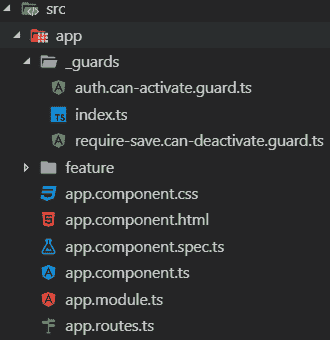
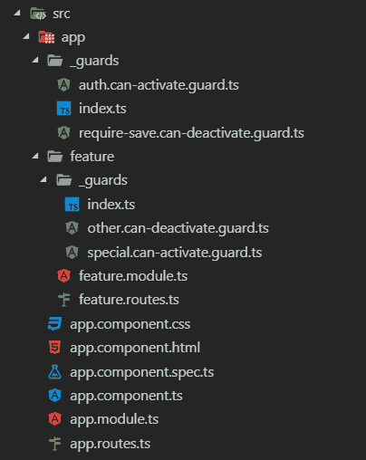

# 角度路由-企业应用的最佳实践

> 原文：<https://dev.to/angular/angular-routing---best-practices-for-enterprise-applications-3p6b>

## 开始之前

本文并不打算成为 Angular 中布线的教程。如果您是 Angular 路由的新手，我强烈建议您查看以下资源之一:

*   [官方角度文档](https://angular.io/guide/router)

## 背景

下面是我在构建了几个企业角度应用程序后，在日常工作中开发的一个模式。虽然大多数在线教程在奠定基础方面做得很好，但我很难找到展示大型可伸缩应用程序的推荐约定和模式的文章。

使用这种模式，您应该对应用程序中所有与路由相关的问题有一个清晰简洁的组织。

## 先决条件

对于上下文，本文假设您正在使用以下版本的 Angular:

*   角度 v7.2.6

* * *

## 最佳实践#1 -创建顶级路由数组文件

> 官方的 [Angular 文档推荐](https://angular.io/guide/router#refactor-the-routing-configuration-into-a-routing-module)为你的顶级路由创建一个成熟的`app-routing.module.ts`。我发现这额外的一层在大多数情况下是不必要的。

让我们采用以下方法:

1.  在根目录`src/app`下创建一个名为`app.routes.ts`的新文件。这个文件将保存我们的顶级`Routes`数组。我们将在整篇文章的后面回来并填充它。现在，让我们用以下内容来搭建它:

> 热提示:这里只注册顶级路由，如果您计划实现特性模块，那么子路由将位于各自的`feature.routes.ts`文件下。我们希望尽可能保持这个顶级 routes 文件的整洁，并遵循组件树结构。

```
import { Routes } from '@angular/router';

export const AppRoutes: Routes = []; 
```

Enter fullscreen mode Exit fullscreen mode

1.  在`app.module.ts`文件中注册`AppRoutes`。

*   从`app.routes.ts`导入`AppRoutes`。
*   从`@angular/router`导入`RouterModule`。
*   将`RouterModule.forRoot(AppRoutes)`添加到您的`imports`数组中

您更新后的`app.module.ts`将类似于以下内容:

```
import { NgModule } from '@angular/core';
import { BrowserModule } from '@angular/platform-browser';
import { RouterModule } from '@angular/router';
import { AppComponent } from './app.component';
import { AppRoutes } from './app.routes';

@NgModule({
  declarations: [AppComponent],
  imports: [BrowserModule, RouterModule.forRoot(AppRoutes)],
  providers: [],
  bootstrap: [AppComponent]
})
export class AppModule {} 
```

Enter fullscreen mode Exit fullscreen mode

## 最佳实践#2 -创建要素级路线数组文件

以类似于我们构建`app.routes.ts`的方式，我们将创建一个`feature.routes.ts`来列出该功能模块的各个路线。我们希望我们的路线尽可能靠近源头。这将与干净的代码方法保持一致，并具有良好的关注点分离。

1.  创建一个名为`feature/feature.routes.ts`的新文件，其中`feature`与您的`feature.module.ts`前缀相匹配。这个文件将保存我们的特性级`Routes`数组。请记住，您将使用您的模块的实际名称来替换`Feature`，让我们用以下内容来搭建它:

```
import { Routes } from '@angular/router';

export const FeatureRoutes: Routes = []; 
```

Enter fullscreen mode Exit fullscreen mode

1.  在`feature/feature.module.ts`文件中注册`FeatureRoutes`。我们将使用`RouterModule.forChild`导入，这样这些路由将自动注册到延迟加载中。

*   从`feature.routes.ts`导入`FeatureRoutes`。
*   从`@angular/router`导入`RouterModule`。
*   将`RouterModule.forChild(FeatureRoutes)`添加到您的`imports`数组中

您更新后的`feature/feature.module.ts`将类似于以下内容:

```
import { CommonModule } from '@angular/common';
import { NgModule } from '@angular/core';
import { RouterModule } from '@angular/router';
import { FeatureRoutes } from './feature.routes';

@NgModule({
  declarations: [],
  imports: [CommonModule, RouterModule.forChild(FeatureRoutes)]
})
export class FeatureModule {} 
```

Enter fullscreen mode Exit fullscreen mode

一个带有子路线的`feature.routes.ts`文件的例子如下:

```
import { Routes } from '@angular/router';
import { FeatureOneComponent } from './feature-one.component';
import { FeatureSpecificCanActivateGuard } from './_guards';

export const FeatureOneRoutes: Routes = [
  {
    path: '',
    component: FeatureOneComponent,
    canActivate: [FeatureSpecificCanActivateGuard]
  }
]; 
```

Enter fullscreen mode Exit fullscreen mode

## 最佳实践#3 -将延迟加载的特性添加到顶级路线文件中

> 延迟加载的概念是将代码资产(javascript、样式)的加载推迟到用户真正需要使用资源的时候。这可以大大提高应用程序的感知加载时间，因为不必在第一次绘制时下载整个代码集。
> 
> Angular 提供了一种很好的方式来处理这个问题，对于给定的路线使用`loadChildren`选项。更多信息可以在[官方角度文件](https://angular.io/guide/router#lazy-loading-route-configuration)中找到。

一旦创建了`app.routes.ts`和`*.routes.ts`文件，就需要注册任何想要延迟加载的特性模块。

### 每个功能模块…

更新`app.routes.ts`文件中的`AppRoutes`数组，以包含新的特征路线:

```
import { Routes } from '@angular/router';

export const AppRoutes: Routes = [
  {
    path: 'feature',
    loadChildren: './feature/feature.module#FeatureModule'
  }
]; 
```

Enter fullscreen mode Exit fullscreen mode

通过将上述路由添加到数组中，当用户在浏览器中请求`/feature`时，Angular lazy 使用给定的路径加载模块，然后使用`RouterModule.forChild`导入自动注册在`feature.routes.ts` `FeatureRoutes`数组中定义的任何路由。

对于每一个额外的特性模块，您将向`AppRoutes`数组添加另一个项目。如果您有多个特性，它可能看起来像下面这样:

```
import { Routes } from '@angular/router';

export const AppRoutes: Routes = [
  {
    path: '',
    pathMatch: 'full',
    redirectTo: 'feature-one'
  },
  {
    path: 'feature-one',
    loadChildren: './feature-one/feature-one.module#FeatureOneModule'
  },
  {
    path: 'feature-two',
    loadChildren: './feature-two/feature-two.module#FeatureTwoModule'
  }
]; 
```

Enter fullscreen mode Exit fullscreen mode

## 最佳实践#4 -保持路由器防护有序

这里有一些让你的路由器防护保持有序的小技巧。这些只是指导方针，但我发现它们非常有帮助。

### 给你的护卫起个好名字

警卫应使用以下命名约定:

*   文件名:`name.function.guard.ts`
*   类名:`NameFunctionGuard`

每个部分被标识为:

*   这是你护卫的名字。你在防范什么？
*   这是你的守卫将被赋予的功能。角撑`CanActivate`、`CanActivateChild`、`CanDeactivate`和`Resolve`。

一个附加到`CanActivate`函数的授权保护的例子命名如下:

*   文件名:`auth.can-activate.guard`
*   类名:`AuthCanActivateGuard`

### `_guards`文件夹下的群组

> 注意文件夹上的下划线“_”前缀，这只是为了在编辑器中进行排序。我总是希望这些文件夹显示在顶部。我对 _ 模型和 _ 服务做同样的事情。

将所有顶级守卫组织在一个名为`src/app/_guards`的文件夹下。我见过一些应用程序，其中的守卫被存储在顶级目录中。我不是这种方法的粉丝，因为如果你最终有几个以上的警卫，这可能会变得混乱。

### 使用桶出口

> 使用桶导出是否被官方认为是“最佳实践”，甚至是否得到 Angular style guide 的支持，还没有定论。然而，我非常喜欢这种干净的组织。这种方法是作为建议提供的。

确保`src/app/_guards`有一个漂亮干净的`index.ts`桶出口。桶导出是简单的`index.ts`文件，它们组合在一起，从一个目录中导出所有公共文件。一个例子如下:

```
export * from './auth.can-activate.guard';
export * from './require-save.can-deactivate.guard'; 
```

Enter fullscreen mode Exit fullscreen mode

不带桶出口:

```
import { AuthCanActivateGuard } from 'src/app/_guards/auth.can-activate.guard';
import { RequireSaveCanDeactivateGuard } from 'src/app/_guards/require-save.can-deactivate.guard'; 
```

Enter fullscreen mode Exit fullscreen mode

带桶出口:

```
import { AuthCanActivateGuard, RequireSaveCanDeactivateGuard } from 'src/app/_guards'; 
```

Enter fullscreen mode Exit fullscreen mode

带有`_guards`目录的示例应用程序如下所示:

[](https://res.cloudinary.com/practicaldev/image/fetch/s--ePzBk4Dk--/c_limit%2Cf_auto%2Cfl_progressive%2Cq_auto%2Cw_880/https://wesleygrimes.com/assets/post_headers/routing_directory.png)

### 组织特色路线守卫

如果你有在特定的`FeatureRoutes`阵列中使用的*专用*守卫，那么将这些路线存储在你的特征文件夹下的一个名为`_guards`的文件夹下。确保遵循上面定义的相同命名约定，以及桶导出。

*   在特征文件夹下名为`_guards`的文件夹下放置防护
*   确保为干净导入创建一个桶导出`index.ts`

带有`_guards`的特征目录示例如下:

[](https://res.cloudinary.com/practicaldev/image/fetch/s--WUVWts1p--/c_limit%2Cf_auto%2Cfl_progressive%2Cq_auto%2Cw_880/https://wesleygrimes.com/assets/post_headers/routing_feature_directory.png)

## 完成应用结构

完整的应用程序结构应该如下所示:

[](https://res.cloudinary.com/practicaldev/image/fetch/s---SqG8P_r--/c_limit%2Cf_auto%2Cfl_progressive%2Cq_auto%2Cw_880/https://wesleygrimes.com/assets/post_headers/routing_completed_structure.png)

* * *

## 示例 GitHub 资源库

我在 GitHub 上创建了一个演示库。随意派生、克隆和提交 PRs。

[https://github . com/Wesley Grimes/angular-routing-best-practices](https://github.com/wesleygrimes/angular-routing-best-practices)

## 结论

重要的是要记住，我已经在几个“真实世界”的应用程序中实现了这些最佳实践。虽然我发现这些最佳实践是有帮助的，并且是可维护的，但是我不认为它们是组织项目中路线的终极解决方案；我就是这么做的。我很好奇你们都是怎么想的？在使用 routing 构建企业级 Angular 应用程序时，请随时提供您所学到的任何建议、技巧或最佳实践，我将更新文章以反映这一点。

编码快乐！