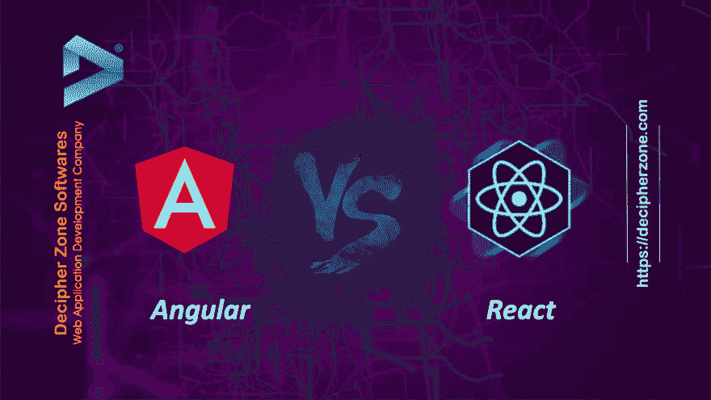

# Angular vs React:哪个最适合 web 应用开发？

> 原文：<https://dev.to/decipherzonesoft/angular-vs-react-which-one-is-best-for-web-application-development-1ne9>

Angular vs React 在制作 web 应用程序时，选择使用哪个 JavaScript 系统可能是一个很棒的选择。谷歌和脸书的前端运动结构有巨大的规划框架，无论如何，对商业和应用程序的想法是独特的兴奋。有不同的选择，但明确的竞争包括两个最重的击球手之间的决定:角度或反应？

棱角反应

Angular 是一个全栈 web 应用系统，位于 Typescript 中，定期与面向单页面应用的前端设计模式连接，由 Google 维护。Angular 是一个超级英雄的 JavaScript MVVM 系统，开发于 2009 年，对于结构化过度的 web 应用程序来说是不可思议的。React 是一个位于 JavaScript 中的 UI 库，通常与基于零件的工程模式相关，由脸书维护。

Angular vs React:哪个最适合 web 应用开发？

Angular vs React，利用工具创建不同的 web 应用程序，永远不会有最好的。每个人都有自己的优点和缺点。在一种情况下有利可图的成分可能对另一种情况不利。

Angular 的优势:在这里阅读全文:[https://www . decipherzone . com/blog-detail/Angular-vs-React-for-Web-Application-Development](https://www.decipherzone.com/blog-detail/Angular-vs-React-for-Web-Application-Development)