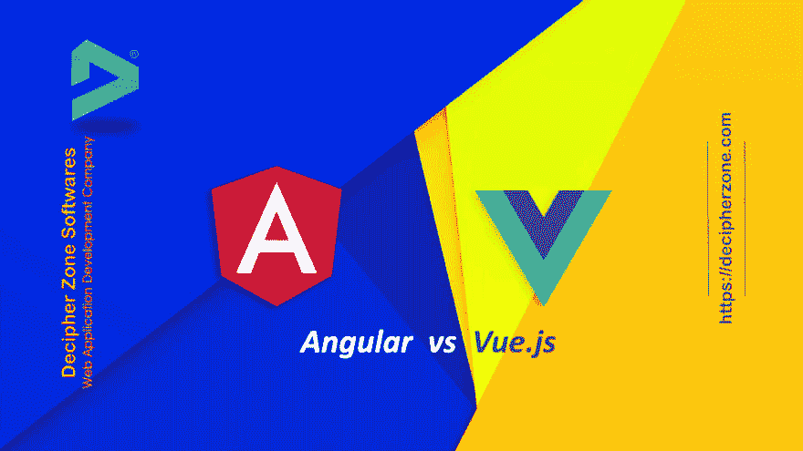

# Angular vs Vue:哪个 JavaScript 框架更适合 Web App 开发？

> 原文：<https://dev.to/decipherzone/angular-vs-vue-which-javascript-framework-is-better-for-web-app-development-6ge>

Angular vs Vue vs Angular vs Vue.js，JavaScript 框架正在改变前端开发者开发 web 应用的观念。JavaScript 框架为轻松构建跨平台的 web 应用程序提供了潜力，并为未来提供了更好的考虑。但是，并不是所有的 JavaScript 框架都没有得到开发界的关注。

而许多新的 JavaScript 框架，如 Vue 和 Ember，已经进入市场，并以其优秀的替代品吸引了更多的开发者。一些像 jQuery 和 Aurelia 这样的框架正在失去他们在 JavaScript 世界的市场。jQuery 和 Aurelia 正在失去 web 应用开发者的关注。

angular vs vue . js(角度 vue . js)

2019 年选择哪些 JavaScript 框架最好？讨论 Angular 和 Vue 这两个流行的框架，并找出哪一个更适合应用程序开发。

有角的

Angular 由 Google 发布，是一个开源框架，用于构建动态网站和 web 应用程序。Angular 属于 MEAN stack 的范畴，最大的代码开发人员社区都支持它。

**Angular vs React:web app 开发哪个好？**

view . js-检视. js

Evan 创建的 Vue.js 是一个开源框架。vue.js 框架对于创建简单的页面 web 应用程序有很高的需求。

为什么选择棱角分明？点击此处阅读全文:[https://www.decipherzone.com/blog-detail/Angular-vs-Vue-哪一个更适合网络应用开发-](https://www.decipherzone.com/blog-detail/Angular-vs-Vue--Which-is-Better-For-Web-App-Development-)