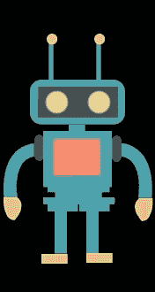
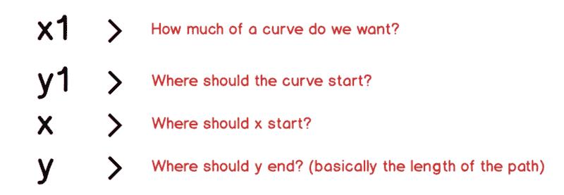
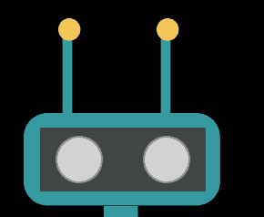
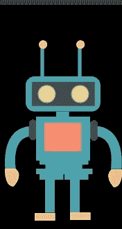
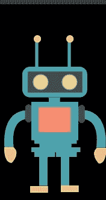
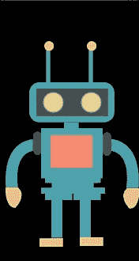

# 用绿麻袋制作机器人动画

> 原文：<https://dev.to/paulryan7/animate-a-robot-with-greensock-4ldc>

所以，今天我们将使用 GreenSock 库制作一个机器人 SVG 动画。我甚至还没有开始工作，但是当你读到这篇文章的时候，我已经完成了。我已经决定记录我创作这部动画的旅程，这样到最后我可以教你，这样你就不必面对同样的挣扎(十指交叉🤞) .

这篇文章将着重于为我们的机器人创建 3 个动画；闪烁，天线摆动，让机器人移动一点点。那么我们开始吧！

我们要做的第一件事是去找一个机器人 SVG。我绝对喜欢[插图](https://undraw.co/illustrations)来寻找很酷的 SVG 图片。我从那里下载了机器人 SVG，但是我把它做得比原来的干净多了，所以实际上可以制作动画。下面是我们的机器人。

[https://codepen.io/PaulRyan17/embed/pQRGmN?height=600&default-tab=result&embed-version=2](https://codepen.io/PaulRyan17/embed/pQRGmN?height=600&default-tab=result&embed-version=2)

有了 SVG，我们就有了起点，现在让我们开始制作动画吧！

确保叉我的笔，如果你想跟着一起，因为你将需要绿色的依赖。

链接到最后的[码笔](https://codepen.io/PaulRyan17/pen/WLzYzL)在这里。

## 使机器人移动

让我们写一些 Javascript。

创建一个名为`moveUpAndDown`的函数，它将按照它所说的去做。

```
const moveUpAndDown = () => {} 
```

为了让这个动作起作用，我们需要移动机器人的三个部位——手臂、身体和头部。我们用`document.querySelector()`。

代码为:

```
const body = document.querySelector('#body')
const head = document.querySelector('#head')
const arms = document.querySelector('#arms') 
```

正如你所看到的，我们还没有使用精彩的 Greensock 库，我们现在将开始使用`TweenMax`来同时制作所有部分的动画。你实际上不需要把元素放入变量中，你可以把选择器传递给 TweenMax，但这是我更喜欢的方式。

我们将使用`to`方法来移动我们的机器人部件，代码是:

```
TweenMax.to([body, head, arms], 0.3, {y: '20px', yoyo: true, repeat: 1}); 
```

这可能看起来有点令人生畏，但实际上非常简单，该方法的签名是:

```
.to( target:Object, duration:Number, vars:Object, position:* ) 
```

所以我们例子中的对象是`body`、`head`、`arms`，持续时间是`300ms`，我们想移动`y`位置`20px`。属性将使动画回到起点，这样我们就不必编写代码来将它全部移回起点，这非常有用。

[](https://res.cloudinary.com/practicaldev/image/fetch/s--tWMHbZBK--/c_limit%2Cf_auto%2Cfl_progressive%2Cq_66%2Cw_880/https://cdn-images-1.medium.com/max/800/1%2A3zs-xLJvU2lHQlogflzIhg.gif)

## 摆动天线

这比上面的更有挑战性，但对我们的学习也更有益，所以让我们开始吧！

[](https://res.cloudinary.com/practicaldev/image/fetch/s--DLYO-b4l--/c_limit%2Cf_auto%2Cfl_progressive%2Cq_66%2Cw_880/https://cdn-images-1.medium.com/max/800/0%2AK1tyV0bMtowMDkwf.gif)

创建一个如下的 wiggleAntenna 函数:

```
const wiggleAntenna = () => {} 
```

所以为了让天线摆动起来，我需要把我的`rect`改成`path`，因为我们没有足够的能力控制`rect`来实现动画。要了解更多关于 SVG 路径的信息，请点击这里查看我的文章。然后我使用`q`命令添加一条小曲线，`q`命令接受两个参数——曲线的控制点和终点(这是它的实际定义，别担心，它也让我困惑)

```
q x1 y1, x y 
```

谢天谢地，q 是比较容易理解的命令之一，我将解释每一点:

目测它的样子是这样的:
[](https://res.cloudinary.com/practicaldev/image/fetch/s--xQxATymZ--/c_limit%2Cf_auto%2Cfl_progressive%2Cq_auto%2Cw_880/https://cdn-images-1.medium.com/max/800/1%2AkuK1lOJBhBTkvGPbNT3xfA.png)

我们的两个天线的 svg 代码现在看起来像:

```
<path id="antenna-1" fill="none" stroke="#3DA4AB" d = "M 54 5 q 0 0 0 50" x="54" y="5" stroke-width="5.38452043"></path>
<path id="antenna-2" fill="none" d="M 108 5 q 0 0 0 50" width="5.38452043" stroke-width="5.38452043" stroke="#3DA4AB" height="46.926779"></path> 
```

目测:
[](https://res.cloudinary.com/practicaldev/image/fetch/s--UYcUlC6S--/c_limit%2Cf_auto%2Cfl_progressive%2Cq_auto%2Cw_880/https://cdn-images-1.medium.com/max/800/1%2AyxD3YXo3GEXTomiqwVENcw.png)

## 机器人的天线

我给天线和椭圆添加了 id，这样我就可以像这样引用它们:

```
const antenna_one = document.querySelector('#antenna-1')
const antenna_one_ball = document.querySelector('#antenna-1-ball')
const antenna_two = document.querySelector('#antenna-2')
const antenna_two_ball = document.querySelector('#antenna-2-ball') 
```

我们需要做的是简单地动画化`x1`值，一次在正方向，一次在负方向。我们将使用`TimeLineMax`来链接动画。
代号是:

```
const wiggle = new TimelineMax()
wiggle.to(antenna_one, 0.1, {attr: {d: "M 54 5 q 10 10 0 50"}, repeat: 1, yoyo: true})
  .to(antenna_one, 0.1, {attr: {d: "M 54 5 q -10 10 0 50"}, repeat: 1, yoyo: true}) 
```

我们还会给天线球一个小动画，让它稍微移动一下

```
const antenna_one_ball = document.querySelector('#antenna-1-ball')
TweenMax.to(antenna_one_ball, 0.1, {repeat: 1, yoyo: true, x:1, y:0}) 
```

我们将为其他天线和球做同样的事情，你可以在 Codepen 中看到代码，但最好自己做一个小测试。

我们现在应该有以下内容:

摆动动画
[](https://res.cloudinary.com/practicaldev/image/fetch/s--EceEge7l--/c_limit%2Cf_auto%2Cfl_progressive%2Cq_66%2Cw_880/https://cdn-images-1.medium.com/max/800/1%2AOOUkpUTtdhlhoUdaSUR87Q.gif)

当然不是最性感的，但作为一个很好的教训来学习 q 命令。

## 使机器人眨眼

这不像上面那样具有挑战性，我们只需要将`scaleY`设置为`0`，并将我们的时间设置为模拟眨眼的`100ms`。

让我们创建一个眨眼函数:

```
const blink = () => {} 
```

给我们的眼睛找个参照物:

```
const eye = document.querySelector('#eye-1')
const eye2 = document.querySelector('#eye-2') 
```

然后我们只需要(注意我们可以在一个数组中传递多个元素):

```
TweenMax.to([eye, eye2], 0.2, { scaleY: 0, yoyo: true, repeat: 1, transformOrigin: 'center'}) 
```

属性用来改变一个元素的变换原点的位置。

闪烁动画
[](https://res.cloudinary.com/practicaldev/image/fetch/s--5swMqIRx--/c_limit%2Cf_auto%2Cfl_progressive%2Cq_66%2Cw_880/https://cdn-images-1.medium.com/max/800/1%2AqO4Fhyk4ZYWv-aN8AyQ09g.gif)

## 奖励-睡眠和唤醒

我在 Codepen 中有 [SVG 的代码，但是你应该自己试试这个，基本上是通过两个函数调用让机器人闭上眼睛，然后再睁开。
睡&醒](https://codepen.io/PaulRyan17/pen/WLzYzL) [](https://res.cloudinary.com/practicaldev/image/fetch/s--1g9LFEck--/c_limit%2Cf_auto%2Cfl_progressive%2Cq_66%2Cw_880/https://cdn-images-1.medium.com/max/800/1%2AwN2uTVnRAO9n-KWssR-sFg.gif)

## 结论

这篇文章有点长，所以我要在这里完成它，这是我们机器人的一些核心动画。我将继续添加更多的动画和抛光目前的，直到我们有一个完整的动画机器人。

希望你学到了一些东西。