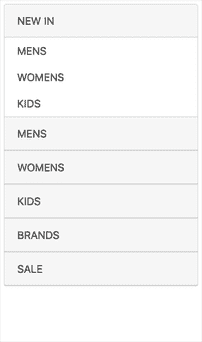
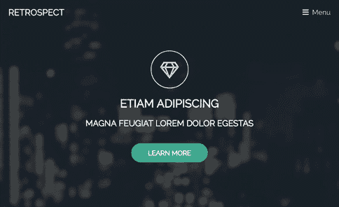

# 对角线幻灯片、电子商务横幅、折叠菜单|模块周一 34

> 原文：<https://dev.to/tyrw/animate-diagonal-slides-ecommerce-banner-accordion-menu-module-monday-34-9km>

## 你可以在任何地方使用的开源网络模块

下面所有的 mod 都是开源的，可以在你选择的任何项目中免费使用。Anymod 可让您快速向任何网站或网络应用添加功能。

单击一个 mod 来查看它的运行及其源代码。

## 动画对角线幻灯片

Codrops 全页显示。轻松添加到任何页面。

[视图对](https://anymod.com/mod/kdlnrr?v=20)视图

 [
T4】](https://anymod.com/mod/kdlnrr?v=20)

## 手风琴侧面菜单

通过链接展开和折叠类别

[视图对](https://anymod.com/mod/oraaon?v=30)视图

 [
T4】](https://anymod.com/mod/oraaon?v=30)

## 用菜单修正 bg 英雄章节

开始一页所需要的一切

[视图对](https://anymod.com/mod/bammko?v=22&w=1000)视图

 [
T4】](https://anymod.com/mod/bammko?v=22&w=1000)

## 电子商务横幅

响应图像和链接，展示你的商品。

[视图对](https://anymod.com/mod/bamrln?v=20)视图

 [
T4】](https://anymod.com/mod/bamrln?v=20)

## 后退按钮

它...做你所期望的。添加到任何地方。

[视图对](https://anymod.com/mod/mlnarn)视图

 [
T4】](https://anymod.com/mod/mlnarn)

* * *

我每周一都会在这里发布新的模块——我希望你会觉得它们有用！

快乐编码✌️