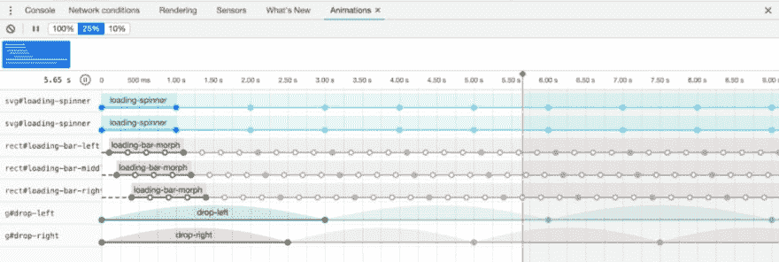

# 用 CSS 制作 SVG 动画

> 原文：<https://dev.to/bnevilleoneill/animating-svg-with-css-5f60>

[](https://res.cloudinary.com/practicaldev/image/fetch/s--sg_t0kMO--/c_limit%2Cf_auto%2Cfl_progressive%2Cq_auto%2Cw_880/https://cdn-images-1.medium.com/max/1024/1%2A-mL-Y_OA9L_GvrKpKxrvpA.png)

网络动画是一种享受。它们改善了用户体验，因为它们可以提供视觉反馈，指导任务，并使网站更加生动。有几种方法可以创建网页动画，包括 [JavaScript 库](https://hackernoon.com/10-javascript-animation-libraries-to-follow-in-2018-50ff1d905f43)，gif 和嵌入视频。但是 SVG 和 CSS 的简单结合很有吸引力，原因有几个。由代码组成，而不是成千上万的光栅图像帧，它们是高性能的，比庞大的 gif 和视频有更快的加载时间。另外，有很多简单的动画可以创建，而不需要在你的网站页面加载中添加另一个 JavaScript 插件。首先，SVG 是基于矢量的，因此它们可以跨屏幕大小和缩放级别完美地缩放，而不会产生破碎的像素化。

现在，你可能想知道:为什么是 CSS？为什么不用本地 SVG 动画规范 [SMIL](https://developer.mozilla.org/en-US/docs/Web/SVG/SVG_animation_with_SMIL) 制作动画呢？事实证明，SMIL 的支持率正在下降。 [Chrome 正朝着贬低 SMIL 的方向前进，支持 CSS 动画和网络动画 API。](https://groups.google.com/a/chromium.org/forum/#!msg/blink-dev/5o0yiO440LM/YGEJBsjUAwAJ)所以，我们继续 CSS 动画……但是它们是如何制作的呢？在这篇文章中，我们将学习如何制作这些轻量级的，可扩展的动画！

### 用 CSS 制作 SVG 动画的常见用例

首先，让我们看看一些实际的用例，看看为什么你需要在你的 web 应用程序或登陆页面中使用动画 SVG。

#### **图标**

动画 SVG 非常适合表示微交互和状态变化的图标。它们在引导用户进行下一步操作时也很有帮助，比如在入职培训中。常见的用例包括加载、上传、菜单切换和播放/暂停视频。

#### **插图**

插图是另一个常见的用例。它们可以作为空白状态包含在产品中，演示如何在仪表板上生成数据。动画表情符号和贴纸是其他流行的使用案例。还有动画插画照亮了登陆页面，在建立品牌的同时带来了维度和乐趣。

[](https://logrocket.com/signup/)

### 如何准备 SVG

现在，让我们进入实质。您要做的第一件事是准备一个 SVG。当您准备好变得凌乱不堪并变成一个疯狂的科学家动画师时，开始清理可能会让人感到很烦，但是从简化的 SVG 代码开始会更容易。

#### **简化 SVG 代码**

当一个 SVG 被创建时，它有很多不必要的额外代码。所以，优化它很重要。我喜欢使用 [SVGO](https://github.com/svg/svgo) ,它可以减小文件大小并保存带有唯一 id 的路径(这对于防止同一页面上的多个 SVG 出现问题很重要)。这是一个 Node.js 工具，有几种使用方法，包括一个草图插件: [SVGO 压缩器](https://github.com/BohemianCoding/svgo-compressor)。

#### **创建有意分组(如果需要)**

在代码编辑器中打开 SVG，注意`<g>`元素。它们用于对 SVG 元素进行分组。如果您想将一组元素制作成动画，将它们包装在`<g></g>`中，并用类或 ID 命名它们。如果您希望以相同的方式设计多个路径，请考虑将 ID 名称转换为类名(ID 只能使用一次)。一旦你有了形状的 ID 或类，你就可以用 CSS 来定位它们。当您保存 SVG 时，现在不会有任何可见的变化。

#### **注意堆叠顺序(如果你要制作一个图形在另一个图形后面的动画)**

这似乎与直觉相反，但是最后列出的形状将被粘贴到前面提到的形状上。因此，如果您希望一个形状出现在背景中，请确保它列在 SVG 代码的顶部。SVG 形状是按照从上到下的顺序“绘制”的。

#### **设置 SVG 造型为首选，初始状态**

SVG 有[表示属性](https://developer.mozilla.org/en-US/docs/Web/SVG/Attribute/Presentation)，类似于 CSS 样式，但是直接在 SVG 上设置。一个常见的例子是填充颜色。由于这些样式是在 SVG 上设置的，您可能会认为它们对浏览器有很大的影响。事实证明，您在外部设置的任何 CSS/Sass 都会自然地覆盖 SVG 样式，而不需要。重要声明。但是，您需要注意 SVG 上的设置，以便为页面加载期间显示的内容做好准备。对于一个加载缓慢的页面，你可能会看到一个在被 CSS 样式化之前的 SVG 动画。我建议您保留宽度和高度，以避免页面加载期间 SVG 的无样式闪烁( [Sara Soueidan 在这里](https://www.sarasoueidan.com/blog/svg-style-inheritance-and-fousvg/)很好地解释了无样式 SVG(FOUSVG)的闪烁)。

### 将 CSS 应用到 SVG

既然您已经整理好了 SVG，让我们开始研究如何引入 CSS。当谈到如何将 CSS 应用于 SVG 时，需要考虑一些因素。一个限制是不能使用外部样式表对外部链接的 SVG 应用样式。

#### **选项 1:将 SVG 代码内嵌在 HTML 中(我的最爱)**

这使得 SVG 元素及其内容成为文档 DOM 树的一部分，因此它们受到文档 CSS 的影响。这是我最喜欢的，因为它将样式与标记分开。

在下面的其他选项中，你会看到它们是紧密相连的。如果您使用 Rails，有一些 gem 可以自动将 SVG 嵌入到视图中。所以，在你的代码中，你可以简单地引用外部 SVG，然后它会在编译时被嵌入。这种方法的另一个好处是内联 SVG 意味着少了一个 HTTP 请求。耶，表演！
[https://codepen.io/lukelogrocket/embed/NmLQdz?height=600&default-tab=result&embed-version=2](https://codepen.io/lukelogrocket/embed/NmLQdz?height=600&default-tab=result&embed-version=2)

#### **选项 2:在一个`<style>`标签**内包含 SVG 中的 CSS

您可以在嵌套在``标签中的`<style>`标签中添加 CSS 样式。【T2[https://codepen.io/lukelogrocket/embed/axaeWO?height=600&default-tab=result&embed-version=2](https://codepen.io/lukelogrocket/embed/axaeWO?height=600&default-tab=result&embed-version=2)

#### **选项 3:将 CSS 包含在带有外部链接的 SVG 中**

如果您想保留 SVG 中引用的样式，但实际上并不包含在 SVG 中，那么您可以使用`<?xml-stylesheet>`标签链接到 SVG 中的外部样式表。
[https://codepen.io/lukelogrocket/embed/qwMejZ?height=600&default-tab=result&embed-version=2](https://codepen.io/lukelogrocket/embed/qwMejZ?height=600&default-tab=result&embed-version=2)

#### **选项 4:在 SVG 中使用内联 CSS 样式**

也可以使用内联样式属性在元素上设置 CSS。
[https://codepen.io/lukelogrocket/embed/EJeqva?height=600&default-tab=result&embed-version=2](https://codepen.io/lukelogrocket/embed/EJeqva?height=600&default-tab=result&embed-version=2)

### 用 CSS 可以制作什么动画？

实际上，很多事情！值可以随时间变化的 CSS 属性可以使用 CSS 动画或 CSS 过渡来制作动画(有关这些属性的完整列表，请参考 MDN Web 文档的可制作动画的 CSS 属性列表)。这里有一些激发灵感的演示。

### 演示

我们将介绍两种主要类型的动画，它们根据提供的控制量而有所不同。注意:我将在演示中使用 Sass，但当然它对 CSS 也同样适用。此外，为了简单起见，我省略了前缀，尽管您在生产中会用到它们(稍后会详细介绍)。

### 过渡属性

对于由加载或状态更改(如悬停或单击)触发的动画，可以使用 transition 属性。transition 属性允许属性值在指定的持续时间内平滑变化。没有它，变化会在瞬间发生，创造一个 jaring 外观。

#### **过渡属性**

`transition: property duration timing-function delay;`

| 价值 | 描述 |
| --- | --- |
| 过渡 | 一次设置全部四个的速记属性 |
| 过渡延迟 | 过渡效果的延迟时间(秒) |
| 过渡持续时间 | 完成转场效果所需的秒数或毫秒数 |
| 过渡属性 | 指定过渡效果所针对的 CSS 属性的名称 |
| 过渡时间函数 | 过渡效果的速度曲线 |

#### **悬停变换示例**

[https://codepen.io/hopearmstrong/embed/LrQyRG?height=600&default-tab=result&embed-version=2](https://codepen.io/hopearmstrong/embed/LrQyRG?height=600&default-tab=result&embed-version=2)
这个迷幻的甜甜圈有一种因过渡属性而产生的变色糖衣！# donut-ice 元素上的过渡告诉填充使用缓出计时功能在三秒内逐渐变化。悬停状态会触发填充变为蓝色。中间发生的是一个冷色调的混合，让一点紫色流行进来。

### 动画属性

transition 属性的一个限制是，它不能很好地控制时间轴上发生的变化。对于从 A 点到 b 点的简单动画更好，为了进一步控制，请使用 animation 属性。这些属性可以单独使用，但我将演示动画速记。

#### **动画属性**

`animation: name duration timing-function delay iteration-count direction fill-mode play-state;`

| **值** | **描述** |
| 动画名称 | 这是您想要绑定到选择器的关键帧的名称。当你阅读下面的关键帧部分时，请注意这一点。 |
| 动画时长 | 以秒或毫秒为单位的动画长度。注意:请始终指定动画持续时间属性。否则持续时间为 0，永远不会播放。 |
| 动画-计时-功能 | 动画的速度曲线。例如:线性，缓动，缓入，缓出，缓入，缓出，步进开始，步进结束，步进(int，start&#124;end)，三次贝塞尔(n，n，n，n)，初始，继承 |
| 动画-延迟 | 以秒(s)或毫秒(ms)定义，它是动画开始前的延迟长度。注意:如果给定一个负值，它将开始播放，就像它已经播放了给定的时间一样。 |
| 动画-迭代-计数 | 动画应该播放的次数。任何数字 |
| 动画方向 | 反向或交替播放动画。例如:正常、反向、交替、交替-反向、初始、继承 |
| 动画填充模式 | 指定动画在执行时间之外应用什么值 |
| 动画播放状态 | 指定动画是正在运行还是暂停 |
| 初始 | 默认值 |
| 继承 | 继承自父元素 |

#### [t1**关键帧**](#keyframes)

这才是真正令人兴奋的地方，也是动画区别于转场属性的地方，就时间控制而言。使用@keyframes at-rule 告诉它如何在中间步骤进行更改。要使用关键帧，请添加一个@keyframes at-rule，其名称与所需的 animation-name 属性相匹配。使用关键帧选择器指定动画时间轴上发生更改的百分比。

下面是一个显示百分比选择器的例子:

```
@keyframes name-goes-here
  0%
    width: 100px
  25%
    width: 120px
  50%, 75%
    width: 130px
  100%
    width: 110px 
```

如果您想只为开始和结束创建关键帧，您可以这样做:

```
@keyframes name-goes-here
  from
    width: 100px
  to
    width: 120px 
```

虽然关键帧可能会在样式表中的任何位置运行，但它们通常放在 animation 属性下面，在那里可以很容易地引用它们。

### 变换

元素可以在二维或三维空间中被动画化。在这里，我将展示几个 2D 变换的例子。要了解更多关于 3d 变换的信息，请查看 noob 的 3D 变换指南。

#### **旋转**

[https://codepen.io/hopearmstrong/embed/ZZYgMe?height=600&default-tab=result&embed-version=2](https://codepen.io/hopearmstrong/embed/ZZYgMe?height=600&default-tab=result&embed-version=2)
这是一个使用旋转变换的旋转加载图标。想知道它是怎么做的？它从这个基本的 SVG 开始，看起来像一个带有深色象限的环。

#### [T1**HTML**](#html)

[https://codepen.io/lukelogrocket/embed/rbZXra?height=600&default-tab=result&embed-version=2](https://codepen.io/lukelogrocket/embed/rbZXra?height=600&default-tab=result&embed-version=2)
在 Sass 中，SVG 是用 SVG 的 ID 定位的。然后，定义动画和过渡。动画引用@关键帧的名称，其中“transform: rotate”设定为从 0 度到 360 度(完整旋转)。这就是让这个旋转器活起来所需要的一切！

#### **萨斯**

```
#loading
  animation: loading-spinner 1s linear infinite

@keyframes loading-spinner
  from
    transform: rotate(0deg)
  to
    transform: rotate(360deg) 
```

想要更光滑的东西？SVG 支持渐变，因此您可以使用相同的 Sass 实现更平滑的效果，但是 SVG 对环应用了渐变(请参见下面的#spinner-gradient-a 定义)。
[https://codepen.io/hopearmstrong/embed/yrymwg?height=600&default-tab=result&embed-version=2](https://codepen.io/hopearmstrong/embed/yrymwg?height=600&default-tab=result&embed-version=2)
现在，让我们用 transform: scale 来创建这个变形栏加载图标。
[https://codepen.io/hopearmstrong/embed/VNYoNq?height=600&default-tab=result&embed-version=2](https://codepen.io/hopearmstrong/embed/VNYoNq?height=600&default-tab=result&embed-version=2)
SVG 由三个大小相等、间隔均匀的矩形组成。每个元素都添加了 IDs 对于 SVG 和所有三个`<rect>`,因此它们可以很容易地被 Sass 作为目标。

#### [T1**HTML**](#html)

[https://codepen.io/lukelogrocket/embed/ROYXmM?height=600&default-tab=result&embed-version=2](https://codepen.io/lukelogrocket/embed/ROYXmM?height=600&default-tab=result&embed-version=2)
Sass 将动画应用到每一个酒吧。关键帧告诉小节在时间线中的四个位置沿 Y 轴改变缩放，即开始时、四分之一处、中间和四分之三处。动画中的第一个数字表示动画长度，而第二个数字设置延迟。因为我想让这些条形在不同的时间改变大小，所以我为每个条形添加了不同的延迟。

```
#loading-bar
  &-left
    animation: loading-bar-morph 1s linear .1s infinite
    transform-origin: center
  &-middle
    animation: loading-bar-morph 1s linear .2s infinite
    transform-origin: center
  &-right
    animation: loading-bar-morph 1s linear .4s infinite
    transform-origin: center

@keyframes loading-bar-morph 
  0%
    transform: scaleY(1)
  25%
    transform: scaleY(0.3)
  50%
    transform: scaleY(0.7)
  75%
    transform: scaleY(0.15) 
```

#### **一个由来的故事**

注意 transform-origin: center 告诉变换从条的中心开始缩放；否则，它将自上而下扩展，看起来就像钢筋钻入了地下。测试一下，你就会明白我的意思。这是需要学习的重要一课:默认情况下，SVG 位于左上角的(0，0)点。如果您习惯于处理 HTML 元素，这是一个关键的区别，HTML 元素的默认转换起点总是在(50%，50%)。

### 花样繁多的技巧

**线条画动画**
[https://codepen.io/hopearmstrong/embed/BENBzj?height=600&default-tab=result&embed-version=2](https://codepen.io/hopearmstrong/embed/BENBzj?height=600&default-tab=result&embed-version=2)
这种俏皮的效果让你的 SVG 看起来就像正在被绘制一样。它需要一个带线条的 SVG，因为它依赖于笔画。我将向您介绍如何完成一行代码，然后您将知道如何完成其余部分。

首先，使用 stroke-dasharray 对线条应用虚线描边。该数字以像素为单位表示虚线的长度。你会希望它是线的长度。

```
#line
  stroke-dasharray: 497 
```

然后添加 stroke-dashoffset 以沿线重新定位虚线。使其与线条本身一样长，这样看起来就像一条实线。这是动画的最终画面。

```
#line
  stroke-dasharray: 497
  stroke-dashoffset: 497 
```

现在它已经准备好被动画化了。添加激活 stroke-dashoffset 的关键帧，使其从完全偏移(看不到描边)变为 0px 偏移(实线描边)。请注意动画属性中的转发。这是一种动画填充模式，它告诉动画在播放后保持最终状态。没有它，动画将播放，然后返回到它的第一个“帧”作为它的最终静止点。

```
#line
  stroke-dasharray: 497
  stroke-dashoffset: 497
  animation: draw 1400ms ease-in-out 4ms forwards

@keyframes draw
  from
    stroke-dashoffset: 1000
  to
    stroke-dashoffset: 0 
```

#### **动画插图**

对于这颗兴奋跳动的心脏，悬停时会触发一些动画。心脏有 110%的比例变化，眼睛变小，嘴变大，脸红，心脏跳动。对于脉冲效果，我用了 [Animista](http://animista.net/) 的心跳动画。Animista 是预制 CSS 动画效果的一个很好的资源，您可以重复使用和迭代。
T3T5】

```
#smiley-love
  #smiley
    &-blush
      display: none
  a
    display: inline-block
    &:hover
      #smiley
        transform: scale(1.1)
        transform-origin: center
        -webkit-animation: heartbeat 1.5s ease-in-out infinite both
        animation: heartbeat 1.5s ease-in-out infinite both
        &-blush
          display: inherit
        &-eye-left
          transform-origin: center
          transform: scale(.7) translate(-8px)
        &-eye-right
          transform-origin: center
          transform: scale(.7) translate(8px)
        &-mouth
          transform: translateY(-22px) scale(1.6)
          transform-origin: center

/* ----------------------------------------------
 * animation heartbeat
 * Generated by Animista on 2019-3-24 18:51:13
 * w: http://animista.net, t: @cssanimista
 * ---------------------------------------------- */

@-webkit-keyframes heartbeat
  from
    -webkit-transform: scale(1)
            transform: scale(1)
    -webkit-transform-origin: center center
            transform-origin: center center
    -webkit-animation-timing-function: ease-out
            animation-timing-function: ease-out
  10%
    -webkit-transform: scale(0.91)
            transform: scale(0.91)
    -webkit-animation-timing-function: ease-in
            animation-timing-function: ease-in
  17%
    -webkit-transform: scale(0.98)
            transform: scale(0.98)
    -webkit-animation-timing-function: ease-out
            animation-timing-function: ease-out
  33%
    -webkit-transform: scale(0.87)
            transform: scale(0.87)
    -webkit-animation-timing-function: ease-in
            animation-timing-function: ease-in
  45%
    -webkit-transform: scale(1)
            transform: scale(1)
    -webkit-animation-timing-function: ease-out
            animation-timing-function: ease-out
@keyframes heartbeat
  from
    -webkit-transform: scale(1)
            transform: scale(1)
    -webkit-transform-origin: center center
            transform-origin: center center
    -webkit-animation-timing-function: ease-out
            animation-timing-function: ease-out
  10%
    -webkit-transform: scale(0.91)
            transform: scale(0.91)
    -webkit-animation-timing-function: ease-in
            animation-timing-function: ease-in
  17%
    -webkit-transform: scale(0.98)
            transform: scale(0.98)
    -webkit-animation-timing-function: ease-out
            animation-timing-function: ease-out
  33%
    -webkit-transform: scale(0.87)
            transform: scale(0.87)
    -webkit-animation-timing-function: ease-in
            animation-timing-function: ease-in
  45%
    -webkit-transform: scale(1)
            transform: scale(1)
    -webkit-animation-timing-function: ease-out
            animation-timing-function: ease-out 
```

对于这个冰棒，我通过使用 transform: translate 改变水滴的位置来制作它们的动画。为了让它们消失，我制作了不透明度动画。现在看起来像是炎热的夏天！
[https://codepen.io/hopearmstrong/embed/qwdBwR?height=600&default-tab=result&embed-version=2](https://codepen.io/hopearmstrong/embed/qwdBwR?height=600&default-tab=result&embed-version=2)

#### **插件**

使用前面提到的 CSS/Sass 自己做，或者使用像 [Animate 这样的插件走捷径。CSS](https://daneden.github.io/animate.css/) 。它包含了常用动画的现成实用程序类，如淡入淡出、幻灯片、抖动等等。如果你想探索 JavaScript 选项，我听说过格林斯托克的 [GSAP](https://greensock.com/gsap) 很棒，它有一个强大的插件叫做 MorphSVGPlugin，可以让你把一个 SVG 形状变成另一个形状。

### 跨浏览器兼容性

很多 CSS 动画都得到了很好的支持，甚至跨浏览器。但是仍然有一些事情需要注意。以下是我的建议:

#### **浏览器前缀**

您可以检查[shouldiprefix.com](http://shouldiprefix.com)以确认您是否需要包含特定于浏览器的供应商前缀。在撰写本文时，建议您使用-webkit-animation 和@-webkit-keyframes 前缀。

#### **浏览器测试**

请记住，尽管有很多浏览器支持，但您可能会遇到一些渲染差异。例如，如果你想支持旧版本的 Firefox (v. 42 和更低版本)，那么[要注意一个关于 transform-origin](https://bugzilla.mozilla.org/show_bug.cgi?id=923193) 的 bug。虽然现在已经修复了，但是有一段时间，Firefox 在 transform-origin 中不接受任何关键字(如 center)或百分比。因此，如果你遇到渲染问题，尝试使用像素。您可以查看 cx 和 cy 属性来计算中心。为了找出不同浏览器和设备的渲染差异，在[浏览器堆栈](https://www.browserstack.com/)上测试你的动画，找出任何奇怪之处。 [Chrome DevTools 有一个动画标签](https://developers.google.com/web/tools/chrome-devtools/inspect-styles/animations)，这有助于更近距离地观察动画状态。它允许您查看页面上动画的时间线可视化，以慢动作重放动画，以及修改动画。

[](https://res.cloudinary.com/practicaldev/image/fetch/s--owTiLVrG--/c_limit%2Cf_auto%2Cfl_progressive%2Cq_auto%2Cw_880/https://cdn-images-1.medium.com/max/1024/0%2AYQLulhc9UsTKXK0L)

### 结论

现在你已经知道了用 CSS 制作 SVG 动画的几种不同方法，我希望你能从中受到启发，为 web 创建自己的动画！只用几行 CSS 就把静态 SVG 变得生动有趣。一旦你掌握了一些技巧，处理更复杂的动画就更容易了。网上和像 [CodePen](https://codepen.io/) 这样的网站上有无穷无尽的灵感。快乐动画！

* * *

### Plug: [LogRocket](https://logrocket.com/signup/) ，一款适用于网络应用的 DVR

[](https://logrocket.com/signup/)

<figcaption>[https://logrocket.com/signup/](https://logrocket.com/signup/)</figcaption>

LogRocket 是一个前端日志工具，可以让你回放问题，就像它们发生在你自己的浏览器中一样。LogRocket 不需要猜测错误发生的原因，也不需要向用户询问截图和日志转储，而是让您重放会话以快速了解哪里出错了。它可以与任何应用程序完美配合，不管是什么框架，并且有插件可以记录来自 Redux、Vuex 和@ngrx/store 的额外上下文。

除了记录 Redux 操作和状态，LogRocket 还记录控制台日志、JavaScript 错误、堆栈跟踪、带有头+正文的网络请求/响应、浏览器元数据和自定义日志。它还使用 DOM 来记录页面上的 HTML 和 CSS，甚至为最复杂的单页面应用程序重新创建像素级完美视频。

[免费试用](https://logrocket.com/signup/)。

* * *

【用 CSS 制作 SVG 动画】([https://Blog . log rocket . com/Animating-SVG-with-CSS-83e 8 e 27d 739 c/](https://blog.logrocket.com/animating-svg-with-css-83e8e27d739c/)的帖子最早出现在 [LogRocket 博客](https://blog.logrocket.com)上。