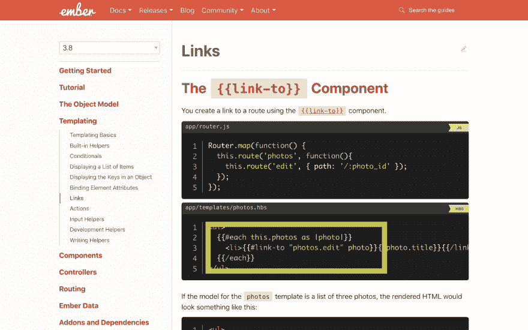
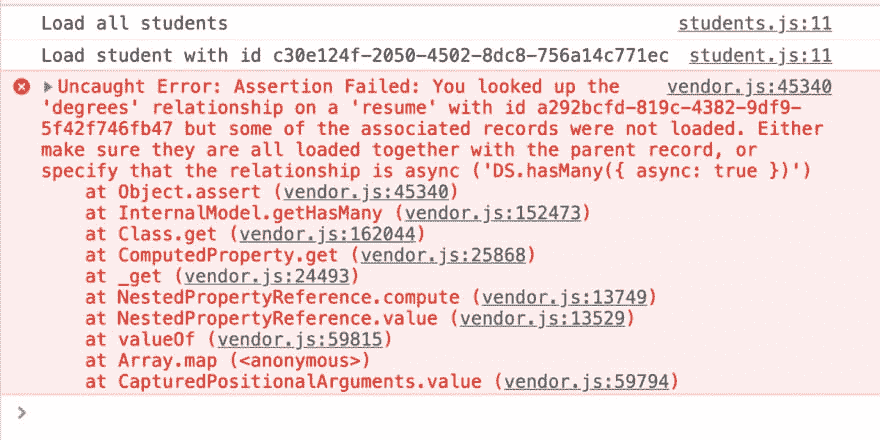

# Ember 中的动画和可预测数据加载

> 原文：<https://dev.to/ijlee2/animation-and-predictable-data-loading-in-ember-j74>

最初发布于 [crunchingnumbers.live](https://crunchingnumbers.live)

在 [EmberConf 2019](https://emberconf.com) 上，我有机会与全球各地的许多 Ember 开发者见面并向他们学习。我对 [Ember Octane](https://emberjs.com/editions/octane/) 感到兴奋，这是一个考虑到开发人员生产力和应用程序性能的新版本。它处于测试阶段，正准备发布。我认为现在是学习和使用 Ember 的最佳时机。

本教程涵盖了如何以可预测的方式加载复杂的数据，以及如何添加动画来活跃您的网站。衷心感谢 Sam Selikoff 和 Ryan Toronto，他们在会议上的教导是我学习的重要基础。他们花时间构建了一个完美的演示应用程序；我受到鼓舞，跟随他们的脚步。

TL；博士使用[余烬动画](https://ember-animation.github.io/ember-animated/)和[余烬数据店面](https://embermap.github.io/ember-data-storefront/)今天！

# 0。完成的应用程序

你可以在 https://ember-animated.herokuapp.com/看到我的演示应用。它反应灵敏，可以扩展到 4K 屏幕。

场景是这样的。你希望雇佣的学生(候选人)的技能符合你的要求。从“学生”选项卡，您可以一目了然地看到所有学生，并详细检查每个学生。从“搜索”选项卡中，您可以设置所需的技能，并找到最符合这些技能的学生。您可以按任何顺序在选项卡和页面之间导航，而不会遇到错误。

[https://www.youtube.com/embed/Q3Wu-HroNy8](https://www.youtube.com/embed/Q3Wu-HroNy8)

# 1。可预测的数据加载

在演示应用程序中，我们有 5 个模型:学生、简历、学位、经验和技能。这些模型通过**一对多**和**多对多关系**关联。

我认为关系是 Ember 数据难以学习和使用的原因。让我向您展示当您拥有带有关系的模型时，您可能会遇到的 4 种类型的错误。然后我将展示 Ember Data Storefront 如何帮助我们解决这些问题。

## a. {{link-to}} bug

[https://www.youtube.com/embed/flQPYH85338](https://www.youtube.com/embed/flQPYH85338)

在查看了所有学生之后，我们单击一个学生来查看他们的详细信息。奇怪的是，我们可以看到他们的名字、电子邮件、电话和个人资料图片(这些**属性**)，却看不到他们的学位、经历和技能(这些关系)。我们点击另一个学生来查看类似的行为。最后，当我们刷新页面时，我们可以看到所有的信息，但是只能看到那个学生的信息，而不能看到其他人的信息。

我们怀疑问题出在**路由处理器**身上，因为它们负责加载数据。然而，当我们检查文件时，我们没有发现任何错误。只是来自 Ember 的老朋友`findAll`和`findRecord`。

```
File: /app/routes/students.js

import Route from '@ember/routing/route';

export default Route.extend({
    model() {
        return this.store.findAll('student');
    },
}); 
```

```
File: /app/routes/students/student.js

import Route from '@ember/routing/route';

export default Route.extend({
    model(params) {
        return this.store.findRecord('student', params.id, {
            include: 'resumes,resumes.degrees,resumes.experiences,resumes.skills',
        });
    },
}); 
```

罪魁祸首原来是一个为每个学生创建链接的**模板**。我们在访问`students`和`students.student`路线时会遇到这个模板。你能发现问题吗？

```
File: /app/components/students-grid/template.hbs

{{#let (component "students-grid/card") as |Card|}}
    {{#each (sort-by "lastName" "firstName" students) as |student|}}
        <li>
            {{#link-to "students.student" student}}
                <Card @student={{student}} />
            {{/link-to}}
        </li>
    {{/each}}
{{/let}} 
```

在第 4 行，我们将`student` **模型**传递给了`{{link-to}}` **助手**。当我们这样做时，Ember 跳过调用`students.student`路线的`model` **钩子**。*我已经有了模型，为什么还要再次获取？虽然 Ember 认为它做出了明智的决定，但用户实际上错过了关键数据。*

解决方法很简单。为了确保 Ember 调用了`model`钩子，我们传递了模型 ID。

```
File: /app/components/students-grid/template.hbs

{{#let (component "students-grid/card") as |Card|}}
    {{#each (sort-by "lastName" "firstName" students) as |student|}}
        <li>
            {{#link-to "students.student" student.id}}
                <Card @student={{student}} />
            {{/link-to}}
        </li>
    {{/each}}
{{/let}} 
```

我认为传递 ID 产生的`{{link-to}}`语法更有意义。毕竟，如果我要为一个学生创建一个 URL，例如`/students/:some_parameter`，我会想要指出是什么标识了他们。

不幸的是，我相信对于新的和经验丰富的开发人员来说，传递模型是很容易犯的错误。直到参加了萨姆和瑞安的讲座，我才知道其中的区别。甚至 Ember 文档也建议传递模型是可以的。(它后来更正了代码，并在[的另一个章节](https://guides.emberjs.com/release/routing/specifying-a-routes-model/#toc_dynamic-models)中警告我们，这个章节被埋在其他文本下面。)

<figure>

[](https://res.cloudinary.com/practicaldev/image/fetch/s--Ij9m3jK6--/c_limit%2Cf_auto%2Cfl_progressive%2Cq_auto%2Cw_880/https://crunchingnumbersdotlive.files.wordpress.com/2019/04/ember_link_to.png)

<figcaption>Think carefully before passing a model to the link-to helper.</figcaption>

</figure>

Sam 和 Ryan 评论说，他们创建了自己的 link-to 助手，可以优雅地处理模型和 ID。他们还建议我们对`{{link-to}}`进行 lint，这样传递模型会导致运行时错误。

TL；博士总是把型号 ID 传给`{{link-to}}`。

## b .查找记录错误

[https://www.youtube.com/embed/7a4UskY6Jus](https://www.youtube.com/embed/7a4UskY6Jus)

在修复了这个错误之后，我们现在可以看到一个学生的学位、经历和技能。但是，这些信息会在一段时间后在屏幕上弹出。刷新页面会导致相同的行为。能不能防止模板“闪”？为什么会出现这种情况？

关键是`students`路线**嵌套**路线`students.student`(这个你可以在`/app/router.js`查)。因此，当我们访问学生详情页面时，无论是通过学生选项卡还是直接通过 URL，Ember 都会首先调用父路由处理程序`students`的`model`钩子。换句话说，当 Ember 试图加载详细信息页面时，它已经有了学生的姓名、电子邮件、电话和个人资料图像。为什么不马上给他们看？

让我们再来看看`students.student`，子路由处理器。

```
File: /app/routes/students/student.js

import Route from '@ember/routing/route';

export default Route.extend({
    model(params) {
        return this.store.findRecord('student', params.id, {
            include: 'resumes,resumes.degrees,resumes.experiences,resumes.skills',
        });
    },
}); 
```

特定于 JSON:API 的查询参数`include`允许我们从**下载**相关数据。因为简历、学位、经验和技能需要额外调用，所以它们会在稍后显示在模板中。

减轻闪烁的一种方法是传递`true`的`reload`参数。Ember 将阻止渲染，直到它重新加载学生数据。

```
File: /app/routes/students/student.js

import Route from '@ember/routing/route';

export default Route.extend({
    model(params) {
        return this.store.findRecord('student', params.id, {
            include: 'resumes,resumes.degrees,resumes.experiences,resumes.skills',
            reload: true,
        });
    },
}); 
```

然而，通过将`reload`设置为`true`，我们失去了`findRecord`提供的**缓存**的好处。我们每次访问学生的页面，都是在加载那个学生的数据。(我们知道这一点是因为我们看到了装载旋转器。)也许我们可以在第一次访问时将`reload`设置为`true`，然后在随后的访问中设置为`false`，但是这会导致更多的工作和复杂的代码。

Sam 和 Ryan(我也是)提倡写一个**声明性** `model`钩子。简单地说，我们应该能够用代码表达我们的想法，而不用担心实现细节。此外，如果加载数据的复杂逻辑都可以在`model`钩子中完成，我们就不会看到将逻辑扩展到其他钩子(例如`afterModel`)可能产生的副作用。

他们的解决方案 [Ember Data Storefront](https://embermap.github.io/ember-data-storefront/) 就是这么做的。也很好用！

首先，我们将 Ember Data 的`findRecord`更改为 Ember Data Storefront 的`loadRecord`。

```
File: /app/routes/students/student.js

import Route from '@ember/routing/route';

export default Route.extend({
    model(params) {
        return this.store.loadRecord('student', params.id, {
            include: 'resumes,resumes.degrees,resumes.experiences,resumes.skills',
        });
    },
}); 
```

其次，我们更新学生模型来扩展`LoadableModel` **mixin** ，这样我们就可以在路由处理程序中使用`loadRecord`。我们还将所有的`async`选项设置为`false`，这样我们可以避免意外的惊喜。(见注释了解原因。)

```
File: /app/models/student.js

import DS from 'ember-data';
import LoadableModel from 'ember-data-storefront/mixins/loadable-model';

export default DS.Model.extend(LoadableModel, {
    resumes: DS.hasMany('resume', { async: false }),
}); 
```

就是这样。不，第三步。

Ember Data Storefront 阻止渲染，直到所有数据都存在。它还支持查询。如果我们之前进行了查询，或者如果包含的模型可以分解为过去查询过的模型，它将返回缓存的数据。

TL；博士用`loadRecord`代替`findRecord`。

## c .发现所有错误

[https://www.youtube.com/embed/_2gLx7dyPqc](https://www.youtube.com/embed/_2gLx7dyPqc)

我们现在可以查看学生的详细信息。接下来，我们要指定我们想要的技能，并找到最符合这些技能的学生。

如果我们直接从主页导航到搜索，我们将毫无问题地看到所有技能。但是，如果我们访问学生详细信息页面，然后访问搜索，我们只能看到该学生的技能。当我们导航到主页，然后返回搜索，我们再次看到所有的技能。这是怎么回事？

这一次，我们来看看`search`路线处理程序。

```
File: /app/routes/search.js

import Route from '@ember/routing/route';

export default Route.extend({
    model() {
        return this.store.findAll('skill');
    },
}); 
```

Ember Data 的`findAll`和它的同类`findRecord`一样，使用缓存和**后台重载**，这样用户就可以在获得新鲜数据的同时立即看到一些内容。不幸的是，当我们有相关的模型并且不能预测用户交互产生的所有可能的状态时，这就产生了副作用。

同样，一个解决方案是通过`{ reload: true }`并忘记缓存。另一种是使用 Ember 数据店面。

```
File: /app/routes/search.js

import Route from '@ember/routing/route';

export default Route.extend({
    model() {
        return this.store.loadRecords('skill');
    },
}); 
```

TL；博士用`loadRecords`代替`findAll`。

## d. (n + 1)查询 bug

[https://www.youtube.com/embed/paNj3rdXOrI](https://www.youtube.com/embed/paNj3rdXOrI)

最后一个 bug 是关于由于关系而产生过多的 AJAX 请求。考虑这个简化的`student-details`模板。

```
File: /app/components/student-details/template.hbs

<ul>
    {{#each resume.degrees as |degree|}}
        <li>{{degree.name}}</li>
    {{/each}}
</ul> 
```

我们已经提出了一个请求来得到这个学生。没有适当的处理，模板会做出 *n* 个额外的请求，每个学位一个。于是， *(n + 1)* 。

多亏了 JSON:API，我们可以用呈现页面所需的所有数据发出一个请求。在 Ember 中，我们传递了查询参数`include`。

```
File: /app/routes/students/student.js

import Route from '@ember/routing/route';

export default Route.extend({
    model(params) {
        return this.store.loadRecord('student', params.id, {
            include: 'resumes,resumes.degrees,resumes.experiences,resumes.skills',
        });
    },
}); 
```

然后，在 Rails(或者你喜欢的后端)中，我们允许**急切加载**。

```
File: /api/app/controllers/students_controller.rb

class StudentsController < ApplicationController
    def show
        render json: StudentSerializer.new(
            @student,
            include: [:resumes, :'resumes.degrees', :'resumes.experiences', :'resumes.skills']
        )
        .serialized_json
    end
end 
```

作为一个花絮，Ember Data Storefront 提供了`AssertMustPreload`组件。它会因缺少关系而引发运行时错误。

```
File: /app/components/student-details/template.hbs

{{assert-must-preload
    student
    "resumes,resumes.degrees,resumes.experiences,resumes.skills"
}}

<ul>
    {{#each resume.degrees as |degree|}}
        <li>{{degree.name}}</li>
    {{/each}}
</ul> 
```

<figure>

[](https://res.cloudinary.com/practicaldev/image/fetch/s--uz0n6ILF--/c_limit%2Cf_auto%2Cfl_progressive%2Cq_auto%2Cw_880/https://crunchingnumbersdotlive.files.wordpress.com/2019/04/ember_data_storefront_error.jpg)

<figcaption>Ember Data Storefront can return a runtime error for missing relationships.</figcaption>

</figure>

我们还可以使用`AssertMustPreload`来防止 *(n + 1)* 查询。如果我们已经创建了与`{ async: false }`的所有关系，运行时错误将暗示我们忘记使用`include`。如果没有`include`，如果我们循环相关数据，我们将进行 *(n + 1)* 查询。QED。

TL；使用`include`博士。

# 2。动画

现在，我们可以以可预测的方式加载数据。但到目前为止，我们的应用程序是静态的，也就是说，它显示的内容没有特色。在这里，我想传达给你的是，即使是小水滴的动画，也能让我们的 app 有动感，有打磨感。

除了 CSS 过渡(更多信息请见注释)，我们可以使用 [Web Animations API](https://developer.mozilla.org/en-US/docs/Web/API/Web_Animations_API) 和 [Ember Animated](https://ember-animation.github.io/ember-animated/) 在 Ember 中创建动画。

## a .网页动画 API

内容丰富的详细信息页面可能会让人看得不知所措。让我们通过一次淡入一个部分来美化它。我们可以使用 Ember 3.8 和 Octane 中引入的一个**修饰符**，轻松解决这个问题。修饰符修改 DOM 元素，让我们发挥想象力。

我有一个修改器叫`fade-up`。首先，让我告诉你我们如何使用修饰语。

```
File: /app/components/student-details/template.hbs

<header {{fade-up id=id}}>
    <h1>{{fullName}}</h1>
</header>

<section {{fade-up id=id}}>
    <ProfileImage @imageUrl={{imageUrl}} @altText={{fullName}} />
</section>

<section {{fade-up id=id delay=50}}>
    <header>
        <h2>Email</h2>
    </header>

    <a href="mailto:{{email}}">
        {{email}}
    </a>
</section> 
```

通过这些简单的更改，我们可以立即淡入姓名和个人资料图像，并在稍后(50 毫秒)淡入电子邮件。我们同样可以用更长的延迟来修改剩余的部分，以产生交错的效果。

[https://www.youtube.com/embed/m_h4EeWFGtk](https://www.youtube.com/embed/m_h4EeWFGtk)

接下来，让我们看看我们的修改器是如何工作的。

```
File: /app/modifiers/fade-up.js

import { Modifier } from 'ember-oo-modifiers';

const FadeUpModifier = Modifier.extend({
    didReceiveArguments(args, options) {
        this.element.animate(
            [
                { opacity: 0, transform: 'translateY(60px)' },
                { opacity: 1, transform: 'translateY(0px)' },
            ],
            {
                duration: options.duration || 2000,
                delay: options.delay || 0,
                easing: 'cubic-bezier(0.075, 0.82, 0.165, 1)',
                fill: 'backwards',
            },
        );
    },
});

export default Modifier.modifier(FadeUpModifier); 
```

这个修改器是从[余烬 OO 修改器](https://github.com/sukima/ember-oo-modifiers)扩展而来的。在修饰符内部，我们有一个对 DOM 元素的引用；只是`this.element`。我们从 Web Animations API 调用`.animate`,并传递两个参数——一组**关键帧**和一个选项散列——来描述我们想要如何动画化元素。

我们使用`didReceiveArguments`钩子，这样当我们在子路径之间切换时(模型 ID 改变)，修改器将被再次调用。`options`参数是一个可以采用*任何*形式的对象。你喜欢什么就传什么。在这里，我允许我们自己控制动画`duration`和`delay`。

然而，网络动画 API 并不是一个完美的解决方案。API 是实验性的，我们的浏览器[并不完全支持它](https://developer.mozilla.org/en-US/docs/Web/API/Element/animate#Browser_compatibility)。你可能最终需要一个[多填充物](https://github.com/web-animations/web-animations-js)。

在写的时候，`fade-up`修饰符也有问题。(我不确定是我误用了 Ember 的修改器还是 Ember OO 的修改器有 bug。)如果你访问一个子路由，比如说`/students/1`，然后另一个子路由`/students/2`，再回来`/students/1`(即缓存数据)，你可能会看到动画出现两次。

## b .烬动画

最后，让我们学习如何创建更复杂的动画。

Ember Animated 有两个助手，`{{animated-each}}`和`{{animated-if}}`，还有其他的。这个想法是，我们简单地在代码中用它们的`animated-`对应物替换 Ember 的`{{each}}`和`{{if}}`。

### 一.动画-每个

考虑这个简化的`search`模板。它显示选定的技能，按类别和名称排序。

```
File: /app/templates/search.hbs

<span>Selected:</span>

{{#each
    (sort-by "category" "name" selectedSkills)
    as |skill|
}}
    <SkillPill @skill={{skill}} />
{{/each}} 
```

然后，我们介绍`{{animated-each}}`如下:

```
File: /app/templates/search.hbs

<span>Selected:</span>

<AnimatedContainer>
    {{#animated-each
        (sort-by "category" "name" selectedSkills)
        use=transition
        as |skill|
    }}
        <SkillPill @skill={{skill}} />
    {{/animated-each}}
</AnimatedContainer> 
```

我认为`{{animated-each}}`和其他插件一起工作是非常棒的。`sort-by`助手来自[成员组合助手](https://github.com/DockYard/ember-composable-helpers)。我不需要做额外的工作来让这两个人友好相处。

`{{animated-container}}`为动画保留空间。如果循环后有内容，当技能进入和退出容器时，它会优雅地退出。

[https://www.youtube.com/embed/Rn2vHZIwhug](https://www.youtube.com/embed/Rn2vHZIwhug)

让我们看看我们在模板中使用的`transition`。我们可以在`search` **控制器**中找到它的定义。

```
File: /app/controllers/search.js

import Controller from '@ember/controller';

export default Controller.extend({
    *transition({ insertedSprites, keptSprites, removedSprites }) {
        insertedSprites.forEach(fadeIn);

        keptSprites.forEach(sprite => {
            parallel(
                fadeIn(sprite),
                move(sprite, { easing: easeIn })
            );
        });

        removedSprites.forEach(sprite => {
            sprite.endTranslatedBy(60, 80);

            parallel(
                fadeOut(sprite),
                move(sprite, { easing: easeOut })
            );
        });
    },
}); 
```

在第 4 行，我们看到`transition`是一个**生成器函数**。常规函数能做的事情，生成器函数也能做。但是生成器函数可以做得更多。它们允许我们在进入函数时**产生**(输出)中间值并检查**上下文**(当前状态)。你可以想象这些特性对动画是多么有用。

在 Ember Animated 中，上下文是一个跟踪 5 种**精灵**的对象。在上面的例子中，我们使用了其中的三个元素:`insertedSprites`(要添加到 DOM 中的元素)、`keptSprites`(要保留的元素)和`removedSprites`(要删除的元素)。对于每种类型(很可能是每个精灵)，我们可以定义它们的运动。

### 二世。动画-如果

接下来，让我们制作导航动画。

[https://www.youtube.com/embed/meIcvx2GjlY](https://www.youtube.com/embed/meIcvx2GjlY)

下面是简化的`navigation-drawer`模板。我们看到，如果一个导航项目的路线匹配当前的路线，然后我们在文本下面添加一个高亮显示。

```
File: /app/components/navigation-drawer.hbs

{{#each navItems as |navItem|}}
    {{#link-to navItem.route}}
        <span>{{navItem.label}}</span>

        {{#if (eq navItem.route currentParentRoute)}}
            <div class="highlighted" aria-hidden="true"></div>
        {{/if}}
    {{/link-to}}
{{/each}} 
```

首先，我们用`{{animated-if}}`代替`{{if}}`。我们通过`group`属性将 3 个`<div>`元素视为一体。

```
File: /app/components/navigation-drawer.hbs

{{#each navItems as |navItem|}}
    {{#link-to navItem.route}}
        <span>{{navItem.label}}</span>

        {{#animated-if
            (eq navItem.route currentParentRoute)
            use=transition
            group="navItems"
        }}
            <div class="highlighted" aria-hidden="true"></div>
        {{/animated-if}}
    {{/link-to}}
{{/each}} 
```

其次，我们定义`transition`。

```
File: /app/components/navigation-drawer/component.js

import Component from '@ember/component';

export default Component.extend({
    *transition({ receivedSprites }) {
        receivedSprites.forEach(sprite => {
            parallel(
                move(sprite),
                scale(sprite)
            );
        });
    },
}); 
```

这一次，我们使用`receivedSprites`来表达我们想要如何制作高光的动画。突出显示只是移动到它的最终位置并改变它的大小(它的宽度，以匹配文本宽度)。

`receivedSprites`和`sentSprites`是另外两种精灵。它们可以用来制作在两个不同组件之间移动的精灵的动画。

# 3。结论

感谢像 [Ember Animated](https://ember-animation.github.io/ember-animated/) 和 [Ember Data Storefront](https://embermap.github.io/ember-data-storefront/) 这样的插件，我们可以真正构建雄心勃勃的应用程序，让我们的想象成真。我在创建我的演示应用程序的过程中获得了很多乐趣(也失去了很多睡眠),希望你也会喜欢创建。

尽管这些插件很棒，但它们也在不断改进中；他们需要你的帮助来实现稳定和实现他们的全部潜力。最后，我要重申肯尼斯·拉森在 EmberConf 上的观点。如果您有时间，请通过帮助文档、问题或教程来回馈您的社区。对彼此都要牛逼。

# 备注

从 Ember Discord 中，我意识到添加一个数据驱动的 CSS 转换既不明显也没有很好的记录。假设我们有一个组件叫做`bar-chart`。它绘制条形图并动态设置其高度。

```
File: /app/components/bar-chart/template.hbs

{{#each bars as |bar|}}
    <div
        class="bar"
        style={{if initialRender (concat "height: " bar.height "%;")}}
    >
    </div>
{{/each}} 
```

```
File: /app/components/bar-chart/component.js

import Component from '@ember/component';
import { later } from '@ember/runloop';

export default Component.extend({
    classNames: ['bar-chart'],

    didRender() {
        this._super(...arguments);

        later(() => {
            this.set('initialRender', true);

        }, 1);
    },
}); 
```

```
File: /app/styles/components/bar-chart.scss

.bar-chart {
    display: flex;

    .bar {
        border: 1px solid orange;
        width: 100px;
        height: 0;
        transition: height 2s ease;
    }
} 
```

关键是我们可以使用 Ember 的`later`来控制 CSS 过渡何时应用(在初始渲染之后)。

有关动画和可预测数据加载的更多信息，我建议您访问以下链接:

*   Sam Selikoff 和 Ryan Toronto 在 Ember.js NYC 的 Ember Data 店面

*   [EmberConf 2018 真人动画](https://www.youtube.com/watch?v=4JofVQ3nGrw)，作者爱德华·福克纳

*   [EmberConf 2019 真实世界动画](https://github.com/embermap/emberconf2019-real-world-animations)，由山姆·塞利科夫和瑞安·多伦多制作

*   [EmberConf 2019 稳健数据提取](https://github.com/embermap/emberconf2019-robust-data-fetching)，作者 Sam Selikoff 和 Ryan Toronto

*   N + 1 个查询或内存问题:为什么不同时解决？理查德·施尼曼

*   Ryan Toronto 的《反对异步关系的案例》

*   什么是修饰语？克里斯·加勒特

您可以在这里找到完整的代码:

[从 GitHub 下载](https://github.com/ijlee2/ember-animated-tutorial)